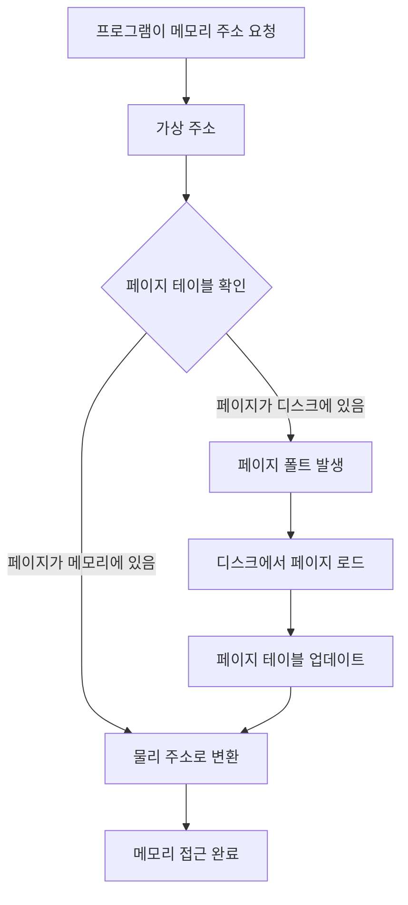
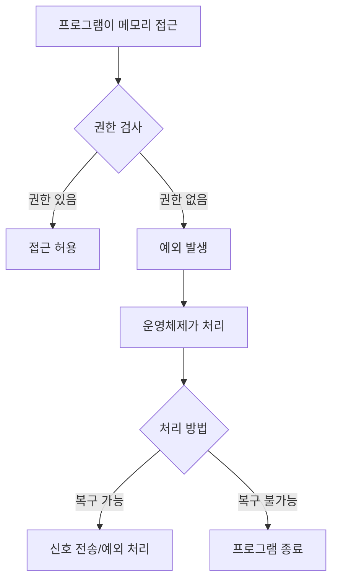

# 메모리 관리  

## 개요
메모리 관리는 운영체제의 핵심 기능 중 하나입니다. 특히 게임 서버처럼 많은 메모리를 사용하는 애플리케이션에서는 더욱 중요한 개념입니다. 이 가이드에서는 가상 메모리 시스템, 페이지 교체 알고리즘, 메모리 보호 및 격리에 대해 자세히 알아보겠습니다.
  
   
## 1. 가상 메모리 시스템 운영

### 가상 메모리란?
가상 메모리는 프로그램이 실제 물리적 메모리보다 더 많은 메모리를 사용할 수 있게 해주는 메모리 관리 기법입니다.

### 📊 물리 메모리 부족 문제 상황

<pre>
💾 실제 물리 메모리: 8GB
┌─────────────────────────────────────────────────────────────────────────────┐
│                              8GB 물리 메모리                                  │
└─────────────────────────────────────────────────────────────────────────────┘

🖥️ 프로그램들이 요구하는 메모리:

프로그램 A 요구량: 4GB
┌─────────────────────────────────────────┐
│           프로그램 A (4GB)               │
└─────────────────────────────────────────┘

프로그램 B 요구량: 6GB  
┌───────────────────────────────────────────────────────────────┐
│                    프로그램 B (6GB)                            │
└───────────────────────────────────────────────────────────────┘

❌ 문제 발생!
총 필요 메모리: 4GB + 6GB = 10GB > 8GB (물리 메모리)

┌─────────────────────────────────────────┐ ┌───────────────────────────────────────────────────────────────┐
│           프로그램 A (4GB)               │                    프로그램 B (6GB)                                     │                     │
└─────────────────────────────────────────┘                     │ └───────────────────────────────────────────────────────────────┘
                    ↓                                                        ↓
┌─────────────────────────────────────────────────────────────────────────────┐  ← 8GB만 사용 가능
│                              8GB 물리 메모리                                 │
└─────────────────────────────────────────────────────────────────────────────┘
                                   
                      🚫 2GB 부족! 실행 불가능
</pre>
  
### ✅ 가상 메모리 시스템의 해결책

<pre>
🌐 가상 메모리 사용 시:

프로그램 A의 가상 주소 공간              프로그램 B의 가상 주소 공간
┌─────────────────────────────┐          ┌─────────────────────────────────────┐
│  가상 메모리 4GB              │          │  가상 메모리 6GB                     │
│  0x00000000~0xFFFFFFFF      │          │  0x00000000~0xFFFFFFFF              │
│                             │          │                                     │
│  ┌─────┐ ┌─────┐ ┌─────┐    │          │  ┌─────┐ ┌─────┐ ┌─────┐ ┌─────┐    │
│  │ P1  │ │ P2  │ │ P3  │    │          │  │ P1  │ │ P2  │ │ P3  │ │ P4  │    │
│  │사용중│ │미사용│ │사용중│    │          │  │사용중│ │사용중│ │미사용│ │미사용│    │
│  └─────┘ └─────┘ └─────┘    │          │  └─────┘ └─────┘ └─────┘ └─────┘    │
└─────────────────────────────┘          └─────────────────────────────────────┘
       ↓         ↓                              ↓         ↓
    실제로      디스크에                     실제로      디스크에
   메모리에      저장됨                      메모리에      저장됨
    로드됨                                   로드됨

                    ↓ 매핑 (실제 사용하는 페이지만) ↓

💾 실제 물리 메모리 8GB (효율적 활용)
┌─────────────────────────────────────────────────────────────────────────────┐
│ 프로그램A  │ 프로그램B │ 프로그램A │ 프로그램B │ 운영체제  │     여유공간           │
│   P1     │   P1     │   P3     │   P2     │         │                       │
│  (1GB)   │  (2GB)   │  (1GB)   │  (2GB)   │  (1GB)  │      (1GB)            │
└─────────────────────────────────────────────────────────────────────────────┘

💿 디스크 (스왑 공간)
┌─────────────────────────────────────────────────────────────────────────────┐
│ 프로그램A │ 프로그램B │ 프로그램B │          기타 저장 공간                       │
│   P2     │   P3     │   P4     │                                            │
│  (미사용) │  (미사용) │  (미사용) │                                            │
└─────────────────────────────────────────────────────────────────────────────┘

✨ 결과:
- 각 프로그램은 자신만의 완전한 주소 공간을 가짐
- 실제로는 필요한 부분(페이지)만 물리 메모리에 로드
- 사용하지 않는 부분은 디스크에 저장
- 총 10GB 프로그램이 8GB 메모리에서 동작 가능!
</pre>

### 가상 메모리의 구조

<pre>
        가상 주소 공간              물리 메모리
    ┌─────────────────────┐    ┌─────────────────────┐
    │  프로그램 A          │    │                     │
    │  0x00000000         │    │   실제 데이터        │
    │  0x00001000         │────┤   (페이지 단위)      │
    │  0x00002000         │    │                     │
    │  0x00003000         │    ├─────────────────────┤
    │       ...           │    │                     │
    │  0xFFFFFFFF         │    │   다른 프로그램       │
    └─────────────────────┘    │   데이터             │
                               │                     │
    ┌─────────────────────┐    ├─────────────────────┤
    │  프로그램 B          │    │                     │
    │  0x00000000         │    │   디스크에 저장된     │
    │  0x00001000         │────┤   페이지들           │
    │  0x00002000         │    │   (스왑 공간)        │
    │       ...           │    │                     │
    └─────────────────────┘    └─────────────────────┘
</pre>  
  
### 페이지와 프레임
가상 메모리는 **페이지**라는 고정 크기 블록으로 나뉩니다.

<pre>
페이지 크기: 보통 4KB

가상 메모리 페이지        물리 메모리 프레임
┌───────────────┐        ┌───────────────┐
│ 페이지 0       │   →    │ 프레임 3       │
│ (4KB)         │        │ (4KB)         │
├───────────────┤        ├───────────────┤
│ 페이지 1       │   →    │ 프레임 1       │
│ (4KB)         │        │ (4KB)         │
├───────────────┤        ├───────────────┤
│ 페이지 2       │   X    │ 프레임 0       │
│ (디스크에저장)  │        │ (다른 프로그램) │
└───────────────┘        └───────────────┘
</pre>  
  
### 주소 변환 과정



#### 가상메모리의 페이지에 대해서 궁금한데 내가 10바이트를 메모리 할당을 요청해도 4kb 페이지 하나를 사용하는거야? 
아니다. 10바이트를 할당 요청한다고 해서 4KB 페이지 하나를 그 10바이트만을 위해 사용하는 것은 아니다.

가상 메모리의 페이지와 힙 메모리 할당은 서로 다른 레벨에서 작동한다:

**힙 관리자의 역할:**
- `malloc(10)`, `new char[10]`, `make([]byte, 10)` 같은 할당 요청이 들어오면, 힙 관리자가 이미 확보해둔 힙 공간에서 10바이트를 할당한다
- 하나의 4KB 페이지 안에 수백 개의 작은 할당들이 함께 들어갈 수 있다
- 힙 관리자는 free list, buddy system, slab allocator 등의 방식으로 작은 할당들을 효율적으로 관리한다

**페이지의 역할:**
- 페이지는 가상 주소와 물리 주소 간의 매핑 단위다
- 프로세스가 특정 가상 주소에 처음 접근할 때 페이지 폴트가 발생하고, 그때 물리 메모리 페이지와 매핑된다
- 하나의 페이지에는 여러 개의 작은 객체들이 함께 존재한다

**실제 게임 서버에서의 예:**
C++에서 작은 패킷 구조체들을 여러 개 할당해도, 이들은 같은 페이지 내에서 연속적으로 또는 분산되어 배치된다. Go의 가비지 컬렉터나 C#의 관리 힙도 마찬가지로 작은 객체들을 페이지 단위로 효율적으로 관리한다.

따라서 메모리 낭비는 생각보다 크지 않다.
  

### C#에서의 가상 메모리 예시

```csharp
// C#에서는 가상 메모리가 자동으로 관리됩니다
byte[] largeArray = new byte[1024 * 1024 * 100]; // 100MB 배열

// 실제로는 필요한 부분만 물리 메모리에 로드됨
for(int i = 0; i < 1000; i++) {
    largeArray[i] = (byte)i; // 이 부분만 물리 메모리에 로드
}
// 나머지 부분은 아직 디스크에 있을 수 있음
```

---

## 2. 페이지 교체 알고리즘 실행

### 페이지 교체가 필요한 이유
물리 메모리가 가득 찬 상황에서 새로운 페이지를 로드해야 할 때, 기존 페이지 중 하나를 디스크로 내보내야 합니다.

<pre>
상황: 물리 메모리가 가득 참

물리 메모리 (4개 프레임)
┌─────┬─────┬─────┬─────┐
│ A   │ B   │ C   │ D   │  ← 모두 사용 중
└─────┴─────┴─────┴─────┘

새로운 페이지 E를 로드해야 함
→ 기존 페이지 중 하나를 선택해서 디스크로 내보냄
</pre>
  

### 주요 페이지 교체 알고리즘

#### 1) FIFO (First In, First Out)

가장 먼저 들어온 페이지를 먼저 내보내는 방식입니다.

```
시간 순서: A → B → C → D → E(새로 들어올 페이지)

┌─────┬─────┬─────┬─────┐
│ A   │ B   │ C   │ D   │  ← 현재 상태
└─────┴─────┴─────┴─────┘
  ↑ 가장 오래된 페이지 (교체 대상)

교체 후:
┌─────┬─────┬─────┬─────┐
│ E   │ B   │ C   │ D   │
└─────┴─────┴─────┴─────┘
```

**장점**: 구현이 간단함
**단점**: 자주 사용되는 페이지도 오래되면 교체될 수 있음
  

#### 2) LRU (Least Recently Used)
가장 최근에 사용되지 않은 페이지를 교체하는 방식입니다.

<pre>
최근 사용 시간:
A: 5분 전
B: 2분 전  
C: 3분 전
D: 1분 전

┌─────┬─────┬─────┬─────┐
│ A   │ B   │ C   │ D   │
└─────┴─────┴─────┴─────┘
  ↑ 가장 오래 전에 사용 (교체 대상)
</pre>  
  

#### 3) LFU (Least Frequently Used)
가장 적게 사용된 페이지를 교체하는 방식입니다.

```
사용 횟수:
A: 10번
B: 3번   ← 교체 대상
C: 7번
D: 5번
```
  

### 페이지 교체 알고리즘 시뮬레이션

```
페이지 요청 순서: 1, 2, 3, 4, 1, 2, 5, 1, 2, 3, 4, 5

메모리 프레임 수: 3

FIFO 알고리즘:
Step 1: [1] - - (페이지 폴트)
Step 2: [1][2] - (페이지 폴트)  
Step 3: [1][2][3] (페이지 폴트)
Step 4: [4][2][3] (페이지 폴트, 1 교체)
Step 5: [4][1][3] (페이지 폴트, 2 교체)
Step 6: [4][1][2] (페이지 폴트, 3 교체)
...

총 페이지 폴트: 9번
```

  
## 3. 메모리 보호 및 격리

### 메모리 보호의 필요성
여러 프로그램이 동시에 실행될 때, 한 프로그램이 다른 프로그램의 메모리를 잘못 접근하면 시스템 전체가 불안정해질 수 있습니다.

```
문제 상황:
프로그램 A의 메모리: 0x1000 ~ 0x2000
프로그램 B의 메모리: 0x2000 ~ 0x3000

프로그램 A가 실수로 0x2500에 접근
→ 프로그램 B의 데이터를 망가뜨림!
```
  

### 메모리 보호 기법

#### 1) 세그멘테이션
메모리를 논리적인 단위로 나누어 관리합니다.  
  
<pre>
        세그먼트 테이블
    ┌─────────────────────────┐
    │ 세그먼트 | 베이스 | 한계   │
    ├─────────────────────────┤
    │ 코드     | 1000  | 500   │
    │ 데이터   | 2000  | 300   │  
    │ 스택     | 5000  | 200   │
    └─────────────────────────┘

메모리 접근 시:
1. 세그먼트 번호와 오프셋으로 주소 계산
2. 한계값 검사 (오프셋 < 한계)
3. 권한 검사 (읽기/쓰기/실행)
</pre>  
  
#### 2) 페이징 기반 보호
각 페이지마다 보호 비트를 설정합니다.

<pre>
        페이지 테이블 엔트리
    ┌─────────────────────────────┐
    │ 물리주소 | V | R | W | X | U │
    ├─────────────────────────────┤
    │ 12340   | 1 | 1 | 0 | 1 | 0 │  
    └─────────────────────────────┘
                 │   │   │   │   └─ User 접근 가능
                 │   │   │   └───── eXecute 권한
                 │   │   └─────── Write 권한  
                 │   └─────────── Read 권한
                 └───────────── Valid (메모리에 있음)
</pre>
  

### 프로세스 간 격리

#### 가상 주소 공간 분리

<pre>
프로세스 A의 가상 주소 공간     프로세스 B의 가상 주소 공간
┌─────────────────────────┐    ┌─────────────────────────┐
│ 0xFFFFFFFF              │    │ 0xFFFFFFFF              │
│     커널 공간            │    │     커널 공간             │
│     (공유됨)             │    │     (공유됨)             │
├─────────────────────────┤    ├─────────────────────────┤
│     스택                 │    │     스택                │
│         ↓               │    │         ↓               │
│                         │    │                         │
│         ↑               │    │         ↑               │
│     힙                  │    │     힙                  │
├─────────────────────────┤    ├─────────────────────────┤
│     데이터 영역           │    │     데이터 영역          │
├─────────────────────────┤    ├─────────────────────────┤
│     코드 영역            │    │     코드 영역            │
│ 0x00000000              │    │ 0x00000000              │
└─────────────────────────┘    └─────────────────────────┘
</pre>
  

### 메모리 접근 위반 처리


  

### C++에서의 메모리 보호 예시

```cpp
#include <iostream>
#include <signal.h>

void segfault_handler(int sig) {
    std::cout << "메모리 접근 위반 감지!" << std::endl;
    exit(1);
}

int main() {
    // 시그널 핸들러 등록
    signal(SIGSEGV, segfault_handler);
    
    int* ptr = nullptr;
    
    // 잘못된 메모리 접근 시도
    try {
        *ptr = 42; // 세그먼테이션 폴트 발생
    } catch(...) {
        std::cout << "예외 처리됨" << std::endl;
    }
    
    return 0;
}
```
  

### 권한 수준 (Ring)

<pre>
        Ring 0 (커널 모드)
    ┌─────────────────────────┐
    │   운영체제 커널           │
    │   - 모든 권한 가짐        │  
    │   - 하드웨어 직접 제어     │
    └─────────────────────────┘
              ↑ 시스템 콜
        Ring 3 (사용자 모드)  
    ┌─────────────────────────┐
    │   응용 프로그램           │
    │   - 제한된 권한           │
    │   - 커널을 통해서만       │
    │     하드웨어 접근         │
    └─────────────────────────┘
</pre>
    
  
  
## 결론
메모리 관리는 운영체제의 핵심 기능으로, 다음과 같은 중요한 역할을 합니다:

1. **가상 메모리 시스템**: 프로그램이 실제 메모리보다 큰 주소 공간을 사용할 수 있게 해줍니다
2. **페이지 교체 알고리즘**: 한정된 물리 메모리를 효율적으로 관리합니다  
3. **메모리 보호 및 격리**: 프로그램들이 서로의 메모리를 침범하지 못하게 보호합니다
  
  