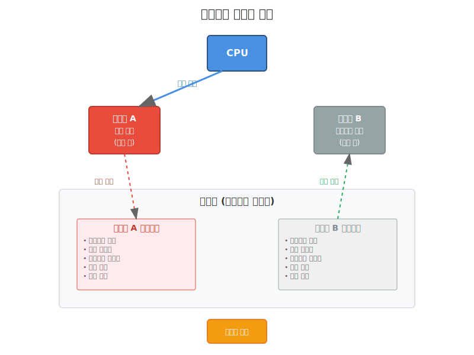
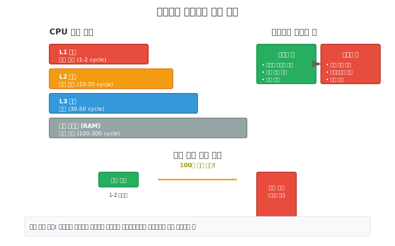
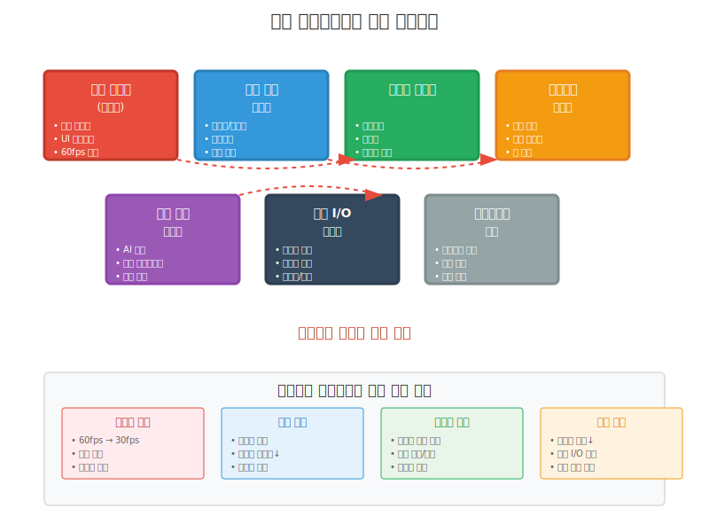
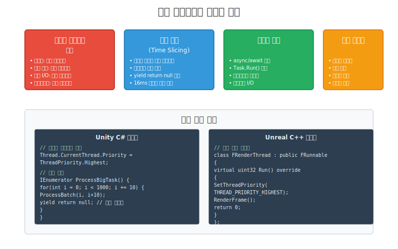
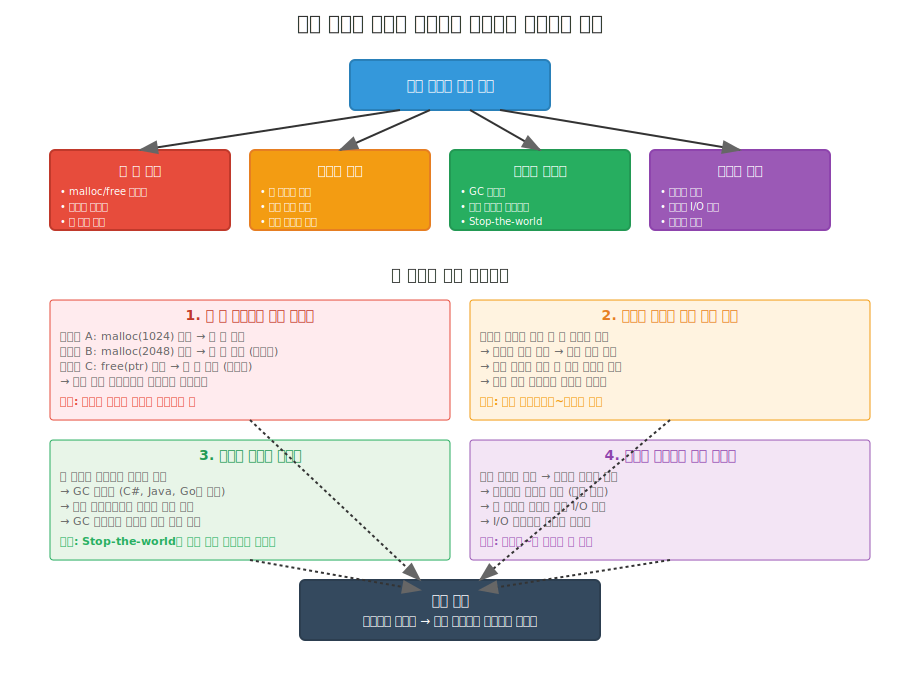
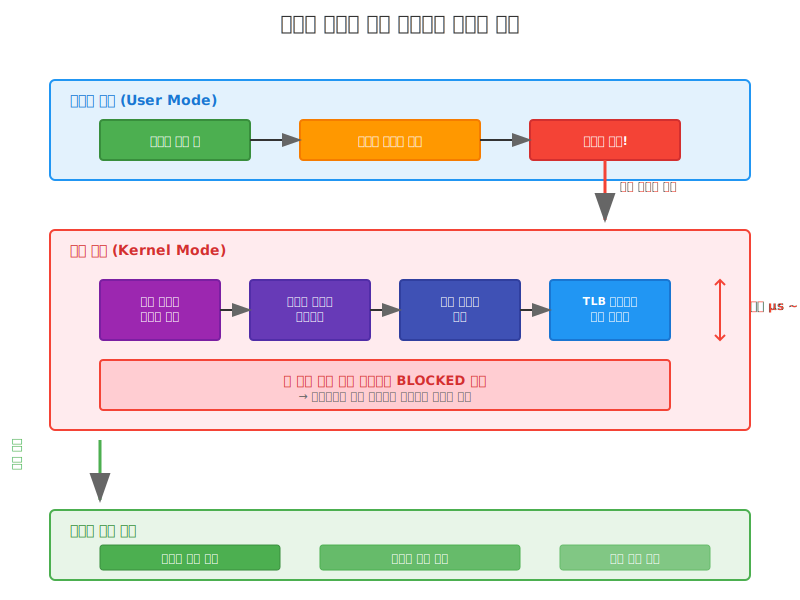

# 컨텍스트 스위칭 (Context Switching)
  
## 컨텍스트 스위칭이란?
컨텍스트 스위칭을 쉽게 비유하면, **여러 명이 한 대의 컴퓨터를 번갈아 사용하는 상황**과 같다. 한 사람이 컴퓨터를 사용하다가 잠시 자리를 비우면, 다른 사람이 그 컴퓨터를 사용할 수 있도록 현재 작업을 저장하고 새로운 사용자의 작업 환경을 불러오는 과정이다.   
     
  

### 1. 타이머 인터럽트 (시간 할당량 소진)
Windows에서는 보통 15.6ms 마다 "시간 끝!" 신호를 보낸다. 게임 서버에서 말하자면, 한 스레드가 플레이어 데이터 처리에 너무 오래 집중하고 있으면 강제로 멈추고 다른 작업(네트워크 패킷 처리 등)에게 기회를 준다.

**게임 서버 예시:**
```csharp
// 이런 코드는 위험하다 - 무한루프로 CPU를 독점할 수 있음
while (true) {
    ProcessPlayerMovement(); // 타이머 인터럽트가 없다면 계속 실행됨
}
```

### 2. I/O 대기 상황
파일을 읽거나 네트워크 통신을 기다릴 때 발생한다. 게임 서버에서 데이터베이스 조회나 다른 서버와의 통신을 기다리는 동안 다른 스레드가 일할 수 있게 한다.

**게임 서버 예시:**
```golang
// 네트워크 요청 시 컨텍스트 스위칭 발생
response, err := http.Get("http://api.gameserver.com/player/123") // 여기서 대기
// 이 시점에 다른 스레드가 실행됨

// Sleep 호출 시에도 발생
time.Sleep(100 * time.Millisecond) // 다른 스레드에게 실행 기회 제공
```
  
### 3. 우선순위 변화
더 중요한 작업이 생기면 즉시 실행권을 넘긴다. 게임 서버에서 긴급한 패킷 처리가 필요하면 일반적인 게임 로직 처리를 멈추고 우선 처리한다.  
  
### 4. 명시적 양보
개발자가 직접 "다른 스레드 먼저 해" 라고 지시하는 경우다.

**게임 서버 예시:**
```csharp
// 무거운 작업 중간에 다른 스레드에게 기회 제공
for (int i = 0; i < 1000000; i++) {
    ProcessHeavyGameLogic(i);
    if (i % 1000 == 0) {
        Thread.Yield(); // 다른 스레드에게 양보
    }
}
```
  
## 성능에 미치는 영향
  
       
  

## 실무에서 고려해야 할 점들

### 게임 서버에서의 실제 영향

1. **네트워크 패킷 처리**: 초당 수만 개의 패킷을 처리하는 게임 서버에서 컨텍스트 스위칭이 자주 발생하면 레이턴시가 증가한다.

2. **플레이어 데이터 캐싱**: 플레이어의 위치, 스킬 쿨다운 등의 데이터가 캐시에서 밀려나면 다시 로드하는 시간이 필요하다.

3. **실시간 게임 로직**: FPS나 MOBA 같은 실시간 게임에서는 몇 밀리초의 지연도 게임 경험에 영향을 준다.
  
### 최적화 방법들

```csharp
// 1. 스레드 풀 사용으로 생성/소멸 비용 줄이기
ThreadPool.QueueUserWorkItem(ProcessPlayerAction);

// 2. 적절한 스레드 수 설정 (CPU 코어 수와 비슷하게)
int optimalThreadCount = Environment.ProcessorCount;

// 3. 무거운 작업은 작게 나누어 처리
for (int i = 0; i < players.Length; i += batchSize) {
    ProcessPlayerBatch(players, i, Math.Min(i + batchSize, players.Length));
    if (needContextSwitch) Thread.Yield(); // 필요시에만 양보
}
```

### 성능 측정 방법
게임 서버에서는 다음과 같은 지표들을 모니터링한다:
- **Context Switches/sec**: 초당 컨텍스트 스위칭 횟수
- **% Processor Time**: CPU 사용률
- **Cache Hit Ratio**: 캐시 적중률

이런 지표들을 통해 스레드 설계가 적절한지 판단할 수 있다.

컨텍스트 스위칭은 멀티스레딩의 필수적인 부분이지만, 게임 서버처럼 고성능이 요구되는 환경에서는 신중하게 관리해야 하는 중요한 요소다. 적절한 스레드 설계와 모니터링을 통해 최적의 성능을 얻을 수 있다.

  

-----  

## 게임 클라이언트에서의 실제 영향
게임 클라이언트는 서버와 다르게 **사용자 경험**이 가장 중요하다. 컨텍스트 스위칭이 많이 발생하면 플레이어가 직접 느낄 수 있는 문제들이 생긴다.  
  
     
  
### 1. 프레임 드롭 (Frame Drop)
게임에서 가장 중요한 것은 **일정한 프레임률 유지**다. 컨텍스트 스위칭이 자주 발생하면 렌더링 스레드가 방해받아서 60fps를 유지하기 어려워진다.  
  
**Unity C# 예시:**
```csharp
public class GameRenderer : MonoBehaviour {
    void Update() {
        // 매 프레임마다 호출되어야 하는 렌더링 작업
        RenderAllGameObjects();
        UpdateAnimations();
        ProcessLighting();
        
        // 만약 이 시점에 컨텍스트 스위칭이 발생하면
        // 다음 프레임까지의 시간(16.67ms)을 놓칠 수 있음
    }
}

// 잘못된 예: 메인 스레드에서 무거운 작업
void BadExample() {
    // 이런 코드는 렌더링을 블록함
    for (int i = 0; i < 100000; i++) {
        CalculateComplexAI(); // 컨텍스트 스위칭 유발 가능
    }
}
```

**실제 영향:**
- 60fps → 30fps 또는 그 이하로 떨어짐
- 화면이 끊기는 현상 (스터터링)
- 특히 FPS, 액션 게임에서 치명적

### 2. 입력 지연 (Input Lag)
사용자의 마우스 클릭이나 키보드 입력이 화면에 반영되는 시간이 늘어난다. 게임에서는 몇 밀리초의 지연도 플레이어가 느낄 수 있다.

**Unreal C++ 예시:**
```cpp
// 입력 처리 스레드에서
void APlayerController::ProcessInput() {
    FVector2D MouseInput = GetInputMouseDelta();
    
    // 컨텍스트 스위칭이 발생하면 여기서 지연 발생
    if (ContextSwitchOccurs()) {
        // 10-50ms 지연 가능 (플레이어가 느낄 수 있는 수준)
        DelayedResponse();
    }
    
    RotateCamera(MouseInput); // 마우스 움직임이 늦게 반영됨
}

// 최적화된 예: 입력을 별도 스레드에서 처리
std::thread inputThread([]() {
    while (gameRunning) {
        ProcessHighPriorityInput(); // 높은 우선순위로 처리
        std::this_thread::sleep_for(std::chrono::milliseconds(1));
    }
});
```

**실제 영향:**
- 마우스 감도가 둔해진 것 같은 느낌
- 키보드 입력 반응이 늦음
- 특히 격투게임, 슈팅게임에서 심각한 문제

### 3. 오디오 끊김 (Audio Stuttering)
게임의 배경음악이나 효과음이 끊기는 현상이다. 오디오는 **실시간 스트리밍**이라서 조금의 지연도 바로 들린다.

**C# 오디오 처리 예시:**
```csharp
public class AudioManager : MonoBehaviour {
    private AudioSource bgmSource;
    private Queue<float[]> audioBuffer = new Queue<float[]>();
    
    void UpdateAudio() {
        // 오디오 버퍼가 비어있으면 소리가 끊김
        if (audioBuffer.Count == 0) {
            // 컨텍스트 스위칭으로 인해 새로운 오디오 데이터를 
            // 제때 준비하지 못한 경우
            Debug.LogWarning("Audio buffer underrun!"); // 소리 끊김 발생
        }
    }
    
    // 해결 방법: 충분한 버퍼 크기 확보
    void OptimizedAudioUpdate() {
        const int SAFE_BUFFER_SIZE = 4096; // 여유분 확보
        while (audioBuffer.Count < SAFE_BUFFER_SIZE) {
            LoadNextAudioChunk();
        }
    }
}
```

**실제 영향:**
- 배경음악이 뚝뚝 끊김
- 효과음이 제때 재생되지 않음
- 게임의 몰입감이 크게 떨어짐

### 4. UI 응답성 저하
게임 내 메뉴, 인벤토리, 채팅창 등의 UI가 느리게 반응한다.

**Unity UI 예시:**
```csharp
public class InventoryUI : MonoBehaviour {
    public void OnItemClicked() {
        // UI 업데이트가 메인 스레드에서 실행됨
        StartCoroutine(UpdateInventoryDisplay());
        
        // 만약 여기서 컨텍스트 스위칭이 발생하면
        // UI 업데이트가 다음 프레임으로 밀림
    }
    
    // 최적화: UI 업데이트를 여러 프레임에 분산
    IEnumerator UpdateInventoryDisplay() {
        for (int i = 0; i < itemCount; i += batchSize) {
            UpdateItemBatch(i, i + batchSize);
            yield return null; // 다음 프레임에서 계속
        }
    }
}
```

### 5. 네트워크 통신 지연
온라인 게임에서 서버와의 통신이 불안정해진다.

**Golang 네트워크 클라이언트 예시:**
```go
// 게임 클라이언트의 네트워크 처리
func (c *GameClient) SendPlayerAction(action PlayerAction) {
    // 패킷 생성
    packet := createPacket(action)
    
    // 컨텍스트 스위칭이 발생하면 패킷 전송 지연
    select {
    case c.sendChannel <- packet:
        // 정상 전송
    case <-time.After(10 * time.Millisecond):
        // 전송 지연 발생 - 게임에서는 치명적
        log.Warning("Packet send delayed due to context switch")
    }
}

// 최적화: 네트워크 전용 고루틴 사용
func (c *GameClient) networkWorker() {
    for {
        select {
        case packet := <-c.sendChannel:
            c.conn.Write(packet) // 즉시 전송
        case <-c.shutdownCh:
            return
        }
    }
}
```

### 최적화 전략들

     


### 1. 스레드 우선순위 조정

**Unity에서의 구현:**
```csharp
public class GameManager : MonoBehaviour {
    void Start() {
        // 렌더링 스레드는 최고 우선순위
        Thread.CurrentThread.Priority = ThreadPriority.Highest;
        
        // 입력 처리 스레드
        Thread inputThread = new Thread(ProcessInput);
        inputThread.Priority = ThreadPriority.AboveNormal;
        inputThread.Start();
        
        // 파일 로딩은 낮은 우선순위
        Thread fileThread = new Thread(LoadAssets);
        fileThread.Priority = ThreadPriority.BelowNormal;
        fileThread.Start();
    }
}
```

### 2. 프레임 기반 작업 분할

**대용량 데이터 처리를 여러 프레임에 분산:**
```csharp
public class EnemyAIManager : MonoBehaviour {
    private List<Enemy> enemies = new List<Enemy>();
    private int currentIndex = 0;
    
    void Update() {
        // 매 프레임마다 일정 수의 적만 처리
        int processed = 0;
        float startTime = Time.realtimeSinceStartup;
        
        while (processed < enemies.Count && 
               (Time.realtimeSinceStartup - startTime) < 0.005f) { // 5ms 제한
            
            enemies[currentIndex].UpdateAI();
            currentIndex = (currentIndex + 1) % enemies.Count;
            processed++;
        }
    }
}
```

### 3. 비동기 리소스 로딩

**Golang 스타일의 비동기 처리:**
```go
// 게임 클라이언트에서 리소스 로딩
type ResourceLoader struct {
    loadQueue chan LoadRequest
    cache     map[string]Resource
}

func (r *ResourceLoader) LoadResourceAsync(path string) <-chan Resource {
    resultCh := make(chan Resource, 1)
    
    go func() {
        // 백그라운드에서 로딩 (메인 스레드 방해 안 함)
        resource := r.loadFromDisk(path)
        r.cache[path] = resource
        resultCh <- resource
    }()
    
    return resultCh
}
```

### 4. 객체 풀링으로 메모리 할당 최소화

```csharp
public class BulletPool : MonoBehaviour {
    private Queue<GameObject> bulletPool = new Queue<GameObject>();
    
    public GameObject GetBullet() {
        if (bulletPool.Count > 0) {
            return bulletPool.Dequeue(); // 재사용으로 GC 압박 줄임
        }
        
        return Instantiate(bulletPrefab); // 필요시에만 새로 생성
    }
    
    public void ReturnBullet(GameObject bullet) {
        bullet.SetActive(false);
        bulletPool.Enqueue(bullet); // 풀에 반환
    }
}
```

### 실제 성능 차이 측정

**게임에서 확인해야 할 지표들:**
- **FPS (Frames Per Second)**: 60fps 유지 여부
- **Frame Time**: 각 프레임이 걸리는 시간 (16.67ms 목표)
- **Input Latency**: 입력부터 화면 반영까지의 시간
- **Audio Buffer Underruns**: 오디오 끊김 횟수
- **Context Switches/sec**: Windows 성능 모니터로 확인

**Unity Profiler에서 확인:**
```csharp
public class PerformanceMonitor : MonoBehaviour {
    void Update() {
        // 프레임 시간 모니터링
        float frameTime = Time.deltaTime * 1000f; // ms 단위
        if (frameTime > 16.67f) {
            Debug.LogWarning($"Frame drop detected: {frameTime:F2}ms");
        }
        
        // 메모리 할당 모니터링
        long memoryBefore = GC.GetTotalMemory(false);
        // ... 게임 로직 실행 ...
        long memoryAfter = GC.GetTotalMemory(false);
        
        if (memoryAfter - memoryBefore > 1024 * 1024) { // 1MB 이상
            Debug.LogWarning("High memory allocation detected");
        }
    }
}
```

게임 클라이언트에서는 서버와 달리 **플레이어가 직접 느끼는 경험**이 최우선이다. 컨텍스트 스위칭으로 인한 성능 저하는 바로 게임의 재미에 영향을 주기 때문에, 적절한 스레드 설계와 최적화가 반드시 필요하다. 특히 모바일 게임에서는 배터리 수명과도 직결되므로 더욱 신중하게 관리해야 한다.       
    

멀티스레드 환경에서 동적 메모리 사용이 컨텍스트 스위칭을 유발하는 것은 **직접적인 원인은 아니지만, 여러 간접적인 경로를 통해 유발**한다. 자세히 설명해보겠다.
  
  
-----    
  

## 동적 메모리와 컨텍스트 스위칭의 연관성

     

## 1. 힙 락 경합 (Heap Lock Contention)
멀티스레드 환경에서 가장 흔한 원인이다. 대부분의 메모리 할당자는 **힙을 보호하기 위해 뮤텍스나 스핀락을 사용**한다.

### **발생 메커니즘:**

**C++ 예시:**
```cpp
// 여러 스레드가 동시에 메모리 할당을 시도하는 상황
std::vector<std::thread> threads;

for (int i = 0; i < 8; i++) {
    threads.emplace_back([]() {
        for (int j = 0; j < 10000; j++) {
            // 이 부분에서 힙 락 경합 발생
            void* ptr = malloc(1024);  // 힙 락 획득 필요
            
            // 만약 다른 스레드가 힙 락을 가지고 있다면?
            // → 현재 스레드는 블로킹됨
            // → 운영체제가 이 스레드를 대기 상태로 전환
            // → 다른 스레드로 컨텍스트 스위칭 발생
            
            DoSomeWork(ptr);
            free(ptr);  // 여기서도 힙 락 필요
        }
    });
}
```

**실제 윈도우에서의 힙 구조:**
- Windows의 `HeapAlloc()`은 내부적으로 Critical Section 사용
- 하나의 스레드만 힙에 접근 가능
- 다른 스레드들은 `WaitForSingleObject()` 상태가 됨

### **성능 측정 예시:**

**C# 스레드 경합 측정:**
```csharp
class HeapContentionTest {
    private static volatile int allocCount = 0;
    private static object lockObj = new object();
    
    static void AllocatorThread() {
        var stopwatch = Stopwatch.StartNew();
        
        for (int i = 0; i < 100000; i++) {
            // GC 힙에서 할당 - 내부적으로 동기화 발생
            byte[] buffer = new byte[1024];
            
            // 할당 시간이 평소보다 길면 경합 발생
            if (stopwatch.ElapsedMilliseconds > 50) {
                Console.WriteLine($"Thread {Thread.CurrentThread.ManagedThreadId}: " +
                                $"Allocation took {stopwatch.ElapsedMilliseconds}ms - " +
                                $"Context switching likely occurred");
            }
            
            Interlocked.Increment(ref allocCount);
            stopwatch.Restart();
        }
    }
    
    static void Main() {
        Thread[] threads = new Thread[Environment.ProcessorCount * 2];
        
        for (int i = 0; i < threads.Length; i++) {
            threads[i] = new Thread(AllocatorThread);
            threads[i].Start();
        }
        
        Array.ForEach(threads, t => t.Join());
        Console.WriteLine($"Total allocations: {allocCount}");
    }
}
```
  

## 2. 페이지 폴트 (Page Fault)
큰 메모리 블록을 할당할 때 새로운 가상 메모리 페이지가 필요하면 커널에 요청해야 한다.

### **발생 과정:**
  
   
  
### **실제 코드에서의 페이지 폴트:**

**C++ 대용량 할당 예시:**
```cpp
#include <chrono>
#include <iostream>
#include <vector>

void MeasurePageFaultLatency() {
    const size_t LARGE_SIZE = 100 * 1024 * 1024; // 100MB
    
    auto start = std::chrono::high_resolution_clock::now();
    
    // 이 할당에서 페이지 폴트가 여러 번 발생할 수 있음
    char* largeBuffer = new char[LARGE_SIZE];
    
    auto end = std::chrono::high_resolution_clock::now();
    auto duration = std::chrono::duration_cast<std::chrono::microseconds>(end - start);
    
    std::cout << "Allocation time: " << duration.count() << " microseconds\n";
    
    // 실제로 메모리에 접근해야 페이지 폴트 발생
    start = std::chrono::high_resolution_clock::now();
    for (size_t i = 0; i < LARGE_SIZE; i += 4096) { // 페이지 크기마다 접근
        largeBuffer[i] = 1; // 여기서 페이지 폴트 발생 가능
    }
    end = std::chrono::high_resolution_clock::now();
    duration = std::chrono::duration_cast<std::chrono::microseconds>(end - start);
    
    std::cout << "First access time: " << duration.count() << " microseconds\n";
    // 첫 접근이 할당보다 훨씬 오래 걸린다면 페이지 폴트 발생
    
    delete[] largeBuffer;
}
```

**게임 서버에서 실제 발생 사례:**
```csharp
// 플레이어 데이터 캐시가 급격히 커지는 상황
public class PlayerDataCache {
    private Dictionary<int, PlayerData> playerCache = new();
    
    public void AddPlayers(List<PlayerData> newPlayers) {
        var stopwatch = Stopwatch.StartNew();
        
        foreach (var player in newPlayers) {
            // 대량의 플레이어 데이터 추가 시
            // Dictionary 내부 배열이 재할당되면서 페이지 폴트 발생 가능
            playerCache[player.Id] = player;
            
            if (stopwatch.ElapsedMilliseconds > 5) {
                // 5ms 이상 걸리면 페이지 폴트 의심
                Console.WriteLine($"Potential page fault at player {player.Id}");
                stopwatch.Restart();
            }
        }
    }
}
```

## 3. 가비지 컬렉션 (Garbage Collection)
C#과 Golang에서는 메모리 할당이 많으면 GC가 트리거되어 **모든 스레드가 일시 정지**된다.

### **GC로 인한 강제 컨텍스트 스위칭:**

**C# GC 모니터링:**
```csharp
public class GCMonitor {
    private static volatile bool isMonitoring = true;
    private static int lastGen0Count = 0;
    private static int lastGen1Count = 0;
    private static int lastGen2Count = 0;
    
    public static void StartGCMonitoring() {
        Thread gcMonitorThread = new Thread(() => {
            while (isMonitoring) {
                int gen0 = GC.CollectionCount(0);
                int gen1 = GC.CollectionCount(1);
                int gen2 = GC.CollectionCount(2);
                
                if (gen0 > lastGen0Count || gen1 > lastGen1Count || gen2 > lastGen2Count) {
                    // GC가 발생했다 = 모든 애플리케이션 스레드가 정지했다
                    Console.WriteLine($"GC occurred! Gen0: {gen0-lastGen0Count}, " +
                                    $"Gen1: {gen1-lastGen1Count}, Gen2: {gen2-lastGen2Count}");
                    Console.WriteLine("All threads were context switched during GC!");
                    
                    lastGen0Count = gen0;
                    lastGen1Count = gen1;
                    lastGen2Count = gen2;
                }
                
                Thread.Sleep(100);
            }
        });
        
        gcMonitorThread.IsBackground = true;
        gcMonitorThread.Start();
    }
    
    // GC를 유발하는 코드 예시
    public static void AllocateLotsOfMemory() {
        var threads = new Thread[Environment.ProcessorCount];
        
        for (int i = 0; i < threads.Length; i++) {
            threads[i] = new Thread(() => {
                for (int j = 0; j < 10000; j++) {
                    // 대량의 작은 객체 할당 - Gen0 GC 유발
                    var data = new byte[1024];
                    var list = new List<int>(100);
                    
                    // 이런 할당이 누적되면 GC 임계치 도달
                    // → GC 트리거
                    // → 모든 스레드 강제 일시정지
                    // → GC 스레드로 컨텍스트 스위칭
                }
            });
            threads[i].Start();
        }
        
        Array.ForEach(threads, t => t.Join());
    }
}
```

**Golang GC와 고루틴:**
```go
package main

import (
    "fmt"
    "runtime"
    "runtime/debug"
    "sync"
    "time"
)

func monitorGC() {
    var stats runtime.MemStats
    var lastGC uint32 = 0
    
    for {
        runtime.ReadMemStats(&stats)
        
        if stats.NumGC > lastGC {
            // GC가 발생했음을 감지
            fmt.Printf("GC occurred! Pause time: %v\n", 
                      time.Duration(stats.PauseNs[(stats.NumGC+255)%256]))
            fmt.Printf("All goroutines were paused during GC\n")
            lastGC = stats.NumGC
        }
        
        time.Sleep(100 * time.Millisecond)
    }
}

func allocateMemory(wg *sync.WaitGroup, id int) {
    defer wg.Done()
    
    for i := 0; i < 100000; i++ {
        // 대량의 메모리 할당
        data := make([]byte, 1024)
        sliceData := make([]int, 100)
        
        // 이런 할당들이 누적되면 GC 트리거
        // → 모든 고루틴이 일시 정지
        // → GC 고루틴으로 강제 컨텍스트 스위칭
        
        _ = data
        _ = sliceData
        
        if i % 10000 == 0 {
            fmt.Printf("Goroutine %d: allocated %d times\n", id, i)
        }
    }
}

func main() {
    // GC 모니터링 시작
    go monitorGC()
    
    // GC 임계치를 낮춰서 더 자주 발생하게 함
    debug.SetGCPercent(10) // 기본값 100에서 10으로 낮춤
    
    var wg sync.WaitGroup
    
    // 여러 고루틴에서 동시에 메모리 할당
    for i := 0; i < 10; i++ {
        wg.Add(1)
        go allocateMemory(&wg, i)
    }
    
    wg.Wait()
    
    // 최종 GC 통계 출력
    var stats runtime.MemStats
    runtime.ReadMemStats(&stats)
    fmt.Printf("Total GC runs: %d\n", stats.NumGC)
    fmt.Printf("Total pause time: %v\n", 
              time.Duration(stats.PauseTotalNs))
}
```
  

## 4. 메모리 부족으로 인한 스와핑
물리 메모리가 부족하면 운영체제가 일부 페이지를 디스크로 내보낸다 (스와핑). 이때 매우 긴 I/O 대기가 발생한다.

### **스와핑 감지 및 측정:**

**C++ Windows API를 사용한 메모리 상태 확인:**
```cpp
#include <windows.h>
#include <psapi.h>
#include <iostream>

void CheckMemoryPressure() {
    MEMORYSTATUSEX memStatus;
    memStatus.dwLength = sizeof(memStatus);
    
    if (GlobalMemoryStatusEx(&memStatus)) {
        // 물리 메모리 사용률 확인
        DWORD memoryLoad = memStatus.dwMemoryLoad;
        DWORDLONG availPhysMem = memStatus.ullAvailPhys;
        DWORDLONG totalPhysMem = memStatus.ullTotalPhys;
        
        std::cout << "Memory load: " << memoryLoad << "%\n";
        std::cout << "Available physical memory: " 
                  << (availPhysMem / (1024*1024)) << " MB\n";
        
        if (memoryLoad > 90) {
            std::cout << "WARNING: High memory pressure!\n";
            std::cout << "Memory allocation may cause swapping and context switching\n";
        }
    }
    
    // 페이지 폴트 통계 확인
    PROCESS_MEMORY_COUNTERS_EX pmc;
    if (GetProcessMemoryInfo(GetCurrentProcess(), 
                           (PROCESS_MEMORY_COUNTERS*)&pmc, 
                           sizeof(pmc))) {
        std::cout << "Page fault count: " << pmc.PageFaultCount << "\n";
        // 페이지 폴트가 많으면 스와핑이 발생하고 있을 가능성
    }
}

// 스와핑을 유발할 수 있는 대량 메모리 할당
void CauseMemoryPressure() {
    std::vector<char*> allocatedMemory;
    const size_t CHUNK_SIZE = 100 * 1024 * 1024; // 100MB chunks
    
    try {
        for (int i = 0; i < 100; i++) { // 최대 10GB까지 할당 시도
            auto start = std::chrono::high_resolution_clock::now();
            
            char* chunk = new char[CHUNK_SIZE];
            // 실제로 메모리에 접근 (페이지 폴트 유발)
            memset(chunk, i, CHUNK_SIZE);
            
            auto end = std::chrono::high_resolution_clock::now();
            auto duration = std::chrono::duration_cast<std::chrono::milliseconds>(end - start);
            
            if (duration.count() > 100) { // 100ms 이상 걸리면
                std::cout << "Chunk " << i << " took " << duration.count() 
                         << "ms - likely swapping occurred!\n";
                std::cout << "Context switching to other threads during I/O wait\n";
            }
            
            allocatedMemory.push_back(chunk);
            CheckMemoryPressure();
        }
    } catch (std::bad_alloc& e) {
        std::cout << "Memory allocation failed: " << e.what() << "\n";
    }
    
    // 메모리 해제
    for (char* chunk : allocatedMemory) {
        delete[] chunk;
    }
}
```
  

## 최적화 방법들

### **1. 메모리 풀 사용으로 힙 경합 줄이기:**

**C++ 스레드별 메모리 풀:**
```cpp
class ThreadLocalMemoryPool {
private:
    static thread_local std::unique_ptr<MemoryPool> localPool;
    
public:
    static void* Allocate(size_t size) {
        if (!localPool) {
            localPool = std::make_unique<MemoryPool>(1024 * 1024); // 1MB 풀
        }
        
        // 스레드별 풀 사용 → 힙 락 경합 없음
        return localPool->Allocate(size);
    }
    
    static void Deallocate(void* ptr) {
        if (localPool) {
            localPool->Deallocate(ptr);
        }
    }
};

thread_local std::unique_ptr<MemoryPool> 
    ThreadLocalMemoryPool::localPool = nullptr;
```

### **2. 객체 풀링으로 GC 압박 줄이기:**

**C# 게임 오브젝트 풀:**
```csharp
public class GameObjectPool<T> where T : class, new() {
    private readonly ConcurrentQueue<T> pool = new();
    private readonly Func<T> factory;
    
    public GameObjectPool(Func<T> factory = null) {
        this.factory = factory ?? (() => new T());
    }
    
    public T Rent() {
        if (pool.TryDequeue(out T item)) {
            return item; // 재사용 → GC 압박 없음
        }
        return factory(); // 새 객체 생성
    }
    
    public void Return(T item) {
        // 객체를 리셋하고 풀에 반환
        if (item is IResettable resettable) {
            resettable.Reset();
        }
        pool.Enqueue(item);
    }
}

// 사용 예시 - 총알 객체 풀
var bulletPool = new GameObjectPool<Bullet>();

// 총알 발사 시
Bullet bullet = bulletPool.Rent(); // GC 없음
bullet.Fire(position, direction);

// 총알 소멸 시  
bulletPool.Return(bullet); // GC 없이 재사용
```

### **3. 메모리 사용량 모니터링:**

**실시간 메모리 압박 감지:**
```csharp
public class MemoryPressureMonitor {
    private readonly Timer monitorTimer;
    
    public MemoryPressureMonitor() {
        monitorTimer = new Timer(CheckMemoryPressure, null, 
                               TimeSpan.Zero, TimeSpan.FromSeconds(1));
    }
    
    private void CheckMemoryPressure(object state) {
        var gcMemory = GC.GetTotalMemory(false);
        var workingSet = Process.GetCurrentProcess().WorkingSet64;
        
        // 메모리 사용량이 임계치 초과 시 경고
        if (gcMemory > 500 * 1024 * 1024) { // 500MB
            Console.WriteLine($"High GC memory: {gcMemory / (1024*1024)}MB");
            Console.WriteLine("Consider object pooling to reduce allocations");
        }
        
        if (workingSet > 1024 * 1024 * 1024) { // 1GB
            Console.WriteLine($"High working set: {workingSet / (1024*1024)}MB");
            Console.WriteLine("Risk of swapping and context switching");
        }
        
        // GC 압박 레벨 확인
        var pressure = GC.GetMemoryInfo().MemoryLoadBytes;
        if (pressure > 0.8) { // 80% 이상
            Console.WriteLine("High memory pressure - GC will run more frequently");
        }
    }
}
```
  

## 결론
동적 메모리 할당이 컨텍스트 스위칭을 유발하는 주요 경로들은 다음과 같다:

1. **힙 락 경합**: 가장 흔한 원인, 적절한 메모리 풀로 해결
2. **페이지 폴트**: 대용량 할당 시 발생, 메모리 사전 할당으로 완화
3. **GC 트리거**: 객체 풀링과 할당 패턴 최적화로 해결
4. **메모리 부족**: 시스템 모니터링과 메모리 사용량 제한으로 예방

게임 서버와 클라이언트에서는 이런 원인들을 이해하고 적절한 최적화 전략을 적용하여 안정적인 성능을 유지해야 한다.    