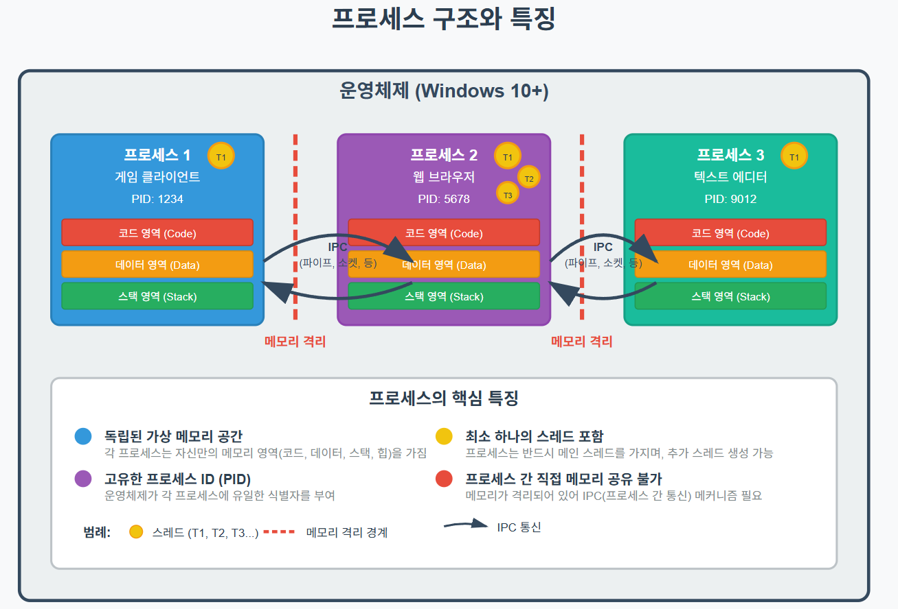
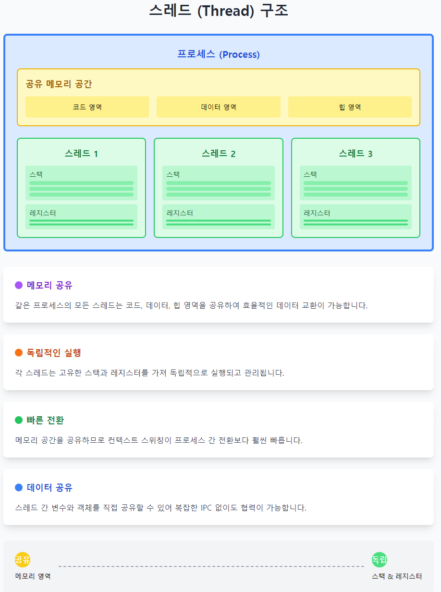
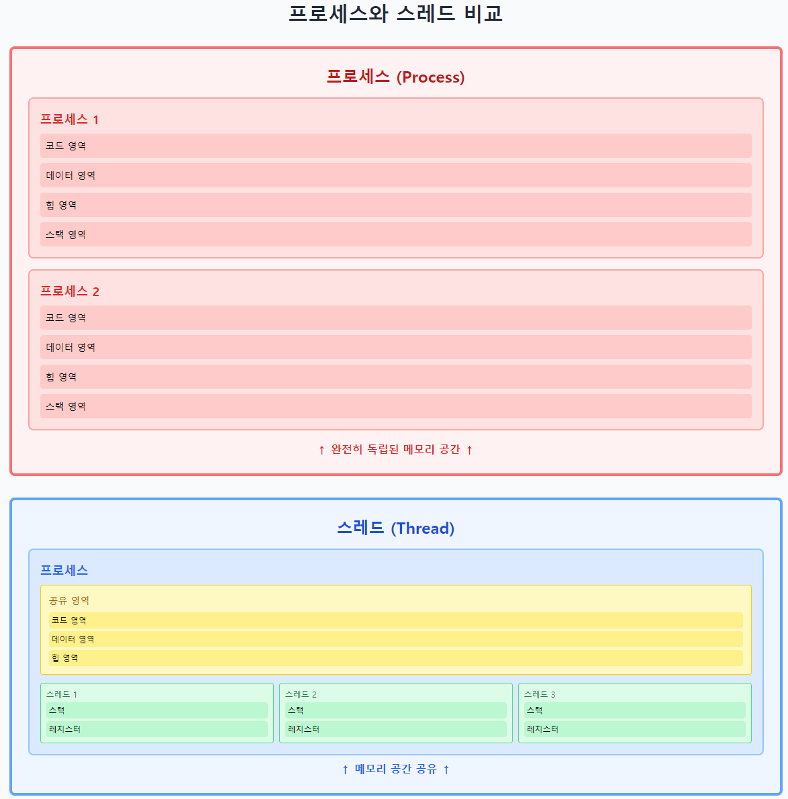
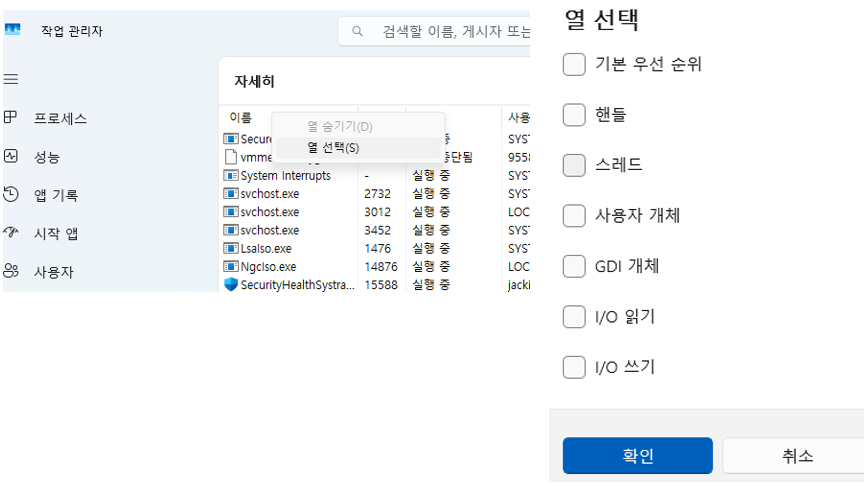
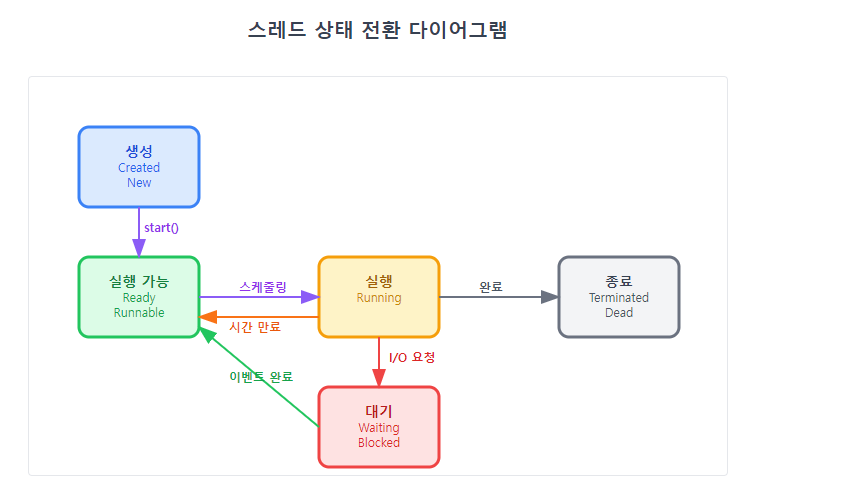
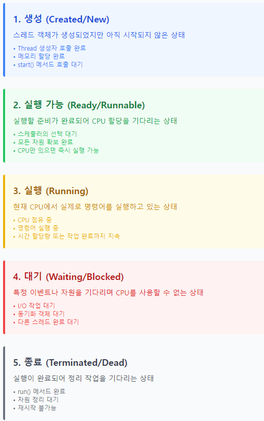
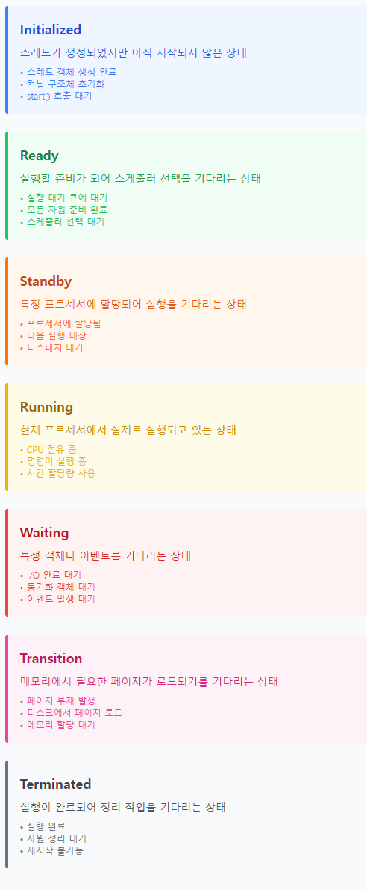
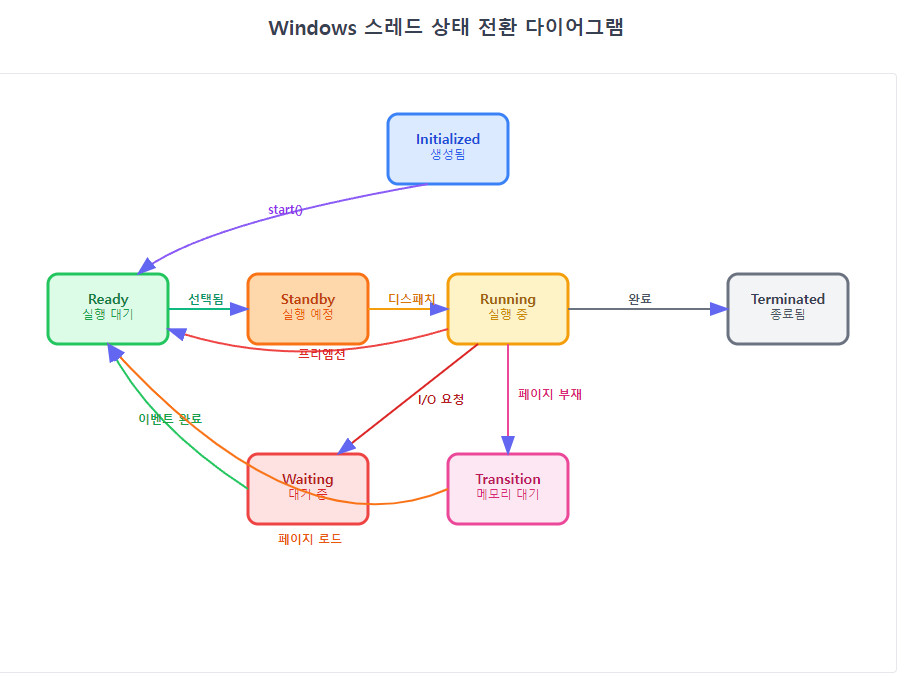
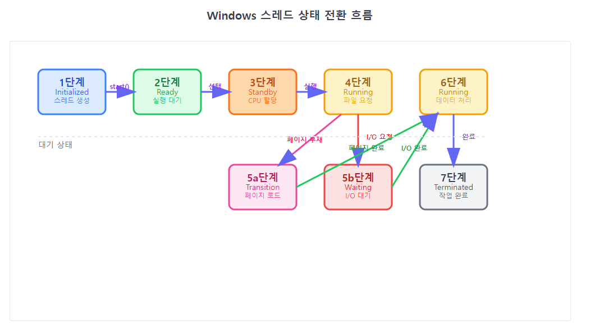
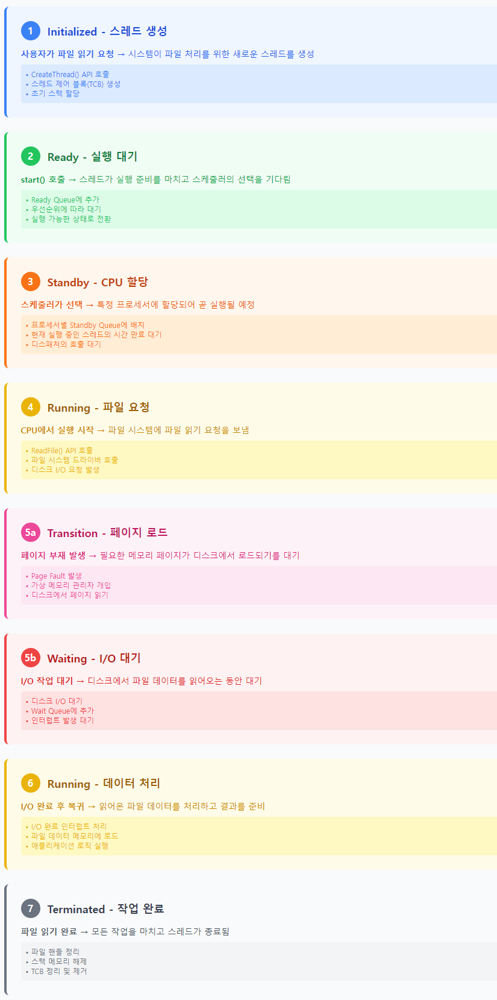

# 2주차: 운영체제와 멀티쓰레드 기초

## 학습 목표
- 운영체제의 기본 개념과 커널의 역할을 이해한다
- 프로세스와 스레드의 차이점을 명확히 구분할 수 있다
- 멀티프로세스와 멀티스레드의 장단점을 비교 분석할 수 있다
- 간단한 멀티스레드 프로그램을 작성하고 성능을 측정할 수 있다

---

## 커널(Kernel) 

### 1. 커널(Kernel)의 정의와 핵심 개념

#### 1.1 커널이란?
커널(Kernel)은 운영체제의 핵심 구성요소로, 컴퓨터의 하드웨어와 소프트웨어 사이에서 중개자 역할을 수행한다. 마치 호텔의 컨시어지처럼, 모든 요청을 받아서 적절한 자원과 연결해주는 역할을 한다.

**커널의 핵심 특징:**
- **독점적 하드웨어 접근**: 오직 커널만이 하드웨어에 직접 접근할 수 있다
- **자원 관리자**: CPU, 메모리, 저장장치, 네트워크 등 모든 시스템 자원을 관리
- **보안 게이트키퍼**: 애플리케이션의 모든 시스템 요청을 검증하고 제어
- **서비스 제공자**: 시스템 콜을 통해 표준화된 서비스를 제공

#### 1.2 시스템 아키텍처에서의 커널 위치

<pre>
┌─────────────────────────────────────────────────────────────┐
│                    사용자 애플리케이션                         │
│  ┌─────────────┐ ┌─────────────┐ ┌─────────────────────────┐│
│  │   게임 클라  │ │   웹 브라우저│ │      개발 도구            │ │
│  │   이언트     │ │             │ │                         │ │
│  └─────────────┘ └─────────────┘ └─────────────────────────┘ │
├──────────────────────────────────────────────────────────────┤ ← 유저 모드/커널 모드 경계
│                        커널 공간                              │
│  ┌─────────────┐ ┌─────────────┐ ┌─────────────────────────┐ │
│  │ 프로세스     │ │   메모리     │ │     파일 시스템           │ │
│  │ 관리자       │ │   관리자     │ │     관리자               │ │
│  └─────────────┘ └─────────────┘ └─────────────────────────┘ │
│  ┌─────────────┐ ┌─────────────┐ ┌─────────────────────────┐ │
│  │ 네트워크     │ │ 디바이스     │ │     스케줄러              │ │
│  │ 스택         │ │ 드라이버     │ │                         │ │
│  └─────────────┘ └─────────────┘ └─────────────────────────┘ │
├──────────────────────────────────────────────────────────────┤
│                      하드웨어 계층                             │
│  ┌─────────────┐ ┌─────────────┐ ┌─────────────────────────┐ │
│  │     CPU     │ │    메모리   │ │       저장장치            │ │
│  └─────────────┘ └─────────────┘ └─────────────────────────┘ │
│  ┌─────────────┐ ┌─────────────┐ ┌─────────────────────────┐ │
│  │ 네트워크     │ │   그래픽    │ │      기타 장치             │ │
│  │ 인터페이스   │ │   카드      │ │                           │ │
│  └─────────────┘ └─────────────┘ └─────────────────────────┘ │
└──────────────────────────────────────────────────────────────┘
</pre>

#### 1.3 커널의 주요 역할과 기능

**1) 프로세스 및 스레드 관리**
- 프로세스 생성, 종료, 스케줄링
- 스레드 간 컨텍스트 스위칭
- 우선순위 기반 CPU 할당

**2) 메모리 관리**
- 가상 메모리 시스템 운영
- 페이지 교체 알고리즘 실행
- 메모리 보호 및 격리

**3) 파일 시스템 관리**
- 파일 생성, 읽기, 쓰기, 삭제
- 디렉토리 구조 관리
- 접근 권한 제어

**4) 네트워크 관리**
- 소켓 생성 및 관리
- 프로토콜 스택 운영
- 패킷 라우팅

**5) 디바이스 관리**
- 하드웨어 추상화
- 인터럽트 처리
- 디바이스 드라이버 인터페이스
  

### 2. 게임 서버 관점에서 보는 커널의 역할
게임 서버는 수많은 클라이언트와 실시간으로 통신하면서 게임 상태를 관리해야 한다. 이 과정에서 커널의 다양한 기능을 활용한다.

#### 2.1 네트워크 패킷 처리를 위한 소켓 관리

```cpp
// 게임 서버의 네트워크 처리 예시
#include <WinSock2.h>
#include <iostream>
#include <thread>
#include <vector>

class GameNetworkManager {
private:
    SOCKET listenSocket;
    std::vector<SOCKET> clientSockets;
    
public:
    bool initializeNetwork(int port) {
        // 1. Winsock 초기화 (커널의 네트워크 서비스 활성화)
        WSADATA wsaData;
        if (WSAStartup(MAKEWORD(2,2), &wsaData) != 0) {
            std::cout << "WSAStartup 실패" << std::endl;
            return false;
        }
        
        // 2. 소켓 생성 (커널에 네트워크 엔드포인트 요청)
        listenSocket = socket(AF_INET, SOCK_STREAM, IPPROTO_TCP);
        if (listenSocket == INVALID_SOCKET) {
            std::cout << "소켓 생성 실패: " << WSAGetLastError() << std::endl;
            WSACleanup();
            return false;
        }
        
        // 3. 주소 바인딩 (커널에 포트 할당 요청)
        sockaddr_in serverAddr;
        serverAddr.sin_family = AF_INET;
        serverAddr.sin_addr.s_addr = INADDR_ANY;
        serverAddr.sin_port = htons(port);
        
        if (bind(listenSocket, (sockaddr*)&serverAddr, sizeof(serverAddr)) == SOCKET_ERROR) {
            std::cout << "바인딩 실패: " << WSAGetLastError() << std::endl;
            closesocket(listenSocket);
            WSACleanup();
            return false;
        }
        
        // 4. 리스닝 시작 (커널에 연결 대기 요청)
        if (listen(listenSocket, SOMAXCONN) == SOCKET_ERROR) {
            std::cout << "리스닝 실패: " << WSAGetLastError() << std::endl;
            closesocket(listenSocket);
            WSACleanup();
            return false;
        }
        
        std::cout << "게임 서버가 포트 " << port << "에서 시작되었습니다." << std::endl;
        return true;
    }
    
    void acceptClients() {
        while (true) {
            // 클라이언트 연결 수락 (커널이 TCP 핸드셰이크 처리)
            SOCKET clientSocket = accept(listenSocket, nullptr, nullptr);
            if (clientSocket != INVALID_SOCKET) {
                clientSockets.push_back(clientSocket);
                std::cout << "새 클라이언트 연결됨. 총 클라이언트 수: " 
                         << clientSockets.size() << std::endl;
                
                // 각 클라이언트를 위한 별도 스레드 생성
                std::thread clientThread(&GameNetworkManager::handleClient, this, clientSocket);
                clientThread.detach();
            }
        }
    }
    
private:
    void handleClient(SOCKET clientSocket) {
        char buffer[1024];
        while (true) {
            // 데이터 수신 (커널의 네트워크 버퍼에서 읽기)
            int bytesReceived = recv(clientSocket, buffer, sizeof(buffer), 0);
            if (bytesReceived > 0) {
                buffer[bytesReceived] = '\0';
                std::cout << "수신된 데이터: " << buffer << std::endl;
                
                // 에코 응답 (커널을 통해 네트워크로 전송)
                send(clientSocket, buffer, bytesReceived, 0);
            } else {
                // 연결 종료
                std::cout << "클라이언트 연결 종료" << std::endl;
                break;
            }
        }
        closesocket(clientSocket);
    }
};
```  
  
**커널의 역할 분석:**
- **소켓 생성**: 커널이 네트워크 인터페이스와 연결된 소켓 구조체 생성
- **포트 바인딩**: 커널이 특정 포트를 해당 프로세스에 할당
- **연결 관리**: 커널이 TCP 핸드셰이크, 패킷 순서 보장, 재전송 처리
- **버퍼 관리**: 커널이 송수신 버퍼를 관리하여 데이터 임시 저장
   
  
#### 2.2 게임 데이터 저장을 위한 파일 시스템 접근

```cpp
// 게임 데이터 저장 및 로드 시스템
#include <windows.h>
#include <iostream>
#include <string>
#include <vector>

class GameDataManager {
private:
    std::string dataPath;
    
public:
    GameDataManager(const std::string& path) : dataPath(path) {
        // 데이터 디렉토리 생성 (커널의 파일 시스템 서비스 사용)
        CreateDirectory(dataPath.c_str(), NULL);
    }
    
    bool savePlayerData(int playerId, const std::string& data) {
        std::string filename = dataPath + "\\player_" + std::to_string(playerId) + ".dat";
        
        // 파일 생성/열기 (커널에 파일 핸들 요청)
        HANDLE fileHandle = CreateFile(
            filename.c_str(),
            GENERIC_WRITE,
            0,                    // 공유 모드 없음
            NULL,                 // 보안 속성
            CREATE_ALWAYS,        // 항상 새로 생성
            FILE_ATTRIBUTE_NORMAL,
            NULL
        );
        
        if (fileHandle == INVALID_HANDLE_VALUE) {
            std::cout << "파일 생성 실패: " << GetLastError() << std::endl;
            return false;
        }
        
        // 데이터 쓰기 (커널의 파일 시스템을 통해 디스크에 저장)
        DWORD bytesWritten;
        bool success = WriteFile(
            fileHandle,
            data.c_str(),
            data.length(),
            &bytesWritten,
            NULL
        );
        
        CloseHandle(fileHandle);  // 커널에 파일 핸들 반환
        
        if (success) {
            std::cout << "플레이어 " << playerId << " 데이터 저장 완료 (" 
                     << bytesWritten << " bytes)" << std::endl;
        }
        
        return success;
    }
    
    std::string loadPlayerData(int playerId) {
        std::string filename = dataPath + "\\player_" + std::to_string(playerId) + ".dat";
        
        // 파일 열기 (커널에 읽기 전용 파일 핸들 요청)
        HANDLE fileHandle = CreateFile(
            filename.c_str(),
            GENERIC_READ,
            FILE_SHARE_READ,
            NULL,
            OPEN_EXISTING,
            FILE_ATTRIBUTE_NORMAL,
            NULL
        );
        
        if (fileHandle == INVALID_HANDLE_VALUE) {
            std::cout << "파일 열기 실패: " << GetLastError() << std::endl;
            return "";
        }
        
        // 파일 크기 확인 (커널의 파일 시스템 메타데이터 조회)
        DWORD fileSize = GetFileSize(fileHandle, NULL);
        if (fileSize == INVALID_FILE_SIZE) {
            CloseHandle(fileHandle);
            return "";
        }
        
        // 데이터 읽기 (커널이 디스크에서 메모리로 데이터 복사)
        std::vector<char> buffer(fileSize + 1);
        DWORD bytesRead;
        
        bool success = ReadFile(
            fileHandle,
            buffer.data(),
            fileSize,
            &bytesRead,
            NULL
        );
        
        CloseHandle(fileHandle);
        
        if (success) {
            buffer[bytesRead] = '\0';
            std::cout << "플레이어 " << playerId << " 데이터 로드 완료 (" 
                     << bytesRead << " bytes)" << std::endl;
            return std::string(buffer.data());
        }
        
        return "";
    }
    
    void demonstrateAsyncFileIO() {
        std::cout << "\n=== 비동기 파일 I/O 데모 ===" << std::endl;
        
        // 여러 플레이어 데이터를 병렬로 저장
        std::vector<std::thread> saveThreads;
        
        for (int i = 0; i < 5; ++i) {
            saveThreads.emplace_back([this, i]() {
                std::string data = "플레이어 " + std::to_string(i) + "의 게임 데이터\n"
                                 + "레벨: " + std::to_string(i * 10) + "\n"
                                 + "경험치: " + std::to_string(i * 1000) + "\n";
                savePlayerData(i, data);
            });
        }
        
        // 모든 저장 작업 완료 대기
        for (auto& t : saveThreads) {
            t.join();
        }
        
        // 저장된 데이터 다시 로드
        for (int i = 0; i < 5; ++i) {
            std::string loadedData = loadPlayerData(i);
            std::cout << "로드된 데이터:\n" << loadedData << std::endl;
        }
    }
};
```
  

#### 2.3 메모리 풀 관리

```cpp
// 게임 서버용 메모리 풀 구현
#include <windows.h>
#include <iostream>
#include <vector>
#include <mutex>

class GameMemoryPool {
private:
    void* poolMemory;
    size_t poolSize;
    size_t blockSize;
    std::vector<void*> freeBlocks;
    std::mutex poolMutex;
    
public:
    GameMemoryPool(size_t totalSize, size_t blockSize) 
        : poolSize(totalSize), blockSize(blockSize) {
        
        // 커널에게 대용량 메모리 블록 요청
        poolMemory = VirtualAlloc(
            NULL,                    // 시스템이 주소 결정
            poolSize,               // 할당할 크기
            MEM_COMMIT | MEM_RESERVE, // 물리 메모리 즉시 할당
            PAGE_READWRITE          // 읽기/쓰기 권한
        );
        
        if (poolMemory == NULL) {
            throw std::runtime_error("메모리 풀 할당 실패");
        }
        
        // 메모리 블록들을 자유 리스트에 추가
        char* ptr = static_cast<char*>(poolMemory);
        size_t numBlocks = poolSize / blockSize;
        
        for (size_t i = 0; i < numBlocks; ++i) {
            freeBlocks.push_back(ptr + i * blockSize);
        }
        
        std::cout << "메모리 풀 생성: " << totalSize << " bytes, "
                  << numBlocks << "개 블록 (각 " << blockSize << " bytes)" << std::endl;
    }
    
    void* allocate() {
        std::lock_guard<std::mutex> lock(poolMutex);
        
        if (freeBlocks.empty()) {
            std::cout << "메모리 풀 고갈!" << std::endl;
            return nullptr;
        }
        
        void* block = freeBlocks.back();
        freeBlocks.pop_back();
        
        return block;
    }
    
    void deallocate(void* ptr) {
        if (ptr == nullptr) return;
        
        std::lock_guard<std::mutex> lock(poolMutex);
        freeBlocks.push_back(ptr);
    }
    
    void printStatus() {
        std::lock_guard<std::mutex> lock(poolMutex);
        size_t usedBlocks = (poolSize / blockSize) - freeBlocks.size();
        std::cout << "메모리 풀 상태: " << usedBlocks << " 사용중, "
                  << freeBlocks.size() << " 사용가능" << std::endl;
    }
    
    ~GameMemoryPool() {
        if (poolMemory) {
            // 커널에게 메모리 반환
            VirtualFree(poolMemory, 0, MEM_RELEASE);
        }
    }
};

// 게임 오브젝트 예시
struct GameObject {
    int id;
    float x, y, z;
    char data[256];  // 게임 오브젝트 데이터
    
    GameObject(int id) : id(id), x(0), y(0), z(0) {
        std::cout << "GameObject " << id << " 생성됨" << std::endl;
    }
    
    ~GameObject() {
        std::cout << "GameObject " << id << " 소멸됨" << std::endl;
    }
};
```
  

### 실습 1: 커널 서비스 모니터링 
커널이 제공하는 서비스들을 실제로 관찰해보자.  

`KernelServiceMonitor`  

```cpp
// KernelMonitor.cpp
#include <windows.h>
#include <iostream>
#include <thread>
#include <psapi.h>

class KernelServiceMonitor {
public:
    static void monitorMemoryUsage() {
        PROCESS_MEMORY_COUNTERS_EX pmc;
        
        while (true) {
            if (GetProcessMemoryInfo(GetCurrentProcess(), 
                                   (PROCESS_MEMORY_COUNTERS*)&pmc, sizeof(pmc))) {
                
                std::cout << "\n=== 메모리 사용량 (커널 관리) ===" << std::endl;
                std::cout << "물리 메모리 사용: " << pmc.WorkingSetSize / 1024 << " KB" << std::endl;
                std::cout << "가상 메모리 사용: " << pmc.PrivateUsage / 1024 << " KB" << std::endl;
                std::cout << "페이지 폴트 수: " << pmc.PageFaultCount << std::endl;
            }
            
            std::this_thread::sleep_for(std::chrono::seconds(2));
        }
    }
    
    static void monitorThreads() {
        DWORD currentProcessId = GetCurrentProcessId();
        
        while (true) {
            HANDLE snapshot = CreateToolhelp32Snapshot(TH32CS_SNAPTHREAD, 0);
            if (snapshot == INVALID_HANDLE_VALUE) continue;
            
            THREADENTRY32 threadEntry;
            threadEntry.dwSize = sizeof(THREADENTRY32);
            
            int threadCount = 0;
            if (Thread32First(snapshot, &threadEntry)) {
                do {
                    if (threadEntry.th32OwnerProcessID == currentProcessId) {
                        threadCount++;
                    }
                } while (Thread32Next(snapshot, &threadEntry));
            }
            
            CloseHandle(snapshot);
            
            std::cout << "현재 프로세스의 스레드 수: " << threadCount << std::endl;
            std::this_thread::sleep_for(std::chrono::seconds(3));
        }
    }
};
```
  

### 실습 2: 시스템 콜 성능 측정 
다양한 시스템 콜의 성능을 측정해보자.  
  
`SystemCallBenchmark`    

```cpp
// SystemCallBenchmark.cpp
#include <windows.h>
#include <iostream>
#include <chrono>
#include <vector>

class SystemCallBenchmark 
{
public:
    static void benchmarkFileOperations() {
        const int iterations = 1000;
        std::vector<double> times;
        
        std::cout << "파일 시스템 콜 벤치마크 시작..." << std::endl;
        
        for (int i = 0; i < iterations; ++i) {
            auto start = std::chrono::high_resolution_clock::now();
            
            // 파일 생성 시스템 콜
            HANDLE file = CreateFile(
                "test_file.tmp",
                GENERIC_WRITE,
                0,
                NULL,
                CREATE_ALWAYS,
                FILE_ATTRIBUTE_TEMPORARY | FILE_FLAG_DELETE_ON_CLOSE,
                NULL
            );
            
            if (file != INVALID_HANDLE_VALUE) {
                CloseHandle(file);  // 파일 닫기 시스템 콜
            }
            
            auto end = std::chrono::high_resolution_clock::now();
            auto duration = std::chrono::duration_cast<std::chrono::microseconds>(end - start);
            times.push_back(duration.count());
        }
        
        // 통계 계산
        double total = 0;
        for (double time : times) {
            total += time;
        }
        double average = total / times.size();
        
        std::cout << "평균 파일 생성/삭제 시간: " << average << " μs" << std::endl;
    }
    
    static void benchmarkMemoryOperations() {
        const int iterations = 10000;
        const size_t allocSize = 1024 * 1024;  // 1MB
        
        std::cout << "메모리 시스템 콜 벤치마크 시작..." << std::endl;
        
        auto start = std::chrono::high_resolution_clock::now();
        
        for (int i = 0; i < iterations; ++i) {
            // 메모리 할당 시스템 콜
            void* ptr = VirtualAlloc(NULL, allocSize, MEM_COMMIT, PAGE_READWRITE);
            if (ptr) {
                // 메모리 해제 시스템 콜
                VirtualFree(ptr, 0, MEM_RELEASE);
            }
        }
        
        auto end = std::chrono::high_resolution_clock::now();
        auto duration = std::chrono::duration_cast<std::chrono::milliseconds>(end - start);
        
        std::cout << iterations << "회 메모리 할당/해제 시간: " << duration.count() << " ms" << std::endl;
        std::cout << "평균 시간: " << (double)duration.count() / iterations << " ms" << std::endl;
    }
    
    static void benchmarkThreadOperations() {
        const int iterations = 100;
        
        std::cout << "스레드 시스템 콜 벤치마크 시작..." << std::endl;
        
        auto start = std::chrono::high_resolution_clock::now();
        
        for (int i = 0; i < iterations; ++i) {
            // 스레드 생성 시스템 콜
            HANDLE thread = CreateThread(NULL, 0, [](LPVOID) -> DWORD {
                return 0;  // 즉시 종료
            }, NULL, 0, NULL);
            
            if (thread) {
                WaitForSingleObject(thread, INFINITE);  // 스레드 대기 시스템 콜
                CloseHandle(thread);  // 핸들 닫기 시스템 콜
            }
        }
        
        auto end = std::chrono::high_resolution_clock::now();
        auto duration = std::chrono::duration_cast<std::chrono::milliseconds>(end - start);
        
        std::cout << iterations << "개 스레드 생성/종료 시간: " << duration.count() << " ms" << std::endl;
        std::cout << "평균 시간: " << (double)duration.count() / iterations << " ms" << std::endl;
    }
};
```
  
  
### 정리
커널은 게임 서버 개발에서 없어서는 안 될 핵심 요소다. 네트워크 통신, 메모리 관리, 파일 시스템, 스레드 관리 등 모든 시스템 자원에 대한 접근은 커널을 통해 이루어진다. 
효율적인 게임 서버를 개발하려면 커널의 동작 방식을 이해하고, 적절한 시스템 콜을 선택하여 성능을 최적화해야 한다. 다음 시간에는 유저 모드와 커널 모드의 전환 과정과 그에 따른 성능 영향을 더 자세히 살펴보겠다.

-----  
  

## 유저 모드 vs 커널 모드

### 기본 개념
현대 운영체제는 보안과 안정성을 위해 **권한 레벨**을 구분해서 동작한다. 이는 마치 회사에서 일반 직원과 관리자의 권한을 구분하는 것과 비슷해.

**유저 모드 (User Mode)**
- 일반적인 애플리케이션들이 실행되는 모드
- 하드웨어에 직접 접근할 수 없음
- 메모리 접근이 제한됨 (가상 메모리 영역만)
- CPU의 특권 명령어를 사용할 수 없음
- 안전하지만 제한적인 환경

**커널 모드 (Kernel Mode)**
- 운영체제 커널과 디바이스 드라이버가 실행되는 모드
- 하드웨어에 직접 접근 가능
- 모든 메모리 영역에 접근 가능
- CPU의 모든 명령어 사용 가능
- 강력하지만 위험한 환경
 

### 시스템 구조 개념도

<pre>
┌─────────────────────────────────────────┐
│           애플리케이션 영역                │
│  ┌─────────┐ ┌─────────┐ ┌─────────┐    │ ← 유저 모드
│  │게임클라  │ │브라우저   │ │텍스트    │    │
│  │이언트    │ │         │ │에디터    │    │
│  └─────────┘ └─────────┘ └─────────┘    │ 
├─────────────────────────────────────────┤
│              시스템 콜 인터페이스          │
├─────────────────────────────────────────┤
│           운영체제 커널 영역               │
│  ┌─────────────────────────────────────┐ │ ← 커널 모드
│  │  스케줄러, 메모리관리, 파일시스템        │ │
│  │  네트워크, 디바이스 드라이버            │ │
│  └─────────────────────────────────────┘ │
├──────────────────────────────────────────┤
│              하드웨어 영역                 │
│    CPU, 메모리, 디스크, 네트워크            │
└──────────────────────────────────────────┘
</pre>
  

### 모드 전환 과정
유저 모드에서 커널 모드로 전환되는 경우들:
- **시스템 콜 호출**: 파일 읽기, 네트워크 통신 등
- **하드웨어 인터럽트**: 키보드 입력, 타이머 등
- **예외 발생**: 메모리 접근 위반, 0으로 나누기 등


### 멀티스레드와 모드 전환

#### 스레드 생성과 관리
멀티스레드 프로그래밍에서 스레드를 생성하고 관리하는 작업은 대부분 **커널의 도움**이 필요하다. Windows에서 스레드를 만들 때 내부적으로 어떤 일이 벌어지는지 살펴보자.

```cpp
// C++20 표준 스레드 생성
#include <thread>
#include <iostream>

void worker_function(int id) {
    std::cout << "Worker " << id << " running in user mode\n";
    // 이 함수는 유저 모드에서 실행됨
}

int main() {
    // 스레드 생성 - 내부적으로 커널 모드 전환 발생
    std::thread worker1(worker_function, 1);
    std::thread worker2(worker_function, 2);
    
    // 스레드 종료 대기 - 역시 커널 모드 전환 발생  
    worker1.join();
    worker2.join();
    
    return 0;
}
```

위 코드에서 `std::thread` 생성자와 `join()` 함수는 내부적으로 Windows API(`CreateThread`, `WaitForSingleObject` 등)를 호출하고, 이는 시스템 콜을 통해 커널 모드로 전환된다.
  

### 동기화 객체와 모드 전환
동기화 객체들도 유저 모드와 커널 모드에서 다르게 동작한다.

```cpp
#include <mutex>
#include <shared_mutex>
#include <atomic>
#include <thread>
#include <chrono>

class GameServer {
private:
    std::mutex user_data_mutex;           // 유저 모드 + 커널 모드
    std::atomic<int> online_users{0};     // 순수 유저 모드
    std::shared_mutex config_mutex;       // 유저 모드 + 커널 모드
    
public:
    // 가벼운 연산 - 주로 유저 모드에서 처리
    void increment_online_users() {
        online_users.fetch_add(1, std::memory_order_relaxed);
        // atomic 연산은 CPU 수준에서 처리되어 빠름
    }
    
    // 무거운 연산 - 경합 시 커널 모드 전환
    void update_user_data(int user_id, const std::string& data) {
        std::lock_guard<std::mutex> lock(user_data_mutex);
        // 다른 스레드가 이미 락을 잡고 있다면
        // 커널 모드로 전환되어 스레드가 블록됨
        
        // 실제 데이터 업데이트 로직
        std::this_thread::sleep_for(std::chrono::milliseconds(10));
    }
    
    // 읽기 전용 연산 - shared_mutex 활용
    std::string read_config() {
        std::shared_lock<std::shared_mutex> lock(config_mutex);
        // 여러 스레드가 동시에 읽기 가능
        return "config_data";
    }
};
```


### 실용적인 예제: 게임 서버 패킷 처리기
실제 게임 서버에서 사용할 수 있는 패킷 처리 시스템을 만들어보자. 이 예제를 통해 유저 모드와 커널 모드의 차이를 체감할 수 있다.

```cpp
#include <iostream>
#include <thread>
#include <queue>
#include <mutex>
#include <condition_variable>
#include <atomic>
#include <vector>
#include <chrono>
#include <functional>

// 패킷 구조체
struct Packet 
{
    int user_id;
    int packet_type;
    std::vector<char> data;
    
    Packet(int uid, int type, const std::vector<char>& d) 
        : user_id(uid), packet_type(type), data(d) {}
};

class PacketProcessor 
{
private:
    // 유저 모드에서 주로 동작하는 부분들
    std::atomic<bool> running{true};
    std::atomic<long long> processed_count{0};
    
    // 커널 모드 전환이 필요한 부분들
    std::queue<Packet> packet_queue;
    std::mutex queue_mutex;
    std::condition_variable queue_cv;
    
    // 워커 스레드들
    std::vector<std::thread> workers;
    
public:
    PacketProcessor(int worker_count = 4) {
        // 워커 스레드들 생성 (커널 모드 전환 발생)
        for (int i = 0; i < worker_count; ++i) {
            workers.emplace_back(&PacketProcessor::worker_thread, this, i);
        }
    }
    
    ~PacketProcessor() {
        stop();
    }
    
    // 패킷 추가 - 빠른 유저 모드 연산 + 필요시 커널 모드 전환
    void enqueue_packet(const Packet& packet) {
        {
            std::lock_guard<std::mutex> lock(queue_mutex);
            packet_queue.push(packet);
        }
        // 대기 중인 워커 스레드 깨우기 (커널 모드 전환)
        queue_cv.notify_one();
    }
    
    // 통계 조회 - 순수 유저 모드 연산 (매우 빠름)
    long long get_processed_count() const {
        return processed_count.load(std::memory_order_relaxed);
    }
    
    void stop() {
        running.store(false);
        queue_cv.notify_all();
        
        for (auto& worker : workers) {
            if (worker.joinable()) {
                worker.join();
            }
        }
    }
    
private:
    void worker_thread(int worker_id) {
        std::cout << "Worker " << worker_id << " started\n";
        
        while (running.load()) {
            Packet packet{0, 0, {}};
            bool has_packet = false;
            
            // 패킷 큐에서 가져오기
            {
                std::unique_lock<std::mutex> lock(queue_mutex);
                
                // 패킷이 없으면 대기 (커널 모드로 전환되어 블록)
                queue_cv.wait(lock, [this] { 
                    return !packet_queue.empty() || !running.load(); 
                });
                
                if (!packet_queue.empty()) {
                    packet = packet_queue.front();
                    packet_queue.pop();
                    has_packet = true;
                }
            }
            
            if (has_packet) {
                // 패킷 처리 (유저 모드에서 실행)
                process_packet(packet);
                
                // 처리 완료 카운트 증가 (유저 모드, 매우 빠름)
                processed_count.fetch_add(1, std::memory_order_relaxed);
            }
        }
        
        std::cout << "Worker " << worker_id << " terminated\n";
    }
    
    void process_packet(const Packet& packet) {
        // 실제 패킷 처리 로직 (유저 모드에서 실행)
        switch (packet.packet_type) {
            case 1: // 이동 패킷
                // 플레이어 위치 업데이트
                break;
            case 2: // 채팅 패킷  
                // 채팅 메시지 처리
                break;
            case 3: // 전투 패킷
                // 전투 계산
                break;
        }
        
        // 처리 시간 시뮬레이션
        std::this_thread::sleep_for(std::chrono::microseconds(100));
    }
};

// 성능 테스트 함수
void performance_test() {
    PacketProcessor processor(4);
    
    // 패킷 생성 스레드
    std::thread packet_generator([&processor] {
        for (int i = 0; i < 10000; ++i) {
            std::vector<char> data(100, 'A' + (i % 26));
            Packet packet(i % 100, i % 3 + 1, data);
            processor.enqueue_packet(packet);
            
            // 패킷 생성 속도 조절
            std::this_thread::sleep_for(std::chrono::microseconds(50));
        }
    });
    
    // 통계 출력 스레드 (유저 모드 연산 활용)
    std::thread stats_printer([&processor] {
        auto start_time = std::chrono::steady_clock::now();
        
        for (int i = 0; i < 10; ++i) {
            std::this_thread::sleep_for(std::chrono::seconds(1));
            
            auto current_time = std::chrono::steady_clock::now();
            auto elapsed = std::chrono::duration_cast<std::chrono::seconds>(
                current_time - start_time).count();
            
            long long processed = processor.get_processed_count();
            std::cout << "Time: " << elapsed << "s, Processed: " << processed 
                      << " packets, Rate: " << (processed / elapsed) << " pps\n";
        }
    });
    
    packet_generator.join();
    stats_printer.join();
}

int main() {
    std::cout << "=== 게임 서버 패킷 처리기 테스트 ===\n";
    performance_test();
    return 0;
}
```  

<pre>
매번 queue_cv.notify_one(); 을 호출하는 것은 문제가 없을까?

**전혀 문제가 없으며 오히려 지금처럼 매번 깨우는 것이 가장 안전하고 표준적인 방법**이다. 👍

1. '신호(Notify)'는 잠자는 스레드에게만 의미가 있다

`queue_cv.notify_one()`은 비유하자면 '혹시 기다리는 사람 있으면 일어나세요!'라고 외치는 것과 같다.

- 소비자 스레드가 자고 있을 때 (wait 상태일 때): 이 외침을 듣고 잠에서 깨어나 작업을 확인한다. 
- 소비자 스레드가 안 자고 있을 때 (열심히 일하는 중일 때): 외침은 그냥 허공에 사라질 뿐, 일하고 있는 스레드에게는 아무런 영향을 주지 않는다. 이 신호를 받는다고 해서 작업이 중단되거나 오류가 발생하지 않는다.

즉, 불필요한 호출의 비용은 거의 0에 가깝다. 운영체제 커널에서 이 신호는 매우 가볍게 처리되므로 성능에 미치는 영향도 미미하다.


2. 매번 깨우지 '않으려고' 하면 훨씬 더 위험한 문제가 발생한다
이것이 핵심적인 이유이다. 만약 우리가 "소비자가 잘 때만 깨워야지"라는 생각으로 코드를 수정하려 하면, **경쟁 상태(Race Condition)**라는 심각한 버그가 발생할 수 있다.

⚠️ 위험한 시나리오
만약 아래와 같이 '스스로 똑똑하게' 동작하는 코드를 상상해 보겠다.

1.  생산자 스레드: (패킷을 넣기 전) "소비자가 자고 있나?" 확인한다. -> "아니, 지금 일하고 있네."
2.  이때 운영체제가 CPU 제어권을 소비자 스레드로 넘긴다.
3.  소비자 스레드: 하던 일을 마저 끝내고 큐를 확인한다. -> "어, 큐가 비었네. 이제 자야겠다." 하고 `queue_cv.wait()`를 호출하여 잠이 든다.
4.  다시 CPU 제어권이 생산자 스레드로 돌아온다.
5.  생산자 스레드: (1번에서 소비자가 깨어있다고 판단했으므로) "깨어있으니 깨울 필요 없겠지?" 생각하고 패킷만 큐에 넣고 `notify_one()`을 호출하지 않는다.

결과: 큐에는 처리해야 할 패킷이 들어왔지만, 소비자 스레드는 그 사실을 모른 채 영원히 잠드는 '교착 상태(Deadlock)'**에 빠지게 된다.


✅ 결론
이러한 경쟁 상태 문제를 원천적으로 차단하기 위해 동기화 로직은 항상 단순하고 보수적으로 설계한다.

> "상태를 확인하고 행동하지 말고, 그냥 행동하라."

즉, "소비자가 자고 있는지 확인하고 깨운다"가 아니라 "일단 큐에 데이터가 추가되었으니, 혹시 자고 있을지도 모르는 스레드를 무조건 깨운다"는 현재의 방식이 가장 간단하고, 안전하며, 효율적인 최선의 방법이다.
</pre>
  

### 모드 전환의 성능 영향

#### 성능 측정 예제
유저 모드와 커널 모드 전환의 성능 차이를 직접 측정해보자.  
  
`PerformanceComparison`    

```cpp
#include <chrono>
#include <iostream>
#include <atomic>
#include <mutex>
#include <thread>

class PerformanceComparison {
private:
    std::atomic<long long> atomic_counter{0};
    long long normal_counter = 0;
    std::mutex counter_mutex;
    
public:
    // 순수 유저 모드 연산 (매우 빠름)
    void test_atomic_operations(int iterations) {
        auto start = std::chrono::high_resolution_clock::now();
        
        for (int i = 0; i < iterations; ++i) {
            atomic_counter.fetch_add(1, std::memory_order_relaxed);
        }
        
        auto end = std::chrono::high_resolution_clock::now();
        auto duration = std::chrono::duration_cast<std::chrono::microseconds>(
            end - start).count();
            
        std::cout << "Atomic operations: " << duration 
                  << " microseconds for " << iterations << " operations\n";
    }
    
    // 커널 모드 전환이 발생할 수 있는 연산 (상대적으로 느림)
    void test_mutex_operations(int iterations) {
        auto start = std::chrono::high_resolution_clock::now();
        
        for (int i = 0; i < iterations; ++i) {
            std::lock_guard<std::mutex> lock(counter_mutex);
            normal_counter++;
        }
        
        auto end = std::chrono::high_resolution_clock::now();
        auto duration = std::chrono::duration_cast<std::chrono::microseconds>(
            end - start).count();
            
        std::cout << "Mutex operations: " << duration 
                  << " microseconds for " << iterations << " operations\n";
    }
    
    // 멀티스레드 환경에서의 경합 테스트
    void test_contention(int thread_count, int iterations_per_thread) {
        std::cout << "\n=== 멀티스레드 경합 테스트 ===\n";
        
        // Atomic 테스트
        atomic_counter.store(0);
        auto start = std::chrono::high_resolution_clock::now();
        
        std::vector<std::thread> atomic_threads;
        for (int i = 0; i < thread_count; ++i) {
            atomic_threads.emplace_back([this, iterations_per_thread] {
                for (int j = 0; j < iterations_per_thread; ++j) {
                    atomic_counter.fetch_add(1, std::memory_order_relaxed);
                }
            });
        }
        
        for (auto& t : atomic_threads) {
            t.join();
        }
        
        auto end = std::chrono::high_resolution_clock::now();
        auto atomic_duration = std::chrono::duration_cast<std::chrono::microseconds>(
            end - start).count();
        
        // Mutex 테스트
        normal_counter = 0;
        start = std::chrono::high_resolution_clock::now();
        
        std::vector<std::thread> mutex_threads;
        for (int i = 0; i < thread_count; ++i) {
            mutex_threads.emplace_back([this, iterations_per_thread] {
                for (int j = 0; j < iterations_per_thread; ++j) {
                    std::lock_guard<std::mutex> lock(counter_mutex);
                    normal_counter++;
                }
            });
        }
        
        for (auto& t : mutex_threads) {
            t.join();
        }
        
        end = std::chrono::high_resolution_clock::now();
        auto mutex_duration = std::chrono::duration_cast<std::chrono::microseconds>(
            end - start).count();
        
        std::cout << "Atomic (" << thread_count << " threads): " 
                  << atomic_duration << " microseconds\n";
        std::cout << "Mutex (" << thread_count << " threads): " 
                  << mutex_duration << " microseconds\n";
        std::cout << "Performance ratio: " 
                  << (static_cast<double>(mutex_duration) / atomic_duration) 
                  << "x slower with mutex\n";
    }
};

void run_performance_tests() 
{
    PerformanceComparison perf;
    
    std::cout << "=== 단일 스레드 성능 테스트 ===\n";
    perf.test_atomic_operations(1000000);
    perf.test_mutex_operations(1000000);
    
    perf.test_contention(2, 500000);
    perf.test_contention(4, 250000);
    perf.test_contention(8, 125000);
}
```
  

### 문제 1: 기본 개념 확인
다음 코드에서 유저 모드와 커널 모드 전환이 발생하는 지점을 찾아보자.

```cpp
#include <iostream>
#include <thread>
#include <mutex>
#include <fstream>

std::mutex file_mutex;
int global_counter = 0;

void worker_function(int id) {
    // A 지점: 변수 할당
    int local_var = id * 2;
    
    // B 지점: 뮤텍스 락 획득
    std::lock_guard<std::mutex> lock(file_mutex);
    
    // C 지점: 전역 변수 수정  
    global_counter++;
    
    // D 지점: 파일 쓰기
    std::ofstream file("output.txt", std::ios::app);
    file << "Worker " << id << " executed\n";
}

int main() {
    // E 지점: 스레드 생성
    std::thread t1(worker_function, 1);
    std::thread t2(worker_function, 2);
    
    // F 지점: 스레드 종료 대기
    t1.join();
    t2.join();
    
    return 0;
}
```

<details open>
<summary>정답과 설명:</summary>

- A 지점: 유저 모드 (단순 변수 할당)
- B 지점: 경합 시 커널 모드 전환 (다른 스레드가 락을 잡고 있다면)
- C 지점: 유저 모드 (메모리 접근)
- D 지점: 커널 모드 전환 (파일 시스템 접근)
- E 지점: 커널 모드 전환 (스레드 생성)
- F 지점: 커널 모드 전환 (스레드 종료 대기)


#### join()이 커널모드로 전환되는 이유

**1. 시스템 콜 필요성**
```cpp
t1.join();  // 이 한 줄이 내부적으로 커널 시스템 콜을 호출
```

**2. 내부 동작 과정**
```
사용자 모드 → 커널 모드 전환
├── WaitForSingleObject() 시스템 콜 호출
├── 커널에서 스레드 상태 확인
├── 스레드가 아직 실행 중이면 현재 스레드를 대기 상태로 변경
└── 대상 스레드 종료 시 대기 중인 스레드를 깨움
```

#### 플랫폼별 구현

**Windows에서의 join() 내부**
```cpp
// std::thread::join() 내부 구현 (간소화)
void join() {
    if (_Thr._Id != id{}) {
        // 여기서 커널모드로 전환!
        WaitForSingleObject(_Thr._Hnd, INFINITE);
        _Thr = {};
    }
}
```

**Linux에서의 join() 내부**
```cpp
// pthread_join() 시스템 콜 호출
int pthread_join(pthread_t thread, void **retval) {
    // 커널모드 전환하여 스레드 상태 확인
    return syscall(SYS_futex, ...);
}
```

#### 왜 커널모드 전환이 필요한가?

1. **스레드 상태 확인**: 커널만이 다른 스레드의 실행 상태를 알 수 있음
2. **동기화 메커니즘**: 스레드 간 동기화는 커널의 스케줄러가 관리
3. **블로킹 연산**: 대상 스레드가 종료될 때까지 현재 스레드를 대기 상태로 변경

</details open>  
     
  
### 요약
1. **유저 모드**는 안전하지만 제한적이고, **커널 모드**는 강력하지만 전환 비용이 있어
2. **Atomic 연산**은 주로 유저 모드에서 처리되어 빠르고, **뮤텍스 경합**은 커널 모드 전환을 유발해
3. **시스템 콜**과 **I/O 작업**은 항상 커널 모드 전환을 필요로 해
4. 성능 최적화를 위해서는 불필요한 **모드 전환을 최소화**하는 것이 중요해
  

-----  
  
<br>    
  

## 프로세스와 스레드

### 프로세스 (Process)
프로세스는 실행 중인 프로그램의 인스턴스다. 각 프로세스는 독립된 메모리 공간을 가진다.

**프로세스의 특징:**
- 독립된 가상 메모리 공간
- 고유한 프로세스 ID (PID)
- 최소 하나의 스레드(메인 스레드) 포함
- 프로세스 간 직접적인 메모리 공유 불가  

   
  

### 스레드 (Thread)
스레드는 프로세스 내에서 실행되는 실행 단위다. 같은 프로세스의 스레드들은 메모리 공간을 공유한다.

**스레드의 특징:**
- 프로세스의 메모리 공간 공유
- 고유한 스택과 레지스터 세트
- 빠른 컨텍스트 스위칭
- 스레드 간 데이터 공유 가능

   
     

예제 코드: 스레드를 사용한 프로그램     
```cpp
#include <iostream>
#include <vector>
#include <windows.h> // Win32 API를 사용하기 위한 필수 헤더

// 전역 변수 (모든 스레드가 공유)
int sharedCounter = 0;

// 스레드에 인자를 전달하기 위한 구조체
struct ThreadData {
    int threadId;
    int iterations;
};

// Win32 API 스레드 함수 형식: DWORD WINAPI FunctionName(LPVOID lpParam)
DWORD WINAPI incrementCounter(LPVOID lpParam) {
    // void 포인터(lpParam)를 원래의 구조체 포인터로 변환
    ThreadData* data = static_cast<ThreadData*>(lpParam);

    for (int i = 0; i < data->iterations; ++i) {
        sharedCounter++;
        // Win32 API의 Sleep 함수 사용 (밀리초 단위)
        Sleep(1);
    }

    // std::cout은 스레드 안전하지 않으므로 출력이 섞일 수 있음
    // 여기서는 간단한 예시로 그대로 사용합니다.
    std::cout << "스레드 " << data->threadId << " 완료" << std::endl;

    return 0; // 스레드 함수는 DWORD 값을 반환해야 함
}

void demonstrateWin32Threads() {
    const int numThreads = 4;
    const int iterations = 1000;

    // 스레드 핸들을 저장할 벡터
    std::vector<HANDLE> threadHandles(numThreads);
    // 스레드에 전달할 인자들을 저장할 벡터 (중요: 스레드가 실행되는 동안 메모리에 유지되어야 함)
    std::vector<ThreadData> threadArgs(numThreads);

    std::cout << "Win32 API 스레드 생성 시작..." << std::endl;

    // 여러 스레드 생성
    for (int i = 0; i < numThreads; ++i) {
        // 스레드에 전달할 데이터 설정
        threadArgs[i] = { i, iterations };

        // CreateThread로 스레드 생성
        threadHandles[i] = CreateThread(
            NULL,              // 기본 보안 속성
            0,                 // 기본 스택 크기
            incrementCounter,  // 스레드가 실행할 함수
            &threadArgs[i],    // 함수에 전달할 인자
            0,                 // 즉시 실행
            NULL               // 스레드 ID는 필요 없음
        );
    }

    // 모든 스레드가 완료될 때까지 대기 (std::thread::join과 유사)
    WaitForMultipleObjects(numThreads, threadHandles.data(), TRUE, INFINITE);

    std::cout << "모든 스레드 작업 완료." << std::endl;

    // 사용이 끝난 스레드 핸들 정리
    for (HANDLE handle : threadHandles) {
        CloseHandle(handle);
    }

    // 결과 출력
    std::cout << "최종 카운터 값: " << sharedCounter << std::endl;
    std::cout << "예상 값: " << numThreads * iterations << std::endl;
}

// 프로그램 시작점
int main() 
{
    demonstrateWin32Threads();
    return 0;
}
```

### 프로세스 vs 스레드 비교
   
   
   
   
  


### 멀티프로세스 vs 멀티스레드 사용 시나리오

#### 멀티프로세스가 적합한 경우
**장점:**
- 높은 안정성 (프로세스 간 격리)
- 확장성 (여러 머신에 분산 가능)
- 보안성 (권한 분리 가능)

**사용 예시:**
```cpp
// 게임 서버 아키텍처 예시
// 마스터 프로세스 + 여러 워커 프로세스

#include <windows.h>
#include <iostream>
#include <string>

class GameServerManager 
{
public:
    void startGameServers(int serverCount) 
    {
        for (int i = 0; i < serverCount; ++i) 
        {
            std::string cmdLine = "GameWorker.exe " + std::to_string(i);
            
            STARTUPINFO si = {0};
            PROCESS_INFORMATION pi = {0};
            si.cb = sizeof(si);
            
            if (CreateProcess(NULL, (LPSTR)cmdLine.c_str(), 
                            NULL, NULL, FALSE, 0, NULL, NULL, &si, &pi)) 
            {
                std::cout << "게임 서버 " << i << " 시작됨 (PID: " 
                         << pi.dwProcessId << ")" << std::endl;
                CloseHandle(pi.hThread);
                CloseHandle(pi.hProcess);
            }
        }
    }
};
```
  
#### 멀티스레드가 적합한 경우
**장점:**
- 빠른 데이터 공유
- 낮은 메모리 사용량
- 빠른 생성/제거

**사용 예시:**
```cpp
// 게임 서버 내부 멀티스레드 처리
#include <thread>
#include <queue>
#include <mutex>
#include <condition_variable>

class GameServer 
{
private:
    std::queue<std::string> messageQueue;
    std::mutex queueMutex;
    std::condition_variable cv;
    bool running = true;

public:
    void networkThread() 
    {
        // 네트워크 패킷 수신 스레드
        while (running) 
        {
            // 패킷 수신 시뮬레이션
            std::string packet = receivePacket();
            
            {
                std::lock_guard<std::mutex> lock(queueMutex);
                messageQueue.push(packet);
            }
            cv.notify_one();
        }
    }
    
    void gameLogicThread() 
    {
        // 게임 로직 처리 스레드
        while (running) {
            std::unique_lock<std::mutex> lock(queueMutex);
            cv.wait(lock, [this] { return !messageQueue.empty() || !running; });
            
            if (!running) break;
            
            std::string message = messageQueue.front();
            messageQueue.pop();
            lock.unlock();
            
            processGameLogic(message);
        }
    }
    
private:
    std::string receivePacket() 
    {
        // 네트워크 패킷 수신 시뮬레이션
        std::this_thread::sleep_for(std::chrono::milliseconds(10));
        return "패킷 데이터";
    }
    
    void processGameLogic(const std::string& message) 
    {
        // 게임 로직 처리
        std::this_thread::sleep_for(std::chrono::milliseconds(5));
    }
};
```
  

### 실습 1: Task Manager를 통한 프로세스/스레드 관찰 

#### 1.1 준비 작업
1. `Ctrl + Shift + Esc`로 Task Manager 실행
2. "자세히" 탭 클릭
3. 열 헤더에서 우클릭 → "열 선택"에서 "스레드" 체크  
  
   
     

#### 1.2 관찰 프로그램 작성

```cpp
#include <iostream>
#include <thread>
#include <vector>
#include <chrono>
#include <windows.h>

void cpuIntensiveTask(int threadId, int seconds)
{
    auto start = std::chrono::high_resolution_clock::now();
    auto end = start + std::chrono::seconds(seconds);

    while (std::chrono::high_resolution_clock::now() < end) {
        // CPU 집약적 작업 시뮬레이션
        volatile int dummy = 0;
        for (int i = 0; i < 1000000; ++i) {
            dummy += i;
        }
    }

    std::cout << "스레드 " << threadId << " 완료" << std::endl;
}

int main()
{    
    std::cout << "현재 프로세스 ID: " << GetCurrentProcessId() << std::endl;
    std::cout << "Task Manager에서 이 PID를 찾아보세요!" << std::endl;

    std::cout << std::endl;
    std::cout << "10초 후 스레드 생성합니다" << std::endl;
    std::this_thread::sleep_for(std::chrono::seconds(10));

    std::cout << "\n1단계: 단일 스레드로 실행 (10초)" << std::endl;
    std::this_thread::sleep_for(std::chrono::seconds(2));
    cpuIntensiveTask(0, 8);

    std::cout << "\n2단계: 8개 스레드로 실행 (10초)" << std::endl;
    std::this_thread::sleep_for(std::chrono::seconds(2));

    std::vector<std::thread> threads;
    for (int i = 0; i < 8; ++i) {
        threads.emplace_back(cpuIntensiveTask, i, 8);
    }

    for (auto& t : threads) {
        t.join();
    }

    std::cout << "관찰 완료. 엔터를 눌러 종료하세요." << std::endl;
    std::cin.get();
    return 0;
}
```

#### 1.3 관찰 포인트
- **CPU 사용률**: 단일 스레드 vs 멀티 스레드에서의 차이
- **스레드 수**: 프로그램 실행 중 스레드 개수 변화
- **메모리 사용량**: 스레드 추가에 따른 메모리 변화
  

### 실습 2: 성능 비교 실습 

#### 2.1 벤치마크 프로그램 작성

```cpp
#include <iostream>
#include <thread>
#include <vector>
#include <chrono>
#include <numeric>
#include <algorithm>

class PerformanceBenchmark
{
private:
    static const int ARRAY_SIZE = 10000000;
    std::vector<int> data;

public:
    PerformanceBenchmark() : data(ARRAY_SIZE) {
        // 랜덤 데이터 생성
        std::iota(data.begin(), data.end(), 1);
        std::random_shuffle(data.begin(), data.end());
    }

    // 단일 스레드로 배열 정렬
    long long singleThreadSort() {
        auto dataCopy = data;

        auto start = std::chrono::high_resolution_clock::now();
        std::sort(dataCopy.begin(), dataCopy.end());
        auto end = std::chrono::high_resolution_clock::now();

        return std::chrono::duration_cast<std::chrono::milliseconds>(end - start).count();
    }

    // 멀티 스레드로 배열 정렬 (병합 정렬 방식)
    long long multiThreadSort(int numThreads = 4) {
        auto dataCopy = data;

        auto start = std::chrono::high_resolution_clock::now();
        parallelSort(dataCopy, numThreads);
        auto end = std::chrono::high_resolution_clock::now();

        return std::chrono::duration_cast<std::chrono::milliseconds>(end - start).count();
    }

private:
    void parallelSort(std::vector<int>& arr, int numThreads) {
        if (numThreads <= 1 || arr.size() < 1000) {
            std::sort(arr.begin(), arr.end());
            return;
        }

        std::vector<std::thread> threads;
        int chunkSize = arr.size() / numThreads;

        // 각 청크를 병렬로 정렬
        for (int i = 0; i < numThreads; ++i) {
            int start = i * chunkSize;
            int end = (i == numThreads - 1) ? arr.size() : (i + 1) * chunkSize;

            threads.emplace_back([&arr, start, end]() {
                std::sort(arr.begin() + start, arr.begin() + end);
                });
        }

        for (auto& t : threads) {
            t.join();
        }

        // 정렬된 청크들을 병합
        mergeChunks(arr, numThreads, chunkSize);
    }

    void mergeChunks(std::vector<int>& arr, int numThreads, int chunkSize) {
        // 간단한 병합 구현 (실제로는 더 효율적인 방법 사용)
        std::vector<int> temp = arr;

        for (int step = 1; step < numThreads; step *= 2) {
            for (int i = 0; i < numThreads; i += step * 2) {
                int left = i * chunkSize;
                int mid = std::min((i + step) * chunkSize, (int)arr.size());
                int right = std::min((i + step * 2) * chunkSize, (int)arr.size());

                if (mid < right) {
                    std::inplace_merge(arr.begin() + left,
                        arr.begin() + mid,
                        arr.begin() + right);
                }
            }
        }
    }
};

// 간단한 수학 연산 벤치마크
class MathBenchmark {
public:
    static long long singleThreadCalculation() {
        auto start = std::chrono::high_resolution_clock::now();

        double result = 0;
        for (int i = 0; i < 100000000; ++i) {
            result += std::sin(i) * std::cos(i);
        }

        auto end = std::chrono::high_resolution_clock::now();
        std::cout << "계산 결과 (의미 없음): " << result << std::endl;

        return std::chrono::duration_cast<std::chrono::milliseconds>(end - start).count();
    }

    static long long multiThreadCalculation(int numThreads = 4) {
        auto start = std::chrono::high_resolution_clock::now();

        std::vector<std::thread> threads;
        std::vector<double> results(numThreads, 0.0);
        int workPerThread = 100000000 / numThreads;

        for (int t = 0; t < numThreads; ++t) {
            threads.emplace_back([t, workPerThread, &results, numThreads]() {
                double localResult = 0;
                int startIdx = t * workPerThread;
                int endIdx = (t == numThreads - 1) ? 100000000 : (t + 1) * workPerThread;

                for (int i = startIdx; i < endIdx; ++i) {
                    localResult += std::sin(i) * std::cos(i);
                }
                results[t] = localResult;
                });
        }

        for (auto& thread : threads) {
            thread.join();
        }

        double totalResult = std::accumulate(results.begin(), results.end(), 0.0);
        auto end = std::chrono::high_resolution_clock::now();

        std::cout << "계산 결과 (의미 없음): " << totalResult << std::endl;
        return std::chrono::duration_cast<std::chrono::milliseconds>(end - start).count();
    }
};

int main() {
    std::cout << "=== 멀티스레드 성능 벤치마크 ===" << std::endl;
    std::cout << "CPU 코어 수: " << std::thread::hardware_concurrency() << std::endl << std::endl;

    // 수학 연산 벤치마크
    std::cout << "1. 수학 연산 벤치마크" << std::endl;

    auto mathSingleTime = MathBenchmark::singleThreadCalculation();
    std::cout << "단일 스레드: " << mathSingleTime << "ms" << std::endl;

    auto mathMultiTime = MathBenchmark::multiThreadCalculation(4);
    std::cout << "4 스레드: " << mathMultiTime << "ms" << std::endl;

    double mathSpeedup = (double)mathSingleTime / mathMultiTime;
    std::cout << "속도 향상: " << mathSpeedup << "배" << std::endl << std::endl;

    // 정렬 벤치마크
    std::cout << "2. 배열 정렬 벤치마크" << std::endl;
    PerformanceBenchmark benchmark;

    auto sortSingleTime = benchmark.singleThreadSort();
    std::cout << "단일 스레드 정렬: " << sortSingleTime << "ms" << std::endl;

    auto sortMultiTime = benchmark.multiThreadSort(4);
    std::cout << "4 스레드 정렬: " << sortMultiTime << "ms" << std::endl;

    double sortSpeedup = (double)sortSingleTime / sortMultiTime;
    std::cout << "속도 향상: " << sortSpeedup << "배" << std::endl << std::endl;

    // 결과 분석
    std::cout << "=== 결과 분석 ===" << std::endl;
    std::cout << "• CPU 집약적 작업(수학 연산)에서는 멀티스레드가 효과적" << std::endl;
    std::cout << "• 메모리 접근이 많은 작업(정렬)에서는 효과가 제한적일 수 있음" << std::endl;
    std::cout << "• 실제 성능 향상은 작업의 특성과 시스템 환경에 따라 달라짐" << std::endl;

    return 0;
}
```


## 스레드 상태 모델

### 1. 이론: 스레드 상태 모델의 기본 개념

#### 1.1 스레드 생명주기 개요
스레드는 생성부터 종료까지 여러 상태를 거치면서 실행된다. 이 상태들을 이해하는 것은 효율적인 멀티스레드 프로그래밍의 핵심이다.

**기본 스레드 상태 (5가지)**

1. **생성 (Created/New)**: 스레드 객체는 만들어졌지만 아직 실행되지 않은 상태
2. **실행 가능 (Ready/Runnable)**: 실행할 준비가 되어 있고 CPU 할당을 기다리는 상태
3. **실행 (Running)**: 현재 CPU에서 실제로 실행되고 있는 상태
4. **대기 (Waiting/Blocked)**: 특정 이벤트(I/O, 동기화 객체 등)를 기다리는 상태
5. **종료 (Terminated/Dead)**: 실행이 완료되어 정리되기를 기다리는 상태
  
   
   

  
#### 1.2 Windows에서의 스레드 상태
Windows는 좀 더 세분화된 스레드 상태를 사용해:

- **Initialized**: 스레드가 생성되었지만 아직 시작되지 않음
- **Ready**: 실행 대기 중
- **Running**: 현재 실행 중
- **Standby**: 다음에 실행될 예정 (특정 프로세서에 할당됨)
- **Waiting**: 객체나 이벤트 대기 중
- **Transition**: 메모리에서 페이지 대기
- **Terminated**: 종료됨
  
     
  

### 2. 스레드 상태 전환 다이어그램
스레드가 어떤 조건에서 상태를 변경하는지 시각적으로 확인해보자.

<pre>
    [생성]
      ↓ 스레드 시작
   [실행가능]
      ↓ 스케줄러가 CPU 할당
    [실행] ←──────────────────┐
      ↓                      │
      ├─→ [대기] ─────────────┘ (이벤트 발생시)
      │   (I/O, 동기화 대기)
      │
      ├─→ [실행가능] (시간 할당량 초과, 선점)
      │      ↑
      │      └────────────────── (스케줄러 재선택)
      │
      └─→ [종료] (함수 완료, 예외, 강제 종료)
</pre>
  
     


### 3 상태 전환 조건들
**생성 → 실행가능**
- `std::thread` 생성자 호출 또는 `CreateThread()` API 호출

**실행가능 → 실행**
- 운영체제 스케줄러가 해당 스레드를 선택
- CPU 코어가 사용 가능해짐

**실행 → 대기**
- I/O 작업 (파일 읽기/쓰기, 네트워크 통신)
- 동기화 객체 대기 (`mutex`, `condition_variable` 등)
- 명시적 대기 (`sleep`, `wait` 함수 호출)

**실행 → 실행가능**
- 시간 할당량(time slice) 소진
- 더 높은 우선순위 스레드의 선점(preemption)
- `yield()` 함수 호출로 자발적 양보

**대기 → 실행가능**
- 대기 중이던 이벤트 발생
- I/O 작업 완료
- 동기화 객체 획득 가능
  

Window:  
   
   


### 4. 요약

#### 핵심 포인트
1. **스레드 상태**는 생성→실행가능→실행→대기→종료의 생명주기를 가진다
2. **상태 전환**은 스케줄러, I/O, 동기화 등의 이벤트에 의해 발생한다
3. **Windows에서는** 더 세분화된 스레드 상태와 고급 제어 기능을 제공한다
4. **실용적인 스레드 관리**를 위해서는 역할별 분리와 우선순위 설정이 중요하다

#### 게임 서버 개발에서의 활용
- **네트워크 스레드**는 높은 우선순위로 I/O 처리
- **게임 로직 스레드**는 CPU 집약적 작업 담당
- **모니터링 시스템**으로 실시간 스레드 상태 추적
- **부하 분산**으로 효율적인 리소스 활용

  
-----  
    
## 간단한 스레드 프로그래밍 

### Win32 API  
이 프로그램은 여러 개의 스레드를 생성하여 공유 변수인 `g_count`를 각각 100만 번씩 증가시킨다.   
`CRITICAL_SECTION`을 사용하여 한 번에 하나의 스레드만 `g_count`에 접근하도록 하여 데이터의 무결성을 보장한다.  
  
```cpp
#include <iostream>
#include <vector>
#include <process.h> // _beginthreadex
#include <windows.h> // Windows API

// 스레드에 전달될 데이터 구조체
struct ThreadData {
    int threadId;
};

// 모든 스레드가 공유할 전역 변수
int g_count = 0;

// 동기화를 위한 크리티컬 섹션 객체
CRITICAL_SECTION g_cs;

// 스레드가 실행할 함수
// unsigned int __stdcall: _beginthreadex에서 요구하는 함수 시그니처
unsigned int __stdcall ThreadFunction(void* pParam) {
    ThreadData* pData = static_cast<ThreadData*>(pParam);

    for (int i = 0; i < 1000000; ++i) {
        // --- 크리티컬 섹션 시작 ---
        // 공유 데이터에 접근하기 전에 잠금을 요청한다.
        // 다른 스레드가 이미 잠금을 획득했다면, 해당 스레드가 잠금을 해제할 때까지 대기한다.
        EnterCriticalSection(&g_cs);

        // 한 번에 하나의 스레드만 이 코드 블록을 실행할 수 있다.
        g_count++;

        // 공유 데이터 접근이 끝났으므로 잠금을 해제한다.
        LeaveCriticalSection(&g_cs);
        // --- 크리티컬 섹션 종료 ---
    }

    std::cout << "Thread " << pData->threadId << " finished." << std::endl;

    // 스레드에 전달된 메모리 해제
    delete pData;

    return 0; // 스레드 종료 코드
}

int main() 
{
    const int NUM_THREADS = 5; // 생성할 스레드 개수

    std::vector<HANDLE> threadHandles(NUM_THREADS);
    std::vector<ThreadData*> threadData(NUM_THREADS);

    // 1. 크리티컬 섹션 초기화
    // 동기화 객체를 사용하기 전에 반드시 호출해야 한다.
    InitializeCriticalSection(&g_cs);

    std::cout << "Main thread: Creating " << NUM_THREADS << " worker threads..." << std::endl;

    for (int i = 0; i < NUM_THREADS; ++i) {
        // 각 스레드에 고유한 데이터를 전달하기 위해 동적 할당
        threadData[i] = new ThreadData{ i };

        // 2. 스레드 생성
        // _beginthreadex(보안 속성, 스택 크기, 스레드 함수, 스레드 인자, 생성 플래그, 스레드 ID)
        threadHandles[i] = (HANDLE)_beginthreadex(NULL, 0, &ThreadFunction, threadData[i], 0, NULL);

        if (threadHandles[i] == NULL) {
            std::cerr << "Failed to create thread " << i << std::endl;
            return 1;
        }
    }

    // 3. 모든 스레드가 종료될 때까지 대기
    // WaitForMultipleObjects(핸들 개수, 핸들 배열, 모두 대기 여부, 타임아웃)
    // 세 번째 인자가 TRUE이므로, 모든 스레드가 종료되어야 반환된다.
    WaitForMultipleObjects(NUM_THREADS, threadHandles.data(), TRUE, INFINITE);

    std::cout << "All threads have finished execution." << std::endl;
    std::cout << "Final g_count: " << g_count << std::endl;
    std::cout << "Expected g_count: " << NUM_THREADS * 1000000 << std::endl;

    // 4. 스레드 핸들 정리
    // 스레드 객체와 관련된 커널 리소스를 해제한다.
    for (int i = 0; i < NUM_THREADS; ++i) {
        CloseHandle(threadHandles[i]);
    }

    // 크리티컬 섹션 객체 리소스 해제
    DeleteCriticalSection(&g_cs);

    return 0;
}
```

#### 코드 설명 📝

  * **`InitializeCriticalSection(&g_cs)`**

      * **크리티컬 섹션(임계 영역)** 객체인 `g_cs`를 초기화한다. 임계 영역이란 두 개 이상의 스레드가 동시에 접근해서는 안 되는 공유 자원을 의미한다. 이 함수를 호출해야 `EnterCriticalSection`과 `LeaveCriticalSection`을 사용할 수 있다.

  * **`_beginthreadex(...)`**

      * 새로운 스레드를 생성하고 실행을 시작한다.
      * 세 번째 인자로 전달된 `ThreadFunction`이 새로운 스레드에서 실행될 코드이다.
      * 네 번째 인자는 스레드 함수에 전달할 데이터를 지정한다.

  * **`EnterCriticalSection(&g_cs)`**

      * 공유 자원(`g_count`)에 접근하기 전에 호출하여 잠금을 요청한다.
      * 만약 다른 스레드가 이미 잠금을 획득한 상태라면, 그 스레드가 `LeaveCriticalSection`을 호출하여 잠금을 해제할 때까지 이 지점에서 실행이 멈추고 대기한다.

  * **`LeaveCriticalSection(&g_cs)`**

      * 공유 자원에 대한 모든 작업을 마친 후 잠금을 해제한다.
      * 이 함수가 호출되면, `EnterCriticalSection`에서 대기하고 있던 다른 스레드 중 하나가 잠금을 획득하고 임계 영역 코드를 실행할 수 있게 된다.

  * **`WaitForMultipleObjects(...)`**

      * `main` 함수(메인 스레드)가 자식 스레드들의 작업이 모두 끝날 때까지 기다리도록 한다.
      * 이 함수가 없다면, 메인 스레드는 자식 스레드가 작업을 완료하기 전에 먼저 종료되어 프로그램이 비정상적으로 끝날 수 있다.

  * **`CloseHandle(...)`**

      * 스레드 사용이 모두 끝난 후, 스레드 커널 객체를 시스템에서 제거하여 리소스 누수를 방지한다. 스레드가 종료되었다고 해서 핸들이 자동으로 닫히지는 않으므로 명시적으로 호출해야 한다.

#### 실행 결과 예측

```
Main thread: Creating 5 worker threads...
Thread 1 finished.
Thread 0 finished.
Thread 3 finished.
Thread 2 finished.
Thread 4 finished.
All threads have finished execution.
Final g_count: 5000000
Expected g_count: 5000000
```
  
(스레드 완료 순서는 실행할 때마다 달라질 수 있습니다.)

만약 `EnterCriticalSection`과 `LeaveCriticalSection`으로 `g_count++` 연산을 감싸지 않는다면, 여러 스레드가 동시에 `g_count` 값을 읽고, 증가시키고, 쓰는 과정에서 **경쟁 상태(Race Condition)**가 발생하여 `Final g_count`가 예상 값인 5,000,000 보다 작게 나올 것이다. 이 예제는 동기화의 중요성을 명확하게 보여준다.
  
    
### C++ Thread  
Windows API로 작성했던 코드와 완전히 동일한 기능을 C++11 표준 라이브러리(`std::thread`, `std::mutex` 등)만을 사용하여 작성하였다.
`std::mutex`와 `std::lock_guard`를 사용하여 여러 스레드가 공유 변수인 `g_count`를 안전하게 증가시키는 예제이다.  
    
이 코드는 특정 운영체제(OS)에 종속되지 않아 Windows, macOS, Linux 등 다양한 환경에서 컴파일하고 실행할 수 있다.
  
```cpp
#include <iostream>
#include <vector>
#include <thread> // std::thread
#include <mutex>  // std::mutex, std::lock_guard

// 모든 스레드가 공유할 전역 변수
int g_count = 0;

// 동기화를 위한 뮤텍스 객체
// Windows API의 CRITICAL_SECTION과 유사한 역할을 한다.
std::mutex g_mutex;

// 스레드가 실행할 함수
void ThreadFunction(int threadId) 
{
    for (int i = 0; i < 1000000; ++i) {
        // --- 뮤텍스 잠금 시작 ---
        // std::lock_guard는 생성될 때 자동으로 g_mutex를 잠근다.
        // 이 블록({})을 벗어날 때, lock_guard 객체가 파괴되면서
        // 자동으로 g_mutex의 잠금을 해제(unlock)한다. (RAII 패턴)
        // EnterCriticalSection/LeaveCriticalSection 쌍을 대체한다.
        {
            std::lock_guard<std::mutex> lock(g_mutex);
            g_count++;
        } // <- lock_guard가 여기서 소멸되며 g_mutex.unlock()이 호출됨
        // --- 뮤텍스 잠금 종료 ---
    }
    // C++에서는 cout이 스레드로부터 안전한 출력을 어느 정도 보장하지만,
    // 여러 스레드의 출력이 섞일 수 있으므로 명확한 구분을 위해 메시지를 출력한다.
    // std::cout << "Thread " << threadId << " finished." << std::endl;
}

int main() 
{
    const int NUM_THREADS = 5; // 생성할 스레드 개수

    std::vector<std::thread> threads;

    std::cout << "Main thread: Creating " << NUM_THREADS << " worker threads..." << std::endl;

    // 1. 스레드 생성
    // Windows API의 _beginthreadex와 유사한 역할을 한다.
    for (int i = 0; i < NUM_THREADS; ++i) {
        // std::thread 객체를 생성하면 바로 스레드가 실행된다.
        // 첫 번째 인자는 스레드 함수, 그 이후는 해당 함수에 전달할 인자들이다.
        threads.emplace_back(ThreadFunction, i);
    }

    // 2. 모든 스레드가 종료될 때까지 대기
    // Windows API의 WaitForMultipleObjects와 유사한 역할을 한다.
    for (auto& t : threads) {
        // join() 멤버 함수는 해당 스레드가 종료될 때까지 현재 스레드(main)를 대기시킨다.
        t.join();
    }

    std::cout << "All threads have finished execution." << std::endl;
    std::cout << "Final g_count: " << g_count << std::endl;
    std::cout << "Expected g_count: " << NUM_THREADS * 1000000 << std::endl;

    // C++에서는 std::thread와 std::mutex 객체가 범위를 벗어나면
    // 자동으로 소멸되므로, CloseHandle이나 DeleteCriticalSection과 같은
    // 명시적인 정리 함수 호출이 필요 없다.

    return 0;
}
```

  
#### Windows API 버전과의 비교 🔄

| 기능 | Windows API | C++ 표준 라이브러리 | 설명 |
| :--- | :--- | :--- | :--- |
| **스레드 생성** | `_beginthreadex()` | `std::thread` | `std::thread` 객체를 생성하는 것만으로 스레드가 시작되어 더 간결하다. |
| **동기화 객체**| `CRITICAL_SECTION` | `std::mutex` | 공유 자원을 보호하기 위한 잠금 메커니즘을 제공한다. |
| **잠금/해제** | `Enter/LeaveCriticalSection` | `std::lock_guard` | `std::lock_guard`는 **RAII(Resource Acquisition Is Initialization)** 패턴을 활용하여, 객체가 생성될 때 잠그고 범위를 벗어날 때 자동으로 해제한다. 이 방식은 개발자가 잠금 해제를 잊어버리는 실수를 원천적으로 방지해 훨씬 안전하다. |
| **종료 대기** | `WaitForMultipleObjects()` | `thread.join()` | 각 스레드 객체에 대해 `join()`을 호출하여 해당 스레드가 끝날 때까지 기다린다. |
| **리소스 정리**| `CloseHandle()` | **(필요 없음)** | `std::thread` 객체가 소멸자에서 관련 리소스를 자동으로 정리하므로 별도의 정리 코드가 필요 없다. |
  
