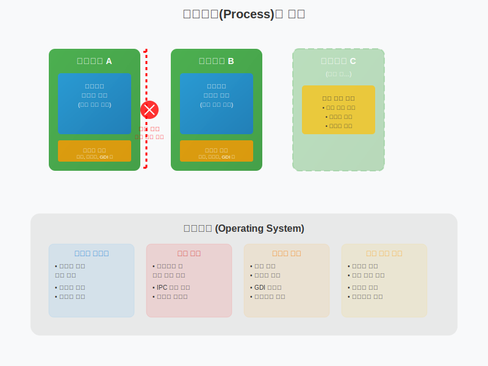
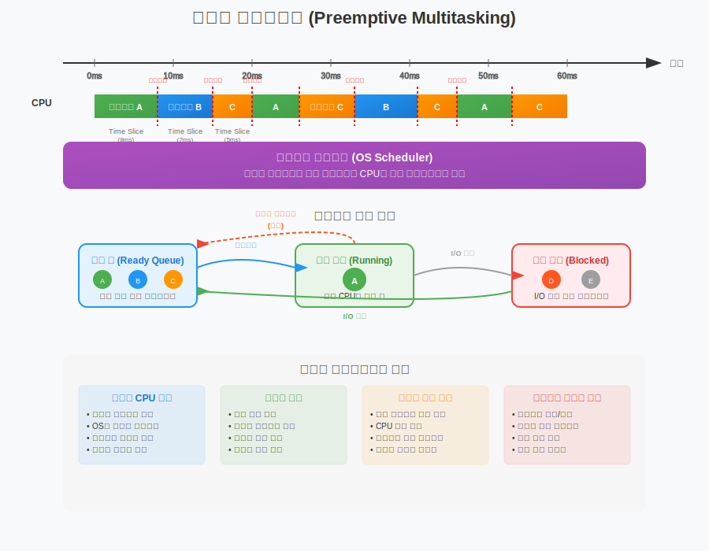
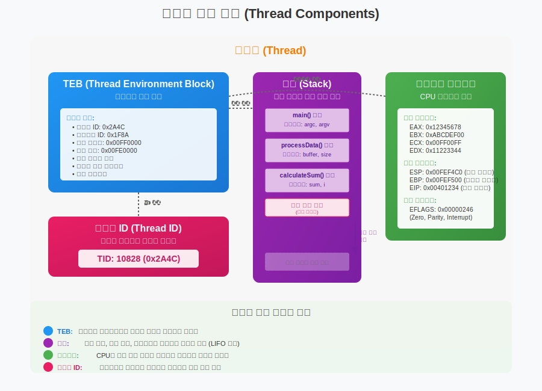
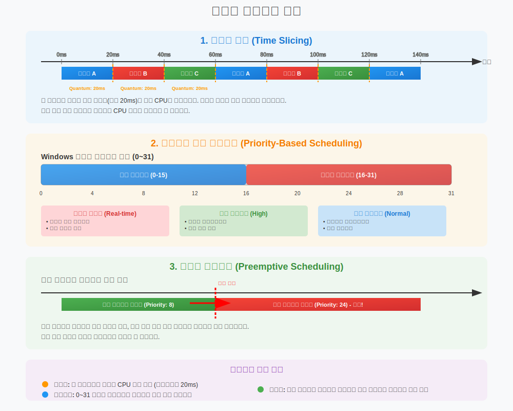
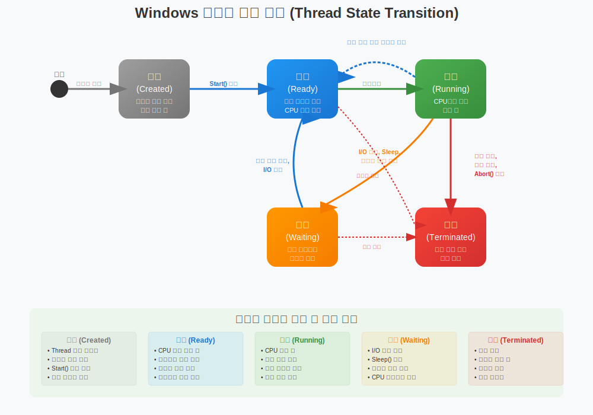
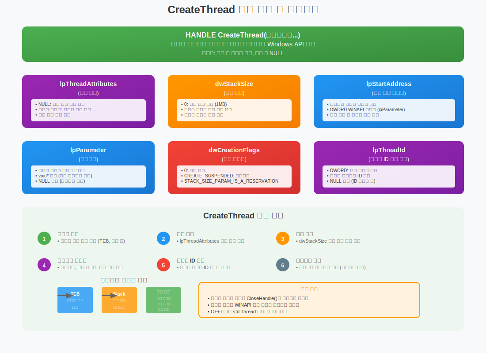
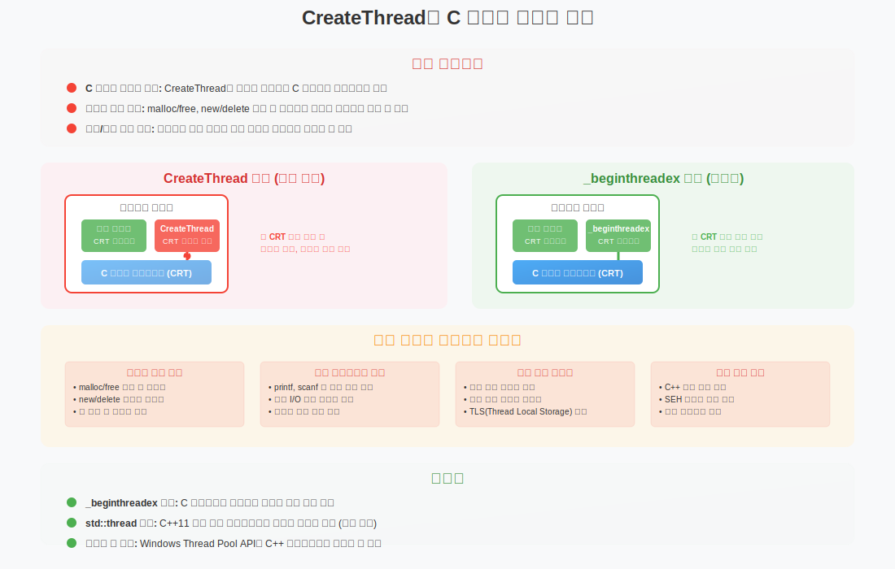

# 3주차: Win32 스레드 프로그래밍 1

-----  
  
# 3.1. Win32 스레드 개념과 API 개요

## 1. 프로세스 vs 스레드 개념 복습

### 1.1 프로세스(Process)의 특징
프로세스는 운영체제에서 실행 중인 프로그램의 인스턴스로, 다음과 같은 특징을 가진다:

- **독립적인 메모리 공간**: 각 프로세스는 자신만의 가상 주소 공간을 가짐
- **보안 경계**: 다른 프로세스의 메모리에 직접 접근 불가
- **리소스 소유**: 파일 핸들, 윈도우, GDI 객체 등을 소유
- **높은 생성 비용**: 새로운 주소 공간 할당과 초기화 필요

   
  

### 1.2 스레드(Thread)의 특징
스레드는 프로세스 내에서 실행되는 실행 단위로, 다음과 같은 특징을 가진다:

- **공유 메모리 공간**: 같은 프로세스 내 스레드들은 힙, 전역 변수, 코드 영역 공유
- **독립적인 실행 컨텍스트**: 각자의 스택, 레지스터, 프로그램 카운터 보유
- **낮은 생성 비용**: 새로운 주소 공간 할당 불필요
- **빠른 컨텍스트 스위칭**: 같은 주소 공간 내에서 동작
  
     
  
  
## 2. Win32 스레드 모델과 특징

### 2.1 Windows 스레드 아키텍처
Windows는 선점형 멀티태스킹을 지원하며, 각 스레드는 다음과 같은 구조를 가진다.

#### 선점형 멀티태스킹

     
  
##### 현대 OS에서 선점형 멀티태스킹을 사용하는 운영체제
**거의 모든 현대 운영체제**가 선점형 멀티태스킹을 사용한다:

###### 데스크톱/서버 OS
- **Windows** (Windows 95 이후의 모든 버전)
  - Windows 10, 11
  - Windows Server 2019, 2022
- **Linux** (모든 배포판)
  - Ubuntu, CentOS, Red Hat, Debian 등
- **macOS** (Mac OS X 이후)
- **Unix 계열** (Solaris, AIX, HP-UX 등)
- **FreeBSD, OpenBSD, NetBSD**

###### 모바일 OS
- **Android** (Linux 커널 기반)
- **iOS** (Darwin 커널 기반)

###### 실시간 OS
- **QNX**
- **VxWorks**
- **FreeRTOS**

###### 게임 콘솔 OS
- **PlayStation 5** OS
- **Xbox Series X/S** OS
- **Nintendo Switch** OS

###### 역사적 배경
**비선점형 멀티태스킹**을 사용했던 구형 OS들:
- Windows 3.1 및 이전 버전 (협력적 멀티태스킹)
- Mac OS 9 이전 버전
- MS-DOS (단일 태스킹)

현재는 거의 모든 운영체제가 선점형 멀티태스킹을 채택한 이유는 시스템 안정성, 응답성, 그리고 멀티코어 프로세서의 효율적인 활용 때문이다. 게임 서버 개발 시 사용하시는 Windows나 Linux 모두 선점형 멀티태스킹을 지원하므로, 멀티스레딩 프로그래밍 시 이러한 특성을 고려하여 개발한다.  


#### 스레드 구성 요소
**TEB (Thread Environment Block)**: 스레드의 모든 메타데이터를 담고 있는 핵심 구조체이다. 스레드 ID, 프로세스 ID, 스택 정보, 예외 핸들러 체인 등을 포함한다.

**스택 (Stack)**: 함수 호출 시 생성되는 스택 프레임들이 LIFO 방식으로 쌓이는 구조를 보여준다. 각 프레임에는 지역 변수와 함수 매개변수가 저장된다.

**레지스터 컨텍스트**: CPU의 현재 상태를 나타내는 모든 레지스터 값들이다. 컨텍스트 스위칭 시 이 값들이 저장되고 복원된다.

**스레드 ID**: 시스템 전체에서 해당 스레드를 고유하게 식별하는 번호이다.


   

  

### 2.2 스레드 스케줄링 특징
- **시분할 방식**: 각 스레드에게 시간 할당량(Quantum) 부여
- **우선순위 기반**: 0~31 레벨의 우선순위 시스템
- **선점형**: 높은 우선순위 스레드가 낮은 우선순위 스레드를 선점 가능
  
   


#### 1. 시분할 방식 (Time Slicing)
**개념**: 각 스레드에게 정해진 시간 할당량(Quantum)을 부여하여 CPU를 순환 사용하는 방식이다.

**동작 원리**:
- Windows에서는 기본적으로 **20ms(millisecond)**의 시간 할당량을 사용한다
- 타이머 인터럽트를 통해 시간 할당량이 끝나면 다음 스레드로 강제 전환한다
- 스레드가 I/O 작업이나 대기 상태로 들어가면 남은 시간을 포기하고 다음 스레드가 실행된다

**사용 사례**:
```csharp
// 게임 서버에서 여러 클라이언트 요청을 처리하는 경우
public class GameServer
{
    public void ProcessClientRequests()
    {
        while (true)
        {
            // 각 스레드가 20ms씩 할당받아 클라이언트 요청 처리
            ProcessNetworkPackets();  // 8ms 소요
            UpdateGameLogic();        // 12ms 소요
            // 20ms 할당량 소모 후 다른 스레드로 전환
        }
    }
}
```  
  
<pre> 
Windows 11 23H2 (2023년 하반기 릴리스), Windows Server 2022 에서의 스레드 시간 할당량(Quantum)  
  
Windows의 스레드 시간 할당량(Time Quantum)에 대해 설명드리겠습니다.

1.기본 시간 할당량
최신 Windows 시스템에서 기본 시간 할당량은 15.625ms (1/64초)이다. 이는 다음과 같이 계산된다:
- 시스템 타이머 해상도: 15.625ms (64Hz)
- 기본 quantum: 6 타이머 틱 = 6 × 15.625ms = 93.75ms

하지만 실제로는 시스템 설정과 워크로드에 따라 달라질 수 있다.

2. 시스템별 차이점
클라이언트 Windows: 기본적으로 더 짧은 quantum을 사용하여 반응성을 높인다.
서버 Windows: 더 긴 quantum을 사용하여 처리량(throughput)을 최적화한다.
우선순위별 차이: 높은 우선순위 스레드는 더 긴 quantum을 받을 수 있다.

3.확인 방법

3.1 WinDbg를 사용한 커널 디버깅
   !quantum

3.2 Performance Toolkit (WPA/WPT)
Windows Performance Analyzer를 사용하여 스케줄링 이벤트를 추적할 수 있다.

3.3 프로그래밍 방식
```cpp
#include <windows.h>
#include <iostream>

int main() {
    SYSTEM_INFO sysInfo;
    GetSystemInfo(&sysInfo);
    
    // 타이머 해상도 확인
    LARGE_INTEGER frequency;
    QueryPerformanceFrequency(&frequency);
    
    std::cout << "Timer frequency: " << frequency.QuadPart << " Hz" << std::endl;
    std::cout << "Timer resolution: " << 1000.0 / frequency.QuadPart << " ms" << std::endl;
    
    return 0;
}
```

3.4. PowerShell을 이용한 시스템 정보 확인
```powershell
Get-WmiObject -Class Win32_OperatingSystem | Select-Object Caption, Version
Get-ItemProperty "HKLM:\SYSTEM\CurrentControlSet\Control\PriorityControl"
```

3.5 레지스트리 확인
```
HKEY_LOCAL_MACHINE\SYSTEM\CurrentControlSet\Control\PriorityControl
```
여기서 `Win32PrioritySeparation` 값을 확인할 수 있다:
- 0: 길게 고정 quantum
- 1: 짧게 고정 quantum  
- 2: 길게 가변 quantum (서버 기본값)
- 24 (0x18): 짧게 가변 quantum (클라이언트 기본값)

4. 동적 변화 요소
실제 quantum은 다음 요인들에 의해 동적으로 조정된다:

시스템 부하: CPU 사용률에 따라 조정된다.

스레드 우선순위: 높은 우선순위는 더 긴 quantum을 받는다.

I/O 대기: I/O 집약적인 스레드는 더 긴 quantum을 받을 수 있다.

전원 관리: 절전 모드에서는 quantum이 조정될 수 있다.


현재 시스템의 정확한 quantum 값을 알아보려면 WinDbg나 Performance Toolkit을 사용하는 것이 가장 정확하다. 하지만 일반적인 응용 프로그램 개발에서는 이 값에 의존하지 않고 운영체제의 스케줄링을 신뢰하는 것이 좋다.
</pre>    
  

#### 2. 우선순위 기반 스케줄링 (Priority-Based Scheduling)
**개념**: 0~31 레벨의 우선순위를 통해 스레드의 중요도를 구분하고 차등 스케줄링하는 방식이다.

**우선순위 분류**:
- **실시간 클래스 (16-31)**: 시스템 중요 프로세스, 커널 스레드
- **높은 우선순위 (13-15)**: 중요한 애플리케이션 스레드
- **일반 우선순위 (8-12)**: 대부분의 사용자 애플리케이션
- **낮은 우선순위 (1-7)**: 백그라운드 작업
- **유휴 우선순위 (0)**: 시스템이 한가할 때만 실행

**사용 사례**:

**게임 서버 예제**:  
```cpp
#include <thread>
#include <windows.h>

// 네트워크 패킷 처리 - 높은 우선순위
std::thread networkThread(ProcessNetworkPackets);
SetThreadPriority(networkThread.native_handle(), THREAD_PRIORITY_ABOVE_NORMAL); // Priority 13

// 게임 로직 처리 - 일반 우선순위  
std::thread gameLogicThread(UpdateGameLogic);
SetThreadPriority(gameLogicThread.native_handle(), THREAD_PRIORITY_NORMAL); // Priority 8

// 로그 파일 쓰기 - 낮은 우선순위
std::thread loggingThread(WriteLogFiles);
SetThreadPriority(loggingThread.native_handle(), THREAD_PRIORITY_BELOW_NORMAL); // Priority 6
```  
  
**실제 활용 예**:
- **네트워크 I/O 스레드**: 높은 우선순위로 설정하여 패킷 손실 방지
- **AI 계산 스레드**: 낮은 우선순위로 설정하여 다른 작업에 영향 최소화
- **데이터베이스 연결 스레드**: 중간 우선순위로 안정적인 처리

#### 3. 선점형 스케줄링 (Preemptive Scheduling)
**개념**: 높은 우선순위의 스레드가 준비 상태가 되면, 현재 실행 중인 낮은 우선순위 스레드를 즉시 중단시키고 CPU를 할당받는 방식이다.

**선점 조건**:
- 더 높은 우선순위의 스레드가 준비 상태로 전환될 때
- 현재 스레드의 시간 할당량이 끝났을 때
- 현재 스레드가 I/O 대기나 동기화 객체 대기 상태로 들어갈 때

**사용 사례**:

**온라인 게임 서버**:
```csharp
public class MMOServer
{
    // 실시간 전투 처리 - 최고 우선순위
    public void ProcessCombatActions()
    {
        // Priority 24 - 즉시 처리 필요
        while (true)
        {
            var combatAction = GetNextCombatAction();
            if (combatAction != null)
            {
                // 다른 모든 스레드를 선점하고 즉시 처리
                ExecuteCombatAction(combatAction);
            }
        }
    }
    
    // 채팅 메시지 처리 - 중간 우선순위
    public void ProcessChatMessages()
    {
        // Priority 10 - 전투보다는 낮지만 중요
        // 전투 스레드에 선점당할 수 있음
    }
    
    // 백그라운드 데이터 정리 - 낮은 우선순위  
    public void CleanupOldData()
    {
        // Priority 4 - 다른 모든 작업에 선점당함
        // 시스템이 한가할 때만 실행
    }
}
```
  

### 스레드 정보 확인 예제 
  
```cpp
// 스레드 정보 확인 예제
#include <windows.h>
#include <iostream>

void DisplayThreadInfo()
{
    DWORD threadId = GetCurrentThreadId();
    HANDLE hThread = GetCurrentThread();
    
    // 스레드 우선순위 확인
    int priority = GetThreadPriority(hThread);
    
    std::cout << "스레드 ID: " << threadId << std::endl;
    std::cout << "우선순위: " << priority << std::endl;
    
    // 스레드가 실행 중인 프로세서 확인
    DWORD_PTR processAffinityMask, systemAffinityMask;
    if (GetProcessAffinityMask(GetCurrentProcess(), &processAffinityMask, &systemAffinityMask))
    {
        std::cout << "프로세스 친화성 마스크: 0x" << std::hex << processAffinityMask << std::endl;
    }
}

DWORD WINAPI WorkerThread(LPVOID lpParam)
{
    std::cout << "\n=== 워커 스레드 정보 ===" << std::endl;
    DisplayThreadInfo();
    
    // CPU 집약적 작업 시뮬레이션
    for (int i = 0; i < 1000000; i++)
    {
        // 의미 있는 작업
        volatile int temp = i * i;
    }
    
    return 0;
}

int main()
{
    std::cout << "=== 메인 스레드 정보 ===" << std::endl;
    DisplayThreadInfo();
    
    // 워커 스레드 생성
    HANDLE hThread = CreateThread(NULL, 0, WorkerThread, NULL, 0, NULL);
    
    if (hThread != NULL)
    {
        // 스레드 완료 대기
        WaitForSingleObject(hThread, INFINITE);
        CloseHandle(hThread);
    }
    
    return 0;
}
```
  

## 3. 스레드 라이프사이클 (생성→실행→종료)

### 3.1 스레드 상태 전환
Windows 스레드는 다음과 같은 상태를 가진다:

1. **생성 (Created)**: 스레드 객체 생성, 아직 실행 전
2. **준비 (Ready)**: 실행 가능한 상태, CPU 할당 대기
3. **실행 (Running)**: CPU에서 실제 실행 중
4. **대기 (Waiting)**: 특정 조건이나 이벤트 대기
5. **종료 (Terminated)**: 실행 완료 또는 강제 종료

   
  

### 3.2 스레드 생성 옵션
`CreateThread`는 Windows에서 새로운 스레드를 생성하는 가장 기본적인 API 함수이다. 이 함수는 운영체제 커널에 직접 요청하여 스레드를 생성하고, 생성된 스레드의 핸들을 반환한다.

```cpp
HANDLE CreateThread(
    LPSECURITY_ATTRIBUTES lpThreadAttributes,  // 보안 특성
    SIZE_T dwStackSize,                       // 스택 크기
    LPTHREAD_START_ROUTINE lpStartAddress,    // 시작 함수
    LPVOID lpParameter,                       // 매개변수
    DWORD dwCreationFlags,                    // 생성 플래그
    LPDWORD lpThreadId                        // 스레드 ID
);
```

   

#### 매개변수별 상세 설명
**1. lpThreadAttributes (보안 특성)**
- **타입**: `LPSECURITY_ATTRIBUTES` (구조체 포인터)
- **용도**: 스레드의 보안 설정과 핸들 상속 여부를 결정
- **일반적 사용**: 대부분 `NULL`로 설정하여 기본 보안 설정 사용
- **세부 제어**: 사용자 정의 보안 디스크립터, 핸들 상속 가능 여부 설정

**2. dwStackSize (스택 크기)**
- **타입**: `SIZE_T` (부호 없는 정수)
- **기본값**: 0 (기본 스택 크기 1MB 사용)
- **단위**: 바이트
- **주의사항**: 시스템이 자동으로 페이지 경계(4KB)에 맞춰 정렬됩니다
- **게임 서버에서의 활용**: 대량의 스레드 생성 시 메모리 절약을 위해 작은 값 설정 가능

**3. lpStartAddress (시작 함수 포인터)**
- **타입**: `LPTHREAD_START_ROUTINE` (함수 포인터)
- **함수 시그니처**: `DWORD WINAPI ThreadFunction(LPVOID lpParam)`
- **중요사항**: 반드시 `WINAPI` 호출 규약을 사용해야 합니다
- **스레드 생명주기**: 이 함수가 종료되면 스레드도 자동으로 종료됩니다

**4. lpParameter (매개변수)**
- **타입**: `LPVOID` (void 포인터)
- **유연성**: 어떤 타입의 데이터든 전달 가능 (구조체, 클래스 인스턴스 등)
- **주의사항**: 포인터로 전달하므로 데이터 생명주기 관리 필요
- **NULL 허용**: 매개변수가 불필요한 경우 NULL 설정 가능

**5. dwCreationFlags (생성 플래그)**
- **기본값**: 0 (즉시 실행)
- **CREATE_SUSPENDED**: 스레드를 일시정지 상태로 생성 (나중에 `ResumeThread()` 호출)
- **STACK_SIZE_PARAM_IS_A_RESERVATION**: 스택 크기를 예약 크기로 해석
- **활용**: 스레드 생성 후 추가 설정이 필요한 경우 일시정지 상태로 생성

**6. lpThreadId (스레드 ID 출력)**
- **타입**: `LPDWORD` (DWORD 포인터)
- **용도**: 생성된 스레드의 고유 ID를 받을 변수의 주소
- **선택사항**: NULL 가능 (ID가 불필요한 경우)
- **활용**: 다른 API 함수에서 스레드 식별용으로 사용

#### 중요한 주의사항
**메모리 관리**: 반환된 핸들은 반드시 `CloseHandle()`로 해제해야 합니다. 그렇지 않으면 커널 객체가 메모리에 남아있게 됩니다.

**호출 규약**: 스레드 함수는 반드시 `WINAPI` (`__stdcall`) 호출 규약을 사용해야 합니다. C++ 기본 호출 규약과 다르므로 주의가 필요합니다.

**데이터 생명주기**: lpParameter로 전달하는 데이터는 스레드가 실행되는 동안 유효해야 합니다. 지역 변수의 주소를 전달하면 위험합니다.

**현대적 대안**: C++11 이후에는 `std::thread`를 사용하는 것이 권장됩니다. `CreateThread`는 **C 런타임과 호환성 문제**가 있을 수 있습니다.

게임 서버 개발에서는 대부분 `std::thread`나 스레드 풀을 사용하지만, Windows 시스템 프로그래밍이나 저수준 최적화가 필요한 경우에는 여전히 `CreateThread`를 직접 사용하기도 합니다.
  
#### CreateThread와 C 런타임 호환성 문제
   
      
##### 핵심 문제: C 런타임 초기화 누락
`CreateThread`는 **운영체제 커널 수준에서 직접 스레드를 생성**하는 저수준 API이다. 이 방식의 가장 큰 문제는 **C 런타임 라이브러리(CRT)가 새로 생성된 스레드에 대해 초기화 작업을 수행하지 않는다**는 점이다.

##### 발생하는 구체적인 문제들
**1. 메모리 관리 오류**
- `malloc()`, `free()`, `new`, `delete` 등의 힙 메모리 관리 함수들이 제대로 동작하지 않는다
- 각 스레드는 고유한 힙 관리 구조를 가져야 하는데, CreateThread로 생성된 스레드는 이 구조가 초기화되지 않는다
- 결과적으로 메모리 누수, 힙 손상, 심지어 크래시까지 발생할 수 있다

**2. 표준 라이브러리 함수 문제**
- `printf()`, `scanf()`, `fopen()` 등의 표준 C 라이브러리 함수들이 비정상적으로 동작한다
- 이러한 함수들은 스레드별로 초기화된 내부 데이터 구조에 의존하기 때문이다
- 특히 파일 I/O나 콘솔 출력에서 예상치 못한 결과가 나타날 수 있다

**3. 전역/정적 변수 초기화 문제**
- C++의 정적 변수나 전역 객체의 생성자가 제대로 호출되지 않을 수 있다
- Thread Local Storage (TLS) 변수들이 올바르게 초기화되지 않는다
- 이로 인해 예상하지 못한 초기값을 가지거나 아예 접근할 수 없는 상황이 발생한다

**4. 예외 처리 메커니즘 문제**
- C++ 예외 처리 시스템이 제대로 동작하지 않는다
- Windows의 SEH (Structured Exception Handling)도 정상적으로 작동하지 않을 수 있다
- 예외 발생 시 스택 언와인딩이 제대로 이루어지지 않아 리소스 누수가 발생한다

##### 왜 이런 문제가 발생하는가?
**C 런타임의 스레드별 초기화 과정**
1. **힙 관리자 초기화**: 각 스레드가 사용할 힙 구조 설정
2. **errno 변수 초기화**: 오류 코드를 저장하는 스레드별 변수
3. **스레드별 버퍼 설정**: printf 등에서 사용하는 내부 버퍼
4. **TLS 슬롯 할당**: Thread Local Storage 메모리 영역 설정
5. **예외 처리 체인 구성**: C++ 예외나 SEH를 위한 구조 초기화

`CreateThread`는 이런 초기화 과정을 **완전히 건너뛰고** 바로 사용자 함수를 실행하기 때문에 문제가 발생한다.

##### 해결책들
**1. _beginthreadex 사용 (권장)**
```cpp
// CreateThread 대신 사용
unsigned threadID;
HANDLE hThread = (HANDLE)_beginthreadex(
    NULL,           // 보안 특성
    0,              // 스택 크기
    ThreadFunction, // 시작 함수
    pParam,         // 매개변수
    0,              // 생성 플래그
    &threadID       // 스레드 ID
);
```
- `_beginthreadex`는 스레드 생성 전에 C 런타임 초기화를 수행한다
- 스레드 종료 시에도 `_endthreadex`를 자동으로 호출하여 정리 작업을 수행한다

**2. std::thread 사용 (가장 권장)**
```cpp
// 현대적이고 안전한 방법
std::thread myThread(ThreadFunction, param);
myThread.join();
```
- C++11 표준의 일부로, 모든 초기화와 정리 작업을 자동으로 처리한다
- 플랫폼 독립적이며 RAII 패턴을 따른다

**3. 스레드 풀 사용**
- Windows Thread Pool API나 C++ 라이브러리의 스레드 풀을 활용
- 스레드 생성/소멸 오버헤드를 줄이면서 안전성도 확보
  

##### CreateThread는 언제 사용하나? 

###### CreateThread가 존재하는 이유
CreateThread는 Windows의 기본 Win32 API로, 운영체제 커널 레벨에서 직접 스레드를 생성한다. 이는 Windows가 제공하는 가장 기본적인 스레드 생성 방법이며, 모든 스레드 생성의 근간이 된다.

###### _beginthreadex를 권장하는 이유
_beginthreadex는 C 런타임 라이브러리(CRT)에서 제공하는 함수로, 내부적으로 CreateThread를 호출하지만 추가적인 초기화 작업을 수행한다:

**CRT 초기화**: 각 스레드마다 독립적인 CRT 데이터 구조를 설정한다. 이는 errno, strtok 같은 전역 변수들이 스레드별로 분리되어 관리되도록 한다.

**안전한 메모리 관리**: malloc, free 등의 CRT 메모리 함수들이 멀티스레드 환경에서 안전하게 동작하도록 보장한다.

**예외 처리**: C++ 예외나 구조화된 예외 처리(SEH)가 올바르게 작동하도록 설정한다.

###### CreateThread를 사용할 수 있는 경우
다음과 같은 상황에서는 CreateThread를 직접 사용할 수 있다:

**순수 Win32 API만 사용하는 경우**: CRT 함수를 전혀 사용하지 않고 Win32 API만으로 프로그래밍할 때.

**시스템 레벨 프로그래밍**: 드라이버나 매우 저수준의 시스템 프로그래밍에서 CRT 오버헤드를 피하고 싶을 때.

**최소한의 오버헤드가 필요한 경우**: 성능이 극도로 중요하고 CRT 초기화 비용을 피하고 싶을 때.

**C 언어로만 작성된 프로그램**: C++ 기능이나 CRT의 고급 기능을 사용하지 않는 순수 C 프로그램.

###### 결론
일반적인 응용 프로그램 개발에서는 _beginthreadex를 사용하는 것이 안전하고 권장된다. CreateThread는 특별한 요구사항이 있거나 매우 제한적인 환경에서만 직접 사용하는 것이 좋다. 대부분의 경우 CRT의 안전성과 편의성이 작은 성능 오버헤드보다 훨씬 가치가 있다.

  
#### 실습 1: 간단한 CreateThread 사용  
CreateThread를 사용하는 간단한 예제 코이다. 

**주요 특징들:**
1. **WINAPI 호출 규약**: 스레드 함수는 반드시 `DWORD WINAPI` 형태로 선언해야 한다.
2. **매개변수 전달**: `ThreadData` 구조체를 통해 여러 데이터를 스레드에 전달한다.
3. **병렬 실행**: 두 개의 워커 스레드와 메인 스레드가 동시에 작업을 수행한다.
4. **스레드 대기**: `WaitForMultipleObjects`를 사용해 모든 스레드의 완료를 기다린다.
5. **리소스 정리**: `CloseHandle`로 스레드 핸들을 반드시 해제한다.

**실행 결과 예상:**
```
=== CreateThread 예제 ===

스레드 생성 완료:
- 스레드 1 ID: 1234
- 스레드 2 ID: 5678

스레드 1 시작: 첫 번째 워커 스레드
스레드 2 시작: 두 번째 워커 스레드
메인 스레드: 다른 작업 수행 중...
스레드 1: 작업 1/3 수행 중...
스레드 2: 작업 1/5 수행 중...
메인 스레드: 작업 1/4
...
```

```cpp 
#include <windows.h>
#include <iostream>

// 스레드에 전달할 데이터 구조체
struct ThreadData {
    int threadId;
    const char* message;
    int count;
};

// 스레드 함수 - 반드시 WINAPI 호출 규약 사용
DWORD WINAPI WorkerThread(LPVOID lpParam) {
    // 매개변수를 원래 타입으로 변환
    ThreadData* data = static_cast<ThreadData*>(lpParam);
    
    printf("스레드 %d 시작: %s\n", data->threadId, data->message);
    
    // 작업 수행 (간단한 카운팅)
    for (int i = 1; i <= data->count; i++) {
        printf("스레드 %d: 작업 %d/%d 수행 중...\n", 
               data->threadId, i, data->count);
        Sleep(1000); // 1초 대기
    }
    
    printf("스레드 %d 완료!\n", data->threadId);
    
    // 스레드 종료 코드 반환
    return data->threadId * 100;
}

int main() 
{
    printf("=== CreateThread 예제 ===\n\n");
    
    // 스레드에 전달할 데이터 준비
    ThreadData threadData1 = {1, "첫 번째 워커 스레드", 3};
    ThreadData threadData2 = {2, "두 번째 워커 스레드", 5};
    
    DWORD threadId1, threadId2;
    
    // 첫 번째 스레드 생성
    HANDLE hThread1 = CreateThread(
        NULL,                    // 기본 보안 설정
        0,                      // 기본 스택 크기 (1MB)
        WorkerThread,           // 스레드 함수
        &threadData1,           // 매개변수
        0,                      // 즉시 실행
        &threadId1              // 스레드 ID 받을 변수
    );
    
    // 두 번째 스레드 생성
    HANDLE hThread2 = CreateThread(
        NULL,
        0,
        WorkerThread,
        &threadData2,
        0,
        &threadId2
    );
    
    // 스레드 생성 성공 여부 확인
    if (hThread1 == NULL) {
        printf("첫 번째 스레드 생성 실패! 오류 코드: %lu\n", GetLastError());
        return 1;
    }
    
    if (hThread2 == NULL) {
        printf("두 번째 스레드 생성 실패! 오류 코드: %lu\n", GetLastError());
        CloseHandle(hThread1);
        return 1;
    }
    
    printf("스레드 생성 완료:\n");
    printf("- 스레드 1 ID: %lu\n", threadId1);
    printf("- 스레드 2 ID: %lu\n\n", threadId2);
    
    // 메인 스레드도 작업 수행
    printf("메인 스레드: 다른 작업 수행 중...\n");
    for (int i = 1; i <= 4; i++) {
        printf("메인 스레드: 작업 %d/4\n", i);
        Sleep(800);
    }
    printf("메인 스레드 작업 완료\n\n");
    
    // 모든 스레드가 완료될 때까지 대기
    printf("모든 스레드 완료 대기 중...\n");
    HANDLE threads[] = {hThread1, hThread2};
    DWORD waitResult = WaitForMultipleObjects(
        2,          // 대기할 객체 수
        threads,    // 핸들 배열
        TRUE,       // 모든 객체가 신호 상태가 될 때까지 대기
        INFINITE    // 무한 대기
    );
    
    if (waitResult == WAIT_OBJECT_0) {
        printf("모든 스레드가 완료되었습니다.\n");
        
        // 스레드 종료 코드 확인
        DWORD exitCode1, exitCode2;
        GetExitCodeThread(hThread1, &exitCode1);
        GetExitCodeThread(hThread2, &exitCode2);
        
        printf("스레드 1 종료 코드: %lu\n", exitCode1);
        printf("스레드 2 종료 코드: %lu\n", exitCode2);
    } else {
        printf("스레드 대기 중 오류 발생: %lu\n", GetLastError());
    }
    
    // 핸들 정리 (중요!)
    CloseHandle(hThread1);
    CloseHandle(hThread2);
    
    printf("\n프로그램 종료\n");
    return 0;
}
``` 


### 3.3 스레드 라이프사이클 예제 코드
아래 예제 코드를 통해서 다음과 같은 스레드 개념들을 학습할 수 있다  

1. **스레드 상태 전환**: Created → Ready → Running → Waiting → Terminated
2. 스레드 동기화: Event 객체를 사용한 스레드 간 신호 전달
3. **스레드 라이프사이클 관리**: 생성, 실행, 대기, 종료의 전체 과정
4. **멀티스레드 프로그래밍**: 여러 스레드의 동시 실행과 제어
  

중요한 부분들과 그 이유  
#### 1. **ThreadContext 구조체** (가장 중요)
```cpp
struct ThreadContext
{
    int threadNumber;
    bool shouldExit;        // ← 핵심
    HANDLE startEvent;      // ← 핵심
};
```

**중요한 이유:**
- `shouldExit`: **스레드의 안전한 종료**를 위한 플래그이다. 강제 종료 대신 스레드가 스스로 종료 조건을 확인하여 종료하는 **협력적 종료(Cooperative Termination)** 방식을 구현한다.
- `startEvent`: **스레드 상태 제어**의 핵심입니다. 스레드를 Waiting 상태로 만들었다가 특정 시점에 Running 상태로 전환시키는 동기화 메커니즘이다.

### 2. **Event 기반 동기화** (매우 중요)
자세한 설명은 뒤에 하니 여기서는 이런 것이 있다는 정도로만...
  
```cpp
// 시작 신호 대기 (Running → Waiting 상태)
WaitForSingleObject(ctx->startEvent, INFINITE);

// 시작 신호 전송 (Waiting → Ready → Running 상태)
SetEvent(startEvents[i]);
```

**중요한 이유:**
- **상태 전환의 실제 구현**: 스레드가 어떻게 Waiting 상태로 들어가고, 다시 Running 상태로 돌아오는지를 보여준다.
- **동기화 프로그래밍의 기초**: Event 객체는 Windows에서 가장 기본적인 동기화 도구 중 하나이다.
- **타이밍 제어**: 스레드들의 실행 순서와 타이밍을 제어할 수 있다.

#### 3. **협력적 종료 메커니즘** (중요)
```cpp
while (!ctx->shouldExit && workCount < 5)
{
    // 작업 수행
    Sleep(1000);  // 주기적으로 shouldExit 확인
    workCount++;
}
```

**중요한 이유:**
- **안전한 스레드 종료**: `TerminateThread()` 같은 강제 종료 대신, 스레드가 스스로 종료 조건을 확인하여 깔끔하게 종료한다.
- **리소스 안전성**: 스레드가 정리 작업을 수행할 수 있는 기회를 제공한다.
- **실제 개발에서의 모범 사례**: 게임 서버나 실제 애플리케이션에서 사용하는 안전한 스레드 종료 패턴이다.

#### 4. **WaitForMultipleObjects** (중요)
```cpp
DWORD waitResult = WaitForMultipleObjects(THREAD_COUNT, threads, TRUE, INFINITE);
```

**중요한 이유:**
- **멀티스레드 동기화**: 여러 스레드의 완료를 한 번에 기다리는 효율적인 방법이다.
- **리소스 관리**: 모든 스레드가 완료된 후에 안전하게 리소스를 정리할 수 있다.
- **데드락 방지**: 스레드들이 서로를 기다리지 않도록 하는 안전한 대기 방식이다.

#### 5. **상태별 출력 메시지** (학습적으로 중요)
```cpp
std::cout << "스레드 " << ctx->threadNumber << " 시작 신호 대기 중..." << std::endl;  // Waiting
std::cout << "스레드 " << ctx->threadNumber << " 작업 시작" << std::endl;            // Running
```

**중요한 이유:**
- **시각적 학습**: 스레드의 상태 변화를 실시간으로 관찰할 수 있다.
- **디버깅 기법**: 실제 개발에서 스레드 상태를 추적하는 방법을 학습할 수 있다.

### 학습 포인트
이 코드를 통해 배울 수 있는 핵심 개념들:

1. **스레드는 생성되자마자 실행되지 않을 수 있다** (Event로 제어)
2. **안전한 스레드 종료 방법** (플래그 기반 협력적 종료)
3. **스레드 간 동기화의 기본** (Event 객체 사용)
4. **멀티스레드 리소스 관리** (핸들 정리의 중요성)


```cpp
#include <windows.h>
#include <iostream>
#include <chrono>

// 스레드 상태를 추적하기 위한 구조체
struct ThreadContext
{
    int threadNumber;
    bool shouldExit;
    HANDLE startEvent;
};

DWORD WINAPI LifecycleThread(LPVOID lpParam)
{
    ThreadContext* ctx = (ThreadContext*)lpParam;
    
    std::cout << "스레드 " << ctx->threadNumber << " 생성됨 (ID: " 
              << GetCurrentThreadId() << ")" << std::endl;
    
    // 시작 신호 대기 (Waiting 상태)
    std::cout << "스레드 " << ctx->threadNumber << " 시작 신호 대기 중..." << std::endl;
    WaitForSingleObject(ctx->startEvent, INFINITE);
    
    // 실제 작업 수행 (Running 상태)
    std::cout << "스레드 " << ctx->threadNumber << " 작업 시작" << std::endl;
    
    int workCount = 0;
    while (!ctx->shouldExit && workCount < 5)
    {
        std::cout << "스레드 " << ctx->threadNumber << " 작업 중... (" 
                  << workCount + 1 << "/5)" << std::endl;
        
        Sleep(1000);  // 1초 대기 (Waiting 상태)
        workCount++;
    }
    
    std::cout << "스레드 " << ctx->threadNumber << " 종료" << std::endl;
    return ctx->threadNumber;  // 종료 코드로 스레드 번호 반환
}

int main()
{
    const int THREAD_COUNT = 3;
    HANDLE threads[THREAD_COUNT];
    ThreadContext contexts[THREAD_COUNT];
    HANDLE startEvents[THREAD_COUNT];
    
    std::cout << "=== 스레드 라이프사이클 데모 ===" << std::endl;
    
    // 스레드들 생성 (Created → Ready 상태)
    for (int i = 0; i < THREAD_COUNT; i++)
    {
        // 각 스레드용 이벤트 생성
        startEvents[i] = CreateEvent(NULL, FALSE, FALSE, NULL);
        
        // 컨텍스트 초기화
        contexts[i].threadNumber = i + 1;
        contexts[i].shouldExit = false;
        contexts[i].startEvent = startEvents[i];
        
        // 스레드 생성
        threads[i] = CreateThread(NULL, 0, LifecycleThread, &contexts[i], 0, NULL);
        
        if (threads[i] == NULL)
        {
            std::cout << "스레드 " << i + 1 << " 생성 실패!" << std::endl;
            return -1;
        }
    }
    
    std::cout << "\n모든 스레드가 생성되었습니다. 3초 후 시작 신호를 보냅니다..." << std::endl;
    Sleep(3000);
    
    // 모든 스레드에 시작 신호 (Ready → Running 상태 전환)
    for (int i = 0; i < THREAD_COUNT; i++)
    {
        SetEvent(startEvents[i]);
        std::cout << "스레드 " << i + 1 << "에 시작 신호 전송" << std::endl;
        Sleep(500);  // 시차를 두고 시작
    }
    
    // 첫 번째 스레드를 중간에 종료시키기
    Sleep(2500);
    std::cout << "\n스레드 1 조기 종료 신호..." << std::endl;
    contexts[0].shouldExit = true;
    
    // 모든 스레드 완료 대기
    std::cout << "\n모든 스레드 완료 대기 중..." << std::endl;
    DWORD waitResult = WaitForMultipleObjects(THREAD_COUNT, threads, TRUE, INFINITE);
    
    if (waitResult == WAIT_OBJECT_0)
    {
        std::cout << "모든 스레드가 정상 완료되었습니다." << std::endl;
        
        // 각 스레드의 종료 코드 확인
        for (int i = 0; i < THREAD_COUNT; i++)
        {
            DWORD exitCode;
            if (GetExitCodeThread(threads[i], &exitCode))
            {
                std::cout << "스레드 " << i + 1 << " 종료 코드: " << exitCode << std::endl;
            }
        }
    }
    
    // 리소스 정리
    for (int i = 0; i < THREAD_COUNT; i++)
    {
        CloseHandle(threads[i]);
        CloseHandle(startEvents[i]);
    }
    
    return 0;
}
```
  

## 4. 주요 스레드 API 함수들 소개

### 4.1 스레드 생성 및 관리 API

| 함수명 | 용도 | 사용 빈도 |
|--------|------|-----------|
| `CreateThread()` | 스레드 생성 | ★★★★★ |
| `ExitThread()` | 스레드 종료 | ★★★★☆ |
| `TerminateThread()` | 강제 종료 (비권장) | ★★☆☆☆ |
| `SuspendThread()` | 스레드 일시 중단 | ★★★☆☆ |
| `ResumeThread()` | 중단된 스레드 재시작 | ★★★☆☆ |
| `GetCurrentThread()` | 현재 스레드 핸들 | ★★★★★ |
| `GetCurrentThreadId()` | 현재 스레드 ID | ★★★★★ |

### 4.2 스레드 대기 및 동기화 API

| 함수명 | 용도 | 사용 빈도 |
|--------|------|-----------|
| `WaitForSingleObject()` | 단일 객체 대기 | ★★★★★ |
| `WaitForMultipleObjects()` | 다중 객체 대기 | ★★★★☆ |
| `Sleep()` | 지정 시간 대기 | ★★★★★ |
| `SwitchToThread()` | 다른 스레드에게 양보 | ★★★☆☆ |

### 4.3 스레드 우선순위 및 속성 API

| 함수명 | 용도 | 사용 빈도 |
|--------|------|-----------|
| `SetThreadPriority()` | 우선순위 설정 | ★★★★☆ |
| `GetThreadPriority()` | 우선순위 조회 | ★★★☆☆ |
| `SetThreadAffinityMask()` | 프로세서 친화성 설정 | ★★☆☆☆ |
| `GetExitCodeThread()` | 스레드 종료 코드 조회 | ★★★☆☆ |

### 4.4 API 사용법 종합 예제
   

```cpp
#include <windows.h>
#include <iostream>
#include <vector>

// 작업 항목 구조체
struct WorkItem
{
    int id;
    int processingTime;  // 밀리초
};

// 스레드 함수
DWORD WINAPI ProcessWorkItem(LPVOID lpParam)
{
    WorkItem* item = (WorkItem*)lpParam;
    DWORD threadId = GetCurrentThreadId();
    
    std::cout << "스레드 " << threadId << ": 작업 " << item->id 
              << " 시작 (예상 시간: " << item->processingTime << "ms)" << std::endl;
    
    // 작업 시뮬레이션
    Sleep(item->processingTime);
    
    std::cout << "스레드 " << threadId << ": 작업 " << item->id << " 완료" << std::endl;
    
    return item->id;  // 작업 ID를 종료 코드로 반환
}

int main()
{
    std::cout << "=== Win32 스레드 API 종합 예제 ===" << std::endl;
    
    // 작업 항목들 준비
    std::vector<WorkItem> workItems = {
        {1, 2000},  // 작업 1: 2초
        {2, 1500},  // 작업 2: 1.5초
        {3, 3000},  // 작업 3: 3초
        {4, 1000}   // 작업 4: 1초
    };
    
    std::vector<HANDLE> threads;
    std::vector<DWORD> threadIds;
    
    // 시작 시간 기록
    DWORD startTime = GetTickCount();
    
    // 각 작업에 대해 스레드 생성
    for (auto& item : workItems)
    {
        DWORD threadId;
        HANDLE hThread = CreateThread(
            NULL,                   // 기본 보안 특성
            0,                      // 기본 스택 크기
            ProcessWorkItem,        // 스레드 함수
            &item,                  // 매개변수
            0,                      // 즉시 실행
            &threadId               // 스레드 ID 받기
        );
        
        if (hThread != NULL)
        {
            threads.push_back(hThread);
            threadIds.push_back(threadId);
            
            std::cout << "작업 " << item.id << "용 스레드 생성: ID " << threadId << std::endl;
            
            // 스레드 우선순위 설정 (작업 ID가 높을수록 높은 우선순위)
            if (item.id >= 3)
            {
                SetThreadPriority(hThread, THREAD_PRIORITY_ABOVE_NORMAL);
                std::cout << "  우선순위를 높음으로 설정" << std::endl;
            }
        }
        else
        {
            std::cout << "작업 " << item.id << "용 스레드 생성 실패!" << std::endl;
        }
    }
    
    std::cout << "\n모든 스레드가 생성되었습니다. 완료를 기다립니다..." << std::endl;
    
    // 모든 스레드 완료 대기
    if (!threads.empty())
    {
        DWORD waitResult = WaitForMultipleObjects(
            static_cast<DWORD>(threads.size()),
            threads.data(),
            TRUE,        // 모든 스레드 완료 대기
            INFINITE     // 무한 대기
        );
        
        if (waitResult >= WAIT_OBJECT_0 && 
            waitResult < WAIT_OBJECT_0 + threads.size())
        {
            std::cout << "\n모든 작업이 완료되었습니다!" << std::endl;
            
            // 각 스레드의 결과 확인
            for (size_t i = 0; i < threads.size(); i++)
            {
                DWORD exitCode;
                if (GetExitCodeThread(threads[i], &exitCode))
                {
                    std::cout << "스레드 " << threadIds[i] 
                              << " 완료 (작업 ID: " << exitCode << ")" << std::endl;
                }
            }
        }
        else
        {
            std::cout << "스레드 대기 중 오류 발생!" << std::endl;
        }
    }
    
    // 총 실행 시간 계산
    DWORD endTime = GetTickCount();
    std::cout << "\n총 실행 시간: " << (endTime - startTime) << "ms" << std::endl;
    
    // 핸들 정리
    for (HANDLE hThread : threads)
    {
        CloseHandle(hThread);
    }
    
    std::cout << "리소스 정리 완료." << std::endl;
    return 0;
}
```

## 요약
이번 강의에서는 Win32 스레드 프로그래밍의 기초 개념을 학습했다:

1. **프로세스와 스레드의 차이점**: 메모리 공유 방식과 생성 비용의 차이
2. **Win32 스레드 모델**: 선점형 멀티태스킹과 우선순위 기반 스케줄링
3. **스레드 라이프사이클**: 생성부터 종료까지의 상태 전환 과정
4. **핵심 API 함수들**: 실무에서 자주 사용하는 함수들의 용도와 사용법

다음 시간에는 `CreateThread()`와 `_beginthreadex()`의 차이점을 자세히 알아보고, 스레드 생성과 관리 방법을 더 깊이 있게 학습하겠다.

**실습 포인트**:   
스레드 ID, 우선순위, 종료 코드 등의 개념을 확인한다.
  
  
  
# 3.2. 스레드 생성과 관리

## 1. CreateThread() 함수 상세 분석

### 1.1 함수 프로토타입과 매개변수
```cpp
HANDLE CreateThread(
    LPSECURITY_ATTRIBUTES   lpThreadAttributes,    // 보안 특성
    SIZE_T                  dwStackSize,           // 스택 크기
    LPTHREAD_START_ROUTINE  lpStartAddress,        // 스레드 함수
    LPVOID                  lpParameter,           // 매개변수
    DWORD                   dwCreationFlags,       // 생성 플래그
    LPDWORD                 lpThreadId             // 스레드 ID
);
```

### 1.2 매개변수 상세 설명

**lpThreadAttributes**
- `NULL`: 기본 보안 특성 사용 (가장 일반적)
- 자식 프로세스의 핸들 상속 여부 결정

**dwStackSize**
- `0`: 기본 스택 크기 사용 (1MB)
- 명시적 크기 지정 시 4KB 단위로 반올림

**lpStartAddress**
- 스레드가 실행할 함수의 주소
- `DWORD WINAPI ThreadProc(LPVOID lpParam)` 형태

**dwCreationFlags**
- `0`: 즉시 실행
- `CREATE_SUSPENDED`: 일시 중단 상태로 생성

### 1.3 CreateThread() 기본 사용 예제
```cpp
#include <windows.h>
#include <iostream>
#include <string>

// 스레드 매개변수 구조체
struct ThreadData
{
    int workerId;
    std::string taskName;
    int iterations;
};

DWORD WINAPI WorkerThreadProc(LPVOID lpParam)
{
    ThreadData* data = static_cast<ThreadData*>(lpParam);
    DWORD threadId = GetCurrentThreadId();
    
    std::cout << "[스레드 " << threadId << "] 워커 " << data->workerId 
              << " 시작: " << data->taskName << std::endl;
    
    for (int i = 1; i <= data->iterations; i++)
    {
        std::cout << "[스레드 " << threadId << "] " << data->taskName 
                  << " 진행: " << i << "/" << data->iterations << std::endl;
        
        Sleep(500);  // 0.5초 대기
        
        // 작업 취소 확인 (나중에 배울 내용)
        // if (ShouldExit()) break;
    }
    
    std::cout << "[스레드 " << threadId << "] 워커 " << data->workerId 
              << " 완료" << std::endl;
    
    return data->workerId;  // 종료 코드로 워커 ID 반환
}

void DemonstrateCreateThread()
{
    std::cout << "=== CreateThread() 기본 사용법 ===" << std::endl;
    
    // 스레드 데이터 준비
    ThreadData workerData = { 1, "데이터 처리", 5 };
    
    DWORD threadId;
    HANDLE hThread = CreateThread(
        NULL,                   // 기본 보안 특성
        0,                      // 기본 스택 크기
        WorkerThreadProc,       // 스레드 함수
        &workerData,            // 매개변수
        0,                      // 즉시 실행
        &threadId               // 스레드 ID 반환
    );
    
    if (hThread == NULL)
    {
        std::cout << "스레드 생성 실패! 오류 코드: " << GetLastError() << std::endl;
        return;
    }
    
    std::cout << "스레드 생성 성공! ID: " << threadId << ", 핸들: " << hThread << std::endl;
    
    // 메인 스레드도 다른 작업 수행
    for (int i = 1; i <= 3; i++)
    {
        std::cout << "[메인 스레드] 다른 작업 수행 중... " << i << "/3" << std::endl;
        Sleep(800);
    }
    
    // 스레드 완료 대기
    std::cout << "[메인 스레드] 워커 스레드 완료 대기..." << std::endl;
    WaitForSingleObject(hThread, INFINITE);
    
    // 종료 코드 확인
    DWORD exitCode;
    if (GetExitCodeThread(hThread, &exitCode))
    {
        std::cout << "스레드 종료 코드: " << exitCode << std::endl;
    }
    
    CloseHandle(hThread);
    std::cout << "스레드 핸들 정리 완료\n" << std::endl;
}
```

### 1.4 CREATE_SUSPENDED 플래그 활용 예제 
스레드를 생성 후 바로 시작하지 않고 대기 상태에 들어간다.  
`ResumeThread`를 사용해야 스레드가 실행된다.  

#### 실습 2: CREATE_SUSPENDED를 사용한 스레드 생성
직접 코딩 해서 실행해 본다.  
  
```cpp
#include <windows.h>
#include <iostream>

// 스레드에 전달할 데이터 구조체
struct ThreadData {
    int threadId;
    const char* message;
    int count;
};

// 스레드 함수 - 반드시 WINAPI 호출 규약 사용
DWORD WINAPI WorkerThread(LPVOID lpParam) {
    // 매개변수를 원래 타입으로 변환
    ThreadData* data = static_cast<ThreadData*>(lpParam);

    printf("스레드 %d 시작: %s\n", data->threadId, data->message);

    // 작업 수행 (간단한 카운팅)
    for (int i = 1; i <= data->count; i++) {
        printf("스레드 %d: 작업 %d/%d 수행 중...\n",
            data->threadId, i, data->count);
        Sleep(1000); // 1초 대기
    }

    printf("스레드 %d 완료!\n", data->threadId);

    // 스레드 종료 코드 반환
    return data->threadId * 100;
}

void DemonstrateSuspendedCreation()
{
    std::cout << "=== CREATE_SUSPENDED 플래그 사용 ===" << std::endl;

    ThreadData workerData = { 2, "지연 시작 작업", 3 };
    DWORD threadId;

    // 일시 중단 상태로 스레드 생성
    HANDLE hThread = CreateThread(
        NULL,
        0,
        WorkerThread,
        &workerData,
        CREATE_SUSPENDED,       // 일시 중단 상태로 생성
        &threadId
    );

    if (hThread == NULL)
    {
        std::cout << "스레드 생성 실패!" << std::endl;
        return;
    }

    std::cout << "스레드가 일시 중단 상태로 생성됨 (ID: " << threadId << ")" << std::endl;

    // 준비 작업 수행
    std::cout << "시스템 준비 중..." << std::endl;
    for (int i = 1; i <= 3; i++)
    {
        std::cout << "준비 단계 " << i << "/3" << std::endl;
        Sleep(1000);
    }

    // 스레드 실행 시작
    std::cout << "스레드 실행 시작!" << std::endl;
    DWORD resumeResult = ResumeThread(hThread);
    std::cout << "이전 일시 중단 카운트: " << resumeResult << std::endl;

    WaitForSingleObject(hThread, INFINITE);
    CloseHandle(hThread);
    std::cout << "지연 시작 데모 완료\n" << std::endl;
}

int main()
{
    DemonstrateSuspendedCreation();
    return 0;
}
```

## 2. _beginthreadex() 함수와의 차이점
`_beginthreadex()` 을 사용하기 위해서는 `#include <process.h>` 를 선언해야 한다.  
  
### 2.1 _beginthreadex() 소개
`_beginthreadex()`는 C 런타임 라이브러리에서 제공하는 스레드 생성 함수로, C++ 프로그램에서는 `CreateThread()` 보다 `_beginthreadex()` 를 권장한다.  

```cpp
#include <process.h>

uintptr_t _beginthreadex(
    void *security,           // 보안 특성
    unsigned stack_size,      // 스택 크기
    unsigned (__stdcall *start_address)(void *),  // 스레드 함수
    void *arglist,           // 매개변수
    unsigned initflag,       // 생성 플래그
    unsigned *thrdaddr       // 스레드 ID
);
```

### 2.2 주요 차이점 비교

| 구분 | CreateThread() | _beginthreadex() |
|------|----------------|------------------|
| **제공자** | Windows API | C 런타임 라이브러리 |
| **C++ 안전성** | 제한적 | 높음 |
| **errno 처리** | 지원 안함 | 지원 |
| **C 런타임 함수** | 위험할 수 있음 | 안전함 |
| **반환값** | HANDLE | uintptr_t (캐스팅 필요) |
| **스레드 함수 시그니처** | DWORD WINAPI | unsigned __stdcall |

  
### 실습 3: _beginthreadex 권장 사용법   
`m_shouldStop` 으로 프로그램을 종료할 때 스레드를 종료시킨다.   
  
```cpp
#include <windows.h>
#include <iostream>
#include <process.h>

// C++ 프로그램에서 권장하는 스레드 생성 방법
class ThreadSafeWorker
{
private:
    int m_workerId;
    bool m_shouldStop;
    HANDLE m_hThread;
    unsigned m_threadId;

public:
    ThreadSafeWorker(int workerId) : m_workerId(workerId), m_shouldStop(false), m_hThread(NULL) {}
    
    ~ThreadSafeWorker()
    {
        Stop();
    }
    
    bool Start()
    {
        if (m_hThread != NULL) 
            return false;  // 이미 실행 중
        
        m_shouldStop = false;
        m_hThread = reinterpret_cast<HANDLE>(_beginthreadex(
            NULL,
            0,
            ThreadProc,
            this,
            0,
            &m_threadId
        ));
        
        return m_hThread != NULL;
    }
    
    void Stop()
    {
        if (m_hThread == NULL) 
            return;
        
        m_shouldStop = true;
        WaitForSingleObject(m_hThread, INFINITE);
        CloseHandle(m_hThread);
        m_hThread = NULL;
    }
    
private:
    static unsigned __stdcall ThreadProc(void* pParam)
    {
        ThreadSafeWorker* worker = static_cast<ThreadSafeWorker*>(pParam);
        return worker->WorkerFunction();
    }
    
    unsigned WorkerFunction()
    {
        std::cout << "워커 " << m_workerId << " 시작 (스레드 ID: " << m_threadId << ")" << std::endl;
        
        int iteration = 0;
        while (!m_shouldStop && iteration < 10)
        {
            std::cout << "워커 " << m_workerId << " 작업 중... " << ++iteration << std::endl;
            Sleep(500);
        }
        
        std::cout << "워커 " << m_workerId << " 종료" << std::endl;
        return 0;
    }
};

void DemonstrateThreadSafeWorker()
{
    std::cout << "=== 스레드 안전 워커 클래스 ===" << std::endl;
    
    ThreadSafeWorker worker(100);
    
    if (worker.Start())
    {
        std::cout << "워커 시작됨" << std::endl;
        Sleep(3000);  // 3초 후 종료
        worker.Stop();
        std::cout << "워커 정리 완료\n" << std::endl;
    }
}
```

## 3. 스레드 핸들과 스레드 ID 관리

### 3.1 핸들과 ID의 차이점
- **스레드 핸들 (HANDLE)**: 스레드 객체에 대한 참조, 대기/조작 가능
- **스레드 ID (DWORD)**: 시스템 전체에서 유일한 식별자, 숫자값

### 3.2 핸들 사용하기  
다음은 `_beginthreadex`를 사용하여 스레드를 생성하고 핸들을 활용하는 간단한 예제이다:  
이 예제는 스레드 핸들을 사용한 주요 작업들(생성, 대기, 상태 확인, 정리)을 모두 보여준다.    

```cpp
#include <windows.h>
#include <process.h>
#include <iostream>
#include <string>

// 스레드 함수에 전달할 데이터 구조체
struct ThreadData {
    int threadId;
    std::string message;
    int workTime;
};

// 스레드 함수
unsigned __stdcall WorkerThread(void* pArguments)
{
    ThreadData* data = static_cast<ThreadData*>(pArguments);
    
    std::cout << "스레드 " << data->threadId << " 시작: " << data->message << std::endl;
    
    // 작업 시뮬레이션
    for (int i = 1; i <= 5; i++) {
        std::cout << "스레드 " << data->threadId << " 작업 중... (" << i << "/5)" << std::endl;
        Sleep(data->workTime);
    }
    
    std::cout << "스레드 " << data->threadId << " 완료!" << std::endl;
    
    _endthreadex(data->threadId);  // 스레드 종료
    return data->threadId;
}

int main()
{
    std::cout << "=== _beginthreadex 스레드 핸들 예제 ===" << std::endl;
    
    // 스레드 데이터 준비
    ThreadData data1 = { 1, "첫 번째 작업자", 500 };
    ThreadData data2 = { 2, "두 번째 작업자", 300 };
    ThreadData data3 = { 3, "세 번째 작업자", 700 };
    
    // 스레드 생성
    unsigned threadId1, threadId2, threadId3;
    
    HANDLE hThread1 = reinterpret_cast<HANDLE>(_beginthreadex(
        NULL,           // 보안 특성
        0,              // 스택 크기
        WorkerThread,   // 스레드 함수
        &data1,         // 매개변수
        0,              // 즉시 실행
        &threadId1      // 스레드 ID
    ));
    
    HANDLE hThread2 = reinterpret_cast<HANDLE>(_beginthreadex(
        NULL, 0, WorkerThread, &data2, 0, &threadId2
    ));
    
    HANDLE hThread3 = reinterpret_cast<HANDLE>(_beginthreadex(
        NULL, 0, WorkerThread, &data3, 0, &threadId3
    ));
    
    // 스레드 생성 확인
    if (hThread1 == NULL || hThread2 == NULL || hThread3 == NULL) {
        std::cout << "스레드 생성 실패!" << std::endl;
        return 1;
    }
    
    std::cout << "\n모든 스레드가 생성되었습니다." << std::endl;
    std::cout << "스레드 ID: " << threadId1 << ", " << threadId2 << ", " << threadId3 << std::endl;
    
    // 1. 개별 스레드 완료 대기
    std::cout << "\n첫 번째 스레드 완료 대기 중..." << std::endl;
    WaitForSingleObject(hThread1, INFINITE);
    std::cout << "첫 번째 스레드 완료!" << std::endl;
    
    // 2. 여러 스레드 동시 대기
    std::cout << "\n나머지 스레드들 완료 대기 중..." << std::endl;
    HANDLE remainingThreads[] = { hThread2, hThread3 };
    WaitForMultipleObjects(2, remainingThreads, TRUE, INFINITE);
    std::cout << "모든 스레드 완료!" << std::endl;
    
    // 3. 스레드 종료 코드 확인
    DWORD exitCode1, exitCode2, exitCode3;
    GetExitCodeThread(hThread1, &exitCode1);
    GetExitCodeThread(hThread2, &exitCode2);
    GetExitCodeThread(hThread3, &exitCode3);
    
    std::cout << "\n스레드 종료 코드:" << std::endl;
    std::cout << "스레드 1: " << exitCode1 << std::endl;
    std::cout << "스레드 2: " << exitCode2 << std::endl;
    std::cout << "스레드 3: " << exitCode3 << std::endl;
    
    // 4. 핸들 정리
    CloseHandle(hThread1);
    CloseHandle(hThread2);
    CloseHandle(hThread3);
    
    std::cout << "\n프로그램 종료" << std::endl;
    return 0;
}
```

#### 주요 핸들 활용 방법

**1. 스레드 생성 및 핸들 획득**
```cpp
HANDLE hThread = reinterpret_cast<HANDLE>(_beginthreadex(...));
```

**2. 개별 스레드 완료 대기**
```cpp
WaitForSingleObject(hThread, INFINITE);
```

**3. 여러 스레드 동시 대기**
```cpp
HANDLE threads[] = { hThread1, hThread2 };
WaitForMultipleObjects(2, threads, TRUE, INFINITE);
```

**4. 스레드 종료 코드 확인**
```cpp
DWORD exitCode;
GetExitCodeThread(hThread, &exitCode);
```

**5. 핸들 정리**
```cpp
CloseHandle(hThread);
```

#### _endthreadex를 사용하는 이유

**1. C 런타임 데이터 정리**
- 각 스레드는 C 런타임 라이브러리의 스레드별 데이터(errno, locale, 메모리 풀 등)를 가진다  
- `_endthreadex`는 이러한 데이터를 안전하게 정리한다

**2. 메모리 누수 방지**
- 스레드별로 할당된 내부 메모리 구조체들이 해제된다
- C++ 객체의 소멸자가 적절히 호출된다

**3. 종료 코드 설정**
- `GetExitCodeThread`로 확인할 수 있는 종료 코드를 명시적으로 설정한다

##### 비교 예제
다음은 `_endthreadex` 사용 여부에 따른 차이를 보여주는 예제이다:

```cpp
#include <windows.h>
#include <process.h>
#include <iostream>
#include <vector>

class TestObject 
{
public:
    int id;
    TestObject(int _id) : id(_id) {
        std::cout << "TestObject " << id << " 생성자 호출" << std::endl;
    }
    ~TestObject() {
        std::cout << "TestObject " << id << " 소멸자 호출" << std::endl;
    }
};

// _endthreadex를 사용하는 스레드
unsigned __stdcall ThreadWithEndThreadex(void* param)
{
    int threadNum = *static_cast<int*>(param);
    std::cout << "[스레드 " << threadNum << "] _endthreadex 사용" << std::endl;
    
    // 지역 객체 생성
    TestObject obj(threadNum);
    
    // 동적 할당
    std::vector<int>* vec = new std::vector<int>(1000, threadNum);
    
    Sleep(1000);
    
    delete vec;  // 명시적 해제
    
    std::cout << "[스레드 " << threadNum << "] _endthreadex 호출 전" << std::endl;
    _endthreadex(threadNum + 100);  // 종료 코드 설정
    return 0;  // 실제로는 도달하지 않음
}

// _endthreadex를 사용하지 않는 스레드
unsigned __stdcall ThreadWithoutEndThreadex(void* param)
{
    int threadNum = *static_cast<int*>(param);
    std::cout << "[스레드 " << threadNum << "] _endthreadex 미사용" << std::endl;
    
    // 지역 객체 생성
    TestObject obj(threadNum);
    
    // 동적 할당
    std::vector<int>* vec = new std::vector<int>(1000, threadNum);
    
    Sleep(1000);
    
    delete vec;  // 명시적 해제
    
    std::cout << "[스레드 " << threadNum << "] return 호출" << std::endl;
    return threadNum + 200;  // 단순 return으로 종료
}

void TestThreadTermination()
{
    std::cout << "=== 스레드 종료 방법 비교 ===" << std::endl;
    
    int id1 = 1, id2 = 2;
    unsigned threadId1, threadId2;
    
    // _endthreadex 사용 스레드
    HANDLE hThread1 = reinterpret_cast<HANDLE>(_beginthreadex(
        NULL, 0, ThreadWithEndThreadex, &id1, 0, &threadId1
    ));
    
    // _endthreadex 미사용 스레드
    HANDLE hThread2 = reinterpret_cast<HANDLE>(_beginthreadex(
        NULL, 0, ThreadWithoutEndThreadex, &id2, 0, &threadId2
    ));
    
    if (hThread1 == NULL || hThread2 == NULL) {
        std::cout << "스레드 생성 실패!" << std::endl;
        return;
    }
    
    // 스레드 완료 대기
    HANDLE threads[] = { hThread1, hThread2 };
    WaitForMultipleObjects(2, threads, TRUE, INFINITE);
    
    // 종료 코드 확인
    DWORD exitCode1, exitCode2;
    GetExitCodeThread(hThread1, &exitCode1);
    GetExitCodeThread(hThread2, &exitCode2);
    
    std::cout << "\n=== 결과 ===" << std::endl;
    std::cout << "스레드 1 종료 코드: " << exitCode1 << " (예상: 101)" << std::endl;
    std::cout << "스레드 2 종료 코드: " << exitCode2 << " (예상: 202)" << std::endl;
    
    CloseHandle(hThread1);
    CloseHandle(hThread2);
}

// 메모리 누수 테스트
unsigned __stdcall LeakyThread(void* param)
{
    bool useEndThreadex = *static_cast<bool*>(param);
    
    // C 런타임 함수들 사용
    errno = 0;
    time_t currentTime = time(nullptr);
    
    // 일부 C 런타임 내부 할당
    char* buffer = static_cast<char*>(malloc(1024));
    if (buffer) {
        strcpy_s(buffer, 1024, "테스트 데이터");
        free(buffer);
    }
    
    if (useEndThreadex) {
        std::cout << "정상적인 스레드 종료 (_endthreadex 사용)" << std::endl;
        _endthreadex(0);
    } else {
        std::cout << "단순 return으로 종료 (잠재적 누수 가능)" << std::endl;
        return 0;
    }
    
    return 0;
}

int main()
{
    TestThreadTermination();
    
    std::cout << "\n=== 메모리 누수 테스트 ===" << std::endl;
    
    // 여러 스레드로 테스트
    for (int i = 0; i < 3; i++) {
        bool useEndThreadex = (i % 2 == 0);
        unsigned threadId;
        
        HANDLE hThread = reinterpret_cast<HANDLE>(_beginthreadex(
            NULL, 0, LeakyThread, &useEndThreadex, 0, &threadId
        ));
        
        if (hThread != NULL) {
            WaitForSingleObject(hThread, INFINITE);
            CloseHandle(hThread);
        }
    }
    
    std::cout << "\n프로그램 종료" << std::endl;
    return 0;
}
```

##### _endthreadex를 사용하지 않을 때의 문제점

**1. 메모리 누수**
```cpp
// 스레드별 C 런타임 데이터가 정리되지 않음
// 장시간 실행되는 프로그램에서 누적될 수 있음
```

**2. 소멸자 호출 문제**
```cpp
// C++ 객체의 소멸자가 제대로 호출되지 않을 수 있음
// 특히 전역/정적 객체들에서 문제 발생 가능
```

**3. C 런타임 상태 불일치**
```cpp
// errno, locale 등의 상태가 제대로 정리되지 않음
// 다른 스레드에 영향을 줄 수 있음
```

##### 권장사항
`_beginthreadex`로 생성한 스레드는 항상 `_endthreadex`로 종료하는 것이 안전하다. 단순한 `return`도 작동하지만, C 런타임을 많이 사용하는 복잡한 애플리케이션에서는 `_endthreadex`를 사용하는 것이 좋다.    


## 4. WaitForSingleObject()와 WaitForMultipleObjects()

### 4.1 WaitForSingleObject() 상세 분석
```cpp
DWORD WaitForSingleObject(
    HANDLE hHandle,         // 대기할 객체의 핸들
    DWORD  dwMilliseconds   // 대기 시간 (밀리초)
);
```

**반환값:**
- `WAIT_OBJECT_0`: 객체가 신호 상태가 됨
- `WAIT_TIMEOUT`: 시간 초과
- `WAIT_FAILED`: 오류 발생

### 4.2 WaitForMultipleObjects() 상세 분석
```cpp
DWORD WaitForMultipleObjects(
    DWORD   nCount,         // 핸들 개수
    HANDLE* lpHandles,      // 핸들 배열
    BOOL    bWaitAll,       // TRUE: 모든 객체, FALSE: 하나라도
    DWORD   dwMilliseconds  // 대기 시간
);
```

### 실습 4:  다양한 대기 시나리오 예제  
  
```cpp  
#include <windows.h>
#include <iostream>
#include <vector>
#include <string>
#include <process.h>
#include <random>

// 작업 유형별 스레드 함수들 
unsigned __stdcall FastWorker(void* param)
{
    int id = *static_cast<int*>(param);
    std::cout << "[빠른작업 " << id << "] 시작" << std::endl;
    Sleep(1000);  // 1초 작업
    std::cout << "[빠른작업 " << id << "] 완료" << std::endl;
    return 100 + id;
}

unsigned __stdcall SlowWorker(void* param)
{
    int id = *static_cast<int*>(param);
    std::cout << "[느린작업 " << id << "] 시작" << std::endl;
    Sleep(3000);  // 3초 작업
    std::cout << "[느린작업 " << id << "] 완료" << std::endl;
    return 200 + id;
}

unsigned __stdcall UnpredictableWorker(void* param)
{
    int id = *static_cast<int*>(param);
    std::cout << "[불규칙작업 " << id << "] 시작" << std::endl;
    
    // C++11 random 엔진 사용
    std::random_device rd;
    std::mt19937 gen(rd());
    std::uniform_int_distribution<> dis(1, 5);
    int sleepTime = dis(gen) * 1000;
    
    std::cout << "[불규칙작업 " << id << "] 예상 시간: " << sleepTime/1000 << "초" << std::endl;
    
    Sleep(sleepTime);
    std::cout << "[불규칙작업 " << id << "] 완료" << std::endl;
    return 300 + id;
}

void DemonstrateSingleObjectWait()
{
    std::cout << "=== WaitForSingleObject 데모 (_beginthreadex 사용) ===" << std::endl;
    
    int workerId = 1;
    unsigned threadId;
    
    // _beginthreadex로 스레드 생성하고 핸들 얻기
    HANDLE hThread = reinterpret_cast<HANDLE>(_beginthreadex(
        NULL,           // 보안 속성
        0,              // 스택 크기 (기본값)
        SlowWorker,     // 스레드 함수
        &workerId,      // 매개변수
        0,              // 생성 플래그
        &threadId       // 스레드 ID
    ));
    
    if (hThread == NULL)
    {
        std::cout << "스레드 생성 실패! 오류 코드: " << GetLastError() << std::endl;
        return;
    }
    
    std::cout << "스레드 작업 중... 2초마다 상태 확인" << std::endl;
    
    while (true)
    {
        DWORD waitResult = WaitForSingleObject(hThread, 2000);  // 2초 대기
        
        switch (waitResult)
        {
        case WAIT_OBJECT_0:
            std::cout << "스레드 완료!" << std::endl;
            
            DWORD exitCode;
            if (GetExitCodeThread(hThread, &exitCode))
            {
                std::cout << "종료 코드: " << exitCode << std::endl;
            }
            
            CloseHandle(hThread);
            return;
            
        case WAIT_TIMEOUT:
            std::cout << "아직 실행 중... 계속 대기" << std::endl;
            break;
            
        case WAIT_FAILED:
            std::cout << "대기 중 오류 발생! 오류 코드: " << GetLastError() << std::endl;
            CloseHandle(hThread);
            return;
        }
    }
}

void DemonstrateMultipleObjectsWait()
{
    std::cout << "\n=== WaitForMultipleObjects 데모 (_beginthreadex 사용) ===" << std::endl;
    
    // 다양한 유형의 스레드 생성
    int ids[] = { 1, 2, 3 };
    HANDLE threads[3];
    unsigned threadIds[3];
    
    threads[0] = reinterpret_cast<HANDLE>(_beginthreadex(NULL, 0, FastWorker, &ids[0], 0, &threadIds[0]));
    threads[1] = reinterpret_cast<HANDLE>(_beginthreadex(NULL, 0, SlowWorker, &ids[1], 0, &threadIds[1]));
    threads[2] = reinterpret_cast<HANDLE>(_beginthreadex(NULL, 0, UnpredictableWorker, &ids[2], 0, &threadIds[2]));
    
    // 핸들 유효성 검사
    bool allValid = true;
    for (int i = 0; i < 3; i++)
    {
        if (threads[i] == NULL)
        {
            std::cout << "스레드 " << i+1 << " 생성 실패! 오류 코드: " << GetLastError() << std::endl;
            allValid = false;
            
            // 이미 생성된 스레드들 정리
            for (int j = 0; j < i; j++)
            {
                CloseHandle(threads[j]);
            }
        }
    }
    
    if (!allValid) return;
    
    std::cout << "\n--- 시나리오 1: 첫 번째 완료되는 스레드 대기 ---" << std::endl;
    DWORD firstCompleted = WaitForMultipleObjects(3, threads, FALSE, INFINITE);
    
    //만약 첫 번째 스레드(threads[0])가 종료되었다면, WAIT_OBJECT_0 값을 리턴합니다.
    //만약 두 번째 스레드(threads[1])가 종료되었다면, WAIT_OBJECT_0 + 1 값을 리턴합니다.  
    //만약 세 번째 스레드(threads[2])가 종료되었다면, WAIT_OBJECT_0 + 2 값을 리턴합니다.
    if (firstCompleted >= WAIT_OBJECT_0 && firstCompleted < WAIT_OBJECT_0 + 3)
    {
        int completedIndex = firstCompleted - WAIT_OBJECT_0;
        std::cout << "첫 번째 완료: 스레드 " << completedIndex + 1 << std::endl;
        
        // 완료된 스레드의 종료 코드 확인
        DWORD exitCode;
        if (GetExitCodeThread(threads[completedIndex], &exitCode))
        {
            std::cout << "완료된 스레드의 종료 코드: " << exitCode << std::endl;
        }
    }
    
    std::cout << "\n--- 시나리오 2: 모든 스레드 완료 대기 ---" << std::endl;
    DWORD allCompleted = WaitForMultipleObjects(3, threads, TRUE, INFINITE);
    
    if (allCompleted == WAIT_OBJECT_0)
    {
        std::cout << "모든 스레드 완료!" << std::endl;
        
        // 각 스레드의 종료 코드 확인
        for (int i = 0; i < 3; i++)
        {
            DWORD exitCode;
            if (GetExitCodeThread(threads[i], &exitCode))
            {
                std::cout << "스레드 " << i+1 << " 종료 코드: " << exitCode << std::endl;
            }
        }
    }
    else if (allCompleted == WAIT_FAILED)
    {
        std::cout << "모든 스레드 대기 중 오류 발생! 오류 코드: " << GetLastError() << std::endl;
    }
    
    // 핸들 정리
    for (int i = 0; i < 3; i++)
    {
        CloseHandle(threads[i]);
    }
}

void DemonstrateTimeoutWait()
{
    std::cout << "\n=== 타임아웃 처리 데모 (_beginthreadex 사용) ===" << std::endl;
    
    int workerId = 10;
    unsigned threadId;
    
    HANDLE hThread = reinterpret_cast<HANDLE>(_beginthreadex(
        NULL, 0, SlowWorker, &workerId, 0, &threadId
    ));
    
    if (hThread == NULL) 
    {
        std::cout << "스레드 생성 실패! 오류 코드: " << GetLastError() << std::endl;
        return;
    }
    
    std::cout << "2초 타임아웃으로 대기 (3초 작업이므로 타임아웃 예상)" << std::endl;
    
    DWORD waitResult = WaitForSingleObject(hThread, 2000);
    
    switch (waitResult)
    {
    case WAIT_OBJECT_0:
        std::cout << "예상과 달리 빨리 완료됨!" << std::endl;
        
        DWORD exitCode;
        if (GetExitCodeThread(hThread, &exitCode))
        {
            std::cout << "종료 코드: " << exitCode << std::endl;
        }
        break;
        
    case WAIT_TIMEOUT:
        std::cout << "예상대로 타임아웃 발생" << std::endl;
        std::cout << "사용자에게 진행 상황 보고 후 계속 대기..." << std::endl;
        
        // 무한 대기로 변경
        if (WaitForSingleObject(hThread, INFINITE) == WAIT_OBJECT_0)
        {
            std::cout << "최종적으로 완료됨" << std::endl;
            
            DWORD exitCode;
            if (GetExitCodeThread(hThread, &exitCode))
            {
                std::cout << "종료 코드: " << exitCode << std::endl;
            }
        }
        break;
        
    case WAIT_FAILED:
        std::cout << "대기 실패! 오류 코드: " << GetLastError() << std::endl;
        break;
    }
    
    CloseHandle(hThread);
}

// 추가 데모: 주기적 상태 확인
void DemonstratePeriodicStatusCheck()
{
    std::cout << "\n=== 주기적 상태 확인 데모 ===" << std::endl;
    
    int workerId = 20;
    unsigned threadId;
    
    HANDLE hThread = reinterpret_cast<HANDLE>(_beginthreadex(
        NULL, 0, UnpredictableWorker, &workerId, 0, &threadId
    ));
    
    if (hThread == NULL)
    {
        std::cout << "스레드 생성 실패!" << std::endl;
        return;
    }
    
    int checkCount = 0;
    while (true)
    {
        DWORD waitResult = WaitForSingleObject(hThread, 1000);  // 1초마다 확인
        
        switch (waitResult)
        {
        case WAIT_OBJECT_0:
            std::cout << "\n작업 완료! 총 " << checkCount << "번 확인함" << std::endl;
            
            DWORD exitCode;
            if (GetExitCodeThread(hThread, &exitCode))
            {
                std::cout << "종료 코드: " << exitCode << std::endl;
            }
            
            CloseHandle(hThread);
            return;
            
        case WAIT_TIMEOUT:
            checkCount++;
            std::cout << "." << std::flush;  // 진행 상황 표시
            if (checkCount % 10 == 0)
            {
                std::cout << " (" << checkCount << "초 경과)" << std::endl;
            }
            break;
            
        case WAIT_FAILED:
            std::cout << "\n상태 확인 실패!" << std::endl;
            CloseHandle(hThread);
            return;
        }
    }
}

int main()
{
    std::cout << "Windows 스레드 대기 함수 데모 (_beginthreadex 사용)\n" << std::endl;
    
    // 각 데모 함수 실행
    DemonstrateSingleObjectWait();
    DemonstrateMultipleObjectsWait();
    DemonstrateTimeoutWait();
    DemonstratePeriodicStatusCheck();
    
    std::cout << "\n모든 데모 완료!" << std::endl;
    return 0;
}
```  
  
    
## 5. 스레드 종료 방법들

### 5.1 정상적인 종료 방법들

**1. return 문 사용 (권장)**
```cpp
DWORD WINAPI ProperExitThread(LPVOID lpParam)
{
    // 작업 수행
    return 0;  // 정상 종료
}
```

**2. ExitThread() 사용**
```cpp
DWORD WINAPI ExitThreadExample(LPVOID lpParam)
{
    // 작업 수행
    ExitThread(100);  // 종료 코드 100으로 종료
    // 이 아래 코드는 실행되지 않음
}
```

**3. _endthreadex() 사용 (C++ 권장)**
```cpp
unsigned __stdcall EndThreadexExample(void* pParam)
{
    // 작업 수행
    _endthreadex(200);  // 종료 코드 200으로 종료
    return 0;  // 여기는 실행되지 않음
}
```

### 5.2 강제 종료 (비권장)
```cpp
// TerminateThread() - 매우 위험함!
void DangerousTermination(HANDLE hThread)
{
    // 절대 사용하지 말 것!
    // TerminateThread(hThread, 999);
}
```

### 실습 5: 종료 방법 비교 예제
```cpp
#include <windows.h>
#include <process.h>
#include <iostream>

// 방법 1: return 사용 (권장)
DWORD WINAPI ReturnExitThread(LPVOID lpParam)
{
    int* workTime = static_cast<int*>(lpParam);
    std::cout << "[return 방식] 작업 시작 (" << *workTime << "ms)" << std::endl;
    
    Sleep(*workTime);
    
    std::cout << "[return 방식] 정상 완료" << std::endl;
    return 100;  // 종료 코드 100
}

// 방법 2: ExitThread 사용
DWORD WINAPI ExitThreadMethod(LPVOID lpParam)
{
    int* workTime = static_cast<int*>(lpParam);
    std::cout << "[ExitThread 방식] 작업 시작 (" << *workTime << "ms)" << std::endl;
    
    Sleep(*workTime);
    
    std::cout << "[ExitThread 방식] ExitThread 호출" << std::endl;
    ExitThread(200);  // 종료 코드 200
    
    // 이 코드는 실행되지 않음
    std::cout << "이 메시지는 출력되지 않음" << std::endl;
    return 999;
}

// 방법 3: _endthreadex 사용 (C++ 권장)
unsigned __stdcall EndThreadexMethod(void* pParam)
{
    int* workTime = static_cast<int*>(pParam);
    std::cout << "[_endthreadex 방식] 작업 시작 (" << *workTime << "ms)" << std::endl;
    
    Sleep(*workTime);
    
    std::cout << "[_endthreadex 방식] _endthreadex 호출" << std::endl;
    _endthreadex(300);  // 종료 코드 300
    
    return 888;  // 실행되지 않음
}

void CompareExitMethods()
{
    std::cout << "=== 스레드 종료 방법 비교 ===" << std::endl;
    
    int workTime = 1000;  // 1초 작업
    
    // 1. return 방식
    HANDLE hThread1 = CreateThread(NULL, 0, ReturnExitThread, &workTime, 0, NULL);
    
    // 2. ExitThread 방식
    HANDLE hThread2 = CreateThread(NULL, 0, ExitThreadMethod, &workTime, 0, NULL);
    
    // 3. _endthreadex 방식
    unsigned threadId3;
    HANDLE hThread3 = reinterpret_cast<HANDLE>(_beginthreadex(
        NULL, 0, EndThreadexMethod, &workTime, 0, &threadId3));
    
    HANDLE threads[] = { hThread1, hThread2, hThread3 };
    
    // 모든 스레드 완료 대기
    WaitForMultipleObjects(3, threads, TRUE, INFINITE);
    
    // 종료 코드 확인
    std::cout << "\n=== 종료 코드 확인 ===" << std::endl;
    const char* methodNames[] = { "return", "ExitThread", "_endthreadex" };
    
    for (int i = 0; i < 3; i++)
    {
        DWORD exitCode;
        if (GetExitCodeThread(threads[i], &exitCode))
        {
            std::cout << methodNames[i] << " 방식 종료 코드: " << exitCode << std::endl;
        }
        CloseHandle(threads[i]);
    }
}


int main()
{
    CompareExitMethods();
    return 0;
}
```

  
## 요약
이번 강의에서는 Win32 스레드 생성과 관리의 핵심 내용을 학습했다:

1. **CreateThread() 함수**: 매개변수별 상세 분석과 활용법
2. **_beginthreadex()와의 차이점**: C++ 프로그램에서의 권장 사용법
3. **핸들과 ID 관리**: 리소스 정리의 중요성과 체계적 관리 방법
4. **스레드 대기 함수들**: 단일/다중 객체 대기와 타임아웃 처리
5. **안전한 종료 패턴**: 정상 종료와 강제 종료, 신호 기반 종료

**핵심 포인트**:
- C++ 프로그램에서는 `_beginthreadex()` 사용 권장
- 스레드 핸들은 반드시 `CloseHandle()`로 정리
- 강제 종료(`TerminateThread`)는 피하고 신호 기반 종료 패턴 사용
- 타임아웃을 활용한 반응적인 대기 구현


  
