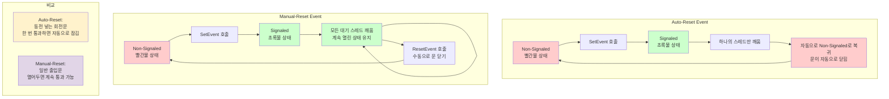
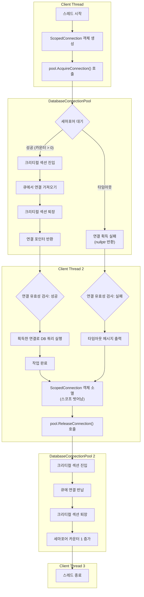
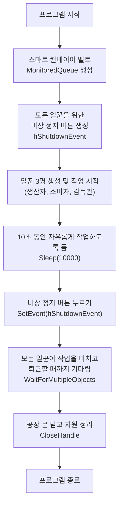

# 4주차: Win32 스레드 프로그래밍 2: 동기화 기초

---

## 1. 동기화 문제와 경쟁 조건

### 1.1 경쟁 조건(Race Condition) 개념과 문제점
경쟁 조건은 두 개 이상의 스레드가 공유 자원에 동시에 접근할 때, 실행 순서에 따라 결과가 달라지는 상황을 말한다. 이는 멀티스레드 프로그래밍에서 가장 흔하고 위험한 문제 중 하나이다.

```
스레드 A          공유 변수          스레드 B
   |                count = 0           |
   |                                    |
   v                                    v
[읽기: 0]                          [읽기: 0]
   |                                    |
   v                                    v
[계산: 0+1]                        [계산: 0+1]
   |                                    |
   v                                    v
[쓰기: 1] -------> count = 1 <------- [쓰기: 1]

예상 결과: count = 2
실제 결과: count = 1 (데이터 손실!)
```

### 1.2 공유 자원 접근 시 발생하는 문제들

**1) 데이터 불일치 (Data Inconsistency)**
```cpp
// 문제가 있는 코드 예시
class BankAccount {
private:
    int balance;
public:
    void Deposit(int amount) {
        int temp = balance;    // 1. 현재 잔액 읽기
        temp += amount;       // 2. 계산
        balance = temp;       // 3. 결과 저장
    }
    
    void Withdraw(int amount) {
        int temp = balance;
        temp -= amount;
        balance = temp;
    }
};
```

**2) 읽기-수정-쓰기 문제**
```
시간축:  T1    T2    T3    T4    T5
스레드A: 읽기  계산   --    쓰기   --
스레드B: --   읽기   계산   --    쓰기

결과: 스레드 A의 작업이 손실됨
```

### 1.3 상호 배제(Mutual Exclusion)의 필요성
상호 배제는 한 번에 하나의 스레드만이 임계 영역(Critical Section)에 접근할 수 있도록 하는 메커니즘이다.

```
임계 영역 개념도:

  스레드1  스레드2  스레드3
     |       |       |
     v       v       v
  [대기]  [대기]  [실행중]
     |       |       |
     |       |    ┌─────┐
     |       |    │임계  │ <- 한 번에 하나만 접근
     |       |    │영역  │
     |       |    └─────┘
     |       |       |
     v       v       v
   [대기]   [대기]  [완료]
```

### 1.4 원자성(Atomicity) 개념과 중요성
**원자성은 작업이 중간에 중단되지 않고 완전히 실행되거나 전혀 실행되지 않는 특성을 의미**한다.

**원자성 위반 예시:**
```cpp
// 원자성이 보장되지 않는 연산
counter++;  // 실제로는 3단계로 구성됨

// 어셈블리 레벨에서의 실제 동작:
// 1. MOV EAX, [counter]    ; 메모리에서 레지스터로 로드
// 2. INC EAX               ; 레지스터 값 증가
// 3. MOV [counter], EAX    ; 레지스터에서 메모리로 저장
```

---

## 2. 기본 동기화 객체들

### 2.1 Critical Section 사용법과 특징
Critical Section은 Win32에서 제공하는 가장 빠른 동기화 객체로, 같은 프로세스 내의 스레드들 간의 동기화에만 사용할 수 있다.

**주요 함수들:**
- `InitializeCriticalSection()`: 임계 영역 초기화
- `EnterCriticalSection()`: 임계 영역 진입
- `LeaveCriticalSection()`: 임계 영역 해제
- `DeleteCriticalSection()`: 임계 영역 삭제

**기본 사용 예제:**
```cpp
#include <windows.h>
#include <iostream>
#include <thread>

class ThreadSafeCounter {
private:
    CRITICAL_SECTION cs;
    int count;

public:
    ThreadSafeCounter() : count(0) {
        InitializeCriticalSection(&cs);
    }
    
    ~ThreadSafeCounter() {
        DeleteCriticalSection(&cs);
    }
    
    void Increment() {
        EnterCriticalSection(&cs);  // 임계 영역 진입
        
        // 임계 영역: 한 번에 하나의 스레드만 실행
        int temp = count;
        Sleep(1);  // 경쟁 상황 시뮬레이션
        count = temp + 1;
        
        LeaveCriticalSection(&cs);  // 임계 영역 해제
    }
    
    int GetCount() const {
        return count;
    }
};
```

**Critical Section 작동 원리:**
```
스레드1                Critical Section               스레드2
   |                                                    |
   v                                                    v
EnterCriticalSection() ──┐                              │
   |                     │                          [대기중]
   |                     │ 소유권 획득                   │
   |                     v                              │
[임계 영역 실행]        ┌─────────┐                       │
   |                  │ 보호된   │                       │
   |                  │ 코드     │                       │
   |                  └─────────┘                       │
   v                     │                              │
LeaveCriticalSection() ──┘                              │
   |                  소유권 해제                        │
   |                     │                              v
   |                     └─────────→ EnterCriticalSection()
   v                                  [임계 영역 실행]
[계속 실행]
```

### 2.2 Mutex 객체와 활용
Mutex(Mutual Exclusion)는 프로세스 간 동기화도 가능한 커널 객체이다. Critical Section 보다 무겁지만 더 강력한 기능을 제공한다.

**주요 함수들:**
- `CreateMutex()`: 뮤텍스 생성
- `WaitForSingleObject()`: 뮤텍스 획득 대기
- `ReleaseMutex()`: 뮤텍스 해제
- `CloseHandle()`: 뮤텍스 핸들 해제

**Mutex 사용 예제:**
```cpp
#include <windows.h>
#include <iostream>
#include <vector>
#include <thread>

class MutexExample {
private:
    HANDLE hMutex;
    int sharedResource;

public:
    MutexExample() : sharedResource(0) {
        // 뮤텍스 생성 (이름 없는 뮤텍스)
        hMutex = CreateMutex(
            NULL,    // 보안 속성
            FALSE,   // 초기 소유권 없음
            NULL     // 이름 없음 (프로세스 내부용)
        );
        
        if (hMutex == NULL) {
            throw std::runtime_error("뮤텍스 생성 실패");
        }
    }
    
    ~MutexExample() {
        if (hMutex) {
            CloseHandle(hMutex);
        }
    }
    
    void AccessResource(int threadId) {
        // 뮤텍스 획득 대기 (최대 5초)
        DWORD waitResult = WaitForSingleObject(hMutex, 5000);
        
        switch (waitResult) {
        case WAIT_OBJECT_0:
            // 뮤텍스 획득 성공
            std::cout << "스레드 " << threadId << ": 리소스 접근 시작\n";
            
            // 공유 리소스 작업
            int oldValue = sharedResource;
            Sleep(1000);  // 작업 시뮬레이션
            sharedResource = oldValue + 1;
            
            std::cout << "스레드 " << threadId << ": 리소스 값 = " 
                      << sharedResource << "\n";
            
            // 뮤텍스 해제
            if (!ReleaseMutex(hMutex)) {
                std::cerr << "뮤텍스 해제 실패\n";
            }
            break;
            
        case WAIT_TIMEOUT:
            std::cout << "스레드 " << threadId << ": 타임아웃 발생\n";
            break;
            
        case WAIT_FAILED:
            std::cerr << "스레드 " << threadId << ": 대기 실패\n";
            break;
        }
    }
    
    int GetResource() const { return sharedResource; }
};
```

### 2.3 Semaphore의 개념과 활용
Semaphore는 제한된 수의 자원에 대한 접근을 제어하는 동기화 객체이다. 카운터를 가지고 있어 여러 스레드가 동시에 접근할 수 있다.      

`CreateSemaphore` 함수를 사용하여 지정된 수만큼의 자원(Resource)에 대한 동시 접근을 제어하는 **세마포어(Semaphore) 커널 객체**를 생성하거나 연다.  
  
가장 쉬운 비유는 **주차장 관리 시스템**이다. 🅿️

  * 세마포어는 주차장의 **총 주차 가능 대수**를 관리한다.
  * 스레드가 세마포어를 얻으려고 시도하는 것(`WaitForSingleObject` 등)은 차가 주차장에 **진입**하려는 것과 같다.
  * 스레드가 세-마포어를 반납하는 것(`ReleaseSemaphore`)은 차가 주차장에서 **빠져나가는** 것과 같다.  
  
만약 주차장이 꽉 찼다면(세마포어 카운트가 0), 다음 차는 자리가 날 때까지 입구에서 기다려야 한다.
  
#### 함수 정의 (Function Signature)
```cpp
HANDLE CreateSemaphore(
  [in, optional] LPSECURITY_ATTRIBUTES lpSemaphoreAttributes,
  [in]           LONG                  lInitialCount,
  [in]           LONG                  lMaximumCount,
  [in, optional] LPCTSTR               lpName
);
```
  
1.  **`lpSemaphoreAttributes`** (LPSECURITY\_ATTRIBUTES)

      * 세마포어 객체의 **보안 속성**을 지정하는 구조체 포인터이다. 자식 프로세스에게 이 세마포어 핸들을 상속할지 여부 등을 설정할 수 있다.
      * 일반적으로 기본 보안 설정을 사용하며, 이 경우 **NULL**을 전달한다.

2.  **`lInitialCount`** (LONG)

      * 세마포어가 생성될 때의 **초기 카운트** 값이다. 즉, 처음부터 사용 가능한 자원의 개수이다.
      * 주차장 비유에서는 "처음에 비어있는 주차 공간의 수"에 해당한다.
      * 이 값은 **0 이상, `lMaximumCount` 이하**여야 한다.

3.  **`lMaximumCount`** (LONG)

      * 세마포어가 가질 수 있는 **최대 카운트** 값이다. 즉, 접근 가능한 총 자원의 개수이다.
      * 주차장 비유에서는 "총 주차 가능 대수"이다.
      * 이 값은 **0보다 커야 한다.**

4.  **`lpName`** (LPCTSTR)

      * 세마포어 객체의 **이름**을 지정하는 문자열 포인터이다.
      * **`NULL`**: 이름 없는(unnamed) 세마포어를 생성한다. 이 세마포어는 생성한 프로세스 내에서만 사용할 수 있다.  
      * **문자열 지정**: 이름 있는(named) 세마포어를 생성한다. 이 이름을 알면 **다른 프로세스에서도** 이 세마포어에 접근하여 프로세스 간 동기화에 사용할 수 있다. 만약 지정한 이름의 세마포어가 이미 존재하면, 시스템은 그 기존 세마포어의 핸들을 반환한다.
  
반환 값 (Return Value)  
  * **성공 시**: 새로 생성되었거나 이미 존재하는 세마포어 객체에 대한 **핸들(HANDLE)**을 반환한다.
  * **실패 시**: **`NULL`**을 반환한다. 실패 원인에 대한 자세한 정보는 `GetLastError()` 함수를 호출하여 얻을 수 있다.  
    
**Semaphore 개념도:**
```
세마포어 (초기값: 3, 최대값: 3)

시간 T1: 사용 가능한 자원 = 3
         [●●●] <- 사용 가능
         
시간 T2: 스레드 A, B가 접근
         [●○○] <- 1개 남음
         
시간 T3: 스레드 C도 접근
         [○○○] <- 모든 자원 사용 중
         
시간 T4: 스레드 D는 대기
         [대기중] [○○○]
         
시간 T5: 스레드 A 작업 완료
         [●○○] <- 1개 다시 사용 가능
         스레드 D 접근 가능
```

**Semaphore 사용 예제:**
```cpp
#include <windows.h>
#include <iostream>
#include <vector>
#include <process.h> // _beginthreadex, _endthreadex를 위해 필요

class ConnectionPool 
{
private:
    HANDLE hSemaphore;
    static const int MAX_CONNECTIONS = 3;

public:
    ConnectionPool() {
        // 세마포어 생성 (초기값: 3, 최대값: 3)
        hSemaphore = CreateSemaphore(
            NULL,              // 보안 속성
            MAX_CONNECTIONS,   // 초기 카운트
            MAX_CONNECTIONS,   // 최대 카운트
            NULL               // 이름
        );

        if (hSemaphore == NULL) {
            throw std::runtime_error("세마포어 생성 실패");
        }
    }

    ~ConnectionPool() {
        if (hSemaphore) {
            CloseHandle(hSemaphore);
        }
    }

    void UseConnection(int threadId) {
        std::cout << "스레드 " << threadId << ": 연결 요청\n";

        // 사용 가능한 연결 대기
        DWORD waitResult = WaitForSingleObject(hSemaphore, INFINITE);

        if (waitResult == WAIT_OBJECT_0) {
            std::cout << "스레드 " << threadId << ": 연결 획득\n";

            // 연결 사용 시뮬레이션
            Sleep(2000 + (rand() % 3000)); // 2-5초 랜덤 작업

            std::cout << "스레드 " << threadId << ": 연결 해제\n";

            // 세마포어 해제 (연결 반납)
            ReleaseSemaphore(hSemaphore, 1, NULL);
        }
    }
};

// _beginthreadex에 전달할 데이터를 담을 구조체
struct ThreadData {
    ConnectionPool* pool;
    int threadId;
};

// 스레드 함수
// _beginthreadex는 static 멤버 함수 또는 전역 함수를 요구합니다.
unsigned int __stdcall ThreadFunction(void* pArguments) {
    ThreadData* data = static_cast<ThreadData*>(pArguments);
    
    if (data) {
        data->pool->UseConnection(data->threadId);
    }
    delete data; // 동적으로 할당된 데이터 해제
    _endthreadex(0);
    return 0;
}

// 사용 예제
void TestConnectionPool() 
{
    ConnectionPool pool;
    const int NUM_THREADS = 5;
    std::vector<HANDLE> threadHandles;

    // 5개 스레드가 3개 연결을 두고 경쟁
    for (int i = 1; i <= NUM_THREADS; ++i) {
        // 스레드에 전달할 데이터를 동적으로 생성
        ThreadData* data = new ThreadData{&pool, i};

        HANDLE hThread = (HANDLE)_beginthreadex(
            NULL,                   // 보안 속성
            0,                      // 스택 크기 (0 = 기본값)
            ThreadFunction,         // 스레드 함수
            data,                   // 스레드 함수에 전달할 인자
            0,                      // 생성 플래그 (0 = 즉시 실행)
            NULL                    // 스레드 ID (필요 없는 경우 NULL)
        );

        if (hThread) {
            threadHandles.push_back(hThread);
        } else {
            delete data; // 스레드 생성 실패 시 메모리 해제
        }
    }

    // 모든 스레드가 끝날 때까지 대기
    WaitForMultipleObjects(threadHandles.size(), threadHandles.data(), TRUE, INFINITE);

    // 스레드 핸들 닫기
    for (HANDLE h : threadHandles) {
        CloseHandle(h);
    }
}

int main() 
{
    srand(time(NULL));
    TestConnectionPool();
    return 0;
}
```

### 2.4 Event 객체 (Manual/Auto Reset)
Event 객체는 특정 조건이나 상태 변화를 알리는 데 사용되는 동기화 객체이다.  
  
**Event 종류:**
- **Auto-Reset Event**: 하나의 대기 스레드가 깨어나면 자동으로 non-signaled 상태로 변경
- **Manual-Reset Event**: 명시적으로 ResetEvent()를 호출할 때까지 signaled 상태 유지  
  
**Auto-Reset Event (자동 리셋 이벤트)**
문을 한 번만 열어주는 자동문 같은 개념이다. 한 사람이 문을 통과하면 문이 자동으로 닫혀버린다. 즉, 대기하고 있던 스레드 중 하나가 신호를 받아 깨어나면, 그 즉시 다시 잠긴 상태가 되어서 다른 스레드들은 계속 기다려야 한다.
  
**Manual-Reset Event (수동 리셋 이벤트)**
수동으로 열고 닫는 일반 문 같은 개념이다. 문을 열어두면 여러 사람이 계속 통과할 수 있고, 누군가가 직접 문을 닫을 때까지는 계속 열린 상태를 유지한다. 즉, 신호가 발생하면 대기 중인 모든 스레드가 깨어날 수 있고, 개발자가 명시적으로 ResetEvent()를 호출해서 다시 잠글 때까지는 계속 열린 상태이.
  
**간단한 비유:**
- Auto-Reset: 동전 하나로 한 번만 이용할 수 있는 회전문
- Manual-Reset: 관리자가 직접 열고 닫는 출입문

<br>        
  
**Signaled 상태란?**
"신호가 켜진 상태" 또는 "통행 허가가 떨어진 상태"라고 생각하면 된다.

**교통신호등으로 비유하면:**
- **Signaled 상태 (신호 ON)**: 초록불 - "지나가도 됩니다!"
- **Non-Signaled 상태 (신호 OFF)**: 빨간불 - "기다리세요!"

**실제 동작:**
스레드들이 Event 객체를 기다리고 있을 때, Event가 Signaled 상태가 되면 "이제 작업을 계속 진행해도 된다"는 신호를 받는 것이다.  
  
**구체적인 예시:**
파일 다운로드가 완료되기를 기다리는 상황을 생각해보자.
- 다운로드 중: Non-Signaled 상태 (대기 스레드들은 계속 기다림)
- 다운로드 완료: Signaled 상태로 변경 (대기하던 스레드들이 깨어나서 다음 작업 진행)

**핵심:**
Signaled 상태는 "조건이 만족되었으니 이제 진행해도 된다"는 신호를 의미한다. 마치 "출발 신호"나 "허가 신호"와 같은 개념이다.  
Non-Signaled 상태에서는 스레드들이 계속 기다리고, Signaled 상태가 되면 기다리던 스레드들이 작업을 재개할 수 있게 된다.  


    
#### `CreateEvent`와 `SetEvent` 함수

`CreateEvent` 함수는 이벤트 객체를 **생성**하거나, 이미 존재하는 이름의 이벤트 객체를 **연다**. 즉, 신호를 보낼 수 있는 "신호등"을 설치하는 역할을 한다.

##### 함수 정의

```cpp
HANDLE CreateEvent(
  [in, optional] LPSECURITY_ATTRIBUTES lpEventAttributes,
  [in]           BOOL                  bManualReset,
  [in]           BOOL                  bInitialState,
  [in, optional] LPCTSTR               lpName
);
```

##### 매개변수
1.  **`lpEventAttributes`** (LPSECURITY\_ATTRIBUTES)

      * 보안 속성을 지정하며, 보통 기본값을 사용하기 위해 **NULL**을 전달한다.

2.  **`bManualReset`** (BOOL) - **[가장 중요한 매개변수]**

      * 이벤트가 신호를 받은 후 어떻게 동작할지 결정한다.
      * **`TRUE` (수동 리셋)**: `SetEvent`로 신호를 보내면, `ResetEvent` 함수를 직접 호출할 때까지 계속 **신호 상태(Signaled)**를 유지한다. 신호를 기다리던 **모든 스레드가 동시에 깨어난다**. (출발 신호 총과 같음)
      * **`FALSE` (자동 리셋)**: `SetEvent`로 신호를 보내면, 신호를 기다리던 스레드 **단 하나만 깨어나고** 이벤트는 즉시 **비신호 상태(Non-signaled)**로 자동 변경된다. (한 명만 통과시키는 개찰구와 같음)

3.  **`bInitialState`** (BOOL)

      * 이벤트의 초기 상태를 결정한다.
      * **`TRUE`**: 생성될 때부터 **신호 상태(Signaled)**로 시작한다. (초록불인 신호등)
      * **`FALSE`**: 생성될 때 **비신호 상태(Non-signaled)**로 시작한다. (빨간불인 신호등, 가장 일반적)

4.  **`lpName`** (LPCTSTR)

      * 이벤트의 이름을 지정하는 문자열이다.
      * **`NULL`**: 이름 없는(unnamed) 이벤트를 만든다. 해당 프로세스 내에서만 유효하다.
      * **문자열 지정**: 이름 있는(named) 이벤트를 만든다. 이 이름을 통해 **프로세스 간 동기화**가 가능하다.

##### 반환 값

  * **성공 시**: 이벤트 객체에 대한 **핸들(HANDLE)**을 반환한다.
  * **실패 시**: **`NULL`**을 반환한다.
  
  
#### Event 사용 예제: 🚩 수동 리셋(Manual-Reset) 이벤트 예제
수동 리셋 이벤트는 `SetEvent`로 신호를 보내면, `ResetEvent`를 명시적으로 호출하기 전까지 신호 상태(Signaled)를 유지한다.   
따라서 이벤트를 기다리는 **모든 스레드가 동시에 깨어나** 작업을 시작할 수 있다. 마치 모든 주자가 출발 신호를 기다리다가 총소리 한 번에 다 같이 출발하는 것과 같다.
  
```cpp
#include <windows.h>
#include <iostream>
#include <vector>
#include <stdexcept>
#include <process.h> // _beginthreadex, _endthreadex를 위해 필요

// 여러 워커 스레드를 제어하는 클래스
class WorkerController 
{
private:
    HANDLE hStartEvent;      // 수동 리셋(Manual-Reset) 이벤트 핸들
    volatile bool shouldStop; // 스레드 종료 플래그

public:
    WorkerController() : shouldStop(false) 
    {
        // 수동 리셋 이벤트 생성 (두 번째 인자: TRUE)
        // 초기 상태는 Non-Signaled (세 번째 인자: FALSE)
        hStartEvent = CreateEvent(NULL, TRUE, FALSE, NULL);
        if (!hStartEvent) {
            throw std::runtime_error("이벤트 생성 실패");
        }
    }

    ~WorkerController() 
    {
        if (hStartEvent) CloseHandle(hStartEvent);
    }

    // 각 워커 스레드가 실행할 함수
    void WorkerThread(int workerId) 
    {
        std::cout << "워커 " << workerId << ": 시작 신호 대기 중...\n";

        // hStartEvent가 Signaled 상태가 될 때까지 무한 대기
        WaitForSingleObject(hStartEvent, INFINITE);

        // Stop 신호가 먼저 왔으면 바로 종료
        if (shouldStop) {
            std::cout << "워커 " << workerId << ": 중지 신호를 받아 종료합니다.\n";
            return;
        }

        std::cout << "워커 " << workerId << ": 작업을 시작합니다.\n";
        // 실제 작업 시뮬레이션
        Sleep(1000 + (rand() % 1000));
        std::cout << "워커 " << workerId << ": 작업 완료.\n";
    }

    // 모든 워커를 동시에 시작시키는 함수
    void StartAllWorkers() 
    {
        std::cout << "\n[메인] 모든 워커에게 시작 신호를 보냅니다. (SetEvent)\n";
        // 이벤트를 Signaled 상태로 변경 -> 대기 중인 모든 스레드가 동시에 깨어남
        SetEvent(hStartEvent);
    }

    // 모든 워커를 종료시키는 함수
    void StopAllWorkers() 
    {
        shouldStop = true;
        // 이미 시작한 스레드 외에 혹시 대기 중일 스레드를 위해 한번 더 호출
        SetEvent(hStartEvent);
    }
};

// _beginthreadex에 전달할 데이터를 위한 구조체
struct ThreadArgs 
{
    WorkerController* controller;
    int workerId;
};

// _beginthreadex가 호출할 스레드 함수
unsigned int __stdcall WorkerThreadFunc(void* pArgs) 
{
    ThreadArgs* args = static_cast<ThreadArgs*>(pArgs);
    if (args) 
    {
        // 실제 멤버 함수 호출
        args->controller->WorkerThread(args->workerId);
        delete args; // 동적으로 할당된 메모리 해제
    }
    _endthreadex(0);
    return 0;
}


int main()
{
    const int NUM_WORKERS = 5;
    WorkerController controller;
    std::vector<HANDLE> workerHandles;
    workerHandles.reserve(NUM_WORKERS);

    // 워커 스레드 생성 및 시작
    for (int i = 0; i < NUM_WORKERS; ++i) {
        // 스레드에 넘겨줄 인자들을 구조체에 담아 동적으로 할당
        ThreadArgs* args = new ThreadArgs{&controller, i + 1};

        HANDLE hThread = (HANDLE)_beginthreadex(
            NULL,               // 보안 속성
            0,                  // 스택 크기
            WorkerThreadFunc,   // 스레드 함수
            args,               // 스레드 함수에 전달할 인자
            0,                  // 생성 플래그
            NULL                // 스레드 ID 변수
        );

        if (hThread) {
            workerHandles.push_back(hThread);
        } else {
            // 스레드 생성 실패 시 메모리 누수 방지
            delete args;
            std::cerr << "스레드 " << i + 1 << " 생성 실패\n";
        }
    }

    // 스레드가 '대기 중' 메시지를 출력할 시간을 줌
    Sleep(1000);

    // 모든 워커를 동시에 시작
    controller.StartAllWorkers();

    // 모든 스레드가 종료될 때까지 대기
    if (!workerHandles.empty()) {
        WaitForMultipleObjects(workerHandles.size(), workerHandles.data(), TRUE, INFINITE);
    }

    std::cout << "\n[메인] 모든 작업이 완료되었습니다.\n";

    // 스레드 핸들 정리
    for (HANDLE h : workerHandles) {
        CloseHandle(h);
    }

    return 0;
}
```
  
실행 결과:  

```
워커 1: 시작 신호 대기 중...
워커 2: 시작 신호 대기 중...
워커 3: 시작 신호 대기 중...
워커 4: 시작 신호 대기 중...
워커 5: 시작 신호 대기 중...

[메인] 모든 워커에게 시작 신호를 보냅니다. (SetEvent)
워커 1: 작업을 시작합니다.
워커 5: 작업을 시작합니다.
워커 4: 작업을 시작합니다.
워커 3: 작업을 시작합니다.
워커 2: 작업을 시작합니다.
워커 3: 작업 완료.
워커 5: 작업 완료.
워커 2: 작업 완료.
워커 1: 작업 완료.
워커 4: 작업 완료.

[메인] 모든 작업이 완료되었습니다.
```

> **결과 분석**: `SetEvent`가 한 번 호출되자, 신호를 기다리던 **모든 워커 스레드가 거의 동시에** "작업을 시작합니다" 메시지를 출력하며 실행을 재개하는 것을 확인할 수 있다.


#### Event 사용 예제: 🚩 자동 리셋(Auto-Reset) 이벤트 예제
자동 리셋 이벤트는 `SetEvent`로 신호를 보내면, 대기하던 스레드 중 **단 하나만 깨워서** 실행시키고 즉시 신호가 없는 상태(Non-Signaled)로 자동 변경된다. 이는 여러 스레드 중 하나만 특정 작업을 처리하게 하거나, 작업 큐에서 순서대로 작업을 꺼내 처리하는 모델에 유용하다. 마치 은행 창구에서 "다음 고객님" 하고 벨을 누르면 대기하던 고객 중 한 명만 창구로 가는 것과 같다.  

```cpp
#include <windows.h>
#include <iostream>
#include <vector>
#include <stdexcept>
#include <process.h> // _beginthreadex, _endthreadex를 위해 필요

// 여러 워커 스레드와 작업 큐를 관리하는 클래스
class WorkManager
{
private:
    HANDLE hWorkEvent;       // 자동 리셋(Auto-Reset) 이벤트 핸들
    volatile bool shouldStop; // 스레드 종료 플래그

public:
    WorkManager() : shouldStop(false) 
    {
        // 자동 리셋 이벤트 생성 (두 번째 인자: FALSE)
        // 초기 상태는 Non-Signaled (세 번째 인자: FALSE)
        hWorkEvent = CreateEvent(NULL, FALSE, FALSE, NULL);
     
        if (!hWorkEvent) {
            throw std::runtime_error("이벤트 생성 실패");
        }
    }

    ~WorkManager() 
    {
        if (hWorkEvent) CloseHandle(hWorkEvent);
    }

    // 각 워커 스레드가 실행할 함수
    void WorkerThread(int workerId) 
    {
        while (!shouldStop) 
        {
            std::cout << "워커 " << workerId << ": 작업 신호 대기 중...\n";

            // hWorkEvent가 Signaled 상태가 될 때까지 무한 대기
            // 신호를 받으면 이벤트는 자동으로 Non-Signaled 상태가 됨
            WaitForSingleObject(hWorkEvent, INFINITE);

            if (shouldStop) break;

            std::cout << "워커 " << workerId << ": 작업을 할당받아 수행합니다.\n";
            // 실제 작업 시뮬레이션
            Sleep(1500);
            std::cout << "워커 " << workerId << ": 작업 완료.\n";
        }
        std::cout << "워커 " << workerId << ": 종료.\n";
    }

    // 워커에게 새로운 작업이 있음을 알리는 함수
    void SignalWork() 
    {
        // 이벤트를 Signaled 상태로 변경 -> 대기 중인 스레드 중 하나만 깨어남
        SetEvent(hWorkEvent);
    }

    // 모든 워커를 종료시키는 함수
    void StopAllWorkers(int numWorkers) 
    {
        shouldStop = true;
        // 대기 중인 모든 스레드를 깨워 루프를 종료시키기 위해 여러 번 호출
        for (int i = 0; i < numWorkers; ++i) {
            SetEvent(hWorkEvent);
        }
    }
};

// _beginthreadex에 전달할 데이터를 담을 구조체
struct ThreadData 
{
    WorkManager* manager;
    int workerId;
};

// 스레드 함수 (_beginthreadex는 C 스타일 함수 포인터를 요구)
unsigned int __stdcall ThreadFunction(void* pArguments) 
{
    ThreadData* data = static_cast<ThreadData*>(pArguments);
    if (data) {
        // 실제 클래스 멤버 함수 호출
        data->manager->WorkerThread(data->workerId);
        delete data; // 동적으로 할당된 데이터 해제
    }
    _endthreadex(0); // 스레드 종료
    return 0;
}

int main()
{
    const int NUM_WORKERS = 3;
    const int NUM_TASKS = 5;
    WorkManager manager;
    std::vector<HANDLE> workerHandles;

    // 워커 스레드 생성 및 시작
    for (int i = 0; i < NUM_WORKERS; ++i) 
    {
        // 스레드에 전달할 데이터를 동적으로 생성
        ThreadData* data = new ThreadData{ &manager, i + 1 };

        HANDLE hThread = (HANDLE)_beginthreadex(
            NULL,             // 보안 속성
            0,                // 스택 크기 (0 = 기본값)
            ThreadFunction,   // 스레드 함수
            data,             // 스레드 함수에 전달할 인자
            0,                // 생성 플래그 (0 = 즉시 실행)
            NULL              // 스레드 ID 포인터
        );

        if (hThread) 
        {
            workerHandles.push_back(hThread);
        } else 
        {
            delete data; // 스레드 생성 실패 시 메모리 해제
            std::cerr << "스레드 " << i + 1 << " 생성 실패!" << std::endl;
        }
    }

    // 스레드가 '대기 중' 메시지를 출력할 시간을 줌
    Sleep(100);

    // 5개의 작업을 순차적으로 요청
    for (int i = 0; i < NUM_TASKS; ++i) 
    {
        std::cout << "\n[메인] " << i + 1 << "번째 작업 신호를 보냅니다. (SetEvent)\n";
        manager.SignalWork();
        Sleep(500); // 작업 신호 간의 간격
    }

    std::cout << "\n[메인] 모든 워커 종료 신호를 보냅니다.\n";
    manager.StopAllWorkers(NUM_WORKERS);

    // 모든 스레드가 종료될 때까지 대기
    WaitForMultipleObjects(workerHandles.size(), workerHandles.data(), TRUE, INFINITE);

    std::cout << "\n[메인] 프로그램이 종료되었습니다.\n";

    // 모든 스레드 핸들 닫기
    for (HANDLE hThread : workerHandles) 
    {
        CloseHandle(hThread);
    }

    return 0;
}
```  
   
실행 결과:  
```
워커 1: 작업 신호 대기 중...
워커 2: 작업 신호 대기 중...
워커 3: 작업 신호 대기 중...

[메인] 1번째 작업 신호를 보냅니다. (SetEvent)
워커 1: 작업을 할당받아 수행합니다.
워커 2: 작업 신호 대기 중...
워커 3: 작업 신호 대기 중...

[메인] 2번째 작업 신호를 보냅니다. (SetEvent)
워커 2: 작업을 할당받아 수행합니다.
워커 3: 작업 신호 대기 중...
워커 1: 작업 완료.
워커 1: 작업 신호 대기 중...

[메인] 3번째 작업 신호를 보냅니다. (SetEvent)
워커 3: 작업을 할당받아 수행합니다.
워커 2: 작업 완료.
워커 2: 작업 신호 대기 중...

[메인] 4번째 작업 신호를 보냅니다. (SetEvent)
워커 1: 작업을 할당받아 수행합니다.
워커 3: 작업 완료.
워커 3: 작업 신호 대기 중...

[메인] 5번째 작업 신호를 보냅니다. (SetEvent)
워커 2: 작업을 할당받아 수행합니다.
워커 1: 작업 완료.
워커 1: 작업 신호 대기 중...
워커 2: 작업 완료.
워커 2: 작업 신호 대기 중...

[메인] 모든 워커 종료 신호를 보냅니다.
워커 3: 종료.
워커 1: 종료.
워커 2: 종료.

[메인] 프로그램이 종료되었습니다.
```

> **결과 분석**: `SetEvent`가 호출될 때마다, 대기하던 여러 스레드 중 **오직 하나의 스레드만** 깨어나 "작업을 할당받아 수행합니다" 라는 메시지를 출력한다. 작업이 끝나고 다시 대기 상태로 돌아간 스레드는 다음 신호를 기다린다. 이처럼 작업이 순차적으로 분배되는 것을 명확히 볼 수 있다.  
  
  
### 2.5 각 동기화 객체의 성능 특성과 선택 기준
**성능 비교표:**
```
동기화 객체        속도    범위        특징                    용도
───────────────────────────────────────────────────────────────────────
Critical Section 빠름   프로세스내   가벼움, 재진입 가능     단순한 상호배제
Mutex            보통   프로세스간   무거움, 소유권 개념     프로세스간 동기화
Semaphore        보통   프로세스간   카운터 기반            자원 풀 관리
Event            보통   프로세스간   상태 알림              조건 대기/신호
```

**선택 기준:**

1. **Critical Section 사용 시기:**
   - 같은 프로세스 내 스레드 간 동기화
   - 성능이 중요한 경우
   - 단순한 상호 배제가 필요한 경우

2. **Mutex 사용 시기:**
   - 프로세스 간 동기화가 필요한 경우
   - 소유권 개념이 중요한 경우
   - 타임아웃이 필요한 경우

3. **Semaphore 사용 시기:**
   - 제한된 자원에 대한 접근 제어
   - 동시 접근 가능한 개수 제한
   - 생산자-소비자 패턴

4. **Event 사용 시기:**
   - 조건 대기/신호 패턴
   - 스레드 간 상태 변화 알림
   - 배치 처리 시작/완료 신호

---

## 3. 실습: 동기화 문제 체험

### 3.1 Race Condition 재현 실험 (은행 계좌 예제)
이 코드에서는 동기화 없이 여러 스레드가 공유 자원에 접근할 때 발생하는 문제를 직접 확인해보겠다.  

**코드:**
```cpp
#include <windows.h>
#include <iostream>
#include <vector>
#include <thread>
#include <iomanip>

class UnsafeBankAccount 
{
private:
    volatile int balance;  // volatile: 컴파일러 최적화 방지

public:
    UnsafeBankAccount(int initialBalance = 0) : balance(initialBalance) {}

    void Deposit(int amount) {
        // 위험한 연산: 원자성이 보장되지 않음
        int temp = balance;        // 1. 읽기
        Sleep(1);                  // 2. 컨텍스트 스위치 유발
        balance = temp + amount;   // 3. 쓰기
    }

    void Withdraw(int amount) {
        int temp = balance;
        Sleep(1);
        if (temp >= amount) {
            balance = temp - amount;
        }
    }

    int GetBalance() const { return balance; }
};

// Race Condition 테스트
void TestRaceCondition() 
{
    const int THREAD_COUNT = 10;
    const int OPERATIONS_PER_THREAD = 100;
    const int DEPOSIT_AMOUNT = 10;

    UnsafeBankAccount account(0);
    std::vector<std::thread> threads;

    std::cout << "=== Race Condition 테스트 시작 ===\n";
    std::cout << "스레드 수: " << THREAD_COUNT << "\n";
    std::cout << "스레드당 입금 횟수: " << OPERATIONS_PER_THREAD << "\n";
    std::cout << "입금 금액: " << DEPOSIT_AMOUNT << "\n";
    std::cout << "예상 최종 잔액: "
        << (THREAD_COUNT * OPERATIONS_PER_THREAD * DEPOSIT_AMOUNT) << "\n\n";

    // 여러 스레드가 동시에 입금
    for (int i = 0; i < THREAD_COUNT; ++i) {
        threads.emplace_back([&account, OPERATIONS_PER_THREAD, DEPOSIT_AMOUNT, i]() {
            for (int j = 0; j < OPERATIONS_PER_THREAD; ++j) {
                account.Deposit(DEPOSIT_AMOUNT);
                if (j % 20 == 0) {
                    std::cout << "스레드 " << i << ": " << (j + 1) << "회 입금 완료\n";
                }
            }
            });
    }

    // 모든 스레드 완료 대기
    for (auto& t : threads) {
        t.join();
    }

    std::cout << "\n=== 결과 ===\n";
    std::cout << "실제 최종 잔액: " << account.GetBalance() << "\n";
    std::cout << "예상 최종 잔액: "
        << (THREAD_COUNT * OPERATIONS_PER_THREAD * DEPOSIT_AMOUNT) << "\n";

    int expectedBalance = THREAD_COUNT * OPERATIONS_PER_THREAD * DEPOSIT_AMOUNT;
    if (account.GetBalance() != expectedBalance) {
        std::cout << "❌ Race Condition 발생! 데이터 손실: "
            << (expectedBalance - account.GetBalance()) << "\n";
    }
    else {
        std::cout << "✅ 우연히 정확한 결과 (다시 실행해보세요)\n";
    }
}

int main()
{
    TestRaceCondition();
	return 0;   
}
```

**실행 결과 예시:**
```
=== Race Condition 테스트 시작 ===
스레드 수: 10
스레드당 입금 횟수: 100
입금 금액: 10
예상 최종 잔액: 10000

스레드 0: 21회 입금 완료
스레드 1: 21회 입금 완료
...

=== 결과 ===
실제 최종 잔액: 8750
예상 최종 잔액: 10000
❌ Race Condition 발생! 데이터 손실: 1250
```

### 3.2 실습 1: Critical Section으로 문제 해결
이제 Critical Section을 사용하여 앞서 발생한 문제들을 해결해보겠다.

**해결된 은행 계좌 코드:**

```cpp
#include <windows.h>
#include <iostream>
#include <vector>
#include <iomanip>
#include <process.h> // _beginthreadex, _endthreadex를 위해 필요

// CRITICAL_SECTION을 사용하여 스레드로부터 안전해진 은행 계좌 클래스
class SafeBankAccount 
{
private:
    int balance;
    CRITICAL_SECTION cs; // Critical Section 객체

public:
    SafeBankAccount(int initialBalance = 0) : balance(initialBalance) 
    {
        // 1. 생성자에서 크리티컬 섹션을 초기화합니다.
        InitializeCriticalSection(&cs);
    }

    ~SafeBankAccount() 
    {
        // 2. 소멸자에서 크리티컬 섹션 리소스를 해제합니다.
        DeleteCriticalSection(&cs);
    }

    // 복사 생성자와 대입 연산자를 삭제하여 객체 복사를 방지합니다.
    // CRITICAL_SECTION은 복사될 수 없기 때문입니다.
    SafeBankAccount(const SafeBankAccount&) = delete;
    SafeBankAccount& operator=(const SafeBankAccount&) = delete;

    void Deposit(int amount) 
    {
        // 3. 공유 자원 접근 전에 임계 영역으로 진입 (Lock)
        EnterCriticalSection(&cs);

        // --- 임계 영역 시작 ---
        int temp = balance;
        Sleep(1); // 컨텍스트 스위치를 유발해도 안전합니다.
        balance = temp + amount;
        // --- 임계 영역 종료 ---

        // 4. 공유 자원 접근이 끝나면 임계 영역에서 나옴 (Unlock)
        LeaveCriticalSection(&cs);
    }

    void Withdraw(int amount) 
    {
        EnterCriticalSection(&cs);
        int temp = balance;
        Sleep(1);
        if (temp >= amount) {
            balance = temp - amount;
        }
        LeaveCriticalSection(&cs);
    }

    int GetBalance() 
    {
        EnterCriticalSection(&cs);
        int currentBalance = balance;
        LeaveCriticalSection(&cs);
        return currentBalance;
    }
};

// _beginthreadex의 스레드 함수에 전달할 인자들을 담는 구조체
struct ThreadArgs 
{
    SafeBankAccount* account;
    int operationsPerThread;
    int depositAmount;
};

// _beginthreadex가 호출할 스레드 진입점 함수
unsigned int __stdcall DepositThreadFunc(void* pArgs) 
{
    // void* 타입의 인자를 원래의 구조체 포인터로 변환
    ThreadArgs* args = static_cast<ThreadArgs*>(pArgs);
    
    if (args) 
    {
        // 구조체에서 데이터를 꺼내 원래 람다 함수가 하던 작업을 수행
        for (int j = 0; j < args->operationsPerThread; ++j) 
        {
            args->account->Deposit(args->depositAmount);
        }
        // 동적으로 할당했던 인자 구조체 메모리 해제
        delete args;
    }

    _endthreadex(0); // 스레드 정상 종료
    return 0;
}


// SafeBankAccount를 사용하여 테스트하는 함수
void TestSafeAccount() 
{
    const int THREAD_COUNT = 10;
    const int OPERATIONS_PER_THREAD = 100;
    const int DEPOSIT_AMOUNT = 10;

    SafeBankAccount account(0); // 안전한 계좌 객체 사용
    std::vector<HANDLE> threadHandles; // 스레드 핸들을 저장할 벡터
    
    int expectedBalance = THREAD_COUNT * OPERATIONS_PER_THREAD * DEPOSIT_AMOUNT;

    std::cout << "=== 크리티컬 섹션 테스트 시작 ===\n";
    std::cout << "예상 최종 잔액: " << expectedBalance << "\n\n";

    // 여러 스레드가 동시에 입금
    for (int i = 0; i < THREAD_COUNT; ++i) 
    {
        // 스레드에 전달할 인자들을 동적으로 할당
        ThreadArgs* args = new ThreadArgs{&account, OPERATIONS_PER_THREAD, DEPOSIT_AMOUNT};

        // _beginthreadex를 사용하여 스레드 생성
        HANDLE hThread = (HANDLE)_beginthreadex(
            NULL,               // 보안 속성
            0,                  // 스택 크기 (기본값)
            DepositThreadFunc,  // 스레드 함수
            args,               // 스레드 함수에 전달할 인자
            0,                  // 생성 플래그 (즉시 실행)
            NULL                // 스레드 ID (필요 없음)
        );

        if (hThread) 
        {
            threadHandles.push_back(hThread);
        } 
        else 
        {
            // 스레드 생성 실패 시 할당된 메모리 해제
            delete args;
        }
    }

    // 모든 스레드가 종료될 때까지 대기
    WaitForMultipleObjects(threadHandles.size(), threadHandles.data(), TRUE, INFINITE);

    std::cout << "\n=== 결과 ===\n";
    std::cout << "실제 최종 잔액: " << account.GetBalance() << "\n";
    std::cout << "예상 최종 잔액: " << expectedBalance << "\n";

    if (account.GetBalance() == expectedBalance) {
        std::cout << "✅ 정확한 결과! Race Condition이 해결되었습니다.\n";
    } else {
        std::cout << "❌ 오류 발생! 여전히 문제가 있습니다.\n";
    }

    // 사용이 끝난 모든 스레드 핸들 닫기
    for (HANDLE h : threadHandles) 
    {
        CloseHandle(h);
    }
}

int main()
{
    TestSafeAccount();
    return 0;
}
```  


### 3.3 성능 비교 테스트  
  
```cpp
#include <windows.h>
#include <iostream>
#include <vector>
#include <thread>
#include <string>
#include <iomanip> // std::fixed, std::setprecision을 위해 추가

// SafeBankAccount, UnsafeBankAccount 클래스는 이전과 동일합니다.
class SafeBankAccount 
{
private:
    int balance;
    CRITICAL_SECTION cs; 

public:
    SafeBankAccount(int initialBalance = 0) : balance(initialBalance) {
        InitializeCriticalSection(&cs);
    }
    ~SafeBankAccount() {
        DeleteCriticalSection(&cs);
    }
    void Deposit(int amount) {
        EnterCriticalSection(&cs);
        int temp = balance;
        balance = temp + amount;
        LeaveCriticalSection(&cs);
    }
    void Withdraw(int amount) {
        EnterCriticalSection(&cs);
        int temp = balance;
        if (temp >= amount) {
            balance = temp - amount;
        }
        LeaveCriticalSection(&cs);
    }
    int GetBalance() {
        EnterCriticalSection(&cs);
        int currentBalance = balance;
        LeaveCriticalSection(&cs);
        return currentBalance;
    }
};

class UnsafeBankAccount 
{
private:
    volatile int balance;

public:
    UnsafeBankAccount(int initialBalance = 0) : balance(initialBalance) {}
    void Deposit(int amount) {
        int temp = balance;
        balance = temp + amount;
    }
    void Withdraw(int amount) {
        int temp = balance;
        if (temp >= amount) {
            balance = temp - amount;
        }
    }
    int GetBalance() const { return balance; }
};


void PerformanceComparison()
{
    // 반복 횟수를 늘려야 측정 시간 차이가 더 잘 보입니다.
    const int ITERATIONS = 500000; 

    // 1. 고해상도 타이머의 주파수(초당 틱 수)를 얻어옵니다.
    // 이 값은 프로그램 실행 동안 변하지 않으므로 한 번만 호출합니다.
    LARGE_INTEGER frequency;
    QueryPerformanceFrequency(&frequency);

    LARGE_INTEGER start, end;
    double elapsedTime;

    std::cout << std::fixed << std::setprecision(2); // 소수점 2자리까지 고정

    // 2. 동기화 없는 버전 (위험하지만 빠름)
    {
        UnsafeBankAccount unsafeAccount;
        QueryPerformanceCounter(&start); // 시작 시간 측정

        for (int i = 0; i < ITERATIONS; ++i) {
            unsafeAccount.Deposit(1);
        }

        QueryPerformanceCounter(&end); // 종료 시간 측정

        // 3. 경과 시간을 마이크로세컨드(us)로 계산
        elapsedTime = static_cast<double>(end.QuadPart - start.QuadPart) * 1000000.0 / frequency.QuadPart;
        std::cout << "동기화 없음: " << elapsedTime << " us\n";
    }

    // 4. Critical Section 사용 (안전하고 빠름)
    {
        SafeBankAccount safeAccount;
        QueryPerformanceCounter(&start);

        for (int i = 0; i < ITERATIONS; ++i) {
            safeAccount.Deposit(1);
        }

        QueryPerformanceCounter(&end);
        
        elapsedTime = static_cast<double>(end.QuadPart - start.QuadPart) * 1000000.0 / frequency.QuadPart;
        std::cout << "Critical Section: " << elapsedTime << " us\n";
    }

    // 5. Mutex 사용 (안전하지만 느림)
    {
        HANDLE hMutex = CreateMutex(NULL, FALSE, NULL);
        int balance = 0;

        QueryPerformanceCounter(&start);

        for (int i = 0; i < ITERATIONS; ++i) {
            WaitForSingleObject(hMutex, INFINITE);
            balance++;
            ReleaseMutex(hMutex);
        }

        QueryPerformanceCounter(&end);
        CloseHandle(hMutex);
        
        elapsedTime = static_cast<double>(end.QuadPart - start.QuadPart) * 1000000.0 / frequency.QuadPart;
        std::cout << "Mutex: " << elapsedTime << " us\n";
    }
}

int main()
{
    PerformanceComparison();
    return 0;
}
```
  
  

## 정리 및 핵심 포인트

### 학습한 주요 개념들

1. **Race Condition**: 여러 스레드가 공유 자원에 동시 접근할 때 발생하는 문제
2. **상호 배제**: 임계 영역에 한 번에 하나의 스레드만 접근하도록 하는 메커니즘
3. **원자성**: 작업이 중간에 중단되지 않고 완전히 실행되는 특성

### 동기화 객체 선택 가이드

```
사용 목적                     → 선택할 동기화 객체
─────────────────────────────────────────────
프로세스 내 간단한 상호배제    → Critical Section
프로세스 간 상호배제          → Mutex  
제한된 자원 풀 관리           → Semaphore
조건 대기/신호               → Event
```

### 실무에서의 주의사항
1. **데드락 방지**: 여러 동기화 객체를 사용할 때는 항상 같은 순서로 획득
2. **성능 고려**: Critical Section > Mutex > Semaphore > Event 순으로 성능 차이
3. **예외 안전성**: RAII 패턴을 사용하여 자동으로 해제되도록 구현
4. **최소 임계 영역**: 동기화 구간을 최대한 짧게 유지


## 4. 동기화 객체 활용

### 4.1 자원 풀 관리 (Database Connection Pool)
아래 코드는 **데이터베이스 연결 풀(Database Connection Pool)** 패턴을 구현한다. 데이터베이스 연결은 생성하는 데 비용이 많이 들기 때문에, 미리 정해진 개수의 연결을 만들어두고(Pool) 필요할 때마다 빌려 쓰고 반납하는 방식이다. 이를 통해 시스템 성능을 크게 향상시킬 수 있다.

#### 1. `DatabaseConnection`

  * 실제 데이터베이스 연결을 **시뮬레이션**하는 단순한 클래스이다.
  * `Connect()`, `Disconnect()`, `ExecuteQuery()` 같은 메서드를 통해 연결, 해제, 쿼리 실행 동작을 흉내 낸다.
  * 내부적으로 `Sleep()` 함수를 사용해 실제 네트워크 지연과 작업 시간을 모방한다.

#### 2. `DatabaseConnectionPool`

  * 연결 풀의 **핵심 로직**을 관리하는 클래스이다.
  * **주요 멤버 변수:**
      * `connections` (`std::vector<std::unique_ptr<DatabaseConnection>>`): 생성된 모든 `DatabaseConnection` 객체의 **소유권**을 가진다. 프로그램이 종료될 때 `unique_ptr`이 자동으로 메모리를 해제한다.
      * `availableConnections` (`std::queue<DatabaseConnection*>`): 현재 사용 가능한 연결 객체들의 **포인터**를 저장하는 큐이다.
      * `cs` (`CRITICAL_SECTION`): 여러 스레드가 동시에 `availableConnections` 큐에 접근할 때 데이터가 깨지는 것을 막는 **잠금(Lock) 장치**이다.
      * `hAvailableConnections` (`HANDLE`): **세마포어(Semaphore)** 객체이다. 사용 가능한 연결의 개수를 나타내는 카운터 역할을 한다. 스레드는 이 카운터가 0보다 클 때만 연결을 가져갈 수 있으며, 0이면 카운터가 1 이상이 될 때까지 효율적으로 대기한다.
  * **주요 메서드:**
      * `AcquireConnection()`: 스레드가 연결을 요청할 때 호출된다.
        1.  `WaitForSingleObject(hAvailableConnections, ...)`: 세마포어 카운터를 1 감소시키고 연결을 획득한다. 만약 카운터가 0이면, 다른 스레드가 연결을 반납하여 카운터가 증가할 때까지 대기한다.
        2.  `EnterCriticalSection(&cs)`: 큐에 접근하기 전에 잠금을 건다.
        3.  큐에서 연결 포인터를 꺼내 반환한다.
        4.  `LeaveCriticalSection(&cs)`: 잠금을 해제한다.
      * `ReleaseConnection()`: 스레드가 사용을 마친 연결을 반납할 때 호출된다.
        1.  `EnterCriticalSection(&cs)`: 큐에 접근하기 전에 잠금을 건다.
        2.  사용한 연결 포인터를 다시 큐에 넣는다.
        3.  `LeaveCriticalSection(&cs)`: 잠금을 해제한다.
        4.  `ReleaseSemaphore(hAvailableConnections, ...)`: 세마포어 카운터를 1 증가시켜 다른 대기 중인 스레드에게 연결이 사용 가능함을 알란다.

#### 3. `ScopedConnection`

  * **RAII(Resource Acquisition Is Initialization)** 패턴을 활용한 헬퍼 클래스이다.
  * 생성자에서 `pool->AcquireConnection()`을 호출하여 연결을 획득하고, 소멸자에서 `pool->ReleaseConnection()`을 호출하여 자동으로 연결을 반납한다.
  * 이 클래스 덕분에 개발자가 수동으로 연결을 반납하는 코드를 잊어버리는 실수를 방지하고, 예외가 발생하더라도 연결이 항상 안전하게 풀에 반납되도록 보장한다.

#### 4. 테스트 로직 (`TestConnectionPool`)

  * `POOL_SIZE` (3개)보다 `CLIENT_COUNT` (8개)를 더 많게 설정하여 연결 풀이 실제로 필요한 상황을 만든다.
  * 8개의 클라이언트 스레드는 동시에 풀에 연결을 요청한다.
  * 처음 3개의 스레드는 즉시 연결을 받아 작업을 시작하지만, 나머지 5개 스레드는 앞선 스레드 중 하나가 연결을 반납할 때까지 대기하게 된다.
  * `monitorThread`는 주기적으로 풀에 남아있는 연결 개수를 출력하여 풀의 상태를 보여준다.

#### 코드 흐름 (Mermaid Diagram)
아래 다이어그램은 한 클라이언트 스레드가 연결을 획득하고 사용한 뒤 반납하는 전체 과정을 보여준다.


  
```cpp
#include <iostream>
#include <vector>
#include <queue>
#include <string>
#include <memory>
#include <process.h>
#include <windows.h> // Win32 API 헤더

// 데이터베이스 연결 풀 시뮬레이션
class DatabaseConnection
{
private:
    int connectionId;
    bool isConnected;

public:
    DatabaseConnection(int id) : connectionId(id), isConnected(false) {}

    bool Connect() 
    {
        Sleep(100);  // 연결 시뮬레이션
        isConnected = true;
        std::cout << "  연결 " << connectionId << " 활성화\n";
        return true;
    }

    void Disconnect() 
    {
        isConnected = false;
        Sleep(50);  // 연결 해제 시뮬레이션
        std::cout << "  연결 " << connectionId << " 비활성화\n";
    }

    void ExecuteQuery(const std::string& query) 
    {
        if (isConnected) 
        {
            std::cout << "  연결 " << connectionId << "에서 쿼리 실행: " << query << "\n";
            Sleep(500 + (rand() % 1000));  // 쿼리 실행 시뮬레이션
        }
    }

    int GetId() const { return connectionId; }
};

class DatabaseConnectionPool
{
private:
    std::vector<std::unique_ptr<DatabaseConnection>> connections;
    std::queue<DatabaseConnection*> availableConnections;
    CRITICAL_SECTION cs;
    HANDLE hAvailableConnections;  // 사용 가능한 연결 개수

public:
    DatabaseConnectionPool(int poolSize) {
        InitializeCriticalSection(&cs);

        // 초기에는 모든 연결이 사용 가능
        hAvailableConnections = CreateSemaphore(NULL, poolSize, poolSize, NULL);

        // 연결 객체들 생성
        for (int i = 0; i < poolSize; ++i) 
        {
            auto conn = std::make_unique<DatabaseConnection>(i + 1);
            conn->Connect();

            EnterCriticalSection(&cs);
            availableConnections.push(conn.get());
            connections.push_back(std::move(conn));
            LeaveCriticalSection(&cs);
        }

        std::cout << "연결 풀 생성 완료 (크기: " << poolSize << ")\n\n";
    }

    ~DatabaseConnectionPool() 
    {
        // 모든 연결 해제
        for (auto& conn : connections) 
        {
            conn->Disconnect();
        }

        DeleteCriticalSection(&cs);
        
        if (hAvailableConnections) CloseHandle(hAvailableConnections);
    }

    DatabaseConnection* AcquireConnection(DWORD timeout = INFINITE) 
    {
        // 1. 사용 가능한 연결이 있을 때까지 대기
        if (WaitForSingleObject(hAvailableConnections, timeout) != WAIT_OBJECT_0) {
            return nullptr;  // 타임아웃
        }

        // 2. 큐에서 연결 획득
        EnterCriticalSection(&cs);
        DatabaseConnection* conn = nullptr;
        if (!availableConnections.empty()) 
        {
            conn = availableConnections.front();
            availableConnections.pop();
        }
        LeaveCriticalSection(&cs);

        return conn;
    }

    void ReleaseConnection(DatabaseConnection* conn) 
    {
        if (!conn) return;

        // 1. 큐에 연결 반납
        EnterCriticalSection(&cs);
        availableConnections.push(conn);
        LeaveCriticalSection(&cs);

        // 2. 사용 가능한 연결 개수 증가
        ReleaseSemaphore(hAvailableConnections, 1, NULL);
    }

    size_t GetAvailableCount() 
    {
        EnterCriticalSection(&cs);
        size_t count = availableConnections.size();
        LeaveCriticalSection(&cs);
        return count;
    }
};

// RAII 패턴으로 자동 해제 보장
class ScopedConnection 
{
private:
    DatabaseConnectionPool* pool;
    DatabaseConnection* connection;

public:
    ScopedConnection(DatabaseConnectionPool* p, DWORD timeout = INFINITE)
        : pool(p), connection(nullptr) 
    {
        connection = pool->AcquireConnection(timeout);
    }

    ~ScopedConnection() 
    {
        if (connection && pool) {
            pool->ReleaseConnection(connection);
        }
    }

    DatabaseConnection* Get() const { return connection; }
    bool IsValid() const { return connection != nullptr; }
};


// 클라이언트 스레드에 전달할 데이터 구조체
struct ClientThreadParams 
{
    DatabaseConnectionPool* pool;
    int clientId;
};

// 클라이언트 스레드 함수
unsigned int __stdcall ClientThreadFunc(void* lpParam) 
{
    ClientThreadParams* params = static_cast<ClientThreadParams*>(lpParam);
    DatabaseConnectionPool* pool = params->pool;
    int clientId = params->clientId;

    std::cout << "클라이언트 " << clientId << " 시작\n";

    // RAII 패턴으로 연결 관리
    ScopedConnection scopedConn(pool, 3000);  // 3초 타임아웃

    if (scopedConn.IsValid()) {
        DatabaseConnection* conn = scopedConn.Get();
        std::cout << "클라이언트 " << clientId << "가 연결 "
            << conn->GetId() << " 획득\n";

        // 여러 쿼리 실행
        conn->ExecuteQuery("SELECT * FROM users WHERE id = " + std::to_string(clientId));
        conn->ExecuteQuery("UPDATE stats SET count = count + 1");

        std::cout << "클라이언트 " << clientId << " 작업 완료\n";
    }
    else 
    {
        std::cout << "클라이언트 " << clientId << " 연결 획득 실패 (타임아웃)\n";
    }

    // scopedConn이 소멸되면서 자동으로 연결 반납

    delete params; // 스레드로 전달된 데이터 구조체 메모리 해제
    return 0;
}

// 모니터 스레드 함수
DWORD WINAPI MonitorThreadFunc(LPVOID lpParam) 
{
    DatabaseConnectionPool* pool = static_cast<DatabaseConnectionPool*>(lpParam);
    for (int i = 0; i < 10; ++i) {
        Sleep(1000);
        std::cout << "[모니터] 사용 가능한 연결: "
            << pool->GetAvailableCount() << "/3\n";
    }
    return 0;
}


// 연결 풀 테스트
void TestConnectionPool()
{
    const int POOL_SIZE = 3;
    const int CLIENT_COUNT = 8;

    DatabaseConnectionPool pool(POOL_SIZE);
    std::vector<HANDLE> clientHandles; // 스레드 핸들을 저장할 벡터

    std::cout << "=== 데이터베이스 연결 풀 테스트 ===\n";
    std::cout << "풀 크기: " << POOL_SIZE << "\n";
    std::cout << "클라이언트 수: " << CLIENT_COUNT << "\n\n";

    // 클라이언트 스레드 생성
    for (int i = 0; i < CLIENT_COUNT; ++i) {
        // 스레드에 전달할 파라미터를 동적으로 할당
        ClientThreadParams* params = new ClientThreadParams{ &pool, i };

        uintptr_t hThreadRaw = _beginthreadex(
            NULL,                   // 기본 보안 속성
            0,                      // 기본 스택 크기
            ClientThreadFunc,       // 스레드 함수
            params,                 // 스레드 함수에 전달할 인자
            0,                      // 즉시 실행
            NULL                    // 스레드 ID는 받지 않음
        );

        if (hThreadRaw != 0) {
            clientHandles.push_back((HANDLE)hThreadRaw);
        }
    }

    // 모니터 스레드 생성
    HANDLE hMonitorThread = CreateThread(NULL, 0, MonitorThreadFunc, &pool, 0, NULL);

    // 모든 클라이언트 스레드가 끝날 때까지 대기
    WaitForMultipleObjects(clientHandles.size(), clientHandles.data(), TRUE, INFINITE);

    // 모니터 스레드가 끝날 때까지 대기
    if (hMonitorThread) 
    {
        WaitForSingleObject(hMonitorThread, INFINITE);
    }

    // 모든 스레드 핸들 닫기
    for (HANDLE h : clientHandles) 
    {
        CloseHandle(h);
    }
    
    if (hMonitorThread) 
    {
        CloseHandle(hMonitorThread);
    }

    std::cout << "\n모든 클라이언트 작업 완료\n";
}

int main()
{
    srand(static_cast<unsigned int>(time(NULL))); // rand() 함수 시드 초기화
    TestConnectionPool();
    return 0;
}
```

  
### 4.2 배치 처리 패턴
  
**배치 작업 조정자 (Batch Coordinator):**
배치 작업 조정자 패턴은 **순차적으로 실행되어야 하는 여러 작업들**의 흐름을 제어하는 방법을 보여준다. 릴레이 경주처럼, 첫 번째 주자(Task A)가 완주해야만 두 번째 주자(Task B)가 출발할 수 있고, 두 번째 주자가 완주해야 세 번째 주자(Task C)가 출발할 수 있다. 🏃‍♂️➡️🏃‍♀️➡️🏃‍♂️
  
여기서 **`Event`는 각 주자가 다음 주자에게 넘겨주는 "바통"** 역할을 한다. 메인 스레드는 전체 경주를 계획하고 시작시키는 "조정자(Coordinator)"가 된다.

이 코드에서는 **자동 리셋(auto-reset)** Event를 사용하여 한 작업의 완료가 다음 작업의 시작을 정확히 한 번만 촉발하도록 만든다.
  
```cpp
#include <iostream>
#include <vector>
#include <windows.h>
#include <process.h> // _beginthreadex를 위해 필요

// --- 전역 변수 ---
// 각 Task의 완료를 알리는 Event 핸들
HANDLE g_hEvent_A_Done;
HANDLE g_hEvent_B_Done;

// --- 스레드 함수 ---
// 각 배치 작업을 수행할 스레드 함수
unsigned int __stdcall BatchTaskThread(void* pParam) 
{
    char taskName = *(static_cast<char*>(pParam));

    switch (taskName) 
    {
        case 'A': {
            std::cout << "[Task A] 시작: 데이터 준비 작업을 수행합니다.\n";
            Sleep(2000); // 2초간 데이터 준비 작업 시뮬레이션
            std::cout << "[Task A] 완료: 다음 작업을 위해 신호를 보냅니다.\n";
            SetEvent(g_hEvent_A_Done); // Task B를 위해 "A 작업 완료" Event를 신호 상태로 만듦
            break;
        }
        case 'B': {
            std::cout << "[Task B] 대기: Task A가 완료되기를 기다립니다...\n";
            WaitForSingleObject(g_hEvent_A_Done, INFINITE); // "A 작업 완료" 신호가 올 때까지 대기
            
            std::cout << "[Task B] 시작: 데이터 처리 작업을 수행합니다.\n";
            Sleep(3000); // 3초간 데이터 처리 작업 시뮬레이션
            std::cout << "[Task B] 완료: 다음 작업을 위해 신호를 보냅니다.\n";
            SetEvent(g_hEvent_B_Done); // Task C를 위해 "B 작업 완료" Event를 신호 상태로 만듦
            break;
        }
        case 'C': {
            std::cout << "[Task C] 대기: Task B가 완료되기를 기다립니다...\n";
            WaitForSingleObject(g_hEvent_B_Done, INFINITE); // "B 작업 완료" 신호가 올 때까지 대기

            std::cout << "[Task C] 시작: 결과 리포팅 작업을 수행합니다.\n";
            Sleep(1500); // 1.5초간 리포팅 작업 시뮬레이션
            std::cout << "[Task C] 완료: 모든 작업이 끝났습니다.\n";
            break;
        }
    }

    delete static_cast<char*>(pParam); // 메인에서 전달한 파라미터 메모리 해제
    return 0;
}


int main() 
{
    std::cout << "[조정자] 배치 프로세스를 시작합니다.\n";

    // --- Event 생성 ---
    // CreateEvent(보안속성, 수동리셋여부, 초기상태, 이름)
    // 자동 리셋(FALSE): 대기하던 스레드 하나가 깨어나면 Event는 자동으로 non-signaled 상태가 됨
    g_hEvent_A_Done = CreateEvent(NULL, FALSE, FALSE, NULL);
    g_hEvent_B_Done = CreateEvent(NULL, FALSE, FALSE, NULL);

    HANDLE hThreads[3]; // 3개의 작업 스레드 핸들을 저장할 배열

    // --- 각 Task에 대한 스레드 생성 ---
    std::cout << "[조정자] Task A, B, C 스레드를 생성하고 작업을 지시합니다.\n";
    
    // 스레드에 전달할 파라미터(작업 이름)를 동적 할당
    char* taskA = new char('A');
    char* taskB = new char('B');
    char* taskC = new char('C');

    hThreads[0] = (HANDLE)_beginthreadex(NULL, 0, BatchTaskThread, taskA, 0, NULL); // Task A
    hThreads[1] = (HANDLE)_beginthreadex(NULL, 0, BatchTaskThread, taskB, 0, NULL); // Task B
    hThreads[2] = (HANDLE)_beginthreadex(NULL, 0, BatchTaskThread, taskC, 0, NULL); // Task C

    // --- 최종 결과 대기 ---
    std::cout << "[조정자] 모든 작업이 완료되기를 기다립니다...\n";
    // 마지막 작업(Task C)이 끝날 때까지만 기다리면 전체 배치가 완료된 것임
    WaitForSingleObject(hThreads[2], INFINITE);

    std::cout << "[조정자] 배치 프로세스가 모두 완료되었습니다.\n";

    // --- 리소스 정리 ---
    CloseHandle(hThreads[0]);
    CloseHandle(hThreads[1]);
    CloseHandle(hThreads[2]);
    CloseHandle(g_hEvent_A_Done);
    CloseHandle(g_hEvent_B_Done);

    return 0;
}
```

#### 코드 실행 흐름

1.  **조정자(`main`)의 준비**:

      * `main` 함수가 `g_hEvent_A_Done`과 `g_hEvent_B_Done`이라는 두 개의 "바통"을 만든다. 처음에는 아무도 바통을 들고 있지 않는다(non-signaled).
      * Task A, B, C를 수행할 3개의 스레드를 생성하고 즉시 실행시킨다.

2.  **스레드들의 초기 상태**:

      * **Task A 스레드**는 의존성이 없으므로 즉시 데이터 준비 작업을 시작한다.
      * **Task B 스레드**는 시작하자마자 `WaitForSingleObject(g_hEvent_A_Done, ...)`를 만나 멈춰 서서 Task A가 바통을 넘겨주기만을 기다린다.
      * **Task C 스레드** 역시 `WaitForSingleObject(g_hEvent_B_Done, ...)`를 만나 멈춰 서서 Task B를 기다린다.

3.  **릴레이 시작 (A → B)**:

      * Task A가 2초간의 작업을 마친 후 `SetEvent(g_hEvent_A_Done)`를 호출하여 "A 완료" 바통을 넘긴다.
      * 이 신호를 기다리던 Task B 스레드가 즉시 깨어나 데이터 처리 작업을 시작한다. (Event는 자동 리셋되므로 바통은 바로 사라진다.)

4.  **릴레이 계속 (B → C)**:

      * Task B가 3초간의 작업을 마친 후 `SetEvent(g_hEvent_B_Done)`를 호출하여 "B 완료" 바통을 넘긴다.
      * 이 신호를 기다리던 Task C 스레드가 깨어나 리포팅 작업을 시작한다.

5.  **완료 및 정리**:

      * Task C가 모든 작업을 마치고 종료된다.
      * 조정자(`main`)는 마지막 주자인 Task C 스레드가 종료되는 것만 기다리고 있다가, 종료가 확인되면 전체 배치가 성공적으로 끝났다고 판단하고 모든 리소스를 정리한다.
  
  
### 4.3 복합 동기화 패턴
**생산자-소비자-모니터 패턴:**    
  
아래 프로그램은 세 명의 일꾼(스레드)이 협업하여 작업을 처리하는 작은 공장을 시뮬레이션힌다.

1.  **생산자 (Producer) 🏭**: 계속해서 물건(데이터)을 만들어 컨베이어 벨트에 올려놓는다.
2.  **소비자 (Consumer) 🛒**: 컨베이어 벨트에서 물건을 가져가 사용한다.
3.  **감독관 (Monitor) 👮‍♂️**: 컨베이어 벨트에 물건이 너무 많이 쌓이거나, 너무 없는지 감시하고 경고한다.

이들의 작업 공간인 **컨베이어 벨트**가 바로 `MonitoredQueue` 클래스이다.

```ascii
  +---------------+             +--------------------------+             +---------------+
  |  생산자 스레드  |-- 물건 -->  |   MonitoredQueue 클래스  | -- 물건 --> |  소비자 스레드  |
  |  (Producer)   | (데이터)    | (안전한 컨베이어 벨트)   |  (데이터)   |  (Consumer)   |
  +---------------+             +--------------------------+             +---------------+
                                             ^
                                             |  (감시)
                                             |
                                     +---------------+
                                     | 감독관 스레드 |
                                     |  (Monitor)  |
                                     +---------------+
```

멀티스레딩의 핵심은 이 **공용 컨베이어 벨트(`MonitoredQueue`)를 여러 일꾼이 동시에 사용하려 할 때 문제가 생기지 않도록 안전장치를 마련**하는 것이다. 이 코드는 그 안전장치를 아주 정교하게 구현했다.
  
```cpp  
#include <iostream>
#include <vector>
#include <queue>
#include <windows.h>
#include <process.h> // _beginthreadex를 위해 필요

// -----------------------------------------------------------------------------
// 생산자-소비자 패턴을 위한 스레드 안전 큐 (Thread-Safe Queue)
// -----------------------------------------------------------------------------
// 설명: 이 클래스는 마치 물탱크처럼 동작합니다.
// - 생산자(Producer)는 물탱크에 물(데이터)을 채웁니다.
// - 소비자(Consumer)는 물탱크에서 물(데이터)을 빼서 사용합니다.
// - 세마포어(Semaphore): 물이 얼마나 찼는지, 빈 공간이 얼마나 남았는지 세는 카운터.
// - 이벤트(Event): 수위가 너무 낮거나 높을 때 울리는 경보 장치.
// -----------------------------------------------------------------------------
class MonitoredQueue {
private:
    std::queue<int> queue;
    CRITICAL_SECTION cs;         // 큐에 동시 접근을 막기 위한 자물쇠

    HANDLE hNotEmpty;            // 세마포어: 큐에 있는 아이템 개수 (소비자가 기다림)
    HANDLE hNotFull;             // 세마포어: 큐의 남은 공간 개수 (생산자가 기다림)
    HANDLE hLowWaterMark;        // 이벤트: 아이템 개수가 너무 적을 때 울리는 '낮은 수위' 경보
    HANDLE hHighWaterMark;       // 이벤트: 아이템 개수가 꽉 차갈 때 울리는 '높은 수위' 경보

    size_t capacity;             // 큐의 최대 용량
    size_t lowThreshold;         // 낮은 수위 경보 기준
    size_t highThreshold;        // 높은 수위 경보 기준


    // 큐의 현재 크기에 따라 수위 경보(Event)를 켜거나 끄는 도우미 함수
    void UpdateWaterMarks(size_t currentSize) {
        if (currentSize <= lowThreshold) {
            SetEvent(hLowWaterMark); // 수위가 낮음 -> 경보 ON
        } else {
            ResetEvent(hLowWaterMark); // 수위가 낮지 않음 -> 경보 OFF
        }

        if (currentSize >= highThreshold) {
            SetEvent(hHighWaterMark); // 수위가 높음 -> 경보 ON
        } else {
            ResetEvent(hHighWaterMark); // 수위가 높지 않음 -> 경보 OFF
        }
    }

public:
    MonitoredQueue(size_t cap, size_t lowThresh, size_t highThresh)
        : capacity(cap), lowThreshold(lowThresh), highThreshold(highThresh) {

        InitializeCriticalSection(&cs);

        // 세마포어 생성
        // hNotEmpty: 처음엔 큐가 비어있으므로 0으로 시작
        hNotEmpty = CreateSemaphore(NULL, 0, capacity, NULL);
        // hNotFull: 처음엔 큐가 꽉 비어있으므로 capacity로 시작
        hNotFull = CreateSemaphore(NULL, capacity, capacity, NULL);

        // 이벤트 생성 (수동 리셋 모드)
        // hLowWaterMark: 큐가 비어있어 낮은 수위이므로 TRUE (신호 켜짐)로 시작
        hLowWaterMark = CreateEvent(NULL, TRUE, TRUE, NULL);
        // hHighWaterMark: 큐가 비어있어 높은 수위가 아니므로 FALSE (신호 꺼짐)로 시작
        hHighWaterMark = CreateEvent(NULL, TRUE, FALSE, NULL);
    }

    ~MonitoredQueue() {
        DeleteCriticalSection(&cs);
        if (hNotEmpty) CloseHandle(hNotEmpty);
        if (hNotFull) CloseHandle(hNotFull);
        if (hLowWaterMark) CloseHandle(hLowWaterMark);
        if (hHighWaterMark) CloseHandle(hHighWaterMark);
    }

    // 생산자가 큐에 아이템을 추가하는 함수
    bool Enqueue(const int& item) {
        // 1. 큐에 빈 공간이 생길 때까지 대기 (hNotFull 카운터가 0보다 커질 때까지)
        if (WaitForSingleObject(hNotFull, INFINITE) != WAIT_OBJECT_0) {
            return false;
        }

        // 2. 자물쇠를 걸고 큐에 아이템 추가
        EnterCriticalSection(&cs);
        queue.push(item);
        size_t currentSize = queue.size();
        LeaveCriticalSection(&cs);

        // 3. 수위 경보 상태 업데이트
        UpdateWaterMarks(currentSize);

        // 4. "아이템이 하나 추가됐다"고 신호 (hNotEmpty 카운터 1 증가)
        ReleaseSemaphore(hNotEmpty, 1, NULL);

        return true;
    }

    // 소비자가 큐에서 아이템을 가져가는 함수
    bool Dequeue(int& item) {
        // 1. 큐에 아이템이 생길 때까지 대기 (hNotEmpty 카운터가 0보다 커질 때까지)
        if (WaitForSingleObject(hNotEmpty, INFINITE) != WAIT_OBJECT_0) {
            return false;
        }

        // 2. 자물쇠를 걸고 큐에서 아이템 꺼내기
        EnterCriticalSection(&cs);
        item = queue.front();
        queue.pop();
        size_t currentSize = queue.size();
        LeaveCriticalSection(&cs);

        // 3. 수위 경보 상태 업데이트
        UpdateWaterMarks(currentSize);

        // 4. "빈 공간이 하나 생겼다"고 신호 (hNotFull 카운터 1 증가)
        ReleaseSemaphore(hNotFull, 1, NULL);

        return true;
    }

    // 모니터 스레드가 경보 이벤트를 감시할 수 있도록 핸들을 반환
    HANDLE GetLowWaterMarkEvent() const { return hLowWaterMark; }
    HANDLE GetHighWaterMarkEvent() const { return hHighWaterMark; }
};

// -----------------------------------------------------------------------------
// 스레드 테스트 로직
// -----------------------------------------------------------------------------

// 모든 스레드에 공통적으로 필요한 데이터를 전달하기 위한 구조체
struct ThreadParams 
{
    MonitoredQueue* queue;
    HANDLE hShutdownEvent; // 모든 스레드를 안전하게 종료시키기 위한 이벤트
};

// [역할 1] 생산자 스레드: 큐에 데이터를 계속해서 넣는 역할
unsigned int __stdcall ProducerThread(void* pParam) {
    ThreadParams* params = static_cast<ThreadParams*>(pParam);
    int item = 0;

    // 종료 신호(Shutdown Event)가 오기 전까지 계속 실행
    while (WaitForSingleObject(params->hShutdownEvent, 0) != WAIT_OBJECT_0) {
        item++;
        std::cout << " -> 생산: " << item << std::endl;
        params->queue->Enqueue(item);
        Sleep(200); // 너무 빠르지 않게 조절
    }
    std::cout << "생산자 스레드 종료.\n";
    return 0;
}

// [역할 2] 소비자 스레드: 큐에서 데이터를 계속해서 빼는 역할
unsigned int __stdcall ConsumerThread(void* pParam) {
    ThreadParams* params = static_cast<ThreadParams*>(pParam);
    int item = 0;
    
    // 종료 신호가 오기 전까지 계속 실행
    while (WaitForSingleObject(params->hShutdownEvent, 0) != WAIT_OBJECT_0) {
        if (params->queue->Dequeue(item)) {
            std::cout << "              <- 소비: " << item << std::endl;
        }
        Sleep(500); // 생산자보다 조금 느리게 조절
    }
    std::cout << "소비자 스레드 종료.\n";
    return 0;
}

// [역할 3] 모니터 스레드: 큐의 수위를 감시하고 경보를 출력하는 역할
unsigned int __stdcall MonitorThread(void* pParam) {
    ThreadParams* params = static_cast<ThreadParams*>(pParam);
    HANDLE events[] = {
        params->queue->GetLowWaterMarkEvent(),
        params->queue->GetHighWaterMarkEvent(),
        params->hShutdownEvent // 종료 신호도 함께 감시
    };

    while (true) {
        // 3개의 이벤트 중 하나라도 신호가 오면 즉시 깨어남
        DWORD result = WaitForMultipleObjects(3, events, FALSE, INFINITE);

        switch (result) {
            case WAIT_OBJECT_0: // LowWaterMark 이벤트
                std::cout << "\n           🔵 [모니터] 경고: 큐가 거의 비었습니다!\n\n";
                break;
            case WAIT_OBJECT_0 + 1: // HighWaterMark 이벤트
                std::cout << "\n           🔴 [모니터] 경고: 큐가 거의 꽉 찼습니다!\n\n";
                break;
            case WAIT_OBJECT_0 + 2: // Shutdown 이벤트
                std::cout << "모니터 스레드 종료.\n";
                return 0; // 스레드 종료
        }
    }
    return 0;
}

void TestMonitoredQueue() 
{
    const size_t CAPACITY = 10;
    const size_t LOW_THRESHOLD = 2;
    const size_t HIGH_THRESHOLD = 8;

    MonitoredQueue queue(CAPACITY, LOW_THRESHOLD, HIGH_THRESHOLD);

    // 모든 스레드를 한 번에 종료시키기 위한 이벤트 생성
    HANDLE hShutdownEvent = CreateEvent(NULL, TRUE, FALSE, NULL);

    ThreadParams params = { &queue, hShutdownEvent };
    std::vector<HANDLE> hThreads;

    // 스레드 생성
    hThreads.push_back((HANDLE)_beginthreadex(NULL, 0, MonitorThread, &params, 0, NULL));
    hThreads.push_back((HANDLE)_beginthreadex(NULL, 0, ProducerThread, &params, 0, NULL));
    hThreads.push_back((HANDLE)_beginthreadex(NULL, 0, ConsumerThread, &params, 0, NULL));
    
    std::cout << "--- 모니터링 큐 테스트 시작 (10초 후 자동 종료) ---\n";
    Sleep(10000); // 10초 동안 시뮬레이션 실행

    // --- 종료 처리 ---
    std::cout << "\n--- 모든 스레드에 종료 신호를 보냅니다... ---\n";
    SetEvent(hShutdownEvent); // 모든 스레드에게 종료하라고 알림

    // 모든 스레드가 완전히 끝날 때까지 대기
    WaitForMultipleObjects(hThreads.size(), hThreads.data(), TRUE, INFINITE);

    std::cout << "--- 모든 스레드가 안전하게 종료되었습니다. ---\n";

    // 핸들 정리
    for (HANDLE h : hThreads) {
        CloseHandle(h);
    }
    CloseHandle(hShutdownEvent);
}

int main() 
{
    TestMonitoredQueue();
    return 0;
}
```
  
#### 핵심 부품: `MonitoredQueue` 클래스 파헤치기 (똑똑한 컨베이어 벨트)
`MonitoredQueue`는 단순한 컨베이어 벨트가 아니라, 여러 안전장치가 달린 스마트 시스템이다. 이 시스템을 이해하기 위해 **물탱크**에 비유해 볼게요. 💧

  - **큐 (`std::queue<int>`)**: 물을 담는 **물탱크** 본체이다.
  - **생산자**: 물탱크에 물을 채우는 **입수 펌프**이다.
  - **소비자**: 물탱크에서 물을 빼가는 **배수 밸브**이다.

이 물탱크에는 3가지 종류의 중요한 안전장치가 있다.

##### 1. 크리티컬 섹션 (`CRITICAL_SECTION`) - "화장실 자물쇠" 🔐

  - **역할**: 한 번에 한 명만 들어갈 수 있도록 막는 **자물쇠**이다.
  - **이유**: 생산자가 물을 넣는 동시에 소비자가 물을 빼려고 하면 수위 계산이 꼬이거나 시스템이 망가질 수 있다. `EnterCriticalSection`으로 문을 잠그고, `LeaveCriticalSection`으로 잠금을 해제하여 항상 한 번에 하나의 작업만 안전하게 처리하도록 보장한다.

##### 2. 세마포어 (`Semaphore`) - "똑똑한 카운터" 🔢
세마포어는 **숫자를 세는 신호등**과 같다. 스레드는 이 카운터 숫자를 보고 작업을 계속할지, 아니면 기다릴지 결정한다.

  - `hNotFull` (빈 공간 카운터):
      - **비유**: 주차장의 "남은 자리" 전광판.
      - **동작**: 생산자는 물건을 넣기 전에 이 카운터(`hNotFull`)를 본다. 숫자가 1 이상이면 "자리가 있네!"하고 들어가서 카운터를 1 줄인다. 만약 숫자가 0이면, 자리가 날 때까지 입구에서 **기다린다.** (이 기다림이 아주 효율적이다!)
  - `hNotEmpty` (아이템 개수 카운터):
      - **비유**: 빵집의 "빵 나온 개수" 알림판.
      - **동작**: 소비자는 물건을 꺼내기 전에 이 카운터(`hNotEmpty`)를 본다. 숫자가 1 이상이면 "빵이 있네!"하고 가져가서 카운터를 1 줄인다. 만약 0이면, 빵이 나올 때까지 **기다린다.**

이 두 카운터 덕분에 생산자는 물탱크가 꽉 찼을 때, 소비자는 물탱크가 비었을 때 헛수고하지 않고 효율적으로 대기할 수 있습니다.

##### 3. 이벤트 (`Event`) - "수위 경보 시스템" 🚨
이벤트는 **ON/OFF 스위치가 있는 경보**입니다. 특정 조건이 되면 경보가 울리고(ON), 조건이 해제되면 경보가 꺼진다(OFF).

  - `hHighWaterMark`: 물탱크 수위가 너무 높을 때(예: 80% 이상) 울리는 **만수위 경보**이다.
  - `hLowWaterMark`: 물탱크 수위가 너무 낮을 때(예: 20% 이하) 울리는 **갈수위 경보**이다.

이 경보들은 생산/소비 작업에는 직접 관여하지 않고, 오직 **감독관 스레드**에게 현재 상태를 알려주는 역할만 한다.

#### 세 명의 일꾼들: 스레드 함수 분석

##### 1. 생산자 (`ProducerThread`) 🏭
단순하다. 프로그램 종료 신호가 오기 전까지 0.2초마다 숫자를 하나씩 만들어 `Enqueue` 함수를 통해 컨베이어 벨트(큐)에 올린다.

##### 2. 소비자 (`ConsumerThread`) 🛒
마찬가지로 종료 신호가 오기 전까지 0.5초마다 `Dequeue` 함수를 통해 컨베이어 벨트에서 물건을 가져온다. 생산자보다 일부러 느리게 만들어서 큐에 데이터가 쌓이는 상황을 연출한다.

##### 3. 감독관 (`MonitorThread`) 👮‍♂️
가장 똑똑한 일꾼이다. 이 감독관은 **상태(State)**를 가지고 행동한다.

  - **평상시 (`NORMAL` 상태)**: 만수위, 갈수위 두 경보를 모두 지켜본다.
  - **만수위 경보 발생 시 (`HIGH_LEVEL_WARNING` 상태)**:
    1.  "물이 너무 많아!"라고 한 번 외친다.
    2.  이제 만수위 경보는 무시하고, 상황이 해결될 **갈수위 경보가 울릴 때까지** 기다린다. (계속 시끄럽게 외치지 않음)
  - **갈수위 경보 발생 시 (`LOW_LEVEL_WARNING` 상태)**:
    1.  "물이 너무 없어!"라고 한 번 외친다.
    2.  이제 갈수위 경보는 무시하고, 상황이 해결될 **만수위 경보가 울릴 때까지** 기다린다.

이러한 "상태 관리" 덕분에 감독관은 경보를 한 번만 울리고, 상황이 정상으로 돌아왔을 때 "정상 복구" 메시지를 출력하는 스마트한 행동을 할 수 있다.

#### 전체 실행 흐름: 프로그램의 시작과 끝
이 공장 전체를 관리하는 `main` 함수와 `TestMonitoredQueue` 함수의 흐름은 다음과 같다.



