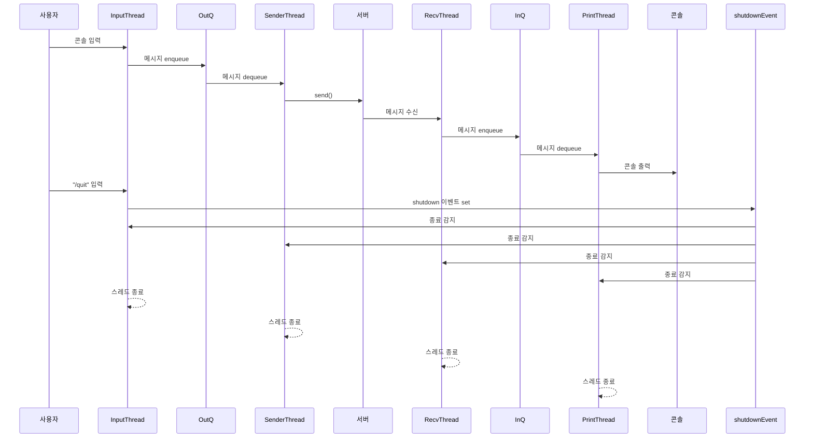
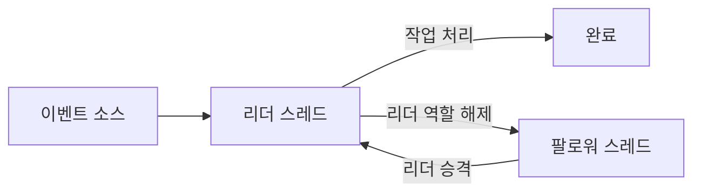

# 5주차: Win32 스레드 프로그래밍 3 - 고급 동기화 기법 1
  
## 1. 흐름 제어(Flow Control) 개념
스레드 프로그래밍에서 **흐름 제어(Flow Control)** 는 여러 스레드가 동시에 실행될 때 작업의 **실행 순서, 속도, 동기화 방식**을 조절하는 개념을 말한다.

### 1.1 흐름 제어의 필요성
멀티스레드 환경에서는 다음과 같은 문제가 발생할 수 있다.

* **경쟁 조건(Race Condition)**: 두 스레드가 동시에 공유 자원에 접근할 때 잘못된 값이 발생
* **교착 상태(Deadlock)**: 스레드들이 서로 자원을 기다리며 무한 대기
* **기아 상태(Starvation)**: 특정 스레드가 우선순위나 스케줄링 때문에 실행 기회를 얻지 못함
* **속도 불균형**: 어떤 스레드는 너무 빨리, 어떤 스레드는 너무 느리게 실행되어 시스템 병목이 발생

#### 경쟁 조건 (Race Condition) 예시
* 온라인 게임 클라이언트에서 **캐릭터의 HP(체력) 값**을 관리한다고 하자.
* 한 스레드는 **네트워크 수신 스레드**에서 "몬스터에게 공격당함 → HP -10" 패킷을 처리하고,
* 동시에 다른 스레드는 **UI 렌더링 스레드**에서 "체력 회복 아이템 사용 → HP +20" 이벤트를 적용하려고 한다.
* 만약 이 두 연산이 동기화 없이 동시에 실행되면, 결과가 덮어쓰기 되어 **HP 값이 -10 또는 +20 중 하나만 반영**되는 잘못된 결과가 나온다.

👉 **문제:** 플레이어의 HP가 실제와 다르게 잘못 표시되거나, 서버와 클라이언트 동기화가 깨져서 치명적인 버그 발생.
  
```cpp
#include <windows.h>
#include <thread>
#include <iostream>

int playerHP = 100;

void DamageThread() {
    for (int i = 0; i < 1000; i++) {
        playerHP -= 10; // 몬스터 공격
    }
}

void HealThread() {
    for (int i = 0; i < 1000; i++) {
        playerHP += 10; // 포션 사용
    }
}

int main() {
    std::thread t1(DamageThread);
    std::thread t2(HealThread);

    t1.join();
    t2.join();

    std::cout << "Final HP = " << playerHP << std::endl;
    // 예상: 100이어야 하지만 Race Condition으로 다른 값이 나올 수 있음
    return 0;
}

```  
  

#### 2. 교착 상태 (Deadlock) 예시
* 온라인 게임 클라이언트에서 **인벤토리 관리**와 **아이템 퀵슬롯 업데이트**를 서로 다른 락으로 보호한다고 하자.
* 스레드 A: 인벤토리 락을 먼저 잡고, 그 후 퀵슬롯 락을 잡으려 한다.
* 스레드 B: 퀵슬롯 락을 먼저 잡고, 그 후 인벤토리 락을 잡으려 한다.
* 두 스레드가 서로 반대 순서로 락을 기다리면서 **영원히 풀리지 않는 교착 상태**가 발생한다.

👉 **문제:** 인벤토리나 퀵슬롯 UI가 멈춰버려 사용자가 게임을 정상적으로 플레이할 수 없음.
  
```cpp
#include <windows.h>
#include <thread>
#include <iostream>

CRITICAL_SECTION inventoryLock;
CRITICAL_SECTION quickslotLock;

void ThreadA() {
    EnterCriticalSection(&inventoryLock);
    Sleep(10); // 락을 오래 쥐고 있음
    EnterCriticalSection(&quickslotLock);

    std::cout << "Thread A finished" << std::endl;

    LeaveCriticalSection(&quickslotLock);
    LeaveCriticalSection(&inventoryLock);
}

void ThreadB() {
    EnterCriticalSection(&quickslotLock);
    Sleep(10); // 락을 오래 쥐고 있음
    EnterCriticalSection(&inventoryLock);

    std::cout << "Thread B finished" << std::endl;

    LeaveCriticalSection(&inventoryLock);
    LeaveCriticalSection(&quickslotLock);
}

int main() {
    InitializeCriticalSection(&inventoryLock);
    InitializeCriticalSection(&quickslotLock);

    std::thread t1(ThreadA);
    std::thread t2(ThreadB);

    t1.join();
    t2.join();

    DeleteCriticalSection(&inventoryLock);
    DeleteCriticalSection(&quickslotLock);
    return 0;
}

```  
  
#### 3. 기아 상태 (Starvation) 예시
* 게임 클라이언트에서 **리소스 로딩 스레드**와 **UI 이벤트 처리 스레드**가 있다고 하자.
* 만약 스케줄러가 우선순위를 리소스 로딩 스레드에 높게 주고, 이 스레드가 끊임없이 대량의 리소스를 읽는다면,
* 낮은 우선순위를 가진 UI 이벤트 처리 스레드는 실행 기회를 거의 얻지 못한다.
* 그 결과, 사용자가 **버튼 클릭, 메뉴 이동 등 UI 입력을 했는데 반응이 거의 없는 상태**가 된다.

👉 **문제:** 게임은 실행 중이지만 유저 인터페이스가 멈춘 것처럼 보여, 플레이 경험이 크게 악화된다.
  
```cpp
#include <windows.h>
#include <thread>
#include <iostream>

bool running = true;

DWORD WINAPI HighPriorityThread(LPVOID) {
    while (running) {
        // CPU 점유
    }
    return 0;
}

DWORD WINAPI LowPriorityThread(LPVOID) {
    while (running) {
        std::cout << "Low priority thread executed" << std::endl;
        Sleep(100); // 실행 기회가 적음
    }
    return 0;
}

int main() {
    HANDLE hHigh = CreateThread(NULL, 0, HighPriorityThread, NULL, 0, NULL);
    HANDLE hLow = CreateThread(NULL, 0, LowPriorityThread, NULL, 0, NULL);

    SetThreadPriority(hHigh, THREAD_PRIORITY_HIGHEST);
    SetThreadPriority(hLow, THREAD_PRIORITY_LOWEST);

    Sleep(2000); // 실행 후 잠시 대기
    running = false;

    WaitForSingleObject(hHigh, INFINITE);
    WaitForSingleObject(hLow, INFINITE);
    return 0;
}

```  

#### 4. 속도 불균형 (Throughput Imbalance) 예시
* 온라인 게임에서 **네트워크 수신 스레드**는 초당 수백 개의 패킷을 빠르게 처리하지만,
* **렌더링 스레드**가 이를 따라가지 못해 **프레임 드랍(FPS 하락)** 이 발생한다고 하자.
* 예를 들어 채팅 패킷이 폭주하거나 대규모 전투 이벤트가 발생할 때, 네트워크는 정상적으로 데이터를 받아오지만,
* 렌더링 스레드가 UI 업데이트를 제때 못 해서 **채팅창이 밀리거나 화면 반응이 늦는 현상**이 생긴다.

👉 **문제:** 클라이언트의 전체 성능이 특정 스레드 병목에 의해 떨어지고, 플레이어는 "렉이 걸린다"고 느낀다.

```cpp
#include <windows.h>
#include <thread>
#include <queue>
#include <mutex>
#include <iostream>

std::queue<int> networkPackets;
std::mutex mtx;
bool running = true;

void NetworkThread() {
    int counter = 0;
    while (running) {
        std::lock_guard<std::mutex> lock(mtx);
        networkPackets.push(counter++);
        Sleep(1); // 매우 빠르게 패킷 생성
    }
}

void RenderThread() {
    while (running) {
        std::lock_guard<std::mutex> lock(mtx);
        if (!networkPackets.empty()) {
            std::cout << "Render consumes packet " << networkPackets.front() << std::endl;
            networkPackets.pop();
        }
        Sleep(50); // 렌더링 속도가 훨씬 느림
    }
}

int main() {
    std::thread t1(NetworkThread);
    std::thread t2(RenderThread);

    Sleep(2000); // 실행
    running = false;

    t1.join();
    t2.join();
    return 0;
}
```  

>> 속도 불균형 문제의 핵심 해결책은 생산자-소비자 간 균형을 맞추는 것이다.
>> Backpressure: 큐 크기 제한, 중요 패킷만 유지
>> Batching/Coalescing: 여러 패킷을 묶거나 최신 상태만 반영
>> Async Decoupling: 네트워크 처리와 렌더링을 분리
>> Load Balancing: 멀티스레드/멀티코어 활용
>> Rate Limiting: 생산 속도를 소비자 속도에 맞춤
  


이런 문제를 예방하고 효율적인 협업을 위해 흐름 제어가 필요하다.


### 1.2 흐름 제어의 주요 메커니즘

#### (1) 동기화(Synchronization)
* **목적**: 공유 자원 접근 시 데이터 무결성을 보장
* **도구**: `Critical Section`, `Mutex`, `Semaphore`, `Event`
* **예시**: 생산자-소비자 패턴에서 큐에 push/pop 할 때 동기화 
   
  
#### (2) 신호(Signaling)
* **목적**: 스레드 간 작업 순서를 맞춤
* **도구**: `Event`, `Condition Variable`
* **예시**: "생산자가 데이터를 넣으면 → 소비자에게 신호 보내서 처리 시작"
     

#### (3) 스케줄링(Scheduling)
* **목적**: 어떤 스레드가 언제 실행될지 결정
* **도구**: OS 스케줄러, `Sleep`, 우선순위 설정
* **예시**: 렌더링 스레드는 16ms마다 실행되도록 조정
     

#### (4) 속도 조절(Rate Limiting / Throttling)
* **목적**: 과도한 작업 실행을 막고 균형 유지
* **도구**: 큐 버퍼 크기 제한, 세마포어
* **예시**: 네트워크 패킷 수신 속도가 너무 빠르면 버퍼를 제한하여 소비 스레드가 따라올 수 있도록 제어
     

#### (5) 파이프라인 제어(Pipeline Flow Control)
* **목적**: 여러 단계로 분리된 작업 흐름에서 병목 방지
* **도구**: 단계별 큐, 이벤트, 세마포어
* **예시**: 리소스 로드 → 디코딩 → 렌더링 단계에서 앞 단계가 너무 빨라서 뒷단계가 처리 불가하면 흐름을 멈춤
     

  
### 1.3 게임 개발에서 흐름 제어 활용 예시
* **네트워크 패킷 처리**
  * 서버에서 오는 패킷은 매우 빠름
  * 게임 로직 스레드가 모두 처리하지 못하면 버퍼 오버플로우 발생
  * 따라서 **큐 크기 제한 + 이벤트 신호**로 흐름 제어

* **애니메이션 파이프라인**
  * Stage1(모델 로딩) → Stage2(애니메이션 계산) → Stage3(렌더링)
  * Stage2가 느려지면 Stage1에서 데이터를 제한해야 전체 프레임 유지

* **멀티코어 AI 연산**
  * 여러 AI 스레드가 동시에 경로 탐색(Pathfinding)을 수행
  * 중앙 큐에서 요청을 분배하고, 세마포어로 "한 번에 몇 개까지 실행 가능"을 제한

### 1.4 요약
* **흐름 제어(Flow Control)** = 스레드 간 실행 속도, 순서, 자원 사용을 조절하는 메커니즘
* 주요 도구: **Critical Section, Mutex, Semaphore, Event, Condition Variable**
* 게임 개발에서는 **네트워크 처리, 렌더링 파이프라인, AI 계산** 등에서 핵심적으로 활용


### 1.5 실습: 세마포어로 작업 속도를 제어(Rate Limiting)  
  
```cpp  
#include <windows.h>
#include <iostream>
#include <queue>
#include <string>
#include <process.h> // _beginthreadex, _endthreadex

// =================================================================
// 전역 변수 및 동기화 객체
// =================================================================

// 작업을 저장할 공유 큐
std::queue<std::string> g_taskQueue;

// 공유 큐에 대한 접근을 동기화하기 위한 크리티컬 섹션
CRITICAL_SECTION g_cs;

// 처리 가능한 작업의 최대 개수를 제한하는 세마포어
// 이 세마포어가 Rate Limiting의 핵심 역할을 합니다.
HANDLE g_hSemaphore;

// 스레드 종료를 알리기 위한 플래그
volatile bool g_bIsRunning = true;

// 버퍼(큐)의 최대 크기. 세마포어의 최대 카운트와 동일하게 설정합니다.
const int MAX_BUFFER_SIZE = 5;


// =================================================================
// 스레드 함수
// =================================================================

/**
 * @brief 작업 생성자(Producer) 스레드 함수
 * 빠르게 작업을 생성하여 큐에 추가합니다.
 * @param pParam 스레드에 전달되는 인자 (사용 안 함)
 * @return 스레드 종료 코드
 */
unsigned int __stdcall ProducerThread(void* pParam)
{
    int taskCount = 0;

    while (taskCount < 20)
    {
        // 1. 세마포어를 기다립니다.
        //    만약 세마포어 카운트가 0이면 (즉, 큐가 꽉 찼으면)
        //    Consumer가 작업을 처리하고 세마포어를 해제할 때까지 여기서 대기합니다.
        // 카운트 > 0 이면: 세마포어는 즉시 카운트를 1 감소시키고 함수를 리턴합니다. 스레드는 대기 없이 다음 코드를 실행합니다.
        // 카운트 == 0 이면: 스레드는 카운트가 0보다 커질 때까지(즉, 다른 스레드가 ReleaseSemaphore를 호출할 때까지) 무한정 대기(block)합니다.
        WaitForSingleObject(g_hSemaphore, INFINITE);

        // 2. 크리티컬 섹션을 통해 큐에 대한 접근을 보호합니다.
        EnterCriticalSection(&g_cs);

        // 작업 생성
        taskCount++;
        std::string task = "작업 " + std::to_string(taskCount);
        g_taskQueue.push(task);
        std::cout << "[생성] " << task << " (현재 큐 크기: " << g_taskQueue.size() << ")" << std::endl;

        // 3. 크리티컬 섹션 해제
        LeaveCriticalSection(&g_cs);

        // 빠른 작업 생성을 시뮬레이션하기 위해 짧은 시간 대기
        Sleep(100);
    }

    // 작업 생성이 완료되면 Consumer 스레드 종료를 위해 플래그 설정
    g_bIsRunning = false;
    std::cout << "\n--- 모든 작업 생성 완료 ---\n" << std::endl;
    return 0;
}

/**
 * @brief 작업 소비자(Consumer) 스레드 함수
 * 큐에서 작업을 가져와 느리게 처리합니다.
 * @param pParam 스레드에 전달되는 인자 (사용 안 함)
 * @return 스레드 종료 코드
 */
unsigned int __stdcall ConsumerThread(void* pParam)
{
    while (g_bIsRunning || !g_taskQueue.empty())
    {
        std::string task;
        bool hasTask = false;

        // 1. 크리티컬 섹션을 통해 큐에 대한 접근을 보호합니다.
        EnterCriticalSection(&g_cs);

        if (!g_taskQueue.empty())
        {
            task = g_taskQueue.front();
            g_taskQueue.pop();
            hasTask = true;
        }

        // 2. 크리티컬 섹션 해제
        LeaveCriticalSection(&g_cs);


        if (hasTask)
        {
            std::cout << "    [처리] " << task << " 시작..." << std::endl;

            // 느린 작업 처리를 시뮬레이션하기 위해 긴 시간 대기
            Sleep(500);

            std::cout << "    [처리] " << task << " 완료!" << std::endl;


            // 3. 작업 처리가 끝났음을 알리고, 비어있는 슬롯이 생겼음을 세마포어에 알립니다.
            //    이 호출로 인해 세마포어 카운트가 1 증가하고,
            //    Producer 스레드가 대기 중이었다면 다시 작업을 생성할 수 있게 됩니다.
            ReleaseSemaphore(g_hSemaphore, 1, NULL);
        }
        else
        {
            // 처리할 작업이 없으면 잠시 대기
            Sleep(10);
        }
    }
    return 0;
}


// =================================================================
// Main 함수
// =================================================================

int main()
{
    HANDLE hThreads[2];
    unsigned int threadID;

    // 1. 동기화 객체 초기화
    InitializeCriticalSection(&g_cs);

    // 세마포어 생성
    // 초기 카운트: MAX_BUFFER_SIZE (처음에는 버퍼가 비어있으므로 최대치만큼 작업 생성 가능)
    // 최대 카운트: MAX_BUFFER_SIZE (버퍼의 최대 크기)
    g_hSemaphore = CreateSemaphore(
        NULL,            // 기본 보안 속성
        MAX_BUFFER_SIZE, // 초기 카운트
        MAX_BUFFER_SIZE, // 최대 카운트
        NULL             // 이름 없는 세마포어
    );

    if (g_hSemaphore == NULL)
    {
        std::cerr << "세마포어 생성 실패: " << GetLastError() << std::endl;
        return 1;
    }

    std::cout << "--- 세마포어를 이용한 속도 제어(Rate Limiting) 시뮬레이션 시작 ---" << std::endl;
    std::cout << "최대 버퍼 크기: " << MAX_BUFFER_SIZE << std::endl << std::endl;

    // 2. 스레드 생성
    hThreads[0] = (HANDLE)_beginthreadex(NULL, 0, &ProducerThread, NULL, 0, &threadID);
    hThreads[1] = (HANDLE)_beginthreadex(NULL, 0, &ConsumerThread, NULL, 0, &threadID);

    // 3. 모든 스레드가 종료될 때까지 대기
    WaitForMultipleObjects(2, hThreads, TRUE, INFINITE);

    std::cout << "\n--- 모든 작업 처리 완료. 프로그램 종료. ---" << std::endl;

    // 4. 리소스 해제
    CloseHandle(hThreads[0]);
    CloseHandle(hThreads[1]);
    CloseHandle(g_hSemaphore);
    DeleteCriticalSection(&g_cs);

    return 0;
}
```

</br>  
</br>  
  
## 2. 흐름 제어 - 멀티스레드 패턴들
흐름 제어가 필요한 대표적인 상황들:
- **생산자-소비자 패턴**: 데이터를 생성하는 스레드와 소비하는 스레드 간의 속도 조절
- **리더-팔로워 패턴**: 여러 스레드 중 하나만 리더가 되어 작업을 수행
- **파이프라인 처리**: 여러 단계의 작업을 순차적으로 처리


### 2.1 생산자-소비자 패턴 (Producer-Consumer)
* **개념**: 데이터를 생성하는 스레드(생산자)와 데이터를 처리하는 스레드(소비자)가 서로 협력하는 구조다.
* **문제**: 생산 속도와 소비 속도가 다를 수 있기 때문에 **버퍼(큐)** 를 두어 균형을 맞춘다.
* **동기화 도구**: `CriticalSection`으로 큐 접근 보호, `Event`로 대기/신호 처리.
 


#### 실습: 생산자-소비자 패턴

```cpp
#include <windows.h>
#include <process.h>
#include <queue>
#include <iostream>

CRITICAL_SECTION cs;
HANDLE hEvent;
std::queue<int> buffer;

unsigned __stdcall Producer(void*) {
    for (int i = 0; i < 5; i++) {
        Sleep(500); // 생산 지연
        
        EnterCriticalSection(&cs);
        buffer.push(i);
        std::cout << "Produced: " << i << std::endl;
        LeaveCriticalSection(&cs);
        
        SetEvent(hEvent); // 소비자 깨우기
    }

    return 0;
}

unsigned __stdcall Consumer(void*) {
    while (true) {
        // Producer가 아이템을 하나 이상 넣었다는 신호를 기다림
        WaitForSingleObject(hEvent, INFINITE);

        // 깨어났으면, 큐가 완전히 빌 때까지 모든 아이템을 소비
        EnterCriticalSection(&cs);
        while (!buffer.empty()) { // 큐가 비어있지 않은 동안 반복
            int data = buffer.front();
            buffer.pop();
            std::cout << "Consumed: " << data << std::endl;
        }
        LeaveCriticalSection(&cs);
    }
    return 0;
}
/*
unsigned __stdcall Consumer(void*) {
    while (true) {
        WaitForSingleObject(hEvent, INFINITE);

        EnterCriticalSection(&cs);

        if (!buffer.empty()) {

            int data = buffer.front();

            buffer.pop();

            std::cout << "Consumed: " << data << std::endl;

        }

        LeaveCriticalSection(&cs);

    }

    return 0;
}
*/

int main() 
{
    InitializeCriticalSection(&cs);
    hEvent = CreateEvent(NULL, FALSE, FALSE, NULL);

    _beginthreadex(NULL, 0, Producer, NULL, 0, NULL);
    _beginthreadex(NULL, 0, Consumer, NULL, 0, NULL);

    Sleep(5000);
    return 0;
}
```
  
[문제 해결 설명](https://docs.google.com/document/d/e/2PACX-1vRuffkZXgyAnXzcceW0D_fZZZ2xowB9q-9gyRthOG0tGDrjMfmPQrW_FuqEvtKzVGlVUNC1bf5U0vBa/pub  )  
  
 
 
#### 게임에서 활용 예시: 채팅 메시지 처리
* 네트워크 스레드(생산자)가 메시지를 큐에 쌓고,
* 게임 로직 스레드(소비자)가 큐에서 꺼내 화면에 출력한다.


##### 프로그램 흐름 개요

```plaintext
 ┌──────────────┐
 │   main.cpp   │
 └──────┬───────┘
        │
        ▼
 ┌───────────────────┐
 │   ChatClient.run  │
 └──────┬────────────┘
        │  (스레드 4개 생성)
        │
   ┌────┼─────┬─────┬─────┐
   ▼    ▼     ▼     ▼
Input  Sender Recv  Printer
Thread Thread Thread Thread
```

##### 내부 처리 흐름 (메시지 전송 경로)

```plaintext
   [콘솔 입력]
        │
        ▼
 ┌──────────────────┐
 │ InputThread      │
 │ (생산자)          │
 └─────┬────────────┘
       │ enqueue
       ▼
 ┌──────────────────┐
 │ OutQ (RingQueue) │
 └─────┬────────────┘
       │ dequeue
       ▼
 ┌──────────────────┐
 │ SenderThread     │
 │ (소비자)          │
 └─────┬────────────┘
       │ send()
       ▼
   [서버 전송]
```


##### 내부 처리 흐름 (메시지 수신 경로)

```plaintext
   [서버 수신 데이터]
        │
        ▼
 ┌──────────────────┐
 │ RecvThread       │
 │ (생산자)          │
 └─────┬────────────┘
       │ enqueue
       ▼
 ┌──────────────────┐
 │ InQ (RingQueue)  │
 └─────┬────────────┘
       │ dequeue
       ▼
 ┌──────────────────┐
 │ PrintThread      │
 │ (소비자)          │
 └─────┬────────────┘
       ▼
   [콘솔 출력]
```


##### 종료 흐름

```plaintext
사용자가 "/quit" 입력
         │
         ▼
 InputThread → shutdown Event set
         │
         ▼
 모든 스레드 WaitForMultipleObjects로
 shutdown 감지 → 안전하게 종료
```
  
  
* **두 개의 RingQueue**(`outQ`, `inQ`)가 중심
* `InputThread`와 `SenderThread`가 **출력 경로(생산자→소비자)**
* `RecvThread`와 `PrintThread`가 **입력 경로(생산자→소비자)**
* 종료는 **shutdown 이벤트**로 모든 스레드에 동시에 전달
  
  



### 2.2 리더-팔로워 패턴 (Leader-Follower)
리더-팔로워 패턴의 핵심 아이디어는 여러 스레드가 동시에 이벤트를 기다리면서 발생하는 비효율(Thundering Herd Problem)을 막는 것이다.  
오직 하나의 '리더' 스레드만이 이벤트를 기다리고, 나머지 '팔로워' 스레드들은 리더가 될 차례를 기다린다.  
  
* **개념**: 여러 스레드가 대기하다가, **오직 하나의 리더**가 이벤트를 처리한다.
* **장점**: 스레드 풀 내에서 부담 분산, 경합 줄임.

#### ASCII 그림

```
[Thread Pool]
   |    |    |
  [L]  [F]  [F]   --> 이벤트 발생 --> 리더 처리
         ^   
         | (리더 역할 교체)
```

#### Mermaid 다이어그램



#### 실습: 리더-팔로워 패턴
- 리더: 뮤텍스(g_hLeaderMutex)를 획득한 스레드이다. 리더만이 작업 큐에 새 작업이 들어오기를 기다립니다(g_hTaskSemaphore).  
- 팔로워: 뮤텍스를 획득하지 못하고 대기 중인 스레드들이다.  
- 작업 흐름:  
    - 리더가 새 작업을 감지하면, 즉시 팔로워 중 하나에게 리더 자리를 넘겨준다(뮤텍스 해제).
    - 새로운 리더는 다음 작업을 기다리기 시작한다.
    - 기존 리더는 자신이 감지했던 작업을 처리한 후, 다시 팔로워가 되어 리더 자리를 기다린다.

```cpp
#include <windows.h>
#include <iostream>
#include <queue>
#include <string>
#include <vector>
#include <process.h> // _beginthreadex, _endthreadex

// =================================================================
// 전역 변수 및 동기화 객체
// =================================================================

// 작업을 저장할 공유 큐
std::queue<std::string> g_taskQueue;

// 공유 큐 접근을 동기화하기 위한 크리티컬 섹션
CRITICAL_SECTION g_csQueue;

// 리더 스레드를 선출하기 위한 오토-리셋 이벤트
// 이 이벤트를 통과한 스레드가 '리더'가 됩니다.
HANDLE g_hLeaderElectionEvent;

// 새로운 작업이 추가되었음을 알리는 세마포어
// 리더 스레드만이 이 세마포어를 기다립니다.
HANDLE g_hTaskSemaphore;

// 스레드 종료를 알리기 위한 플래그
volatile bool g_bIsRunning = true;

// 작업자(리더/팔로워) 스레드의 수
const int NUM_WORKER_THREADS = 4;


// =================================================================
// 스레드 함수
// =================================================================

/**
 * @brief 작업 생성자(Producer) 스레드 함수
 * 주기적으로 작업을 생성하여 큐에 추가하고 세마포어를 통해 알립니다.
 * @param pParam 스레드에 전달되는 인자 (사용 안 함)
 * @return 스레드 종료 코드
 */
unsigned int __stdcall ProducerThread(void* pParam)
{
    for (int i = 1; i <= 15; ++i)
    {
        // 1. 큐를 잠그고 작업을 추가합니다.
        EnterCriticalSection(&g_csQueue);
        std::string task = "작업 " + std::to_string(i);
        g_taskQueue.push(task);
        std::cout << "[생성] " << task << " (현재 큐 크기: " << g_taskQueue.size() << ")" << std::endl;
        LeaveCriticalSection(&g_csQueue);

        // 2. 세마포어 카운트를 1 증가시켜 대기 중인 리더 스레드에게 새 작업이 있음을 알립니다.
        ReleaseSemaphore(g_hTaskSemaphore, 1, NULL);

        // 작업을 주기적으로 생성하기 위해 잠시 대기
        Sleep(500);
    }

    g_bIsRunning = false;
    std::cout << "\n--- 모든 작업 생성 완료. 워커 스레드 종료 신호 전송 ---\n" << std::endl;

    // 종료 신호를 받은 워커 스레드들이 세마포어 대기 상태에서 빠져나올 수 있도록 처리
    ReleaseSemaphore(g_hTaskSemaphore, NUM_WORKER_THREADS, NULL);

    return 0;
}

/**
 * @brief 작업자(Worker) 스레드 함수 (리더 또는 팔로워 역할 수행)
 * @param pParam 스레드 ID
 * @return 스레드 종료 코드
 */
unsigned int __stdcall WorkerThread(void* pParam)
{
    DWORD threadId = GetCurrentThreadId();

    while (true) // 메인 루프. 종료 조건은 리더로 선출된 직후 확인합니다.
    {
        printf("스레드 %lu: 리더가 되기 위해 대기 중 (팔로워 상태)...\n", threadId);

        // 1. 리더로 선출되기 위해 이벤트를 기다립니다.
        //    오토-리셋 이벤트이므로, 오직 하나의 스레드만 통과합니다.
        WaitForSingleObject(g_hLeaderElectionEvent, INFINITE);

        // 2. 리더가 된 직후, 종료 플래그를 확인합니다.
        if (!g_bIsRunning) {
            // 다른 대기 중인 스레드도 종료될 수 있도록 이벤트를 다시 활성화합니다.
            SetEvent(g_hLeaderElectionEvent);
            break; // 루프를 탈출하여 스레드 종료
        }

        printf("스레드 %lu: [리더]가 됨. 새 작업을 기다립니다.\n", threadId);

        // 3. 리더는 새 작업이 도착하기를 기다립니다. (세마포어 대기)
        WaitForSingleObject(g_hTaskSemaphore, INFINITE);

        // 4. 작업이 감지되면, 즉시 다른 팔로워에게 리더 자리를 넘겨줍니다.
        //    이것이 패턴의 핵심으로, 시스템이 현재 작업을 처리하는 동안에도
        //    새로운 리더가 다음 이벤트를 기다릴 수 있게 합니다.
        printf("스레드 %lu: [리더] 새 작업 감지! 다른 스레드에게 리더 역할을 위임합니다.\n", threadId);
        SetEvent(g_hLeaderElectionEvent);


        std::string task;
        bool hasTask = false;

        // 5. 이제 리더가 아니므로, 할당된 작업을 처리합니다.
        EnterCriticalSection(&g_csQueue);
        if (!g_taskQueue.empty())
        {
            task = g_taskQueue.front();
            g_taskQueue.pop();
            hasTask = true;
        }
        LeaveCriticalSection(&g_csQueue);

        if (hasTask)
        {
            printf("    스레드 %lu: '%s' 처리 시작...\n", threadId, task.c_str());
            Sleep(1000); // 작업 처리 시뮬레이션
            printf("    스레드 %lu: '%s' 처리 완료!\n", threadId, task.c_str());
        }
    }

    printf("스레드 %lu: 종료합니다.\n", threadId);
    return 0;
}


// =================================================================
// Main 함수
// =================================================================

int main()
{
    std::vector<HANDLE> hWorkers(NUM_WORKER_THREADS);
    unsigned int threadID;

    // 1. 동기화 객체 초기화
    InitializeCriticalSection(&g_csQueue);

    // 리더 선출을 위한 오토-리셋 이벤트 생성
    // bManualReset = FALSE (자동 리셋), bInitialState = TRUE (초기 신호 상태)
    // 초기 상태가 TRUE이므로, 시작하자마자 스레드 중 하나가 리더가 될 수 있습니다.
    g_hLeaderElectionEvent = CreateEvent(NULL, FALSE, TRUE, NULL);

    // 세마포어 생성 (초기 카운트: 0)
    // 처음에는 작업이 없으므로 리더가 바로 대기 상태에 들어가야 합니다.
    g_hTaskSemaphore = CreateSemaphore(NULL, 0, NUM_WORKER_THREADS + 1, NULL);

    std::cout << "--- 리더-팔로워 패턴 (Mutex-Free) 시뮬레이션 시작 ---" << std::endl;
    std::cout << "워커 스레드 수: " << NUM_WORKER_THREADS << std::endl << std::endl;

    // 2. 워커 스레드들 생성
    for (int i = 0; i < NUM_WORKER_THREADS; ++i)
    {
        hWorkers[i] = (HANDLE)_beginthreadex(NULL, 0, &WorkerThread, NULL, 0, &threadID);
    }

    // 3. 프로듀서 스레드 생성
    HANDLE hProducer = (HANDLE)_beginthreadex(NULL, 0, &ProducerThread, NULL, 0, &threadID);

    // 4. 모든 스레드가 종료될 때까지 대기
    WaitForSingleObject(hProducer, INFINITE);
    WaitForMultipleObjects(NUM_WORKER_THREADS, hWorkers.data(), TRUE, INFINITE);

    std::cout << "\n--- 모든 작업 처리 완료. 프로그램 종료. ---" << std::endl;

    // 5. 리소스 해제
    CloseHandle(hProducer);
    for (int i = 0; i < NUM_WORKER_THREADS; ++i)
    {
        CloseHandle(hWorkers[i]);
    }
    CloseHandle(g_hLeaderElectionEvent);
    CloseHandle(g_hTaskSemaphore);
    DeleteCriticalSection(&g_csQueue);

    return 0;
}
```
  
  
### 2.3 파이프라인 처리 (Pipeline Processing)
* **개념**: 데이터를 여러 단계로 나누어, 각 단계마다 다른 스레드가 처리한다.
* **장점**: 병렬 처리로 전체 처리량 증가.

```
[Stage1: Load] --> [Stage2: Decode] --> [Stage3: Render]
```


#### 실습: 파이프라인 처리
  
```cpp
#include <windows.h>
#include <process.h>
#include <queue>
#include <iostream>

CRITICAL_SECTION cs1, cs2;
std::queue<int> q1, q2;
HANDLE ev1, ev2;

unsigned __stdcall Stage1(void*) {
    for (int i = 0; i < 5; i++) {
        Sleep(300);
        EnterCriticalSection(&cs1);
        q1.push(i);
        std::cout << "Stage1: " << i << std::endl;
        LeaveCriticalSection(&cs1);
        SetEvent(ev1);
    }
    return 0;
}

unsigned __stdcall Stage2(void*) {
    while (true) {
        WaitForSingleObject(ev1, INFINITE);
        EnterCriticalSection(&cs1);
        if (!q1.empty()) {
            int d = q1.front(); q1.pop();
            LeaveCriticalSection(&cs1);
            d *= 2; // 처리
            EnterCriticalSection(&cs2);
            q2.push(d);
            std::cout << "Stage2: " << d << std::endl;
            LeaveCriticalSection(&cs2);
            SetEvent(ev2);
        } else {
            LeaveCriticalSection(&cs1);
        }
    }
    return 0;
}

unsigned __stdcall Stage3(void*) {
    while (true) {
        WaitForSingleObject(ev2, INFINITE);
        EnterCriticalSection(&cs2);
        if (!q2.empty()) {
            int d = q2.front(); q2.pop();
            std::cout << "Stage3: " << d << std::endl;
        }
        LeaveCriticalSection(&cs2);
    }
    return 0;
}

int main() {
    InitializeCriticalSection(&cs1);
    InitializeCriticalSection(&cs2);
    ev1 = CreateEvent(NULL, FALSE, FALSE, NULL);
    ev2 = CreateEvent(NULL, FALSE, FALSE, NULL);

    _beginthreadex(NULL, 0, Stage1, NULL, 0, NULL);
    _beginthreadex(NULL, 0, Stage2, NULL, 0, NULL);
    _beginthreadex(NULL, 0, Stage3, NULL, 0, NULL);

    Sleep(5000);
    return 0;
}
```

#### 게임에서 활용 예시
* **애니메이션 파이프라인**:
  * Stage1: 리소스 로드
  * Stage2: 스켈레톤 변환 처리
  * Stage3: 최종 렌더링

  

### 요약
* **생산자-소비자**는 **속도 차이를 버퍼로 해결**
* **리더-팔로워**는 **스레드 풀에서 리더를 선출해 부하 분산**
* **파이프라인 처리**는 **작업 단계를 나눠 병렬 처리**

</br>  
</br>  
  
## 3. Interlocked 함수들 ( **중요** )
Interlocked 함수는 원자적(atomic) 연산을 제공하여 **락 없이도 스레드 안전한 연산을 수행할 수 있게 한다.**     
이는 성능상 매우 유리하며, 간단한 동기화에 적합하다.   
  
### 주요 Interlocked 함수들

```cpp
// InterlockedIncrement / InterlockedDecrement
LONG InterlockedIncrement(LONG volatile* Addend);
LONG InterlockedDecrement(LONG volatile* Addend);

// InterlockedExchange
LONG InterlockedExchange(LONG volatile* Target, LONG Value);

// InterlockedCompareExchange (CAS - Compare And Swap)
LONG InterlockedCompareExchange(
    LONG volatile* Destination,
    LONG Exchange,
    LONG Comparand
);

// InterlockedAdd
LONG InterlockedAdd(LONG volatile* Addend, LONG Value);

// InterlockedExchangePointer
PVOID InterlockedExchangePointer(
    PVOID volatile* Target,
    PVOID Value
);


// 64비트 버전
LONGLONG InterlockedIncrement64(LONGLONG volatile* Addend);
LONGLONG InterlockedDecrement64(LONGLONG volatile* Addend);
LONGLONG InterlockedExchange64(LONGLONG volatile* Target, LONGLONG Value);
LONGLONG InterlockedCompareExchange64(
    LONGLONG volatile* Destination,
    LONGLONG Exchange,
    LONGLONG Comparand
);
LONGLONG InterlockedAdd64(LONGLONG volatile* Addend, LONGLONG Value);

// 포인터용 함수
PVOID InterlockedCompareExchangePointer(
    PVOID volatile* Destination,
    PVOID Exchange,
    PVOID Comparand
);

// 비트 연산
LONG InterlockedAnd(LONG volatile* Destination, LONG Value);
LONG InterlockedOr(LONG volatile* Destination, LONG Value);
LONG InterlockedXor(LONG volatile* Destination, LONG Value);

// 교체 후 덧셈
LONG InterlockedExchangeAdd(LONG volatile* Addend, LONG Value);

// 메모리 장벽
VOID MemoryBarrier();

```
  

### InterlockedIncrement / InterlockedDecrement

```cpp
LONG InterlockedIncrement(LONG volatile* Addend);
LONG InterlockedDecrement(LONG volatile* Addend);
```

* 공유 변수 값을 **원자적으로 1 증가 / 감소**한다.
* 반환값은 연산 후의 값이다.
* 스레드 카운터, 참조 카운트 등에서 자주 사용된다.

#### 간단한 예제

```cpp
#include <windows.h>
#include <iostream>

LONG g_counter = 0;

DWORD WINAPI ThreadProc(LPVOID) {
    for (int i = 0; i < 1000; i++) {
        InterlockedIncrement(&g_counter);
    }
    return 0;
}

int main() {
    HANDLE h1 = CreateThread(NULL, 0, ThreadProc, NULL, 0, NULL);
    HANDLE h2 = CreateThread(NULL, 0, ThreadProc, NULL, 0, NULL);

    WaitForSingleObject(h1, INFINITE);
    WaitForSingleObject(h2, INFINITE);

    std::cout << "Counter = " << g_counter << std::endl; // 2000 예상
    return 0;
}
```

  
### InterlockedExchange

```cpp
LONG InterlockedExchange(LONG volatile* Target, LONG Value);
```

* `*Target`을 `Value`로 원자적으로 교체한다.
* **교체하기 전의 값**을 반환한다.
* 스레드 간 플래그 변수 설정 등에 사용된다.

#### 간단한 예제

```cpp
LONG g_flag = 0;

void SetFlag() {
    LONG old = InterlockedExchange(&g_flag, 1);
    if (old == 0) {
        // 최초로 flag를 1로 만든 스레드
        printf("Flag set by this thread\n");
    }
}
```

---

### InterlockedCompareExchange (CAS - Compare And Swap)

```cpp
LONG InterlockedCompareExchange(
    LONG volatile* Destination,
    LONG Exchange,
    LONG Comparand
);
```

* `*Destination` 값이 `Comparand`와 같으면 `Exchange`로 교체한다.
* 반환값은 교체 **이전의 값**이다.
* 원자적 비교-교환(CAS) 연산으로, lock-free 알고리즘의 핵심이다.

#### 간단한 예제

```cpp
LONG g_value = 0;

void TryUpdateValue() {
    LONG expected = 0;
    LONG newValue = 123;

    LONG old = InterlockedCompareExchange(&g_value, newValue, expected);
    if (old == expected) {
        printf("Value updated to %ld\n", g_value);
    } else {
        printf("Failed, current value = %ld\n", old);
    }
}
```

---

### InterlockedAdd

```cpp
LONG InterlockedAdd(LONG volatile* Addend, LONG Value);
```

* `*Addend`에 `Value`를 원자적으로 더한다.
* 반환값은 연산 후의 값이다.
* 누적 합산, 가중치 계산 등에 사용된다.

#### 간단한 예제

```cpp
LONG g_total = 0;

void AddScore(LONG score) {
    LONG newTotal = InterlockedAdd(&g_total, score);
    printf("Total score = %ld\n", newTotal);
}
```

---

### InterlockedExchangePointer

```cpp
PVOID InterlockedExchangePointer(
    PVOID volatile* Target,
    PVOID Value
);
```

* 포인터를 원자적으로 교체한다.
* 반환값은 교체하기 전의 포인터다.
* 멀티스레드에서 포인터 교체 시 안전하게 사용된다.

#### 간단한 예제

```cpp
PVOID g_ptr = NULL;

void SetResource(void* newRes) {
    void* old = InterlockedExchangePointer(&g_ptr, newRes);
    if (old != NULL) {
        printf("Old resource released\n");
        // ReleaseResource(old); // 가정
    }
}
```


### InterlockedIncrement64 / InterlockedDecrement64

```cpp
LONGLONG InterlockedIncrement64(LONGLONG volatile* Addend);
LONGLONG InterlockedDecrement64(LONGLONG volatile* Addend);
```

* 64비트 정수를 원자적으로 **1 증가/감소**한다.
* 반환값: 연산 후 값.

#### 간단한 예제

```cpp
LONGLONG g_count64 = 0;

DWORD WINAPI ThreadProc(LPVOID) {
    for (int i = 0; i < 1000; i++) {
        InterlockedIncrement64(&g_count64);
    }
    return 0;
}

int main() {
    HANDLE h1 = CreateThread(NULL, 0, ThreadProc, NULL, 0, NULL);
    HANDLE h2 = CreateThread(NULL, 0, ThreadProc, NULL, 0, NULL);
    WaitForSingleObject(h1, INFINITE);
    WaitForSingleObject(h2, INFINITE);

    printf("Count64 = %lld\n", g_count64); // 2000 예상
}
```

---

### InterlockedExchange64

```cpp
LONGLONG InterlockedExchange64(LONGLONG volatile* Target, LONGLONG Value);
```

* `*Target`을 `Value`로 원자적으로 교체.
* 반환값: 교체 이전 값.

#### 간단한 예제

```cpp
LONGLONG g_value64 = 100;

void UpdateValue() {
    LONGLONG old = InterlockedExchange64(&g_value64, 999);
    printf("Old=%lld, New=%lld\n", old, g_value64);
}
```

---

### InterlockedCompareExchange64

```cpp
LONGLONG InterlockedCompareExchange64(
    LONGLONG volatile* Destination,
    LONGLONG Exchange,
    LONGLONG Comparand
);
```

* `*Destination == Comparand`이면 `Exchange`로 교체.
* 반환값: 교체 전 값.

#### 간단한 예제

```cpp
LONGLONG g_value64 = 0;

void CAS64() {
    LONGLONG old = InterlockedCompareExchange64(&g_value64, 111, 0);
    if (old == 0) printf("CAS success, new=%lld\n", g_value64);
    else printf("CAS failed, current=%lld\n", g_value64);
}
```


### InterlockedAdd64

```cpp
LONGLONG InterlockedAdd64(LONGLONG volatile* Addend, LONGLONG Value);
```

* `*Addend += Value` 원자적 덧셈.
* 반환값: 연산 후 값.

#### 간단한 예제

```cpp
LONGLONG g_sum64 = 0;

void Add64() {
    LONGLONG total = InterlockedAdd64(&g_sum64, 50);
    printf("Total = %lld\n", total);
}
```


### 포인터용 함수 InterlockedCompareExchangePointer

```cpp
PVOID InterlockedCompareExchangePointer(
    PVOID volatile* Destination,
    PVOID Exchange,
    PVOID Comparand
);
```

* `*Destination == Comparand`일 때 `Exchange`로 교체.
* 반환값: 교체 전 값.

#### 간단한 예제

```cpp
PVOID g_ptr = NULL;

void SetResource(void* newRes) {
    void* expected = NULL;
    void* old = InterlockedCompareExchangePointer(&g_ptr, newRes, expected);
    if (old == expected) {
        printf("Pointer set successfully\n");
    } else {
        printf("Already set by another thread\n");
    }
}
```
  

### 비트 연산 관련 InterlockedAnd

```cpp
LONG InterlockedAnd(LONG volatile* Destination, LONG Value);
```

* `*Destination &= Value` (원자적 AND).
* 반환값: 연산 전 값.

#### 간단한 예제

```cpp
LONG g_flags = 0xFF; // 11111111

void MaskFlag() {
    LONG old = InterlockedAnd(&g_flags, 0x0F); // 하위 4비트만 유지
    printf("Old=0x%X, New=0x%X\n", old, g_flags);
}
```

---

### 비트 연산 관련 InterlockedOr

```cpp
LONG InterlockedOr(LONG volatile* Destination, LONG Value);
```

* `*Destination |= Value` (원자적 OR).
* 반환값: 연산 전 값.

#### 간단한 예제

```cpp
LONG g_flags = 0x01;

void SetBit() {
    LONG old = InterlockedOr(&g_flags, 0x04);
    printf("Old=0x%X, New=0x%X\n", old, g_flags);
}
```

---

### 비트 연산 관련 InterlockedXor

```cpp
LONG InterlockedXor(LONG volatile* Destination, LONG Value);
```

* `*Destination ^= Value` (원자적 XOR).
* 반환값: 연산 전 값.

#### 간단한 예제

```cpp
LONG g_flags = 0x05; // 0101

void ToggleBit() {
    LONG old = InterlockedXor(&g_flags, 0x01);
    printf("Old=0x%X, New=0x%X\n", old, g_flags);
}
```


### 교체 후 덧셈 InterlockedExchangeAdd

```cpp
LONG InterlockedExchangeAdd(LONG volatile* Addend, LONG Value);
```

* `*Addend += Value` 수행.
* 반환값: 연산 **전** 값 (→ `InterlockedAdd`와 차이점).

#### 간단한 예제

```cpp
LONG g_total = 10;

void AddScore() {
    LONG old = InterlockedExchangeAdd(&g_total, 5);
    printf("Old=%ld, New=%ld\n", old, g_total); // Old=10, New=15
}
```


### 5-1. 메모리 장벽 MemoryBarrier

```cpp
VOID MemoryBarrier();
```

* CPU 명령 재정렬을 방지하는 **풀 펜스(full fence)**.
* 다중 CPU 코어 환경에서 lock-free 알고리즘의 일관성을 보장.

#### 간단한 예제

```cpp
LONG g_ready = 0;
int g_data = 0;

DWORD WINAPI Producer(LPVOID) {
    g_data = 42;
    MemoryBarrier();        // g_data 쓰기 완료 보장
    InterlockedExchange(&g_ready, 1);
    return 0;
}

DWORD WINAPI Consumer(LPVOID) {
    while (InterlockedCompareExchange(&g_ready, 1, 1) != 1) {
        Sleep(1);
    }
    MemoryBarrier();        // g_data 읽기 이전에 g_ready 반드시 확인
    printf("Received data = %d\n", g_data);
    return 0;
}
```


### 실습: Lock-Free 참조 카운팅

```cpp
#include <windows.h>
#include <iostream>
#include <vector>
#include <thread>

class RefCountedObject {
private:
    volatile LONG refCount;
    std::string data;
    
public:
    RefCountedObject(const std::string& str) : refCount(1), data(str) {
        std::cout << "Object created: " << data << std::endl;
    }
    
    void AddRef() {
        LONG newCount = InterlockedIncrement(&refCount);
        std::cout << "RefCount increased to: " << newCount 
                  << " [Thread: " << GetCurrentThreadId() << "]" << std::endl;
    }
    
    void Release() {
        LONG newCount = InterlockedDecrement(&refCount);
        std::cout << "RefCount decreased to: " << newCount 
                  << " [Thread: " << GetCurrentThreadId() << "]" << std::endl;
        
        if (newCount == 0) {
            delete this;
        }
    }
    
    LONG GetRefCount() const {
        // InterlockedCompareExchange를 사용한 안전한 읽기
        return InterlockedCompareExchange(
            const_cast<volatile LONG*>(&refCount), 0, 0);
    }
    
private:
    ~RefCountedObject() {
        std::cout << "Object destroyed: " << data << std::endl;
    }
};
``` 


### 실습: 스핀락 구현 예제

```cpp
#include <iostream>
#include <vector>
#include <windows.h>
#include <process.h> // _beginthreadex를 위해 필요

// 제공된 SpinLock 클래스
class SpinLock {
private:
    volatile LONG locked;

public:
    SpinLock() : locked(0) {}

    void Lock() {
        // 다른 스레드가 locked를 0으로 바꿀 때까지 계속 시도 (스핀)
        while (InterlockedCompareExchange(&locked, 1, 0) != 0) {
            // 다른 스레드에게 CPU를 양보하여 무한 루프 방지 성능 향상
            YieldProcessor(); 
        }
    }

    void Unlock() {
        // locked 값을 0으로 설정하여 다른 스레드가 진입할 수 있도록 함
        InterlockedExchange(&locked, 0);
    }
};

// --- 전역 변수 및 락 객체 ---
SpinLock g_lock;          // 공유 데이터를 보호할 스핀락 객체
long g_counter = 0;       // 여러 스레드가 공유할 데이터
const int THREAD_COUNT = 10;
const int INCREMENT_PER_THREAD = 100000;

// --- 스레드 함수 ---
// _beginthreadex는 이 함수 시그니처를 요구합니다.
unsigned int __stdcall ThreadFunction(void* arg) {
    int threadId = *(static_cast<int*>(arg)); // 인자로 받은 스레드 ID

    for (int i = 0; i < INCREMENT_PER_THREAD; ++i) {
        // --- 임계 영역 시작 (Critical Section) ---
        g_lock.Lock();

        // SpinLock으로 보호되는 코드
        g_counter++;

        g_lock.Unlock();
        // --- 임계 영역 종료 ---
    }
    
    // 스레드 ID가 담긴 메모리 해제
    delete static_cast<int*>(arg);
    return 0;
}


int main() {
    std::vector<HANDLE> threadHandles;

    std::cout << THREAD_COUNT << "개의 스레드가 각각 " << INCREMENT_PER_THREAD << "번씩 카운터를 증가시킵니다." << std::endl;

    // _beginthreadex를 사용하여 스레드 생성
    for (int i = 0; i < THREAD_COUNT; ++i) {
        // 스레드 함수에 스레드 ID를 넘겨주기 위해 동적 할당
        int* threadId = new int(i);
        
        HANDLE hThread = (HANDLE)_beginthreadex(
            NULL,                   // 보안 속성 (기본값)
            0,                      // 스택 크기 (기본값)
            ThreadFunction,         // 스레드 함수 포인터
            threadId,               // 스레드 함수에 전달할 인자
            0,                      // 생성 플래그 (즉시 실행)
            NULL                    // 스레드 ID를 받을 변수 주소 (필요 없음)
        );

        if (hThread) {
            threadHandles.push_back(hThread);
        } else {
            std::cerr << "스레드 생성 실패!" << std::endl;
            delete threadId; // 실패 시 메모리 해제
        }
    }

    // 모든 스레드가 종료될 때까지 대기
    WaitForMultipleObjects((DWORD)threadHandles.size(), threadHandles.data(), TRUE, INFINITE);

    // 스레드 핸들 정리
    for (HANDLE h : threadHandles) {
        CloseHandle(h);
    }
    
    long long expected_result = (long long)THREAD_COUNT * INCREMENT_PER_THREAD;
    std::cout << "\n예상 결과: " << expected_result << std::endl;
    std::cout << "실제 결과: " << g_counter << std::endl;

    if (g_counter == expected_result) {
        std::cout << "성공: SpinLock이 공유 데이터를 성공적으로 보호했습니다." << std::endl;
    } else {
        std::cout << "실패: 데이터 경쟁 상태가 발생했습니다." << std::endl;
    }

    return 0;
}
```


### 실제 활용 예제: 간단한 lock-free 큐 (단일 생산자, 단일 소비자용 SPSC 큐)
(멀티 생산자/소비자까지 확장하려면 더 복잡한 메모리 장벽과 CAS 루프가 필요하다)


#### 기본 아이디어
* **배열 기반 원형 큐**를 사용한다.
* `head` (읽기 인덱스), `tail` (쓰기 인덱스)를 `Interlocked` 연산으로 조작한다.
* `InterlockedCompareExchange`로 `head`/`tail` 충돌을 방지한다.
* 크리티컬섹션은 쓰지 않고, 오직 원자적 연산만 사용한다.


#### 코드

```cpp
#include <windows.h>
#include <iostream>

const int QUEUE_SIZE = 1024;

struct LockFreeQueue {
    volatile LONG head; // 읽기 위치
    volatile LONG tail; // 쓰기 위치
    int buffer[QUEUE_SIZE];
};

// 초기화
void InitQueue(LockFreeQueue* q) {
    q->head = 0;
    q->tail = 0;
}

// Enqueue (생산자 전용)
bool Enqueue(LockFreeQueue* q, int value) {
    LONG nextTail = (q->tail + 1) % QUEUE_SIZE;

    if (nextTail == q->head) {
        // 큐가 가득 참
        return false;
    }

    q->buffer[q->tail] = value;

    // 쓰기 완료 → 메모리 장벽
    MemoryBarrier();

    q->tail = nextTail;
    return true;
}

// Dequeue (소비자 전용)
bool Dequeue(LockFreeQueue* q, int* outValue) {
    if (q->head == q->tail) {
        // 큐가 비어 있음
        return false;
    }

    *outValue = q->buffer[q->head];

    // 읽기 완료 → 메모리 장벽
    MemoryBarrier();

    q->head = (q->head + 1) % QUEUE_SIZE;
    return true;
}

```


```cpp
LockFreeQueue g_queue;

DWORD WINAPI Producer(LPVOID) {
    for (int i = 0; i < 20; i++) {
        while (!Enqueue(&g_queue, i)) {
            Sleep(1); // 큐가 가득 차면 잠시 쉼
        }
        std::cout << "Produced: " << i << std::endl;
    }
    return 0;
}

DWORD WINAPI Consumer(LPVOID) {
    int value;
    for (int i = 0; i < 20; i++) {
        while (!Dequeue(&g_queue, &value)) {
            Sleep(1); // 큐가 비면 잠시 쉼
        }
        std::cout << "Consumed: " << value << std::endl;
    }
    return 0;
}

int main() {
    InitQueue(&g_queue);

    HANDLE h1 = CreateThread(NULL, 0, Producer, NULL, 0, NULL);
    HANDLE h2 = CreateThread(NULL, 0, Consumer, NULL, 0, NULL);

    WaitForSingleObject(h1, INFINITE);
    WaitForSingleObject(h2, INFINITE);

    return 0;
}
```


#### 동작 개요
* `Producer` 스레드는 `Enqueue`로 데이터를 넣는다.
* `Consumer` 스레드는 `Dequeue`로 데이터를 뺀다.
* `InterlockedCompareExchange`로 `head`/`tail` 갱신을 원자적으로 수행해 **데이터 경합 없이 안전**하다.
* 락(`CriticalSection`)을 쓰지 않으므로 가벼운 구조다.

* PSC 환경에서는 CAS 불필요 → 단순히 head, tail만 읽고/갱신.
* **메모리 장벽(MemoryBarrier)**을 넣어 CPU 재정렬 방지.
* 생산자는 tail만, 소비자는 head만 독점하므로 lock-free가 자연스럽게 보장됨.

  

### 실습: 간단한 lock-free 큐 (다중 생산자/다중 소비자(MPMC))
SPSC 때처럼 단순하지 않고, 여러 스레드가 동시에 `head`와 `tail`을 갱신하므로 **CAS(InterlockedCompareExchange)** 를 사용해야 한다.
가능한 한 **간단한 고정 크기 원형 버퍼 기반**으로 구현하겠다.

  
```cpp
#include <windows.h>
#include <iostream>

const int QUEUE_SIZE = 1024;

struct LockFreeQueue {
    volatile LONG head;
    volatile LONG tail;
    int buffer[QUEUE_SIZE];
};

void InitQueue(LockFreeQueue* q) {
    q->head = 0;
    q->tail = 0;
}

// Enqueue: 여러 생산자 가능
bool Enqueue(LockFreeQueue* q, int value) {
    while (true) {
        LONG tail = q->tail;
        LONG head = q->head;
        LONG nextTail = (tail + 1) % QUEUE_SIZE;

        if (nextTail == head) {
            // 큐가 가득 참
            return false;
        }

        // tail CAS 시도
        if (InterlockedCompareExchange(&q->tail, nextTail, tail) == tail) {
            // 성공적으로 tail 확보했으면 값 저장
            q->buffer[tail] = value;
            return true;
        }
        // 실패 시 다른 스레드가 tail 업데이트 → 재시도
    }
}

// Dequeue: 여러 소비자 가능
bool Dequeue(LockFreeQueue* q, int* outValue) {
    while (true) {
        LONG head = q->head;
        LONG tail = q->tail;

        if (head == tail) {
            // 큐가 비어 있음
            return false;
        }

        LONG nextHead = (head + 1) % QUEUE_SIZE;

        // head CAS 시도
        if (InterlockedCompareExchange(&q->head, nextHead, head) == head) {
            *outValue = q->buffer[head];
            return true;
        }
        // 실패 시 다른 스레드가 head 업데이트 → 재시도
    }
}
```

```cpp
LockFreeQueue g_queue;

DWORD WINAPI Producer(LPVOID param) {
    int id = (int)(INT_PTR)param;
    for (int i = 0; i < 10; i++) {
        while (!Enqueue(&g_queue, id * 100 + i)) {
            Sleep(1); // 큐가 가득 차면 잠시 대기
        }
        std::cout << "Producer " << id << " -> " << (id * 100 + i) << std::endl;
    }
    return 0;
}

DWORD WINAPI Consumer(LPVOID param) {
    int id = (int)(INT_PTR)param;
    int value;
    for (int i = 0; i < 10; i++) {
        while (!Dequeue(&g_queue, &value)) {
            Sleep(1); // 큐가 비면 잠시 대기
        }
        std::cout << "Consumer " << id << " <- " << value << std::endl;
    }
    return 0;
}

int main() {
    InitQueue(&g_queue);

    // 생산자 2개, 소비자 2개
    HANDLE producers[2];
    HANDLE consumers[2];

    producers[0] = CreateThread(NULL, 0, Producer, (LPVOID)1, 0, NULL);
    producers[1] = CreateThread(NULL, 0, Producer, (LPVOID)2, 0, NULL);

    consumers[0] = CreateThread(NULL, 0, Consumer, (LPVOID)1, 0, NULL);
    consumers[1] = CreateThread(NULL, 0, Consumer, (LPVOID)2, 0, NULL);

    WaitForMultipleObjects(2, producers, TRUE, INFINITE);
    WaitForMultipleObjects(2, consumers, TRUE, INFINITE);

    return 0;
}
```
  

#### 동작 개요
* **head/tail 갱신을 CAS(InterlockedCompareExchange)** 로 구현 → 다중 생산자/소비자에서도 안전.
* **Enqueue**: tail 확보 → 데이터 기록.
* **Dequeue**: head 확보 → 데이터 읽기.
* 큐가 가득 차면 `false`, 큐가 비면 `false` 반환.
* 고정 크기라서 오버플로우 없음(다만 버퍼 사이즈 제한 존재).
  
👉 이 버전은 교육용으로 최대한 단순화한 것이고, 실제 고성능 lock-free 큐는 **메모리 장벽(memory fence)**, **false sharing 방지 패딩** 등을 고려해야 한다.


#### 개선된 버전
앞서 만든 **MPMC Lock-free 큐**에 **MemoryBarrier** 를 추가해서 CPU 메모리 재정렬 문제까지 방지하는 버전이다.

윈도우의 `Interlocked*` 함수는 기본적으로 **풀 메모리 장벽(full fence)** 을 제공하지만, 큐의 데이터(`buffer`)를 읽고 쓰는 부분은 `head` / `tail` 인덱스 변경과 반드시 순서를 보장해야 하므로 **추가 MemoryBarrier() 호출**이 안전하다.


```cpp
#include <windows.h>
#include <iostream>

const int QUEUE_SIZE = 1024;

struct LockFreeQueue {
    volatile LONG head;
    volatile LONG tail;
    int buffer[QUEUE_SIZE];
};

void InitQueue(LockFreeQueue* q) {
    q->head = 0;
    q->tail = 0;
}

// Enqueue (여러 Producer)
bool Enqueue(LockFreeQueue* q, int value) {
    while (true) {
        LONG tail = q->tail;
        LONG head = q->head;
        LONG nextTail = (tail + 1) % QUEUE_SIZE;

        if (nextTail == head) {
            // 큐가 가득 참
            return false;
        }

        if (InterlockedCompareExchange(&q->tail, nextTail, tail) == tail) {
            // 인덱스 확보 성공
            MemoryBarrier(); // 인덱스 변경 전 반드시 메모리 동기화
            q->buffer[tail] = value;
            MemoryBarrier(); // 값 쓰기 후 반드시 완료 보장
            return true;
        }
        // 실패 시 재시도
    }
}

// Dequeue (여러 Consumer)
bool Dequeue(LockFreeQueue* q, int* outValue) {
    while (true) {
        LONG head = q->head;
        LONG tail = q->tail;

        if (head == tail) {
            // 큐가 비어 있음
            return false;
        }

        LONG nextHead = (head + 1) % QUEUE_SIZE;

        if (InterlockedCompareExchange(&q->head, nextHead, head) == head) {
            MemoryBarrier(); // head 업데이트 전 동기화
            *outValue = q->buffer[head];
            MemoryBarrier(); // 읽기 완료 보장
            return true;
        }
        // 실패 시 재시도
    }
}
```

```cpp
LockFreeQueue g_queue;

DWORD WINAPI Producer(LPVOID param) {
    int id = (int)(INT_PTR)param;
    for (int i = 0; i < 10; i++) {
        while (!Enqueue(&g_queue, id * 100 + i)) {
            Sleep(1); // 큐가 가득 차면 잠시 대기
        }
        std::cout << "Producer " << id << " -> " << (id * 100 + i) << std::endl;
    }
    return 0;
}

DWORD WINAPI Consumer(LPVOID param) {
    int id = (int)(INT_PTR)param;
    int value;
    for (int i = 0; i < 10; i++) {
        while (!Dequeue(&g_queue, &value)) {
            Sleep(1); // 큐가 비면 잠시 대기
        }
        std::cout << "Consumer " << id << " <- " << value << std::endl;
    }
    return 0;
}

int main() {
    InitQueue(&g_queue);

    HANDLE producers[2];
    HANDLE consumers[2];

    producers[0] = CreateThread(NULL, 0, Producer, (LPVOID)1, 0, NULL);
    producers[1] = CreateThread(NULL, 0, Producer, (LPVOID)2, 0, NULL);

    consumers[0] = CreateThread(NULL, 0, Consumer, (LPVOID)1, 0, NULL);
    consumers[1] = CreateThread(NULL, 0, Consumer, (LPVOID)2, 0, NULL);

    WaitForMultipleObjects(2, producers, TRUE, INFINITE);
    WaitForMultipleObjects(2, consumers, TRUE, INFINITE);

    return 0;
}
```

##### 개선 포인트
1. **MemoryBarrier() 추가**

   * 생산자: `tail` 인덱스 확보 → `buffer`에 쓰기 순서 보장.
   * 소비자: `head` 인덱스 확보 → `buffer` 읽기 순서 보장.
   * CPU의 메모리 재정렬 및 캐시 문제로 인한 데이터 불일치 방지.

2. **InterlockedCompareExchange** 는 원자적 동작 + 풀펜스를 제공하지만, **데이터 접근 부분까지 확실하게 보호**하기 위해 MemoryBarrier를 넣는 것이 안전하다.

  

### 메모리 장벽(memory barrier, fence)
메모리 장벽(memory barrier, fence)은 **컴파일러와 CPU가 메모리 접근을 재정렬하지 못하게 막아 코드에 기술한 순서를 대로 보이도록 강제하는 장치**다. 멀티코어 환경에서 스레드 간에 공유 데이터를 주고받을 때 **가시성(visibility)**과 **순서(ordering)**를 보장하기 위해 필요하다.


#### 왜 필요한가
1. **컴파일러 재정렬**이 존재한다
   최적화를 위해 컴파일러는 독립적인 메모리 읽기/쓰기를 앞뒤로 이동시킬 수 있다. 장벽은 이러한 이동을 금지해준다.

2. **CPU 재정렬과 캐시/버퍼**가 존재한다
   현대 CPU는 파이프라이닝과 스토어 버퍼 때문에 프로그램 순서대로 다른 코어에 보이지 않을 수 있다. 예를 들어 한 코어가 `data=42; ready=1;`을 실행해도 다른 코어는 `ready==1`을 먼저 보고 `data`는 아직 이전 값으로 볼 수 있다.

3. **멀티코어 가시성 문제**를 해결해야 한다
   한 코어가 쓴 값이 다른 코어 캐시에 즉시 반영되지 않을 수 있다. 장벽은 쓰기 전파와 읽기 순서를 강제해 이러한 경쟁 상황을 예방한다.


#### 메모리 장벽의 종류와 의미
* **컴파일러 장벽(compiler barrier)**: 컴파일러에게 재정렬 금지를 지시하지만 CPU에게는 아무 것도 강제하지 않는다. MSVC의 `_ReadWriteBarrier()`가 여기에 해당한다.
* **CPU 장벽(hardware fence)**: CPU의 재정렬과 버퍼링까지 제어한다. Windows의 `MemoryBarrier()`가 대표적이다.
* **획득/해제(acquire/release) 의미론**

  * **Acquire**: 장벽 이후의 읽기/쓰기가 **앞으로 넘어가지 못하게** 한다. 보통 “읽고 나서 그 뒤의 작업을 시작하기 전 제동”으로 이해하면 된다.
  * **Release**: 장벽 이전의 읽기/쓰기가 **뒤로 밀리지 못하게** 한다. 보통 “모든 준비를 끝내고 공개하기 직전 제동”으로 이해하면 된다.
  * **Full fence**: Acquire + Release를 모두 보장해 앞뒤 모든 재정렬을 막는다.
* **세부 분류 표기**
  문헌에서는 `Load-Load`, `Load-Store`, `Store-Load`, `Store-Store` 등의 쌍이 언급되며, 특히 `Store-Load` 방지를 강하게 보장하는 것이 풀 펜스에 해당한다.


#### Windows와 C++에서의 도구

* **Windows**

  * `MemoryBarrier()`는 CPU 전반에 대해 **풀 펜스**를 제공한다.
  * `Interlocked*` 계열 원자 연산은 연산 전후에 **풀 펜스 성질**을 갖도록 정의되어 있다. 즉, 단순 카운터 증감이나 CAS에 수반되는 가시성과 순서를 자체적으로 확보한다.
  * `_ReadWriteBarrier()`는 **컴파일러 장벽**이다. CPU는 멈추지 않는다.
* **C++11 atomics**

  * `std::atomic`과 `std::atomic_thread_fence(memory_order)`를 사용하면 이식성 있게 같은 개념을 표현할 수 있다.
  * 대표적인 메모리 오더는 `memory_order_relaxed`, `acquire`, `release`, `acq_rel`, `seq_cst`가 있다. `seq_cst`는 가장 강한 순서를 제공한다.


#### 전형적 버그와 수정 예

##### 1) 플래그로 공개하는 패턴의 위험
다음 코드는 약한 메모리 모델에서는 잘못 동작할 수 있다.

```cpp
// 잘못된 예
int g_data = 0;
volatile int g_ready = 0; // volatile만으로는 충분하지 않다

// Producer
g_data = 42;           // 데이터 작성
g_ready = 1;           // 공개

// Consumer
while (g_ready == 0) { /* spin */ }
int x = g_data;        // 여기서 0을 읽을 수 있다
```

`volatile`은 **원자성이나 스레드 간 순서 보장**을 제공하지 않는다. Windows에선 다음처럼 수정한다.

```cpp
int g_data = 0;
LONG g_ready = 0;

// Producer
g_data = 42;
MemoryBarrier();                          // 데이터 쓰기 → 공개 순서 고정
InterlockedExchange(&g_ready, 1);         // 공개

// Consumer
while (InterlockedCompareExchange(&g_ready, 1, 1) != 1) { /* spin */ }
MemoryBarrier();                          // 공개 확인 → 데이터 읽기 순서 고정
int x = g_data;                           // 항상 42를 읽는다
```

C++ 표준 방식은 다음과 같다.

```cpp
std::atomic<int> ready{0};
int data = 0;

// Producer
data = 42;
ready.store(1, std::memory_order_release);

// Consumer
while (ready.load(std::memory_order_acquire) == 0) { /* spin */ }
int x = data; // release/acquire로 순서가 보장된다
```

##### 2) SPSC/MPMC 큐에서의 배치
생산자는 **버퍼에 데이터를 먼저 쓰고**, 장벽을 두고, **인덱스를 공개**해야 한다. 소비자는 **인덱스를 먼저 읽고**, 장벽을 두고, **버퍼에서 데이터를 읽어야** 한다.

```cpp
// Producer 쪽
q->buffer[pos] = value;   // 실제 데이터 기록
MemoryBarrier();          // 쓰기 완료를 보이게 보장
InterlockedExchange(&q->tail, nextPos); // 공개

// Consumer 쪽
LONG tail = InterlockedCompareExchange(&q->tail, 0, 0); // 읽기
if (head != tail) {
    MemoryBarrier();      // 공개 확인 후 읽기 순서 고정
    int v = q->buffer[head];
    // ...
}
```


#### x86은 강한 메모리 모델인데 왜 장벽이 필요한가
x86의 TSO 모델은 비교적 강해서 **Load-Load**와 **Store-Store** 재정렬을 하지 않는 것으로 알려져 있다. 그럼에도 불구하고 다음 이유로 장벽이 여전히 필요하다.

* **다른 아키텍처 이식성**을 위해 필요하다. ARM, Power 등은 더 약한 모델을 사용한다.
* **컴파일러 재정렬**은 아키텍처와 무관하게 일어날 수 있다.
* **명시적 의도 표현**으로 유지보수성을 높인다.


#### 장벽과 다른 개념의 차이
* **락(CRITICAL_SECTION, SRWLock)**: 상호 배제를 제공하면서 내부적으로 필요한 메모리 장벽을 함께 제공한다. 락을 사용하면 별도의 장벽을 넣을 필요가 거의 없다.
* **원자 연산(Interlocked*)**: 연산 자체가 원자적이며 대개 풀 펜스를 동반한다. 다만 연산 **주변의 일반 메모리 접근**까지 올바른 순서를 보장하려면 적절한 위치에 장벽을 추가해야 할 수 있다.
* **volatile**: I/O 메모리 접근 보장이나 최적화 억제 용도로 쓰이며, **동기화 보장**이 아니다. 동기화에 사용하지 말아야 한다.

#### 실전 체크리스트
1. **데이터를 먼저 쓰고 → release 성질의 장벽 → “준비됨” 신호를 갱신**한다.
2. **신호를 먼저 확인하고 → acquire 성질의 장벽 → 데이터를 읽는다**.
3. Interlocked 연산은 풀 펜스이지만, **버퍼 접근과 공개 사이의 순서**를 명확히 하려면 `MemoryBarrier()`를 넣는다.
4. 가능한 경우 **락이나 `std::atomic`** 같은 고수준 도구를 우선 사용한다.
5. 과도한 장벽은 성능을 떨어뜨리므로 **필요 최소한**으로 배치한다.


#### 요약
메모리 장벽은 멀티스레드 프로그램에서 **다른 코어가 관찰하는 메모리 접근의 순서와 가시성**을 통제하는 필수 도구다. Windows에서는 `MemoryBarrier()`와 `Interlocked*`를 이용해 구현할 수 있으며, C++ 표준에서는 `std::atomic`의 acquire/release 혹은 `atomic_thread_fence`로 같은 개념을 표현할 수 있다. 장벽을 적절히 배치하면 플래그 공개, lock-free 큐, 참조 카운팅, 이중 체크 초기화 같은 패턴에서 **순서 깨짐으로 인한 희귀한 버그**를 예방할 수 있다.
  
  
</br>  
</br>  
</br>  
  
  
-----  
  
## 핵심 용어와 개념들
**흐름 제어 (Flow Control):**
작업들 간의 실행 순서를 보장하는 것입니다. 예를 들어 파일을 다운로드한 후에 압축을 풀어야 한다면, 다운로드 완료를 기다린 후 압축 해제 작업을 시작해야 합니다. 이벤트 객체나 세마포어 등으로 구현할 수 있습니다.

**경쟁 조건 (Race Condition):**
여러 스레드가 동시에 같은 데이터를 수정할 때 발생하는 문제입니다. 예를 들어 `counter++` 연산은 실제로는 읽기-증가-쓰기의 3단계로 이루어지는데, 두 스레드가 동시에 실행하면 예상과 다른 결과가 나올 수 있습니다.

**원자성 (Atomicity):**
중단될 수 없는 단일 연산을 의미합니다. Win32의 `InterlockedIncrement()` 같은 함수들이 원자적 연산을 제공합니다. 원자적 연산은 다른 스레드가 중간 상태를 볼 수 없습니다.

**상호 배제 (Mutual Exclusion):**
한 번에 하나의 스레드만 공유 자원에 접근할 수 있도록 하는 것입니다. Critical Section이나 Mutex 등으로 구현합니다.

**데드락 (Deadlock):**
두 개 이상의 스레드가 서로가 가진 자원을 기다리며 영원히 대기하는 상황입니다. 예를 들어 스레드 A가 뮤텍스 1을 가지고 뮤텍스 2를 기다리고, 스레드 B가 뮤텍스 2를 가지고 뮤텍스 1을 기다리는 경우입니다.

**기아 상태 (Starvation):**
특정 스레드가 계속해서 실행 기회를 얻지 못하는 상황입니다. 높은 우선순위의 스레드들이 계속 실행되어 낮은 우선순위 스레드가 실행되지 못하는 경우가 대표적입니다.

**가시성 (Visibility):**
한 스레드에서 변경한 메모리 값이 다른 스레드에서 언제 보이게 되는가의 문제입니다. CPU 캐시와 컴파일러 최적화 때문에 즉시 보이지 않을 수 있어서 메모리 배리어나 `volatile` 키워드가 필요합니다.

**False Sharing:**
서로 독립적인 두 변수가 같은 캐시 라인(보통 64바이트)에 위치할 때, 한 스레드가 변수를 수정하면 다른 스레드의 캐시 라인까지 무효화되어 성능이 저하되는 현상입니다. 구조체 멤버들을 적절히 배치하거나 패딩을 사용해 해결할 수 있습니다.