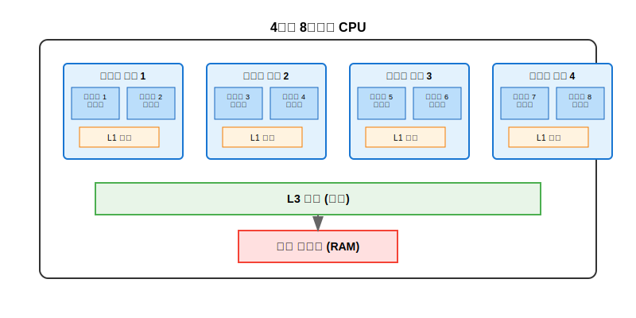
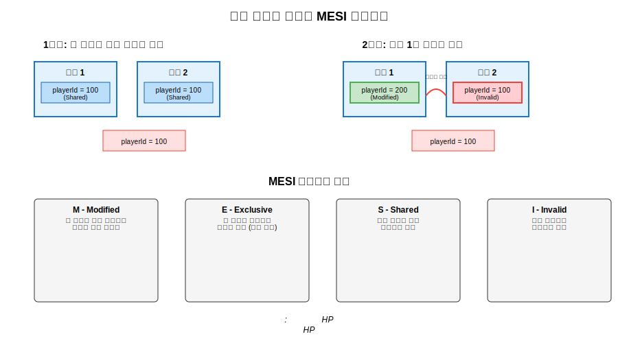
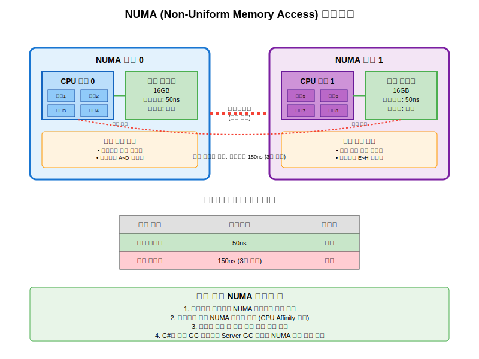
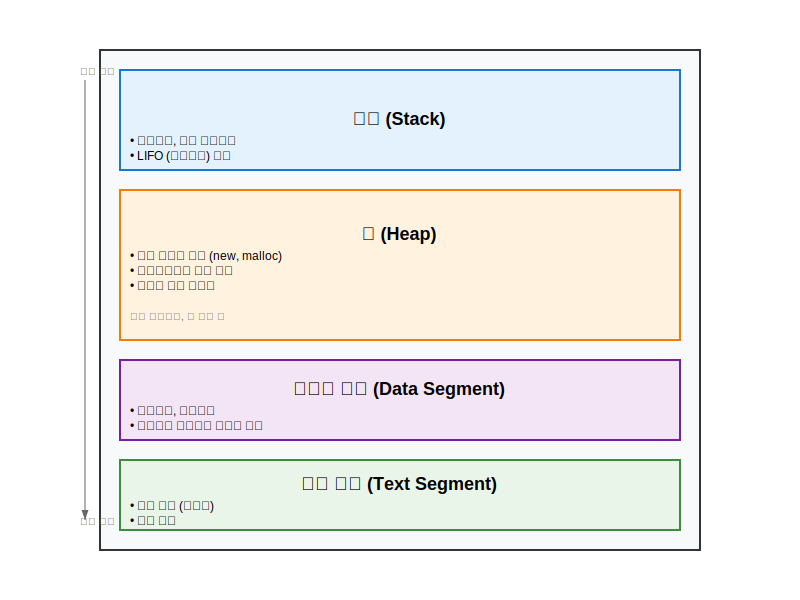
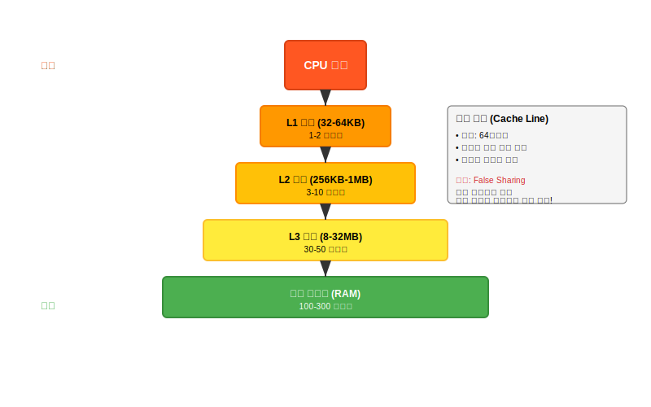
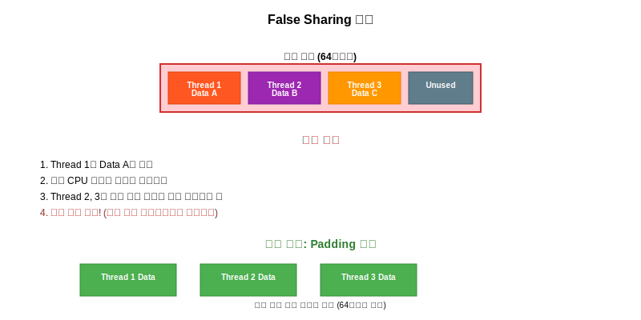

# 멀티코어 시스템과 메모리 구조
  
## 1. 코어, 스레드, 하이퍼스레딩

**물리적 코어와 논리적 스레드의 차이**

물리적 코어는 실제로 연산을 수행하는 독립적인 처리 유닛이다. 마치 여러 명의 요리사가 각자 다른 요리대에서 요리하는 것과 같다.

하이퍼스레딩은 하나의 물리적 코어가 두 개의 작업을 동시에 처리할 수 있게 하는 기술이다. 한 명의 요리사가 두 개의 요리를 번갈아가며 효율적으로 만드는 것과 비슷하다.    
     
    
**게임 서버에서의 실제 활용 예시:**
온라인 게임 서버에서 4코어 8스레드 CPU를 사용한다면, 네트워크 통신 처리용 스레드 2개, 게임 로직 처리용 스레드 2개, 데이터베이스 처리용 스레드 2개, 그리고 로그 기록용 스레드 2개로 나누어 활용할 수 있다. 하이퍼스레딩 덕분에 물리적으로는 4개 코어지만 8개의 작업을 동시에 처리할 수 있게 된다.
  
</br>    
  

## 2. 캐시 일관성 (Cache Coherency)
캐시 일관성은 여러 코어가 같은 데이터를 각자의 캐시에 저장했을 때 발생하는 문제이다.
     


**MESI 프로토콜의 동작:**
게임 서버에서 플레이어의 HP 데이터를 생각해보자. 두 개의 스레드가 같은 플레이어의 HP 값(100)을 각자의 캐시에 저장했다(Shared 상태). 이때 한 스레드가 몬스터의 공격으로 HP를 80으로 감소시키면, 그 캐시는 Modified 상태가 되고 다른 스레드의 캐시는 Invalid 상태가 된다. 다른 스레드가 HP 값을 다시 읽으려고 하면 메모리에서 최신 값을 가져오게 된다.
  
</br>    
  

## 3. NUMA (Non-Uniform Memory Access)
NUMA는 대형 서버에서 메모리 접근 시간이 균일하지 않다는 의미이다.  
     
  
**NUMA의 실제 영향:**
대형 게임 서버에서는 메모리가 여러 NUMA 노드로 나뉘어 있다. 만약 노드 0에서 실행되는 네트워크 처리 스레드가 노드 1의 메모리에 있는 플레이어 데이터에 접근한다면, 로컬 메모리 접근보다 2-3배 느려질 수 있다.

**프로그래밍에서의 고려사항:**

**C# 게임 서버 개발 시:**
- .NET의 Server GC는 NUMA를 인식하여 각 노드별로 GC 힙을 관리한다
- `GCSettings.IsServerGC`와 `GCSettings.LargeObjectHeapCompactionMode` 설정을 통해 최적화할 수 있다
- 플레이어 세션 데이터를 NUMA 노드별로 분산하여 관리하는 것이 좋다

**C++ 게임 서버 개발 시:**
- `numa_alloc_local()` 함수를 사용하여 로컬 노드에서 메모리를 할당할 수 있다
- `sched_setaffinity()`로 스레드를 특정 CPU 코어에 바인딩할 수 있다
- 락프리 자료구조 사용 시 false sharing을 피하기 위해 캐시 라인 정렬을 고려해야 한다
  
**Go 게임 서버 개발 시:**
- Go의 런타임은 NUMA를 자동으로 인식하지만, `GOMAXPROCS` 설정으로 고루틴 스케줄러를 조정할 수 있다
- 채널을 통한 통신 시 데이터 지역성을 고려하여 설계하는 것이 중요하다

이러한 멀티코어 시스템의 특성을 이해하면 게임 서버의 성능을 크게 향상시킬 수 있다. 특히 동시 접속자가 많은 온라인 게임에서는 이런 하드웨어 수준의 최적화가 매우 중요하다.

  
  
# 메모리 구조 및 캐시 최적화

## 1. 메모리 구조 이해
먼저 프로그램이 실행될 때 메모리가 어떻게 구성되는지 시각적으로 보자.
   
  

### 스택 (Stack) 영역
스택은 함수가 호출될 때마다 새로운 프레임이 쌓이는 구조다. 게임 서버에서는 주로 작은 크기의 임시 데이터들이 여기에 저장된다.

```cpp
void processPlayer(int playerId) {
    // 지역변수들은 스택에 저장
    float position[3] = {0.0f, 0.0f, 0.0f};  // 스택
    int hp = 100;                              // 스택
    bool isAlive = true;                       // 스택
    
    // 함수가 끝나면 자동으로 메모리 해제
}
```

### 힙 (Heap) 영역
동적으로 크기가 결정되는 데이터들이 저장되는 곳이다. 게임 서버에서는 플레이어 데이터, 맵 정보 등 큰 객체들이 여기에 할당된다.

```cpp
class Player {
private:
    std::string name;
    std::vector<int> inventory;  // 가변 크기
public:
    Player(const std::string& playerName) : name(playerName) {}
};

// 힙에 Player 객체 생성
Player* player1 = new Player("GamePlayer1");  // 힙 할당
// 사용 후 반드시 해제 필요
delete player1;

// 더 안전한 방법
std::unique_ptr<Player> player2 = std::make_unique<Player>("GamePlayer2");
```

### 데이터 영역
프로그램 전체에서 사용되는 전역 데이터들이 저장된다.

```cpp
// 전역변수 - 데이터 영역에 저장
int g_maxPlayers = 1000;
std::string g_serverName = "GameServer1";

class GameConfig {
    static int maxLevel;  // 정적 변수 - 데이터 영역
};
```
   
</br>    
  
  
## 2. 캐시 시스템과 캐시 라인
이제 성능 최적화의 핵심인 캐시 시스템을 알아보자.
     


### 캐시 라인이 뭘까?
CPU가 메모리에서 데이터를 가져올 때, 한 번에 64바이트씩 덩어리로 가져온다. 이 64바이트 덩어리를 **캐시 라인**이라고 한다. 게임 서버에서 이를 잘 활용하면 성능이 크게 향상된다.

```cpp
// 좋은 예: 캐시 친화적인 구조
struct Player {
    int playerId;      // 4바이트
    float x, y, z;     // 12바이트 (위치)
    int hp;            // 4바이트
    int level;         // 4바이트
    // 총 24바이트 - 하나의 캐시 라인에 여러 Player가 들어감
};

// 나쁜 예: 캐시 라인 낭비
struct PlayerBad {
    int playerId;      // 4바이트
    char padding[60];  // 60바이트 패딩 (낭비)
    float x, y, z;     // 12바이트 (다른 캐시 라인)
    char padding2[52]; // 52바이트 패딩 (낭비)
};
```  
    
</br>    

  
## 3. False Sharing 문제
여러 스레드가 같은 캐시 라인에 있는 서로 다른 데이터를 수정할 때 발생하는 성능 문제다.
     


### False Sharing 코드 예제

```cpp
// 문제가 있는 코드 - False Sharing 발생
struct ThreadData {
    volatile long counter1;  // Thread 1이 사용
    volatile long counter2;  // Thread 2가 사용  
    volatile long counter3;  // Thread 3이 사용
}; // 이 구조체는 24바이트로 하나의 캐시 라인에 들어감

ThreadData data;

// Thread 1
void thread1_function() {
    while(running) {
        data.counter1++;  // 캐시 라인 전체를 무효화시킴
    }
}

// Thread 2
void thread2_function() {
    while(running) {
        data.counter2++;  // 다시 캐시 라인을 로드해야 함
    }
}
```
  

### alignas와 Padding으로 해결하기

alignas(64): C++11 표준 기능으로, 이 구조체의 인스턴스가 메모리상에서 반드시 64바이트 경계에 위치하도록 컴파일러에 지시한다.
이유: 현대 CPU의 L1 데이터 캐시 라인 크기가 일반적으로 64바이트이기 때문이다.     
  
```cpp
// 해결책 1: alignas 사용
struct alignas(64) AlignedThreadData {
    volatile long counter;
    char padding[64 - sizeof(long)];  // 명시적 패딩
};

AlignedThreadData thread1_data;  // 64바이트 정렬
AlignedThreadData thread2_data;  // 다른 캐시 라인에 위치
AlignedThreadData thread3_data;  // 또 다른 캐시 라인에 위치

// 해결책 2: 매크로를 사용한 캐시 라인 패딩
#define CACHE_LINE_SIZE 64
#define CACHE_ALIGN alignas(CACHE_LINE_SIZE)

struct CACHE_ALIGN GameServerData {
    volatile int playerCount;
    char pad1[CACHE_LINE_SIZE - sizeof(int)];
    
    volatile int messageCount;  
    char pad2[CACHE_LINE_SIZE - sizeof(int)];
    
    volatile long totalBytesProcessed;
    char pad3[CACHE_LINE_SIZE - sizeof(long)];
};
```
  
</br>  
  

## 4. 게임 서버에서의 실제 활용 예제
실제 게임 서버에서 이런 최적화가 어떻게 사용되는지 보자.

```cpp
// 플레이어 데이터 구조 최적화
class OptimizedPlayer {
private:
    // 자주 함께 사용되는 데이터들을 묶어서 배치
    int playerId;           // 4바이트
    int hp;                // 4바이트  
    int mp;                // 4바이트
    float x, y, z;         // 12바이트 (위치 정보)
    int level;             // 4바이트
    int exp;               // 4바이트
    // 총 32바이트 - 캐시 라인의 절반을 효율적으로 사용
    
    // 덜 자주 사용되는 데이터는 분리
    std::string playerName;     // 다른 메모리 위치
    std::vector<int> inventory; // 동적 할당
    
public:
    // 핫패스 함수들 - 캐시 친화적
    void updatePosition(float dx, float dy, float dz) {
        x += dx; y += dy; z += dz;  // 모두 같은 캐시 라인
    }
    
    bool takeDamage(int damage) {
        hp -= damage;  // playerId, hp가 같은 캐시 라인에 있음
        return hp > 0;
    }
    
    // 자주 호출되는 getter들도 캐시 친화적
    inline int getId() const { return playerId; }
    inline int getHp() const { return hp; }
    inline float getX() const { return x; }
};

// 멀티스레드 환경에서의 최적화
class GameServer {
private:
    // 각 스레드별로 독립된 캐시 라인 사용
    alignas(64) volatile long thread1_processed_packets;
    char pad1[64 - sizeof(long)];
    
    alignas(64) volatile long thread2_processed_packets;
    char pad2[64 - sizeof(long)];
    
    alignas(64) volatile long thread3_processed_packets;
    char pad3[64 - sizeof(long)];
    
public:
    void processPacketsThread1() {
        while(running) {
            // 패킷 처리 로직
            thread1_processed_packets++;  // False sharing 없음
        }
    }
    
    void processPacketsThread2() {
        while(running) {
            // 패킷 처리 로직  
            thread2_processed_packets++;  // False sharing 없음
        }
    }
};
```
  
</br>  
  
  
## 5. 배열 최적화 기법
배열을 사용할 때도 캐시 친화적으로 만들 수 있다.

```cpp
// 구조체 배열 vs 배열들의 구조체
struct Player {
    int id;
    float x, y, z;
    int hp;
};

// 방법 1: AoS (Array of Structures) - 일반적인 방법
std::vector<Player> players(1000);

// 특정 플레이어의 모든 정보에 접근할 때 좋음
void updatePlayer(int index) {
    players[index].x += 1.0f;
    players[index].hp -= 10;  // 같은 캐시 라인에 있어서 빠름
}

// 방법 2: SoA (Structure of Arrays) - 캐시 최적화
class PlayerManager {
private:
    std::vector<int> ids;
    std::vector<float> positions_x;
    std::vector<float> positions_y; 
    std::vector<float> positions_z;
    std::vector<int> hp_values;
    
public:
    // 모든 플레이어의 위치를 업데이트할 때 매우 빠름
    void updateAllPositions(float deltaTime) {
        for(size_t i = 0; i < positions_x.size(); ++i) {
            positions_x[i] += deltaTime;  // 연속된 메모리 접근
            positions_y[i] += deltaTime;  // 캐시 적중률 높음
            positions_z[i] += deltaTime;
        }
    }
};
```
    
이 코드는 **데이터를 메모리에 배치하는 방법(Data Layout)**이 CPU 캐시 효율성에 얼마나 큰 영향을 미치는지를 보여주는 아주 좋은 예제이다.

핵심은 **"어떤 방식으로 데이터를 반복 처리(loop)할 것인가?"** 에 따라 최적의 구조가 달라진다는 것이다.


### 방법 1: AoS (Array of Structures) - "객체 중심"
이것은 우리가 C++나 Java 같은 객체 지향 언어에서 가장 흔하게 사용하는 **"구조체의 배열"** 방식이다.

  * **메모리 구조:** `Player` 객체 1000개가 메모리에 차례대로 연속해서 놓입니다.

      * `[Player 0: id, x, y, z, hp] | [Player 1: id, x, y, z, hp] | [Player 2: ...] | ...`

  * **장점 (코드의 `updatePlayer`):**

      * **"특정 플레이어 1명"**의 데이터를 다룰 때 매우 빠르다.
      * `players[index]`에 접근하면, CPU는 해당 `Player` 객체가 포함된 64바이트 **캐시 라인(Cache Line)** 을 한 번에 읽어온다.
      * 이 캐시 라인 안에는 `x`, `y`, `z`, `hp` 등 필요한 모든 데이터가 이미 들어있을 확률이 높다. (이를 **공간적 지역성(Spatial Locality)** 이라 한다.)
      * 따라서 `.x`를 수정하고 바로 `.hp`를 수정하는 작업은 캐시 히트(Cache Hit)가 발생하여 매우 빠르다.

  * **단점 (코드의 `updateAllPositions` 같은 작업):**

      * **"모든 플레이어"** 의 **"위치(x)만"** 업데이트할 때 매우 비효율적이다.
      * 루프가 돌면서 `players[0].x`에 접근한다. CPU는 `[Player 0: id, x, y, z, hp]` 전체를 캐시로 가져온다. **하지만 우리는 `id`와 `hp` 데이터는 필요 없다.**
      * 다음 `players[1].x`에 접근한다. CPU는 `[Player 1: id, x, y, z, hp]` 전체를 또 캐시로 가져온다.
      * **결론:** 정작 필요한 데이터는 `float x` (4바이트) 뿐인데, 필요 없는 `id`, `hp` (8바이트) 등의 데이터를 같이 읽어오느라 캐시 공간과 메모리 대역폭을 낭비한다. 이를 **캐시 오염(Cache Pollution)** 이라고 부른다.

### 방법 2: SoA (Structure of Arrays) - "데이터 중심"
이것은 고성능 컴퓨팅(HPC)이나 게임 엔진 개발에서 자주 사용하는 **"배열들의 구조체"** 방식이다. 데이터 지향 설계(Data-Oriented Design)의 핵심 기법이다.

  * **메모리 구조:** 속성(attribute)별로 모든 데이터를 연속하게 배치한다.

      * `ids`: `[id 0, id 1, id 2, ...]`
      * `positions_x`: `[x 0, x 1, x 2, ...]`
      * `positions_y`: `[y 0, y 1, y 2, ...]`
      * `hp_values`: `[hp 0, hp 1, hp 2, ...]`

  * **장점 (코드의 `updateAllPositions`):**

      * **"모든 플레이어"** 의 **"특정 속성(위치)"** 을 일괄 처리할 때 압도적으로 빠르다.
      * `positions_x` 배열을 순회한다. `positions_x[0]`에 접근하면 CPU가 64바이트 캐시 라인을 읽어온다.
      * 이 캐시 라인에는 `[x 0, x 1, x 2, ... x 15]`처럼 **오직 x좌표 값만** 꽉 채워져 있다.
      * 루프가 `i`를 증가시키며 다음 `positions_x[1]`, `positions_x[2]`... 에 접근할 때, 이 데이터들은 **이미 캐시에 로드되어 있다.** (최상의 공간적 지역성)
      * 필요 없는 `id`나 `hp` 데이터가 캐시를 오염시키지 않으므로, CPU가 낭비 없이 데이터를 처리할 수 있다.

  * **단점 (코드의 `updatePlayer` 같은 작업):**

      * **"특정 플레이어 1명"** 의 데이터를 다룰 때는 오히려 매우 느리다.
      * `PlayerManager`에서 100번 플레이어의 정보를 모두 가져오려면:
          * `ids[100]` 접근 (캐시 미스 1)
          * `positions_x[100]` 접근 (캐시 미스 2)
          * `hp_values[100]` 접근 (캐시 미스 3)
      * 한 객체의 데이터가 메모리 전역에 흩어져 있으므로, 캐시 효율이 최악이 된다.

### 요약: 언제 무엇을 써야 할까? 🎯

| 방식 | AoS (Array of Structures) | SoA (Structure of Arrays) |
| :--- | :--- | :--- |
| **메모리** | `[Obj 1] [Obj 2] [Obj 3]` | `[Attr A1, A2, A3] [Attr B1, B2, B3]` |
| **적합한 작업** | \*\*"한 객체"의 "여러 속성"\*\*을 다룰 때 (객체 지향적) | \*\*"여러 객체"의 "한 속성"\*\*을 일괄 처리할 때 (데이터 지향적) |
| **예시** | `getPlayerInfo(id)` | `updateAllPositions()`<br>`renderAllSprites()` |
| **장점** | 코드 이해가 쉽고, 객체 단위 작업에 빠름 | 대규모 데이터 순회 시 캐시 효율 극대화 |
| **단점** | 대규모 순회 시 캐시 오염 발생 | 객체 단위 작업에 매우 느림, 코드 복잡 |

결론적으로, 일반적인 응용 프로그램에서는 **AoS**가 충분히 좋고 코드도 단순하다. 하지만 수백만 개의 파티클을 시뮬레이션하거나 게임 엔진에서 렌더링을 최적화하는 등 극한의 성능이 필요할 때는 **SoA** 방식이 필수적으로 사용된다.

</br>  
  
  
## 6. 메모리 프리페칭
고급 최적화 기법으로 미리 데이터를 캐시에 로드하는 방법도 있다.

```cpp
#include <xmmintrin.h>  // SSE intrinsics

void processPlayers(std::vector<Player>& players) {
    for(size_t i = 0; i < players.size(); ++i) {
        // 다음 플레이어 데이터를 미리 캐시에 로드
        if(i + 1 < players.size()) {
            _mm_prefetch(reinterpret_cast<const char*>(&players[i+1]), _MM_HINT_T0);
        }
        
        // 현재 플레이어 처리
        updatePlayer(players[i]);
    }
}
```

## 마무리
메모리 구조와 캐시 최적화는 고성능 게임 서버를 만드는데 필수적인 지식이다. 특히 다음 사항들을 기억하자:

1. **스택은 빠르지만 크기 제한**이 있고, **힙은 유연하지만 관리가 필요**하다
2. **캐시 라인(64바이트)**을 의식해서 데이터 구조를 설계해야 한다
3. **False Sharing을 피하기 위해 alignas와 padding**을 사용한다
4. **자주 함께 사용되는 데이터는 가까이 배치**한다
5. **대량 처리 시에는 SoA 패턴**을 고려한다

이런 최적화들은 초당 수천, 수만 명이 접속하는 게임 서버에서 큰 성능 차이를 만들어낸다. 처음에는 복잡해 보이지만, 한 번 익숙해지면 자연스럽게 최적화된 코드를 작성할 수 있게 될 것이다.
 